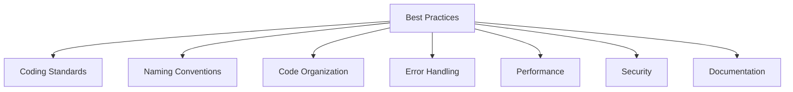
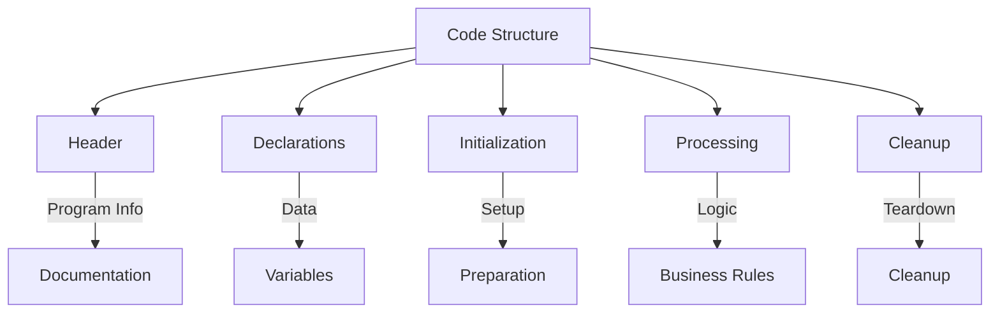
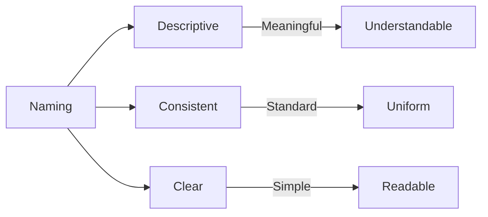
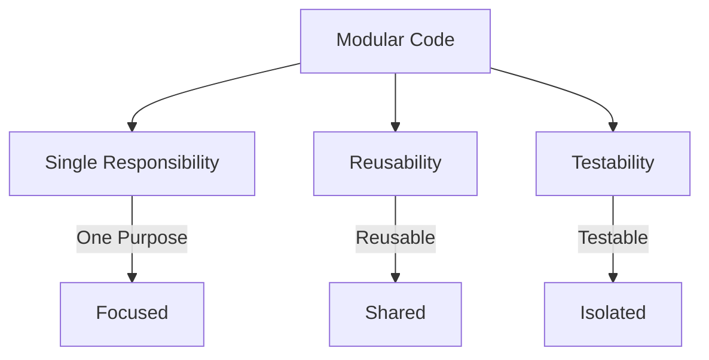
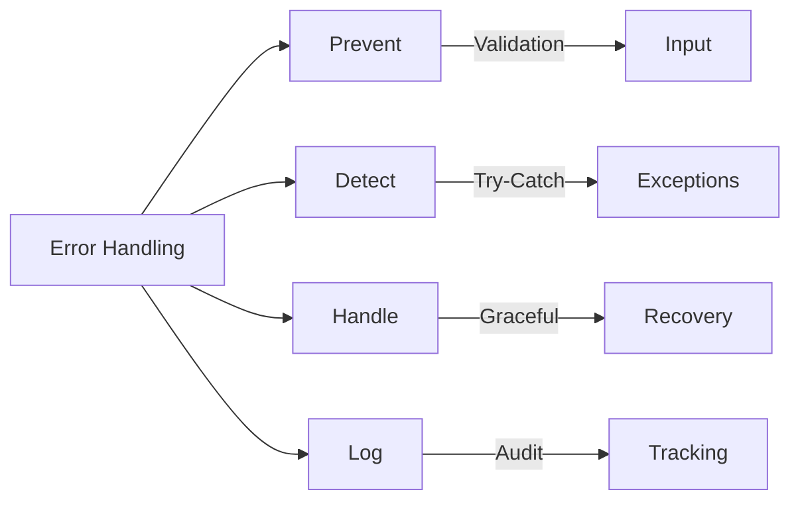
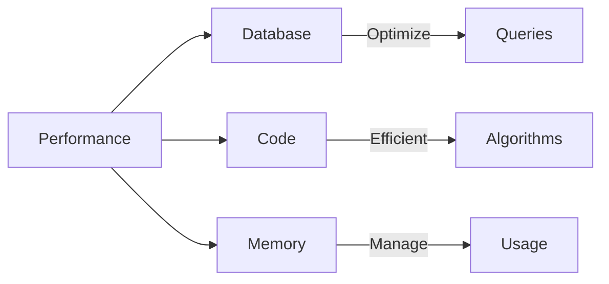
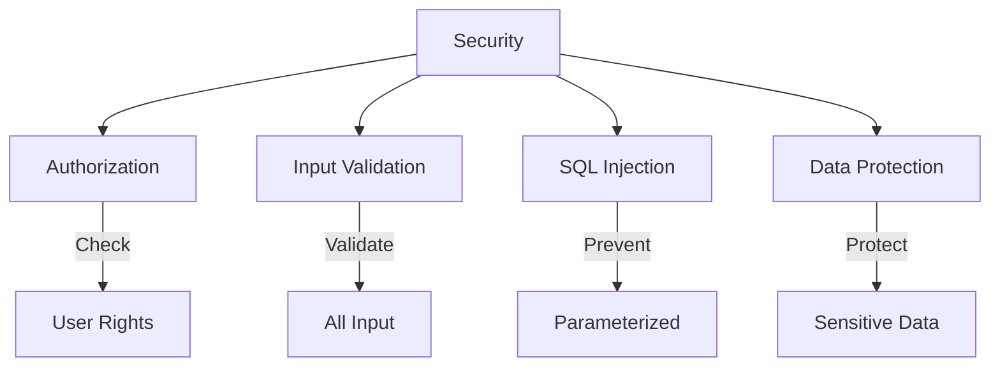
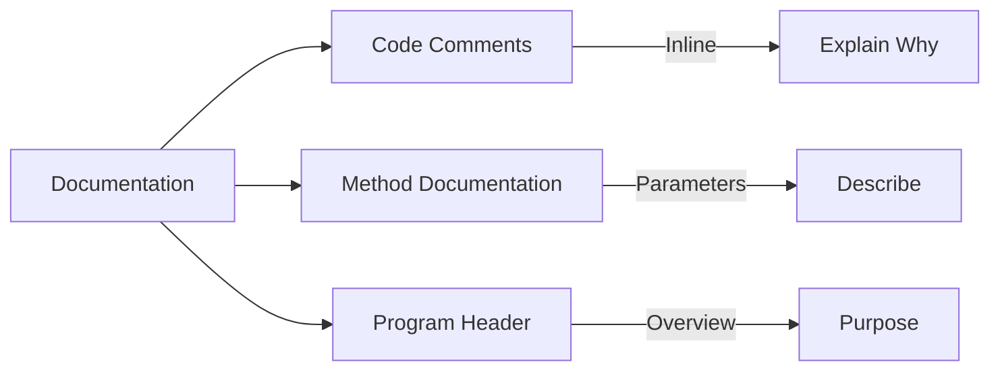
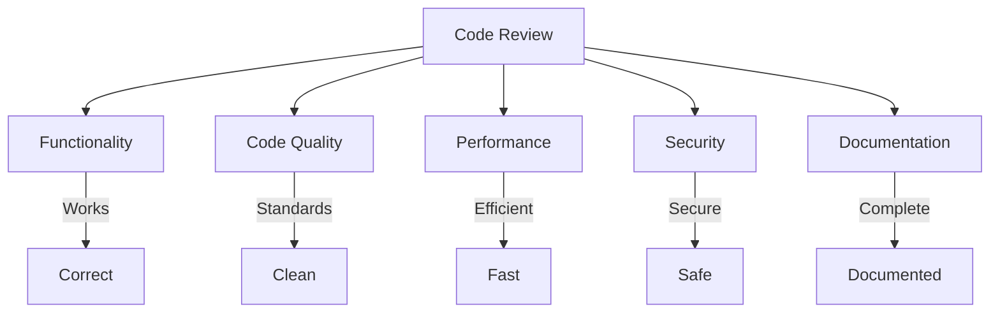

# SAP ABAP Best Practices Guide

**Complete guide to ABAP coding best practices and standards**

---

## 📚 Table of Contents

1. [Introduction](#introduction)
2. [Coding Standards](#coding-standards)
3. [Naming Conventions](#naming-conventions)
4. [Code Organization](#code-organization)
5. [Error Handling](#error-handling)
6. [Performance](#performance)
7. [Security](#security)
8. [Documentation](#documentation)
9. [Code Review](#code-review)
10. [Examples](#examples)

---

## Introduction

**Best Practices** ensure code quality, maintainability, and consistency across ABAP development.

### Best Practices Areas



### Benefits

- ✅ **Maintainability**: Easier to maintain
- ✅ **Readability**: Easier to understand
- ✅ **Consistency**: Uniform code style
- ✅ **Quality**: Higher code quality
- ✅ **Collaboration**: Easier team work

---

## Coding Standards

### Code Structure



### Program Structure

```abap
REPORT z_program_name.

"**********************************************************************
"* Program: Program Name
"* Purpose: Brief description
"* Author: Developer Name
"* Date: YYYY-MM-DD
"* Changes:
"*   YYYY-MM-DD - Initial version
"**********************************************************************

" Type definitions
TYPES: BEGIN OF ty_data,
         ...
       END OF ty_data.

" Data declarations
DATA: lt_data TYPE TABLE OF ty_data,
      ls_data TYPE ty_data.

" Selection screen
SELECTION-SCREEN BEGIN OF BLOCK b1...
SELECTION-SCREEN END OF BLOCK b1.

" Initialization
INITIALIZATION.
  PERFORM set_defaults.

" Main processing
START-OF-SELECTION.
  PERFORM get_data.
  PERFORM process_data.
  PERFORM display_data.

" Form routines
FORM get_data.
  ...
ENDFORM.
```

---

## Naming Conventions

### Variable Naming

| Prefix | Type | Example |
|--------|------|---------|
| **lv_** | Local variable | `lv_employee_id` |
| **gv_** | Global variable | `gv_system_date` |
| **ls_** | Structure | `ls_employee` |
| **lt_** | Internal table | `lt_employees` |
| **lo_** | Object reference | `lo_request` |
| **lo_** | Interface reference | `lo_validator` |
| **lv_** | Field symbol | `<fs_employee>` |

### Naming Rules



1. **Use Descriptive Names**: `lv_employee_id` not `lv_id`
2. **Follow Prefixes**: Use standard prefixes
3. **Avoid Abbreviations**: Use full words
4. **Be Consistent**: Same naming throughout

### Object Naming

| Type | Prefix | Example |
|------|--------|---------|
| **Class** | ZCL_ | `ZCL_LEAVE_REQUEST` |
| **Interface** | ZIF_ | `ZIF_LEAVE_VALIDATOR` |
| **Function Module** | Z_ | `Z_LEAVE_GET_EMPLOYEE` |
| **Table** | Z | `ZLEAVE_REQ_HDR` |
| **Structure** | ZST_ | `ZST_LEAVE_REQUEST` |
| **Type** | ZTT_ | `ZTT_LEAVE_REQUEST` |

---

## Code Organization

### Modular Design



### Code Organization Principles

1. **Single Responsibility**: One function, one purpose
2. **DRY (Don't Repeat Yourself)**: Reuse code
3. **Separation of Concerns**: Separate logic
4. **High Cohesion**: Related code together
5. **Low Coupling**: Minimal dependencies

### Code Structure Example

```abap
" Recommended structure:
" 1. Type definitions
" 2. Constants
" 3. Data declarations (global, then local)
" 4. Selection screen
" 5. Initialization
" 6. Main processing
" 7. Form routines (grouped by function)
" 8. Class definitions (if any)
```

---

## Error Handling

### Error Handling Strategy



### Error Handling Best Practices

1. **Validate Early**: Check input at entry
2. **Use Exceptions**: Don't use return codes
3. **Handle All Errors**: Don't ignore errors
4. **Log Errors**: Record for debugging
5. **User-Friendly Messages**: Clear error messages

### Error Handling Example

```abap
METHOD create_request.
  " Validate input
  IF is_request_data-employee_id IS INITIAL.
    RAISE EXCEPTION TYPE zcx_invalid_input
      EXPORTING
        iv_message = 'Employee ID is required'.
  ENDIF.

  " Process with error handling
  TRY.
      " Business logic
      INSERT zleave_req_hdr FROM is_request_data.
      
      IF sy-subrc <> 0.
        RAISE EXCEPTION TYPE zcx_database_error
          EXPORTING
            iv_message = 'Failed to save request'.
      ENDIF.
      
      COMMIT WORK.
      
    CATCH zcx_invalid_input INTO DATA(lo_invalid).
      " Log error
      MESSAGE lo_invalid->get_text( ) TYPE 'E'.
      RAISE.
      
    CATCH zcx_database_error INTO DATA(lo_db_error).
      ROLLBACK WORK.
      MESSAGE lo_db_error->get_text( ) TYPE 'E'.
      RAISE.
      
    CATCH cx_root INTO DATA(lo_error).
      ROLLBACK WORK.
      " Log unexpected error
      MESSAGE 'Unexpected error occurred' TYPE 'E'.
      RAISE.
  ENDTRY.
ENDMETHOD.
```

---

## Performance

### Performance Best Practices



### Performance Checklist

1. ✅ Use WHERE clause in SELECT
2. ✅ Use indexed fields
3. ✅ Limit data with UP TO
4. ✅ Avoid SELECT in loops
5. ✅ Use appropriate table types
6. ✅ Use BINARY SEARCH
7. ✅ Avoid nested loops
8. ✅ Use field symbols
9. ✅ Clear large tables
10. ✅ Process in batches

**See**: [Performance Guide](./10_SAP_ABAP_PERFORMANCE_GUIDE.md) for details.

---

## Security

### Security Best Practices



### Security Checklist

1. ✅ Check authorization
2. ✅ Validate all input
3. ✅ Use parameterized queries
4. ✅ Handle errors securely
5. ✅ Log security events
6. ✅ Don't expose sensitive data

**See**: [Security Guide](./13_SAP_ABAP_SECURITY_GUIDE.md) for details.

---

## Documentation

### Documentation Standards



### Documentation Best Practices

1. **Program Header**: Include purpose, author, date
2. **Method Documentation**: Document parameters, return values
3. **Complex Logic**: Explain why, not what
4. **Business Rules**: Document business logic
5. **Change History**: Track changes

### Documentation Example

```abap
"**********************************************************************
"* Method: calculate_days
"* Purpose: Calculate number of leave days between start and end date
"*          Excludes weekends
"* Parameters:
"*   IV_START_DATE - Start date of leave
"*   IV_END_DATE - End date of leave
"* Returns:
"*   RV_DAYS - Number of working days
"* Exceptions:
"*   ZCX_INVALID_DATE - If end date before start date
"* Author: Developer Name
"* Date: 2026-01-19
"**********************************************************************
METHOD calculate_days.
  " Implementation
ENDMETHOD.
```

---

## Code Review

### Code Review Checklist



### Review Points

1. **Functionality**: Does it work correctly?
2. **Code Quality**: Follows standards?
3. **Performance**: Efficient?
4. **Security**: Secure?
5. **Documentation**: Well documented?
6. **Testability**: Easy to test?

---

## Examples

### Example 1: Well-Structured Code

```abap
REPORT z_well_structured_program.

"**********************************************************************
"* Program: Employee Leave Request Report
"* Purpose: Generate report of employee leave requests
"* Author: Developer Name
"* Date: 2026-01-19
"**********************************************************************

" Type definitions
TYPES: BEGIN OF ty_leave_report,
         req_id TYPE zleave_req_id,
         employee_id TYPE pernr_d,
         employee_name TYPE string,
         leave_type TYPE zleave_type,
         start_date TYPE datum,
         end_date TYPE datum,
         days TYPE zleave_days,
         status TYPE zleave_status,
       END OF ty_leave_report,
       ty_leave_report_tab TYPE STANDARD TABLE OF ty_leave_report.

" Data declarations
DATA: lt_report TYPE ty_leave_report_tab,
      ls_report TYPE ty_leave_report.

" Selection screen
SELECTION-SCREEN BEGIN OF BLOCK b1 WITH FRAME TITLE TEXT-001.
SELECT-OPTIONS: s_date FOR sy-datum,
                 s_status FOR ls_report-status.
PARAMETERS: p_empno TYPE pernr_d.
SELECTION-SCREEN END OF BLOCK b1.

" Initialization
INITIALIZATION.
  PERFORM set_defaults.

" Main processing
START-OF-SELECTION.
  PERFORM get_data.
  PERFORM process_data.
  PERFORM display_data.

" Form routines
FORM set_defaults.
  " Set default values
  s_date-sign = 'I'.
  s_date-option = 'BT'.
  s_date-low = sy-datum - 30.
  s_date-high = sy-datum.
  APPEND s_date.
ENDFORM.

FORM get_data.
  " Get data from database
  SELECT h~req_id
         h~employee_id
         h~leave_type
         h~start_date
         h~end_date
         h~days
         h~status
         p~ename AS employee_name
    FROM zleave_req_hdr AS h
    INNER JOIN pa0001 AS p
      ON h~employee_id = p~pernr
    INTO CORRESPONDING FIELDS OF TABLE lt_report
    WHERE h~start_date IN s_date
      AND h~status IN s_status
      AND ( p_empno IS INITIAL OR h~employee_id = p_empno )
    UP TO 1000 ROWS.
ENDFORM.

FORM process_data.
  " Process data if needed
  " ...
ENDFORM.

FORM display_data.
  " Display using ALV
  " ...
ENDFORM.
```

---

## Common Transactions

| Transaction | Purpose |
|-------------|---------|
| **SE38** | ABAP Editor |
| **SE80** | Object Navigator |
| **SE24** | Class Builder |
| **SCI** | Code Inspector |

---

## References

- [ABAP Basics Guide](./01_SAP_ABAP_BASICS_GUIDE.md)
- [Performance Guide](./10_SAP_ABAP_PERFORMANCE_GUIDE.md)
- [Security Guide](./13_SAP_ABAP_SECURITY_GUIDE.md)
- [Unit Testing Guide](./14_SAP_ABAP_UNIT_TESTING_GUIDE.md)

---

**Related Guides**:
- All ABAP guides in this repository

