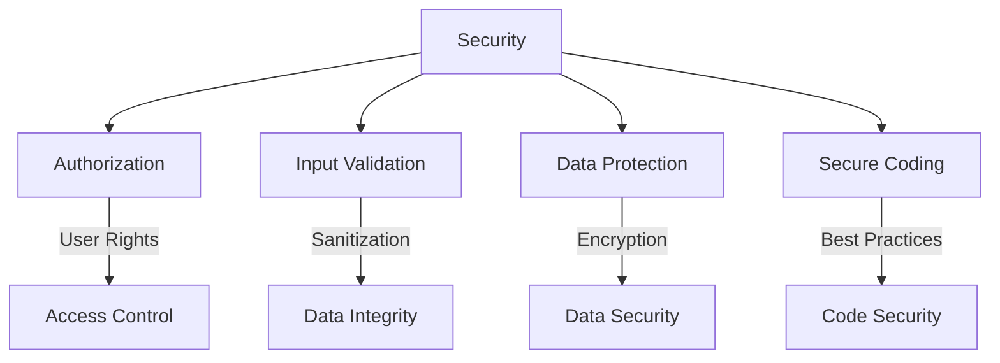
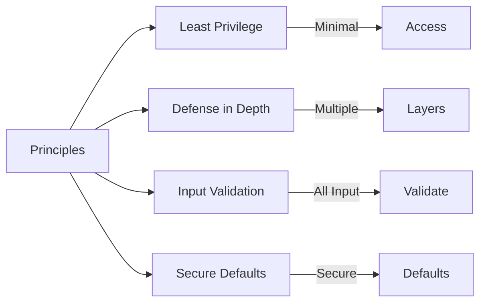
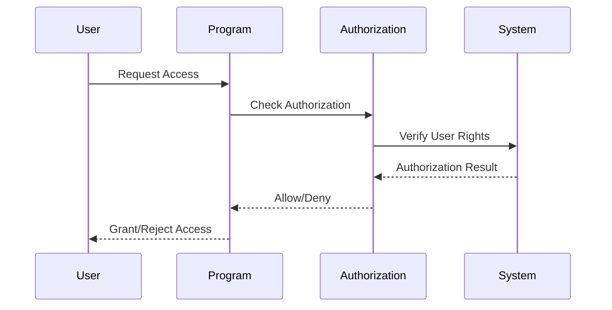
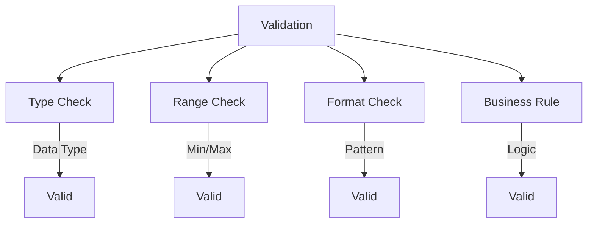
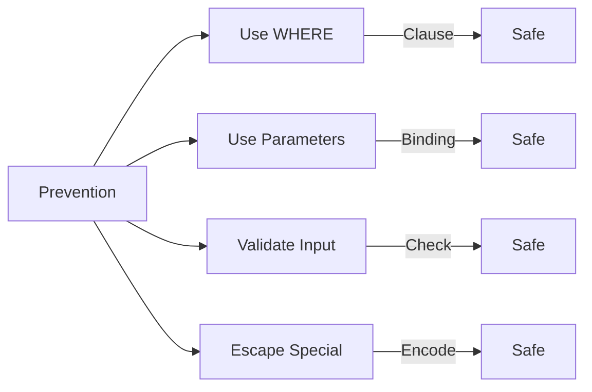
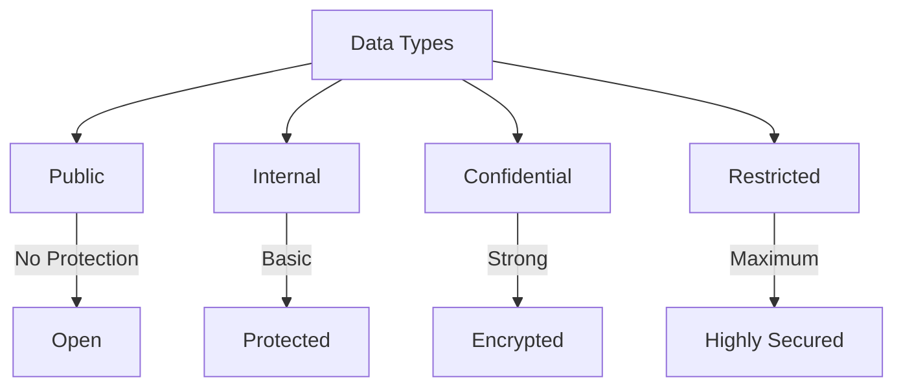
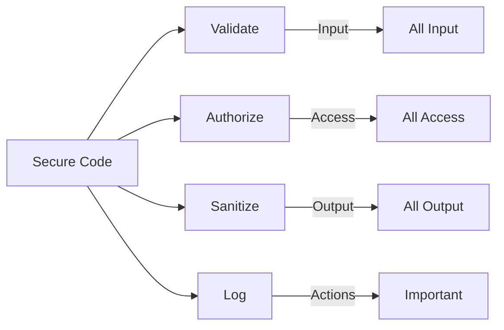
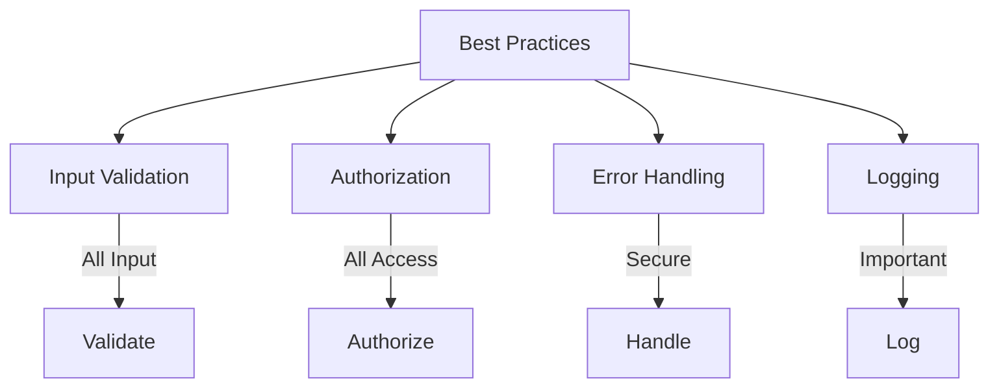

# SAP ABAP Security Guide

**Complete guide to security in ABAP development**

---

## 📚 Table of Contents

1. [Introduction](#introduction)
2. [Security Overview](#security-overview)
3. [Authorization Checks](#authorization-checks)
4. [Input Validation](#input-validation)
5. [SQL Injection Prevention](#sql-injection-prevention)
6. [Data Protection](#data-protection)
7. [Secure Coding](#secure-coding)
8. [Best Practices](#best-practices)
9. [Examples](#examples)

---

## Introduction

**Security** is critical in ABAP development to protect data, prevent unauthorized access, and ensure system integrity.

### Security Layers



### Security Threats

| Threat | Description | Prevention |
|--------|-------------|------------|
| **Unauthorized Access** | User accesses unauthorized data | Authorization checks |
| **SQL Injection** | Malicious SQL in input | Input validation |
| **XSS** | Cross-site scripting | Output encoding |
| **Data Leakage** | Sensitive data exposure | Data protection |

---

## Security Overview

### Security Principles



### Security Checklist

- ✅ Authorization checks
- ✅ Input validation
- ✅ SQL injection prevention
- ✅ Output encoding
- ✅ Error handling
- ✅ Logging and auditing

---

## Authorization Checks

### Authorization Concept

**Authorization** controls what users can access and do in the system.

### Authorization Objects

**Transaction**: SU21 (Maintain Authorization Objects)

**Common Objects**:
- **S_TCODE**: Transaction authorization
- **S_TABU_NAM**: Table authorization
- **S_DEVELOP**: Development authorization

### Authorization Check

```abap
" Check transaction authorization
AUTHORITY-CHECK OBJECT 'S_TCODE'
  ID 'TCD' FIELD 'ZLEAVE_CREATE'.

IF sy-subrc <> 0.
  MESSAGE 'Not authorized' TYPE 'E'.
  RETURN.
ENDIF.

" Check table authorization
AUTHORITY-CHECK OBJECT 'S_TABU_NAM'
  ID 'ACTVT' FIELD '02' " Display
  ID 'TABLE' FIELD 'ZLEAVE_REQ_HDR'.

IF sy-subrc <> 0.
  MESSAGE 'Not authorized to view table' TYPE 'E'.
  RETURN.
ENDIF.
```

### Authorization Flow



---

## Input Validation

### Why Validate Input?

**Input validation** prevents malicious data from entering the system.

### Validation Techniques



### Input Validation Example

```abap
METHOD validate_employee_id.
  " Type validation
  IF iv_employee_id IS INITIAL.
    RAISE invalid_input.
  ENDIF.

  " Format validation
  IF strlen( iv_employee_id ) <> 8.
    RAISE invalid_format.
  ENDIF.

  " Range validation
  IF iv_employee_id < '00000001' OR iv_employee_id > '99999999'.
    RAISE out_of_range.
  ENDIF.

  " Business validation
  SELECT SINGLE pernr
    FROM pa0001
    INTO @DATA(lv_pernr)
    WHERE pernr = @iv_employee_id
      AND endda >= @sy-datum.

  IF sy-subrc <> 0.
    RAISE employee_not_found.
  ENDIF.
ENDMETHOD.
```

---

## SQL Injection Prevention

### What is SQL Injection?

**SQL Injection** occurs when malicious SQL code is inserted into input fields.

### Prevention Techniques



### Safe SELECT Statements

```abap
" Bad: Vulnerable to SQL injection
DATA: lv_where TYPE string.
lv_where = |pernr = '{ iv_employee_id }'|.
SELECT * FROM pa0001 INTO TABLE lt_data WHERE (lv_where).

" Good: Use WHERE clause directly
SELECT * FROM pa0001
  INTO TABLE lt_data
  WHERE pernr = iv_employee_id
    AND endda >= sy-datum.

" Good: Use FOR ALL ENTRIES
IF lt_employee_ids IS NOT INITIAL.
  SELECT * FROM pa0001
    INTO TABLE lt_data
    FOR ALL ENTRIES IN lt_employee_ids
    WHERE pernr = lt_employee_ids-empno.
ENDIF.
```

### Parameterized Queries

```abap
" Modern ABAP: Use @ for parameters
SELECT * FROM pa0001
  INTO TABLE @lt_data
  WHERE pernr = @iv_employee_id
    AND endda >= @sy-datum.

" This prevents SQL injection automatically
```

---

## Data Protection

### Data Classification



### Data Protection Measures

1. **Access Control**: Authorization checks
2. **Data Masking**: Hide sensitive data
3. **Encryption**: Encrypt sensitive data
4. **Audit Logging**: Log data access

### Data Masking Example

```abap
METHOD mask_sensitive_data.
  " Mask employee ID
  DATA: lv_masked TYPE string.
  lv_masked = |****{ iv_employee_id+4(4) }|.

  " Mask email
  DATA: lv_email TYPE string,
        lv_masked_email TYPE string.
  lv_email = 'john.doe@company.com'.
  lv_masked_email = |{ lv_email(1) }***@{ lv_email+INDEX( lv_email '@' ) }|.
ENDMETHOD.
```

---

## Secure Coding

### Secure Coding Practices



### Secure Code Checklist

1. ✅ **Always validate input**
2. ✅ **Check authorization**
3. ✅ **Use parameterized queries**
4. ✅ **Handle errors securely**
5. ✅ **Log security events**
6. ✅ **Don't expose sensitive data**
7. ✅ **Use secure defaults**

### Error Handling

```abap
" Secure error handling
TRY.
    " Process data
    PERFORM process_sensitive_data.
  CATCH cx_root INTO DATA(lo_error).
    " Log error (don't expose details to user)
    " Log: System error occurred
    MESSAGE 'An error occurred. Please contact administrator.' TYPE 'E'.
    " Don't expose: lo_error->get_text( )
ENDTRY.
```

---

## Best Practices

### Security Best Practices



1. **Validate All Input**: Never trust user input
2. **Check Authorization**: Always verify user rights
3. **Use Secure Defaults**: Deny by default
4. **Handle Errors Securely**: Don't expose system details
5. **Log Security Events**: Audit important actions
6. **Keep Code Updated**: Apply security patches
7. **Regular Security Reviews**: Review code for vulnerabilities

---

## Examples

### Example 1: Secure Function Module

```abap
FUNCTION z_secure_get_employee.
*"----------------------------------------------------------------------
*"*"Local Interface:
*"  IMPORTING
*"     VALUE(IV_EMPLOYEE_ID) TYPE PERNR_D
*"  EXPORTING
*"     VALUE(EV_EMPLOYEE_NAME) TYPE STRING
*"  EXCEPTIONS
*"     UNAUTHORIZED
*"     EMPLOYEE_NOT_FOUND
*"----------------------------------------------------------------------

  " 1. Authorization check
  AUTHORITY-CHECK OBJECT 'S_TABU_NAM'
    ID 'ACTVT' FIELD '02'
    ID 'TABLE' FIELD 'PA0001'.

  IF sy-subrc <> 0.
    RAISE unauthorized.
  ENDIF.

  " 2. Input validation
  IF iv_employee_id IS INITIAL.
    RAISE employee_not_found.
  ENDIF.

  " 3. Secure query (parameterized)
  SELECT SINGLE ename
    FROM pa0001
    INTO ev_employee_name
    WHERE pernr = iv_employee_id
      AND endda >= sy-datum
      AND begda <= sy-datum.

  IF sy-subrc <> 0.
    RAISE employee_not_found.
  ENDIF.

ENDFUNCTION.
```

### Example 2: Secure Report

```abap
REPORT z_secure_employee_report.

" Authorization check
AUTHORITY-CHECK OBJECT 'S_TCODE'
  ID 'TCD' FIELD sy-tcode.

IF sy-subrc <> 0.
  MESSAGE 'Not authorized' TYPE 'E'.
  LEAVE PROGRAM.
ENDIF.

SELECT-OPTIONS: s_empno FOR sy-uname.

AT SELECTION-SCREEN.
  " Validate input
  LOOP AT s_empno.
    " Check user can only see their own data
    IF s_empno-low <> sy-uname.
      AUTHORITY-CHECK OBJECT 'S_TABU_NAM'
        ID 'ACTVT' FIELD '03'
        ID 'TABLE' FIELD 'PA0001'.
      IF sy-subrc <> 0.
        MESSAGE 'Not authorized to view other employees' TYPE 'E'.
      ENDIF.
    ENDIF.
  ENDLOOP.

START-OF-SELECTION.
  " Secure data access
  SELECT pernr ename
    FROM pa0001
    INTO TABLE @DATA(lt_employees)
    WHERE pernr IN @s_empno
      AND endda >= @sy-datum
      AND begda <= @sy-datum.

  " Display data
  PERFORM display_data USING lt_employees.
```

---

## Common Transactions

| Transaction | Purpose |
|-------------|---------|
| **SU21** | Maintain Authorization Objects |
| **PFCG** | Role Maintenance |
| **SU53** | Authorization Check |
| **SM19** | Security Audit Log |

---

## Troubleshooting

### Common Security Issues

1. **Authorization Errors**
   - Check authorization object
   - Verify user role
   - Check authorization values

2. **SQL Injection Attempts**
   - Review input validation
   - Check query construction
   - Use parameterized queries

3. **Data Access Issues**
   - Verify table authorization
   - Check user permissions
   - Review authorization checks

---

## References

- [ABAP Basics Guide](./01_SAP_ABAP_BASICS_GUIDE.md)
- [Best Practices Guide](./12_SAP_ABAP_BEST_PRACTICES_GUIDE.md)
- [Security & Authorization Guide](../SAP_SECURITY_AUTHORIZATION_GUIDE.md)

---

**Next**: [Unit Testing Guide](./14_SAP_ABAP_UNIT_TESTING_GUIDE.md)

