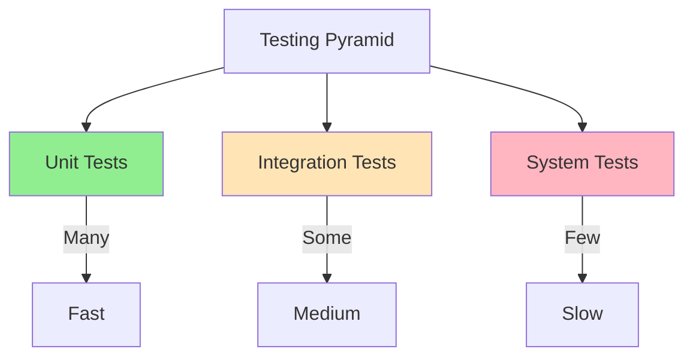
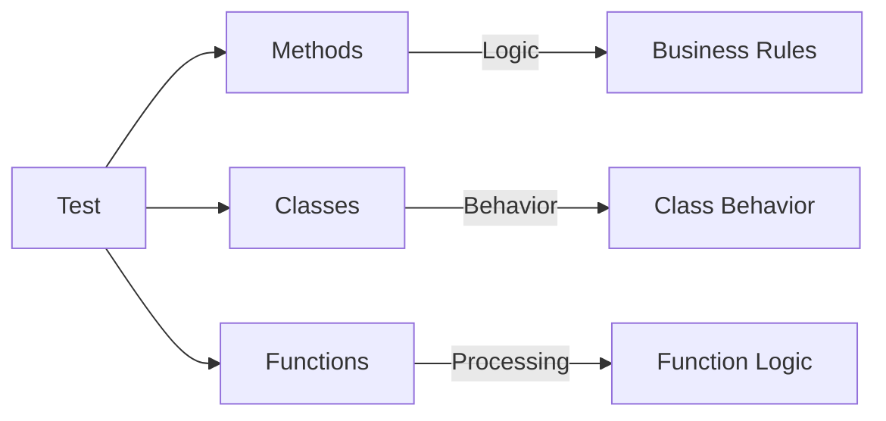
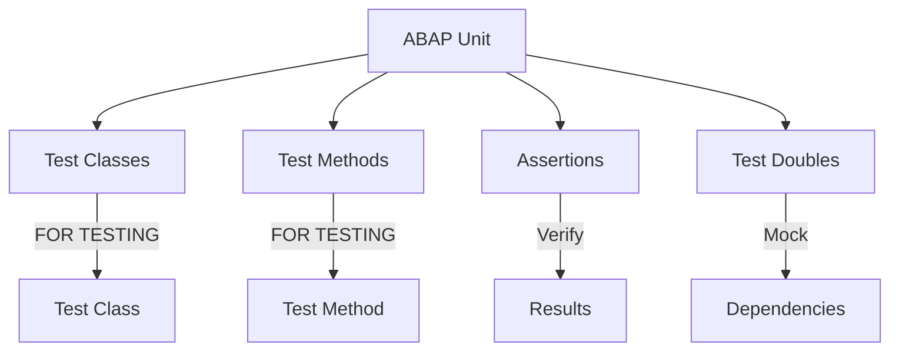
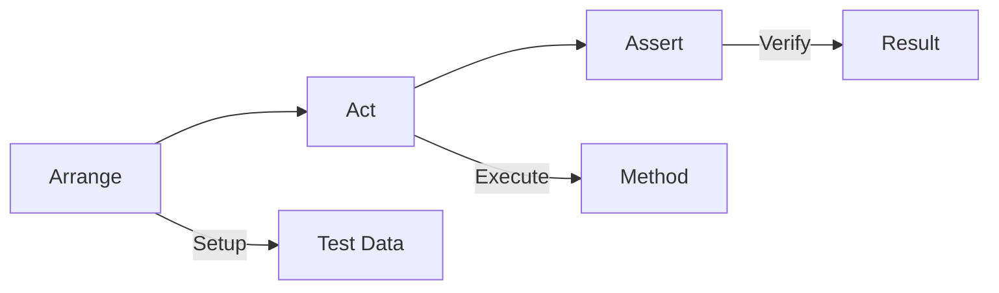
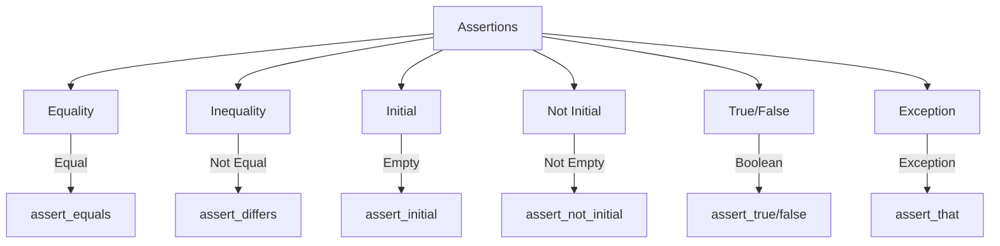
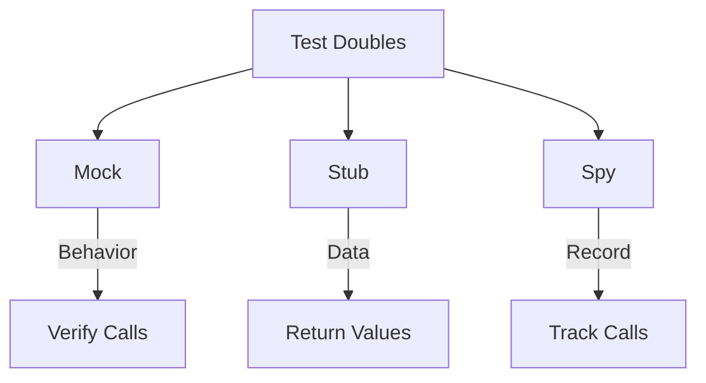
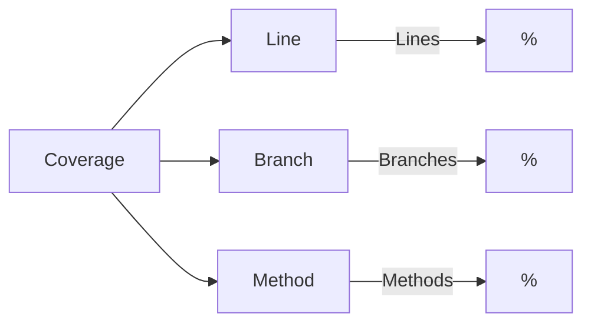
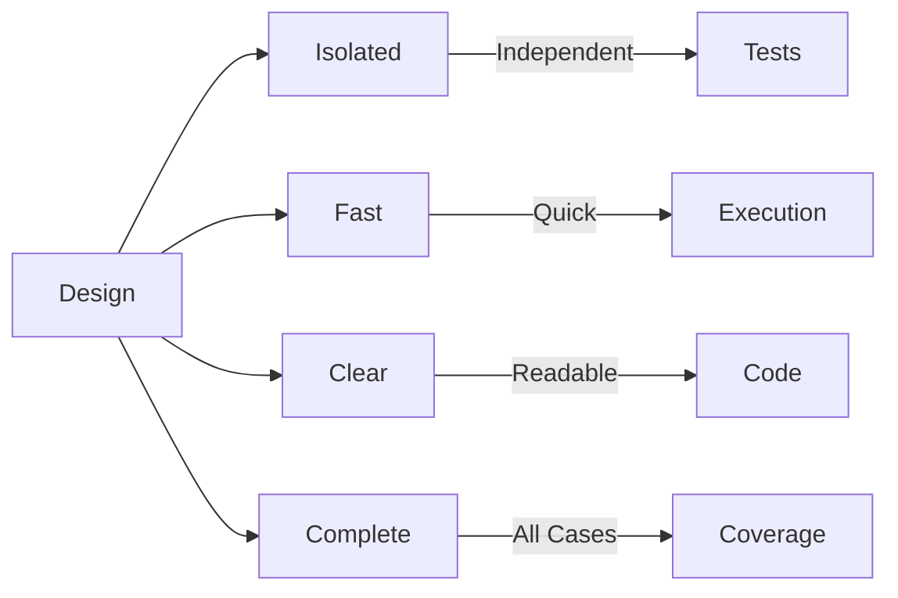

# SAP ABAP Unit Testing Guide

**Complete guide to unit testing in ABAP**

---

## 📚 Table of Contents

1. [Introduction](#introduction)
2. [Unit Testing Overview](#unit-testing-overview)
3. [ABAP Unit Framework](#abap-unit-framework)
4. [Test Classes](#test-classes)
5. [Test Methods](#test-methods)
6. [Assertions](#assertions)
7. [Test Doubles](#test-doubles)
8. [Test Coverage](#test-coverage)
9. [Best Practices](#best-practices)
10. [Examples](#examples)

---

## Introduction

**Unit Testing** verifies that individual components (methods, classes) work correctly in isolation.

### Testing Pyramid



### Unit Testing Benefits

- ✅ **Early Bug Detection**: Find bugs quickly
- ✅ **Documentation**: Tests document behavior
- ✅ **Refactoring Safety**: Safe code changes
- ✅ **Confidence**: Verify code works

---

## Unit Testing Overview

### What to Test?



### Test Coverage Goals

| Coverage Type | Target | Critical |
|---------------|--------|----------|
| **Line Coverage** | 80%+ | 60%+ |
| **Branch Coverage** | 80%+ | 60%+ |
| **Method Coverage** | 90%+ | 70%+ |

---

## ABAP Unit Framework

### ABAP Unit Structure



### Test Class Declaration

```abap
CLASS ltc_leave_calculator DEFINITION
  FOR TESTING
  RISK LEVEL HARMLESS
  DURATION SHORT.

  PRIVATE SECTION.
    METHODS test_calculate_days FOR TESTING.
    METHODS test_calculate_days_weekend FOR TESTING.

ENDCLASS.
```

### Risk Levels

| Level | Description | Use When |
|-------|-------------|----------|
| **HARMLESS** | No side effects | Most tests |
| **DANGEROUS** | May modify data | Integration tests |
| **CRITICAL** | System changes | System tests |

---

## Test Classes

### Test Class Structure

```abap
CLASS ltc_component_name DEFINITION
  FOR TESTING
  RISK LEVEL HARMLESS
  DURATION SHORT.

  PRIVATE SECTION.
    " Test data
    DATA: mo_cut TYPE REF TO zcl_component_under_test.

    " Setup/Teardown
    METHODS setup.
    METHODS teardown.

    " Test methods
    METHODS test_success_scenario FOR TESTING.
    METHODS test_error_scenario FOR TESTING.
    METHODS test_edge_case FOR TESTING.

ENDCLASS.
```

### Setup and Teardown

```abap
CLASS ltc_leave_calculator IMPLEMENTATION.

  METHOD setup.
    " Prepare test environment
    CREATE OBJECT mo_cut.
    " Create test data
  ENDMETHOD.

  METHOD teardown.
    " Clean up
    CLEAR: mo_cut.
    " Delete test data
  ENDMETHOD.

ENDCLASS.
```

---

## Test Methods

### Test Method Structure

```abap
METHOD test_calculate_days.
  " Arrange: Prepare test data
  DATA: lv_start_date TYPE datum VALUE '20260119',
        lv_end_date TYPE datum VALUE '20260123',
        lv_expected TYPE zleave_days VALUE 5,
        lv_actual TYPE zleave_days.

  " Act: Execute method
  lv_actual = mo_cut->calculate_days(
    iv_start_date = lv_start_date
    iv_end_date = lv_end_date
  ).

  " Assert: Verify result
  cl_abap_unit_assert=>assert_equals(
    exp = lv_expected
    act = lv_actual
    msg = 'Days should be 5'
  ).
ENDMETHOD.
```

### Arrange-Act-Assert Pattern



---

## Assertions

### Assertion Types



### Common Assertions

```abap
" Equality
cl_abap_unit_assert=>assert_equals(
  exp = 5
  act = lv_result
  msg = 'Result should be 5'
).

" Not equal
cl_abap_unit_assert=>assert_differs(
  exp = 0
  act = lv_result
  msg = 'Result should not be 0'
).

" Initial
cl_abap_unit_assert=>assert_initial(
  act = lv_result
  msg = 'Result should be initial'
).

" Not initial
cl_abap_unit_assert=>assert_not_initial(
  act = lv_result
  msg = 'Result should not be initial'
).

" True
cl_abap_unit_assert=>assert_true(
  act = lv_condition
  msg = 'Condition should be true'
).

" False
cl_abap_unit_assert=>assert_false(
  act = lv_condition
  msg = 'Condition should be false'
).
```

---

## Test Doubles

### What are Test Doubles?

**Test Doubles** are objects that replace real dependencies in tests.

### Double Types



### Mock Example

```abap
" Mock dependency
CLASS ltc_leave_validator DEFINITION
  FOR TESTING.

  PRIVATE SECTION.
    METHODS test_with_mock_validator FOR TESTING.

ENDCLASS.

CLASS ltc_leave_validator IMPLEMENTATION.

  METHOD test_with_mock_validator.
    " Create mock validator
    DATA: lo_mock_validator TYPE REF TO zif_leave_validator.

    " Use test double (simplified example)
    " In real scenario, use mocking framework
    CREATE OBJECT lo_mock_validator TYPE zcl_mock_validator.

    " Test with mock
    DATA(lo_request) = NEW zcl_leave_request( io_validator = lo_mock_validator ).
    " ... test logic
  ENDMETHOD.

ENDCLASS.
```

---

## Test Coverage

### Coverage Metrics



### Viewing Coverage

**Transaction**: SE80 → Class → Unit Tests → Coverage

**Coverage Report Shows**:
- Lines executed
- Branches covered
- Methods tested
- Uncovered code

### Coverage Goals

- **Minimum**: 60% line coverage
- **Target**: 80% line coverage
- **Ideal**: 90%+ line coverage

---

## Best Practices

### Test Design



1. **One Assertion Per Test**: Focus on one thing
2. **Clear Test Names**: Describe what is tested
3. **Arrange-Act-Assert**: Clear structure
4. **Test Edge Cases**: Boundary conditions
5. **Test Error Cases**: Negative scenarios

### Test Organization

```abap
" Recommended structure:
CLASS ltc_component DEFINITION
  FOR TESTING
  RISK LEVEL HARMLESS
  DURATION SHORT.

  PRIVATE SECTION.
    DATA: mo_cut TYPE REF TO zcl_component.

    METHODS setup.
    METHODS teardown.

    " Positive tests
    METHODS test_success_case FOR TESTING.
    
    " Negative tests
    METHODS test_error_case FOR TESTING.
    
    " Edge cases
    METHODS test_boundary_case FOR TESTING.

ENDCLASS.
```

---

## Examples

### Example 1: Complete Test Class

```abap
CLASS ltc_leave_calculator DEFINITION
  FOR TESTING
  RISK LEVEL HARMLESS
  DURATION SHORT.

  PRIVATE SECTION.
    DATA: mo_calculator TYPE REF TO zcl_leave_calculator.

    METHODS setup.
    METHODS test_calculate_days FOR TESTING.
    METHODS test_calculate_days_weekend FOR TESTING.
    METHODS test_calculate_days_invalid FOR TESTING.

ENDCLASS.

CLASS ltc_leave_calculator IMPLEMENTATION.

  METHOD setup.
    CREATE OBJECT mo_calculator.
  ENDMETHOD.

  METHOD test_calculate_days.
    " Arrange
    DATA: lv_start TYPE datum VALUE '20260119',
          lv_end TYPE datum VALUE '20260123',
          lv_result TYPE zleave_days.

    " Act
    lv_result = mo_calculator->calculate_days(
      iv_start_date = lv_start
      iv_end_date = lv_end
    ).

    " Assert
    cl_abap_unit_assert=>assert_equals(
      exp = 5
      act = lv_result
      msg = 'Should calculate 5 days'
    ).
  ENDMETHOD.

  METHOD test_calculate_days_weekend.
    " Test with weekend
    DATA: lv_start TYPE datum VALUE '20260119', " Monday
          lv_end TYPE datum VALUE '20260125',   " Sunday
          lv_result TYPE zleave_days.

    lv_result = mo_calculator->calculate_days_excluding_weekends(
      iv_start_date = lv_start
      iv_end_date = lv_end
    ).

    " Should exclude weekends (Sat, Sun)
    cl_abap_unit_assert=>assert_equals(
      exp = 5
      act = lv_result
      msg = 'Should exclude weekends'
    ).
  ENDMETHOD.

  METHOD test_calculate_days_invalid.
    " Test invalid input
    DATA: lv_start TYPE datum VALUE '20260123',
          lv_end TYPE datum VALUE '20260119', " Before start
          lv_result TYPE zleave_days.

    " Should handle error
    TRY.
        lv_result = mo_calculator->calculate_days(
          iv_start_date = lv_start
          iv_end_date = lv_end
        ).
        cl_abap_unit_assert=>fail( 'Should raise exception' ).
      CATCH zcx_invalid_date_range.
        " Expected exception
        cl_abap_unit_assert=>assert_true(
          act = abap_true
          msg = 'Exception raised correctly'
        ).
    ENDTRY.
  ENDMETHOD.

ENDCLASS.
```

### Example 2: Testing with Dependencies

```abap
CLASS ltc_leave_request DEFINITION
  FOR TESTING
  RISK LEVEL DANGEROUS
  DURATION SHORT.

  PRIVATE SECTION.
    DATA: mo_request TYPE REF TO zcl_leave_request,
          mo_validator TYPE REF TO zcl_leave_validator.

    METHODS setup.
    METHODS test_create_request_success FOR TESTING.
    METHODS test_create_request_validation_fails FOR TESTING.

ENDCLASS.

CLASS ltc_leave_request IMPLEMENTATION.

  METHOD setup.
    CREATE OBJECT mo_validator.
    CREATE OBJECT mo_request.
  ENDMETHOD.

  METHOD test_create_request_success.
    " Arrange
    DATA: ls_request TYPE zst_leave_request,
          lv_request_id TYPE zleave_req_id,
          lt_messages TYPE bapiret2_t.

    ls_request-employee_id = '00001234'.
    ls_request-leave_type = 'ANNU'.
    ls_request-start_date = '20260119'.
    ls_request-end_date = '20260123'.

    " Act
    mo_request->create_request(
      EXPORTING is_request_data = ls_request
      IMPORTING ev_request_id = lv_request_id
                et_messages = lt_messages
    ).

    " Assert
    cl_abap_unit_assert=>assert_not_initial(
      act = lv_request_id
      msg = 'Request ID should be generated'
    ).
    cl_abap_unit_assert=>assert_initial(
      act = lt_messages
      msg = 'No error messages expected'
    ).
  ENDMETHOD.

ENDCLASS.
```

---

## Running Tests

### Execution Methods

**Method 1: SE80**
1. SE80 → Class
2. Unit Tests → Execute
3. View results

**Method 2: ATC**
1. ATC → Check class
2. View test results
3. Check coverage

**Method 3: Program**
```abap
" Run tests programmatically
cl_aunit_runner=>run( 'LTC_LEAVE_CALCULATOR' ).
```

---

## Common Transactions

| Transaction | Purpose |
|-------------|---------|
| **SE80** | Object Navigator (run tests) |
| **ATC** | ABAP Test Cockpit |
| **SE24** | Class Builder |

---

## Troubleshooting

### Common Issues

1. **Tests Not Running**
   - Check FOR TESTING flag
   - Verify class is active
   - Check test method names

2. **Test Failures**
   - Review assertion messages
   - Check test data
   - Verify expected results

3. **Low Coverage**
   - Add more test cases
   - Test edge cases
   - Test error scenarios

---

## References

- [ABAP Objects Guide](./08_SAP_ABAP_OBJECTS_GUIDE.md)
- [Best Practices Guide](./12_SAP_ABAP_BEST_PRACTICES_GUIDE.md)
- [Testing Guide](../SAP_TESTING_GUIDE.md)

---

**Next**: [Best Practices Guide](./12_SAP_ABAP_BEST_PRACTICES_GUIDE.md)

