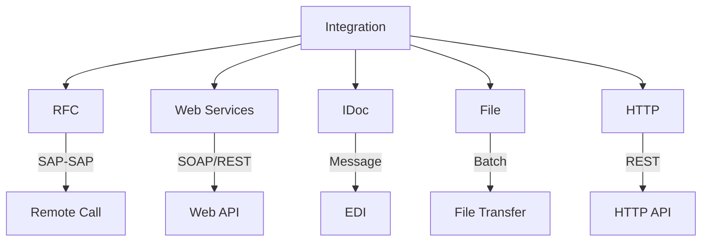
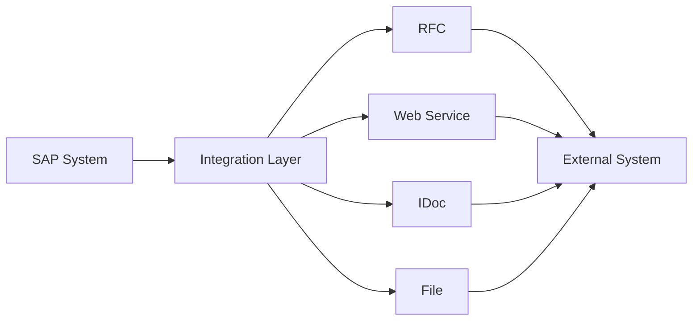
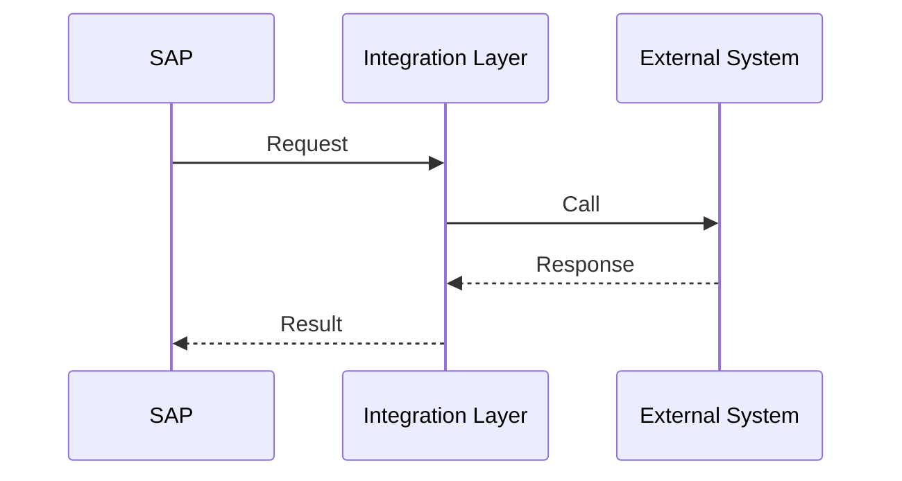
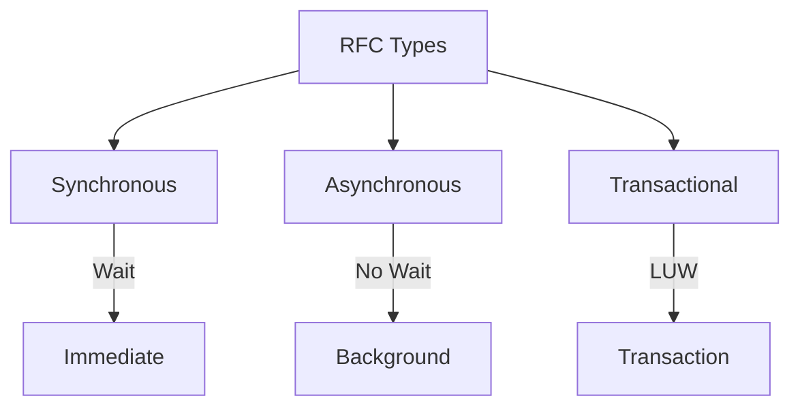
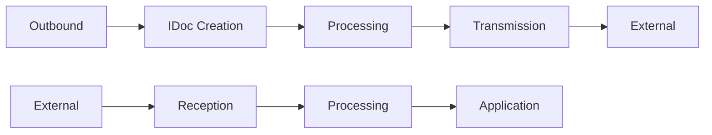
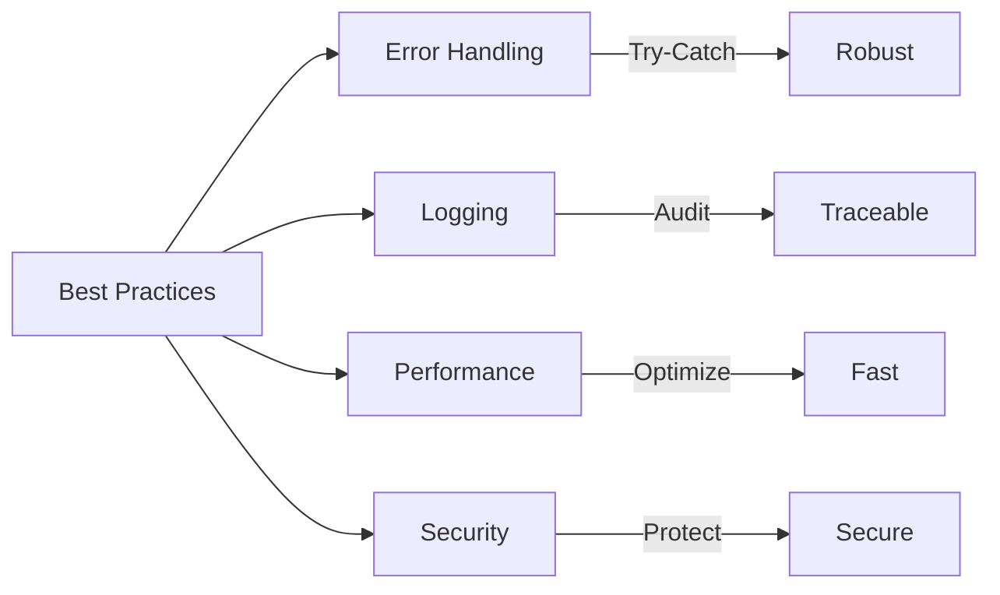

# SAP ABAP Integration Guide

**Complete guide to ABAP integration techniques**

---

## 📚 Table of Contents

1. [Introduction](#introduction)
2. [Integration Overview](#integration-overview)
3. [RFC Communication](#rfc-communication)
4. [Web Services](#web-services)
5. [IDoc Processing](#idoc-processing)
6. [File Interfaces](#file-interfaces)
7. [HTTP Integration](#http-integration)
8. [Best Practices](#best-practices)
9. [Examples](#examples)

---

## Introduction

**ABAP Integration** enables communication between SAP systems and external systems using various protocols and methods.

### Integration Methods



### Integration Scenarios

| Scenario | Method | Use Case |
|----------|--------|----------|
| **SAP to SAP** | RFC | System-to-system |
| **SAP to External** | Web Service | Application integration |
| **External to SAP** | IDoc/File | Batch processing |
| **Real-time** | HTTP/REST | Immediate processing |

---

## Integration Overview

### Integration Architecture



### Integration Flow



---

## RFC Communication

### What is RFC?

**RFC (Remote Function Call)** enables function modules to be called from remote systems.

### RFC Types



### RFC Example

```abap
" Call remote function
CALL FUNCTION 'Z_REMOTE_GET_DATA'
  DESTINATION 'REMOTE_SYSTEM'
  EXPORTING
    iv_key = lv_key
  IMPORTING
    ev_data = lv_data
  EXCEPTIONS
    communication_failure = 1
    system_failure = 2
    OTHERS = 3.

IF sy-subrc = 0.
  " Process data
ELSE.
  " Handle error
ENDIF.
```

**See**: [Function Modules Guide](./05_SAP_ABAP_FUNCTION_MODULES_GUIDE.md) for detailed RFC information.

---

## Web Services

### SOAP Web Services

**Creating SOAP Service**:
1. Create RFC function module
2. SE80 → Utilities → Create Web Service
3. Configure service
4. Activate

### REST Web Services

**Creating REST Service**:
1. Create handler class (IF_HTTP_EXTENSION)
2. Register in SICF
3. Implement HTTP methods
4. Test

**See**: [RESTful Programming Guide](./18_SAP_ABAP_RESTFUL_PROGRAMMING_GUIDE.md) for details.

---

## IDoc Processing

### What is IDoc?

**IDoc (Intermediate Document)** is SAP's standard format for asynchronous data exchange.

### IDoc Processing Flow



### IDoc Example

```abap
" Create outbound IDoc
CALL FUNCTION 'IDOC_CREATE_FROM_DATA'
  EXPORTING
    pi_idoc_control = ls_control
    pi_idoc_data = lt_idoc_data
  IMPORTING
    pe_idoc_number = lv_idoc_number.

" Send IDoc
CALL FUNCTION 'IDOC_WRITE_AND_START_INBOUND'
  EXPORTING
    pi_idoc_number = lv_idoc_number.
```

**See**: [Integration Guide](../SAP_INTEGRATION_GUIDE.md) for detailed IDoc information.

---

## File Interfaces

### File Upload

```abap
" Upload file
DATA: lt_file TYPE TABLE OF string,
      ls_file TYPE string.

CALL FUNCTION 'GUI_UPLOAD'
  EXPORTING
    filename = lv_filename
  TABLES
    data_tab = lt_file
  EXCEPTIONS
    OTHERS = 1.

" Process file
LOOP AT lt_file INTO ls_file.
  " Process line
ENDLOOP.
```

### File Download

```abap
" Download file
DATA: lt_data TYPE TABLE OF string.

" Prepare data
APPEND 'Header' TO lt_data.
APPEND 'Data line 1' TO lt_data.

" Download
CALL FUNCTION 'GUI_DOWNLOAD'
  EXPORTING
    filename = lv_filename
  TABLES
    data_tab = lt_data
  EXCEPTIONS
    OTHERS = 1.
```

---

## HTTP Integration

### HTTP Client

```abap
" Create HTTP client
DATA: lo_http_client TYPE REF TO if_http_client,
      lv_url TYPE string,
      lv_response TYPE string.

lv_url = 'https://api.example.com/data'.

CALL METHOD cl_http_client=>create_by_url
  EXPORTING
    url = lv_url
  IMPORTING
    client = lo_http_client.

" Set method
lo_http_client->request->set_method( 'GET' ).

" Send request
lo_http_client->send( ).
lo_http_client->receive( ).

" Get response
lv_response = lo_http_client->response->get_cdata( ).

" Close
lo_http_client->close( ).
```

### JSON Processing

```abap
" Parse JSON response
DATA: lo_json TYPE REF TO /ui2/cl_json,
      ls_data TYPE ty_data.

lo_json = /ui2/cl_json=>deserialize(
  EXPORTING json = lv_response
  CHANGING data = ls_data
).
```

---

## Best Practices

### Integration Best Practices



1. **Error Handling**: Always handle exceptions
2. **Logging**: Log integration events
3. **Performance**: Optimize data transfer
4. **Security**: Use secure protocols
5. **Retry Logic**: Implement retry for failures

---

## Examples

### Example 1: Complete Integration

```abap
" Integration class
CLASS zcl_leave_integration DEFINITION
  PUBLIC
  FINAL
  CREATE PUBLIC.

  PUBLIC SECTION.
    METHODS integrate_with_hr
      IMPORTING iv_employee_id TYPE pernr_d
      EXPORTING ev_success TYPE abap_bool
                ev_message TYPE string.

ENDCLASS.

CLASS zcl_leave_integration IMPLEMENTATION.

  METHOD integrate_with_hr.
    DATA: lo_http_client TYPE REF TO if_http_client,
          lv_url TYPE string,
          lv_json TYPE string,
          ls_request TYPE ty_hr_request,
          ls_response TYPE ty_hr_response.

    " Prepare request
    ls_request-employee_id = iv_employee_id.
    ls_request-action = 'GET_LEAVE_BALANCE'.

    " Serialize to JSON
    lv_json = /ui2/cl_json=>serialize( data = ls_request ).

    " Create HTTP client
    lv_url = 'https://hr-system.com/api/leave'.
    CALL METHOD cl_http_client=>create_by_url
      EXPORTING
        url = lv_url
      IMPORTING
        client = lo_http_client.

    TRY.
        " Set headers
        lo_http_client->request->set_header_field(
          name = 'Content-Type'
          value = 'application/json'
        ).

        " Set method and data
        lo_http_client->request->set_method( 'POST' ).
        lo_http_client->request->set_cdata( lv_json ).

        " Send request
        lo_http_client->send( ).
        lo_http_client->receive( ).

        " Get response
        lv_json = lo_http_client->response->get_cdata( ).

        " Parse response
        /ui2/cl_json=>deserialize(
          EXPORTING json = lv_json
          CHANGING data = ls_response
        ).

        ev_success = abap_true.
        ev_message = 'Integration successful'.

      CATCH cx_root INTO DATA(lo_error).
        ev_success = abap_false.
        ev_message = lo_error->get_text( ).
    ENDTRY.

    " Close client
    lo_http_client->close( ).
  ENDMETHOD.

ENDCLASS.
```

---

## Common Transactions

| Transaction | Purpose |
|-------------|---------|
| **SM59** | RFC Destinations |
| **SE37** | Function Builder (RFC) |
| **SICF** | HTTP Service Maintenance |
| **WE19** | IDoc Test Tool |
| **SE80** | Object Navigator |

---

## References

- [Function Modules Guide](./05_SAP_ABAP_FUNCTION_MODULES_GUIDE.md)
- [RESTful Programming Guide](./18_SAP_ABAP_RESTFUL_PROGRAMMING_GUIDE.md)
- [Integration Guide](../SAP_INTEGRATION_GUIDE.md)

---

**Related Guides**:
- [OData Services Guide](./17_SAP_ABAP_ODATA_SERVICES_GUIDE.md)

