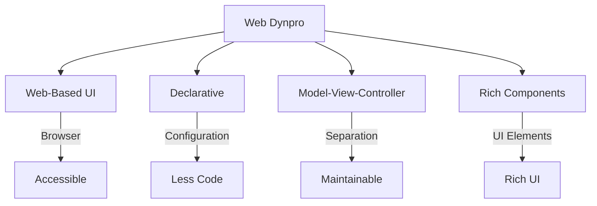
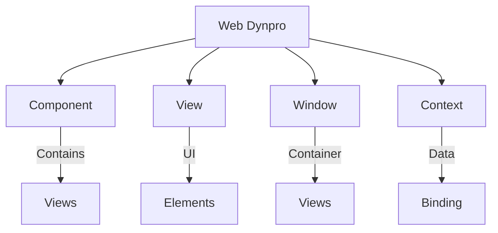
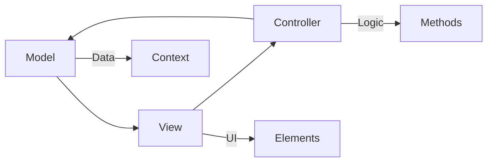
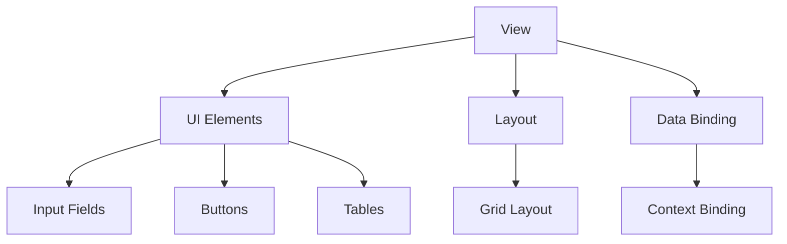
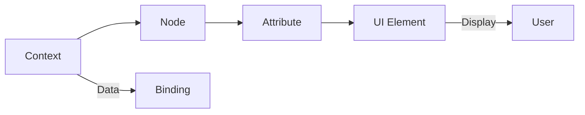
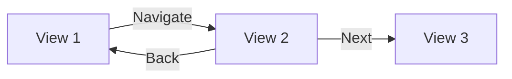
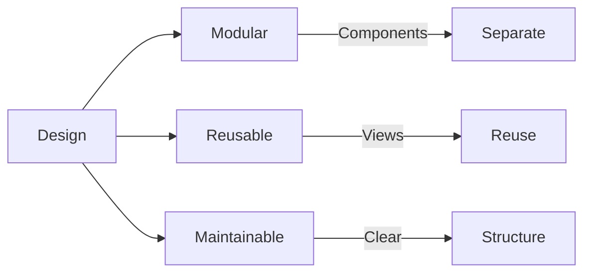

# SAP ABAP Web Dynpro Guide

**Complete guide to Web Dynpro for ABAP**

---

## 📚 Table of Contents

1. [Introduction](#introduction)
2. [Web Dynpro Overview](#web-dynpro-overview)
3. [Web Dynpro Architecture](#web-dynpro-architecture)
4. [Creating Web Dynpro Applications](#creating-web-dynpro-applications)
5. [Components and Views](#components-and-views)
6. [Data Binding](#data-binding)
7. [Navigation](#navigation)
8. [Best Practices](#best-practices)
9. [Examples](#examples)

---

## Introduction

**Web Dynpro for ABAP** is SAP's framework for creating web-based user interfaces using declarative programming.

### Web Dynpro Benefits



### Web Dynpro vs. Screen Programming

| Aspect | Web Dynpro | Screen Programming |
|--------|-----------|-------------------|
| **Platform** | Web browser | SAP GUI |
| **Technology** | Declarative | Procedural |
| **Architecture** | MVC | Event-driven |
| **Modern** | Yes | Legacy |

---

## Web Dynpro Overview

### Web Dynpro Concepts



### Component Structure

```
Web Dynpro Component
├── Views
│   ├── View 1
│   └── View 2
├── Windows
│   └── Main Window
├── Context
│   ├── Nodes
│   └── Attributes
└── Controllers
    ├── View Controller
    └── Component Controller
```

---

## Web Dynpro Architecture

### MVC Pattern



### Architecture Components

1. **Model**: Data structure (Context)
2. **View**: User interface (UI elements)
3. **Controller**: Business logic (Methods)

---

## Creating Web Dynpro Applications

### Step-by-Step Creation

**Transaction**: SE80

**Steps**:
1. SE80 → Web Dynpro → Component
2. Enter component name (e.g., `ZWD_LEAVE_REQUEST`)
3. Click "Create"
4. Create views
5. Define context
6. Implement methods
7. Activate

### Component Creation

```abap
" Web Dynpro Component: ZWD_LEAVE_REQUEST
" Views:
"   - V_MAIN (Main view)
"   - V_DETAIL (Detail view)
" Context:
"   - NODE_REQUEST (Leave request node)
"   - Attribute: REQ_ID, EMPLOYEE_ID, etc.
```

---

## Components and Views

### View Structure



### View Elements

**Common UI Elements**:
- Input fields
- Buttons
- Tables
- Dropdowns
- Checkboxes
- Radio buttons

---

## Data Binding

### Context Binding



### Binding Example

```abap
" Context node: NODE_REQUEST
" Attributes:
"   - REQ_ID (bound to input field)
"   - EMPLOYEE_ID (bound to input field)
"   - LEAVE_TYPE (bound to dropdown)
"   - START_DATE (bound to date field)
```

---

## Navigation

### Navigation Flow



### Navigation Implementation

```abap
" Navigation method
METHOD onactionnavigate.
  " Navigate to detail view
  wd_this->fire_navigate_to_detail_plg( ).
ENDMETHOD.
```

---

## Best Practices

### Web Dynpro Design



1. **Modular Design**: Separate components
2. **Reusable Views**: Create reusable views
3. **Clear Context**: Well-defined context structure
4. **Error Handling**: Handle errors gracefully
5. **Performance**: Optimize data loading

---

## Examples

### Example 1: Simple Web Dynpro Component

```abap
" Component: ZWD_LEAVE_REQUEST
" View: V_MAIN

" Context:
"   NODE_REQUEST
"     - REQ_ID
"     - EMPLOYEE_ID
"     - LEAVE_TYPE
"     - START_DATE
"     - END_DATE

" View Controller Methods:
METHOD wddoinit.
  " Initialize view
  DATA: lo_node TYPE REF TO if_wd_context_node.
  lo_node = wd_context->get_child_node( 'NODE_REQUEST' ).
  " Initialize data
ENDMETHOD.

METHOD onactioncreate.
  " Create leave request
  DATA: ls_request TYPE zst_leave_request.
  " Get data from context
  " Create request
  " Navigate to detail
ENDMETHOD.
```

---

## Common Transactions

| Transaction | Purpose |
|-------------|---------|
| **SE80** | Web Dynpro Component Builder |
| **SE24** | Class Builder |
| **SE11** | Data Dictionary |

---

## References

- [Screen Programming Guide](./06_SAP_ABAP_SCREEN_PROGRAMMING_GUIDE.md)
- [ABAP Objects Guide](./08_SAP_ABAP_OBJECTS_GUIDE.md)
- [OData Services Guide](./17_SAP_ABAP_ODATA_SERVICES_GUIDE.md)

---

**Note**: Web Dynpro is being replaced by SAP Fiori and UI5. Consider using Fiori for new developments.

**Next**: [OData Services Guide](./17_SAP_ABAP_ODATA_SERVICES_GUIDE.md)

