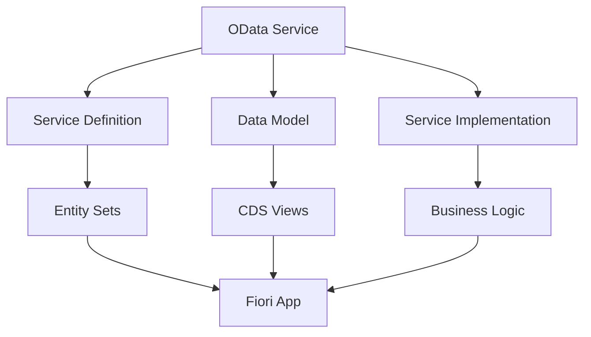
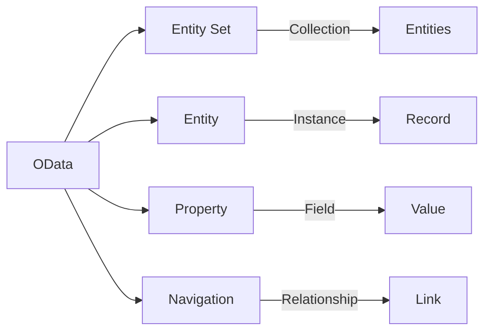
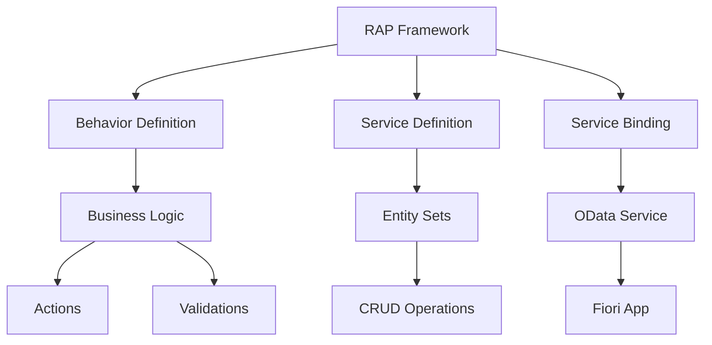
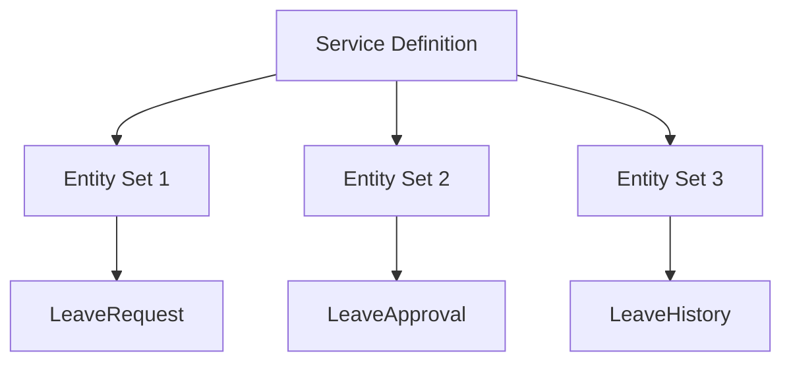
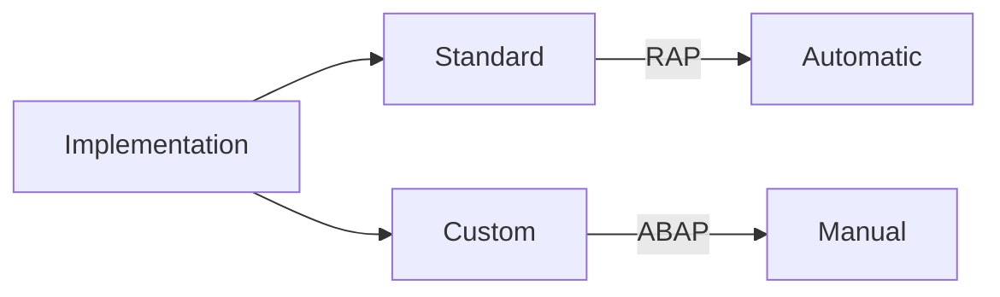
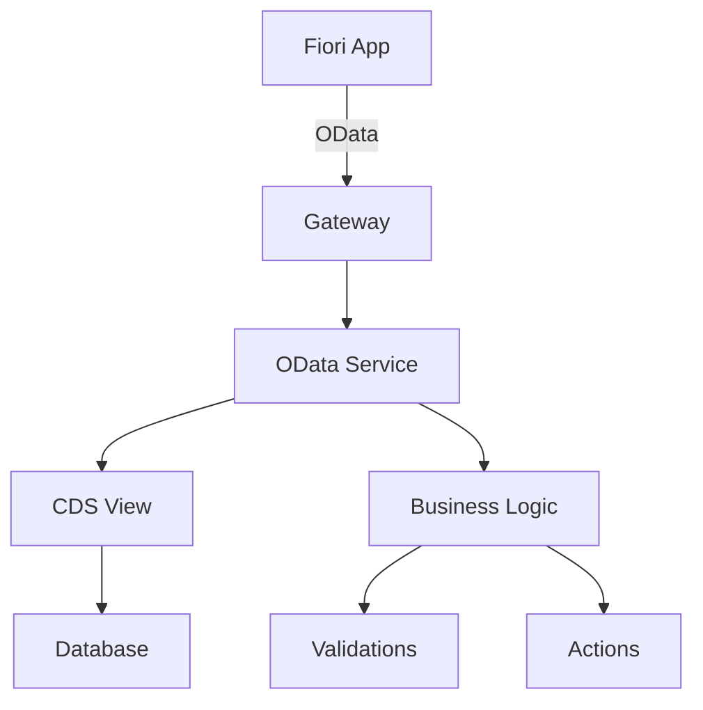
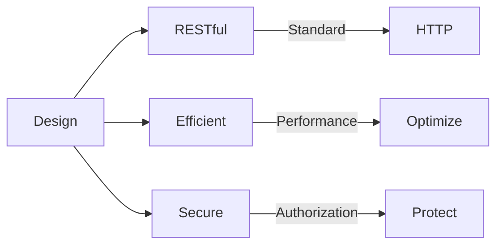

# SAP ABAP OData Services Guide

**Complete guide to creating OData services in ABAP**

---

## 📚 Table of Contents

1. [Introduction](#introduction)
2. [OData Overview](#odata-overview)
3. [RAP Framework](#rap-framework)
4. [Creating OData Services](#creating-odata-services)
5. [Service Definition](#service-definition)
6. [Service Implementation](#service-implementation)
7. [CDS Views](#cds-views)
8. [Fiori Integration](#fiori-integration)
9. [Best Practices](#best-practices)
10. [Examples](#examples)

---

## Introduction

**OData (Open Data Protocol)** is a REST-based protocol for creating and consuming data APIs. SAP uses OData for Fiori applications and modern integrations.

### OData Architecture



### OData Benefits

- ✅ **Standard Protocol**: Industry standard
- ✅ **RESTful**: Simple HTTP-based
- ✅ **Fiori Ready**: Native Fiori support
- ✅ **Flexible**: Query options support

---

## OData Overview

### OData Concepts



### OData Operations

| Operation | HTTP Method | Purpose |
|-----------|-------------|---------|
| **Read** | GET | Retrieve data |
| **Create** | POST | Create new entity |
| **Update** | PUT/PATCH | Update entity |
| **Delete** | DELETE | Delete entity |

---

## RAP Framework

### What is RAP?

**RAP (Restful ABAP Programming)** is SAP's modern framework for building OData services and Fiori apps.

### RAP Architecture



### RAP Components

1. **CDS View**: Data model
2. **Behavior Definition**: Business logic
3. **Service Definition**: OData service
4. **Service Binding**: Service configuration

---

## Creating OData Services

### Step-by-Step Creation

**Transaction**: SEGW (Gateway Service Builder)

**Method 1: Using SEGW (Classic)**
1. Create project
2. Import data model (DDIC/CDS)
3. Generate service
4. Activate
5. Test

**Method 2: Using RAP (Modern)**
1. Create CDS view
2. Create behavior definition
3. Create service definition
4. Create service binding
5. Activate and test

---

## Service Definition

### Service Definition Structure

```abap
" Service Definition: ZSD_LEAVE_SERVICE
@EndUserText.label: 'Leave Request Service'
define service ZSD_LEAVE_SERVICE {
  expose ZC_LEAVE_REQUEST as LeaveRequest;
  expose ZC_LEAVE_APPROVAL as LeaveApproval;
}
```

### Entity Sets



---

## Service Implementation

### Implementation Methods



### RAP Implementation

```abap
" Behavior Definition: ZBD_LEAVE_REQUEST
managed implementation in class zbp_i_leave_request unique;

" Behavior implementation
CLASS zbp_i_leave_request DEFINITION
  PUBLIC
  ABSTRACT
  FINAL
  FOR BEHAVIOR OF zi_leave_request.

  PUBLIC SECTION.
    INTERFACES if_oo_adt_classrun.

ENDCLASS.

CLASS zbp_i_leave_request IMPLEMENTATION.

  METHOD create.
    " Create logic
    LOOP AT entities INTO DATA(entity).
      " Process create
    ENDLOOP.
  ENDMETHOD.

  METHOD update.
    " Update logic
  ENDMETHOD.

  METHOD delete.
    " Delete logic
  ENDMETHOD.

ENDCLASS.
```

---

## CDS Views

### CDS View for OData

```abap
" CDS View: ZC_LEAVE_REQUEST
@EndUserText.label: 'Leave Request'
@AccessControl.authorizationCheck: #CHECK
define view entity ZC_LEAVE_REQUEST
  as select from zleave_req_hdr
    association [1..1] to I_Employee as _Employee
      on $projection.employee_id = _Employee.EmployeeID
{
  key req_id,
      employee_id,
      leave_type,
      start_date,
      end_date,
      days,
      status,
      _Employee
}
```

### CDS Associations

```abap
" Association definition
define view entity ZC_LEAVE_REQUEST
  as select from zleave_req_hdr
    association [1..1] to ZC_EMPLOYEE as _Employee
      on $projection.employee_id = _Employee.employee_id
{
  key req_id,
      employee_id,
      _Employee
}
```

---

## Fiori Integration

### Fiori App Integration



### Fiori Elements

**List Report**:
- Automatically generated from OData
- Uses entity set metadata
- Standard CRUD operations

**Object Page**:
- Detail view
- Navigation properties
- Actions and validations

---

## Best Practices

### OData Design



1. **Use RAP**: Prefer RAP framework
2. **CDS Views**: Use CDS for data model
3. **Authorization**: Implement authorization
4. **Performance**: Optimize queries
5. **Error Handling**: Proper error responses

---

## Examples

### Example 1: Complete OData Service

```abap
" 1. CDS View
@EndUserText.label: 'Leave Request'
define view entity ZC_LEAVE_REQUEST
  as select from zleave_req_hdr
{
  key req_id,
      employee_id,
      leave_type,
      start_date,
      end_date,
      days,
      status
}

" 2. Behavior Definition
managed implementation in class zbp_i_leave_request unique;

" 3. Service Definition
define service ZSD_LEAVE_SERVICE {
  expose ZC_LEAVE_REQUEST as LeaveRequest;
}

" 4. Service Binding
" Configure in ADT
```

---

## Common Transactions

| Transaction | Purpose |
|-------------|---------|
| **SEGW** | Gateway Service Builder |
| **ADT** | ABAP Development Tools |
| **/IWFND/MAINT_SERVICE** | Service Maintenance |
| **/IWFND/GW_CLIENT** | Gateway Client |

---

## References

- [ABAP Objects Guide](./08_SAP_ABAP_OBJECTS_GUIDE.md)
- [Integration Guide](./15_SAP_ABAP_INTEGRATION_GUIDE.md)
- [RESTful Programming Guide](./18_SAP_ABAP_RESTFUL_PROGRAMMING_GUIDE.md)

---

**Next**: [RESTful Programming Guide](./18_SAP_ABAP_RESTFUL_PROGRAMMING_GUIDE.md)

