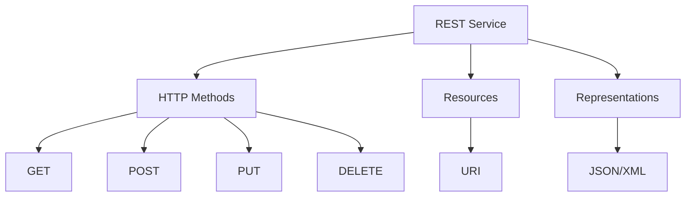
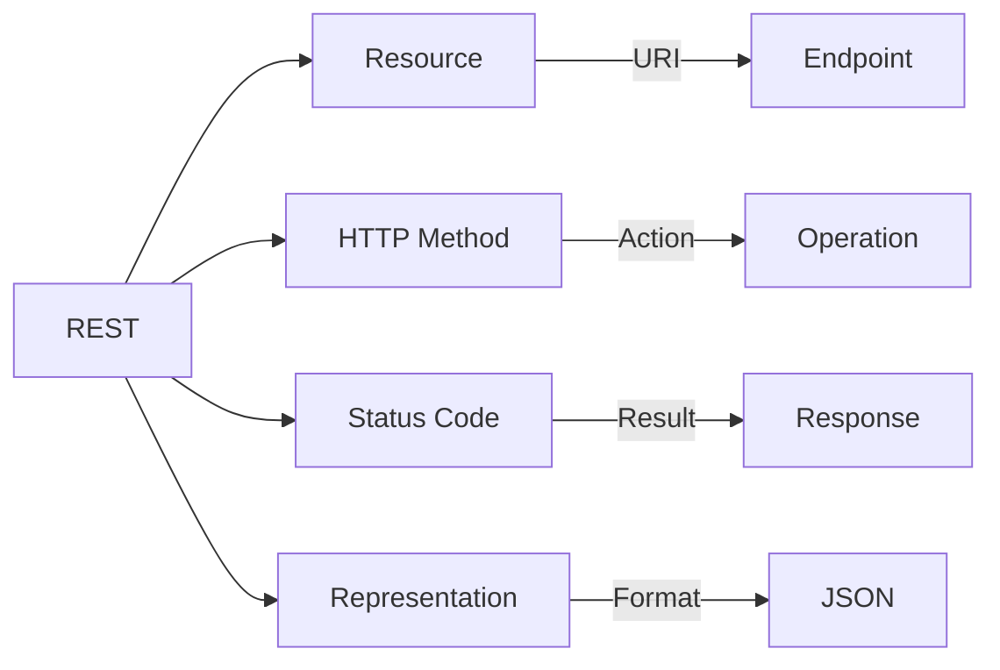
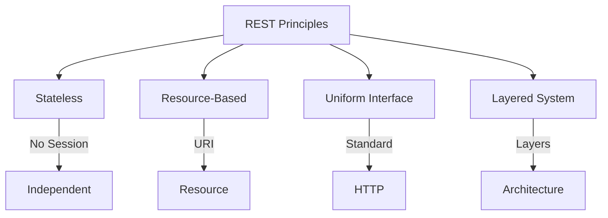
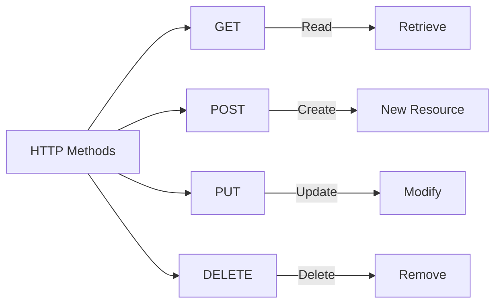
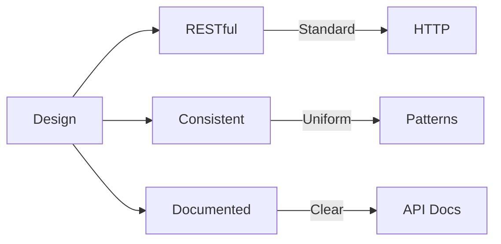

# SAP ABAP RESTful Programming Guide

**Complete guide to RESTful programming in ABAP**

---

## 📚 Table of Contents

1. [Introduction](#introduction)
2. [REST Overview](#rest-overview)
3. [REST Principles](#rest-principles)
4. [HTTP Methods](#http-methods)
5. [Creating REST Services](#creating-rest-services)
6. [JSON Processing](#json-processing)
7. [Error Handling](#error-handling)
8. [Best Practices](#best-practices)
9. [Examples](#examples)

---

## Introduction

**REST (Representational State Transfer)** is an architectural style for designing web services. ABAP supports RESTful programming for modern integrations.

### REST Architecture



### REST Benefits

- ✅ **Stateless**: No server-side session
- ✅ **Standard**: HTTP-based
- ✅ **Simple**: Easy to understand
- ✅ **Scalable**: Horizontal scaling

---

## REST Overview

### REST Concepts



### REST vs SOAP

| Aspect | REST | SOAP |
|--------|------|------|
| **Protocol** | HTTP | HTTP/SMTP |
| **Format** | JSON/XML | XML only |
| **Stateless** | Yes | Can be stateful |
| **Complexity** | Simple | Complex |
| **Performance** | Fast | Slower |

---

## REST Principles

### REST Principles



### Key Principles

1. **Stateless**: Each request contains all information
2. **Resource-Based**: Everything is a resource
3. **Uniform Interface**: Standard HTTP methods
4. **Representation**: JSON/XML formats
5. **Layered**: Can have multiple layers

---

## HTTP Methods

### HTTP Method Mapping

| Method | Purpose | Idempotent | Safe |
|--------|---------|------------|------|
| **GET** | Retrieve | Yes | Yes |
| **POST** | Create | No | No |
| **PUT** | Update/Replace | Yes | No |
| **PATCH** | Partial Update | No | No |
| **DELETE** | Delete | Yes | No |

### HTTP Methods Usage



---

## Creating REST Services

### REST Service in ABAP

**Transaction**: SICF (HTTP Service Maintenance)

**Steps**:
1. Create handler class
2. Implement IF_HTTP_EXTENSION
3. Register in SICF
4. Test service

### Handler Class Structure

```abap
CLASS zcl_rest_leave_service DEFINITION
  PUBLIC
  FINAL
  CREATE PUBLIC.

  PUBLIC SECTION.
    INTERFACES if_http_extension.

ENDCLASS.

CLASS zcl_rest_leave_service IMPLEMENTATION.

  METHOD if_http_extension~handle_request.
    DATA: lv_method TYPE string,
          lv_path TYPE string,
          lv_json TYPE string.

    " Get HTTP method
    lv_method = server->request->get_header_field( '~request_method' ).

    " Get path
    lv_path = server->request->get_header_field( '~request_uri' ).

    " Route based on method and path
    CASE lv_method.
      WHEN 'GET'.
        handle_get( server ).
      WHEN 'POST'.
        handle_post( server ).
      WHEN 'PUT'.
        handle_put( server ).
      WHEN 'DELETE'.
        handle_delete( server ).
      WHEN OTHERS.
        send_error( server = server
                    code = 405
                    message = 'Method not allowed' ).
    ENDCASE.
  ENDMETHOD.

  METHOD handle_get.
    " GET /api/leave-requests/{id}
    DATA: lv_path TYPE string,
          lv_id TYPE string.

    lv_path = server->request->get_header_field( '~request_uri' ).

    " Parse path
    FIND REGEX '/api/leave-requests/(\d+)' IN lv_path
      SUBMATCHES lv_id.

    IF lv_id IS NOT INITIAL.
      " Get single request
      get_request_by_id( server = server
                         id = lv_id ).
    ELSE.
      " Get all requests
      get_all_requests( server ).
    ENDIF.
  ENDMETHOD.

  METHOD handle_post.
    " POST /api/leave-requests
    DATA: lv_json TYPE string,
          ls_request TYPE zst_leave_request.

    " Get request body
    lv_json = server->request->get_cdata( ).

    " Parse JSON
    /ui2/cl_json=>deserialize(
      EXPORTING json = lv_json
      CHANGING data = ls_request
    ).

    " Create request
    create_request( server = server
                    request = ls_request ).
  ENDMETHOD.

ENDCLASS.
```

---

## JSON Processing

### JSON Parsing

```abap
" Parse JSON request
DATA: lv_json TYPE string,
      ls_request TYPE zst_leave_request.

lv_json = server->request->get_cdata( ).

" Deserialize JSON
/ui2/cl_json=>deserialize(
  EXPORTING json = lv_json
  CHANGING data = ls_request
).
```

### JSON Generation

```abap
" Generate JSON response
DATA: ls_request TYPE zst_leave_request,
      lv_json TYPE string.

" Get data
SELECT SINGLE * FROM zleave_req_hdr
  INTO CORRESPONDING FIELDS OF ls_request
  WHERE req_id = lv_id.

" Serialize to JSON
lv_json = /ui2/cl_json=>serialize( data = ls_request ).

" Send response
server->response->set_content_type( 'application/json' ).
server->response->set_cdata( lv_json ).
server->response->set_status( code = 200 reason = 'OK' ).
```

---

## Error Handling

### HTTP Status Codes

| Code | Meaning | Use When |
|------|---------|----------|
| **200** | OK | Success |
| **201** | Created | Resource created |
| **400** | Bad Request | Invalid input |
| **401** | Unauthorized | Authentication required |
| **403** | Forbidden | Not authorized |
| **404** | Not Found | Resource not found |
| **500** | Internal Error | Server error |

### Error Response Example

```abap
METHOD send_error.
  DATA: ls_error TYPE ty_error,
        lv_json TYPE string.

  ls_error-error = iv_message.
  ls_error-code = iv_code.

  " Serialize error
  lv_json = /ui2/cl_json=>serialize( data = ls_error ).

  " Send error response
  server->response->set_content_type( 'application/json' ).
  server->response->set_cdata( lv_json ).
  server->response->set_status( code = iv_code reason = iv_message ).
ENDMETHOD.
```

---

## Best Practices

### REST Design



1. **Use Standard HTTP Methods**: GET, POST, PUT, DELETE
2. **RESTful URLs**: `/api/resources/{id}`
3. **JSON Format**: Use JSON for data exchange
4. **Status Codes**: Use appropriate HTTP codes
5. **Error Handling**: Consistent error format
6. **Versioning**: API versioning strategy

---

## Examples

### Example 1: Complete REST Service

```abap
CLASS zcl_rest_leave_service DEFINITION
  PUBLIC
  FINAL
  CREATE PUBLIC.

  PUBLIC SECTION.
    INTERFACES if_http_extension.

  PRIVATE SECTION.
    METHODS handle_get
      IMPORTING server TYPE REF TO if_http_server.

    METHODS handle_post
      IMPORTING server TYPE REF TO if_http_server.

    METHODS get_request_by_id
      IMPORTING server TYPE REF TO if_http_server
                id TYPE string.

    METHODS create_request
      IMPORTING server TYPE REF TO if_http_server
                request TYPE zst_leave_request.

    METHODS send_response
      IMPORTING server TYPE REF TO if_http_server
                data TYPE any
                code TYPE i DEFAULT 200.

    METHODS send_error
      IMPORTING server TYPE REF TO if_http_server
                code TYPE i
                message TYPE string.

ENDCLASS.

CLASS zcl_rest_leave_service IMPLEMENTATION.

  METHOD if_http_extension~handle_request.
    DATA: lv_method TYPE string.

    lv_method = server->request->get_header_field( '~request_method' ).

    CASE lv_method.
      WHEN 'GET'.
        handle_get( server ).
      WHEN 'POST'.
        handle_post( server ).
      WHEN OTHERS.
        send_error( server = server
                    code = 405
                    message = 'Method not allowed' ).
    ENDCASE.
  ENDMETHOD.

  METHOD handle_get.
    DATA: lv_path TYPE string,
          lv_id TYPE string.

    lv_path = server->request->get_header_field( '~request_uri' ).

    FIND REGEX '/api/leave-requests/(\d+)' IN lv_path
      SUBMATCHES lv_id.

    IF lv_id IS NOT INITIAL.
      get_request_by_id( server = server id = lv_id ).
    ELSE.
      " Get all (simplified)
      send_error( server = server
                  code = 501
                  message = 'Not implemented' ).
    ENDIF.
  ENDMETHOD.

  METHOD get_request_by_id.
    DATA: ls_request TYPE zst_leave_request,
          lv_json TYPE string.

    SELECT SINGLE *
      FROM zleave_req_hdr
      INTO CORRESPONDING FIELDS OF ls_request
      WHERE req_id = id.

    IF sy-subrc = 0.
      lv_json = /ui2/cl_json=>serialize( data = ls_request ).
      send_response( server = server data = lv_json code = 200 ).
    ELSE.
      send_error( server = server
                  code = 404
                  message = 'Request not found' ).
    ENDIF.
  ENDMETHOD.

  METHOD send_response.
    server->response->set_content_type( 'application/json' ).
    server->response->set_cdata( data ).
    server->response->set_status( code = code reason = 'OK' ).
  ENDMETHOD.

  METHOD send_error.
    DATA: ls_error TYPE ty_error,
          lv_json TYPE string.

    ls_error-error = message.
    ls_error-code = code.

    lv_json = /ui2/cl_json=>serialize( data = ls_error ).

    server->response->set_content_type( 'application/json' ).
    server->response->set_cdata( lv_json ).
    server->response->set_status( code = code reason = message ).
  ENDMETHOD.

ENDCLASS.
```

---

## Common Transactions

| Transaction | Purpose |
|-------------|---------|
| **SICF** | HTTP Service Maintenance |
| **SE24** | Class Builder |
| **SE80** | Object Navigator |

---

## References

- [OData Services Guide](./17_SAP_ABAP_ODATA_SERVICES_GUIDE.md)
- [Integration Guide](./15_SAP_ABAP_INTEGRATION_GUIDE.md)
- [ABAP Objects Guide](./08_SAP_ABAP_OBJECTS_GUIDE.md)

---

**Next**: [Integration Guide](./15_SAP_ABAP_INTEGRATION_GUIDE.md)

