# 18 SAP ABAP RESTful Programming Guide

## Table of Contents
1. [Introduction](#introduction)
2. [RESTful ABAP Overview](#restful-abap-overview)
3. [RAP Architecture](#rap-architecture)
4. [CDS Views](#cds-views)
5. [Behavior Definitions](#behavior-definitions)
6. [Behavior Implementation](#behavior-implementation)
7. [Service Bindings](#service-bindings)
8. [Modern ABAP Syntax](#modern-abap-syntax)
9. [RAP Development Workflow](#rap-development-workflow)
10. [Best Practices](#best-practices)
11. [Common Pitfalls](#common-pitfalls)
12. [Real-World Examples](#real-world-examples)
13. [Performance Considerations](#performance-considerations)
14. [Security Considerations](#security-considerations)
15. [Summary](#summary)
16. [Resources](#resources)

---

## Introduction

### Overview
RESTful ABAP Programming (RAP) Model is the modern, cloud-ready approach for S/4HANA development. RAP provides a standardized framework for building Fiori applications and REST APIs using CDS views, behavior definitions, and service bindings.

### Learning Objectives
By the end of this guide, you will be able to:
- Understand RAP architecture and components
- Create and maintain CDS views
- Define behavior definitions for business logic
- Implement behavior handlers
- Create and configure service bindings
- Use modern ABAP syntax effectively
- Apply RAP best practices and patterns

### Prerequisites
- Completed [17_SAP_ABAP_ODATA_SERVICES_GUIDE.md](./17_SAP_ABAP_ODATA_SERVICES_GUIDE.md)
- Completed [08_SAP_ABAP_OBJECTS_GUIDE.md](./08_SAP_ABAP_OBJECTS_GUIDE.md)
- Understanding of S/4HANA concepts
- Familiarity with REST APIs

### Who Should Read This Guide
- ABAP developers working on S/4HANA projects
- Developers building Fiori applications
- Consultants implementing modern SAP solutions
- Architects designing cloud-ready applications

### Estimated Reading Time
6-7 hours (including hands-on practice)

---

## RESTful ABAP Overview

### What is RAP?

RESTful ABAP Programming (RAP) Model is SAP's framework for building business applications in S/4HANA. It provides a standardized way to create OData services and Fiori applications using declarative programming.

### RAP Benefits

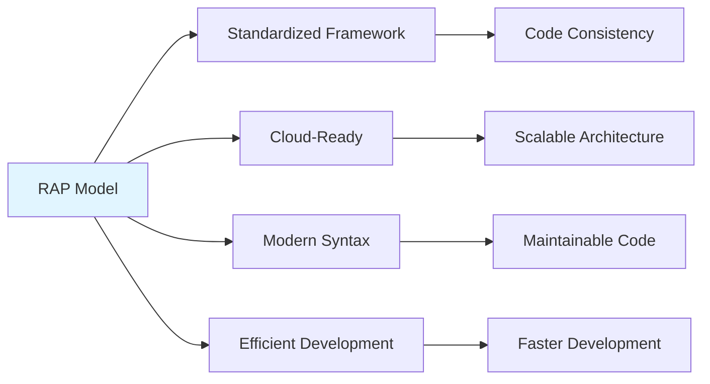

### RAP vs Traditional ABAP

| Aspect | Traditional ABAP | RAP Model |
|--------|-----------------|-----------|
| **Data Access** | Open SQL | CDS Views |
| **Business Logic** | Function modules, classes | Behavior definitions |
| **API Creation** | Manual OData services | Service bindings |
| **Development** | Procedural | Declarative |
| **Cloud Support** | Limited | Full support |

### RAP Architecture Overview

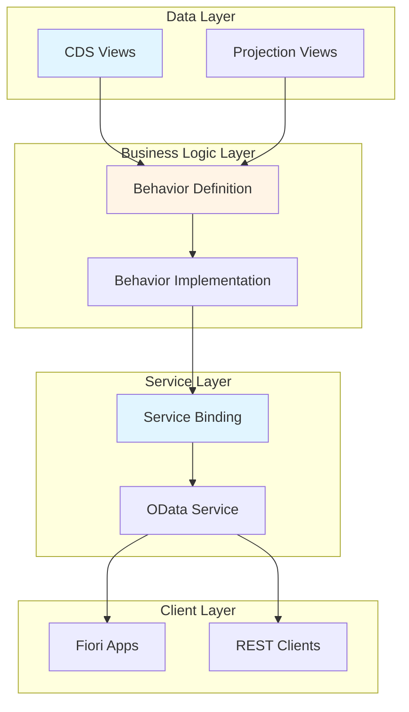

---

## RAP Architecture

### RAP Components

RAP consists of three main layers:

1. **Data Model Layer**: CDS views define the data structure
2. **Business Logic Layer**: Behavior definitions and implementations
3. **Service Layer**: Service bindings expose REST APIs

### RAP Development Flow

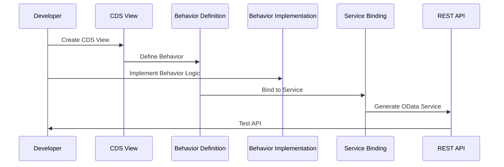

### RAP Object Types

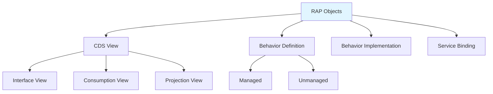

---

## CDS Views

### What are CDS Views?

CDS (Core Data Services) Views provide a data definition language for defining data models in ABAP. They offer enhanced SQL capabilities and are the foundation of RAP.

### CDS View Types

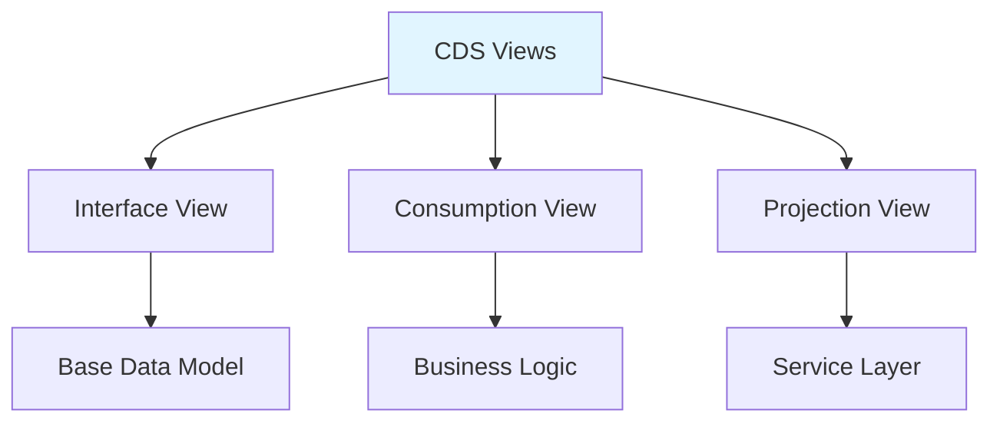

### Creating Interface CDS View

**Step-by-Step Tutorial**:

1. **Transaction**: ADT (Eclipse) or SE80
2. **Create**: New CDS View Entity
3. **Define**: Data structure

**Example: Customer Interface View**

```abap
@AbapCatalog.viewEnhancementCategory: [#NONE]
@AccessControl.authorizationCheck: #CHECK
@EndUserText.label: 'Customer Interface View'
@Metadata.ignorePropagatedAnnotations: true
@ObjectModel.usageType:{
    serviceQuality: #X,
    sizeCategory: #S,
    dataClass: #MIXED
}
define view entity ZI_CUSTOMER
  as select from zcustomer
{
  key customer_id,
      customer_name,
      email,
      phone,
      city,
      country,
      credit_limit,
      created_date,
      created_by,
      last_changed_date,
      last_changed_by,
      
      /* Associations */
      _Order : redirected to child ZI_CUSTOMER_ORDER
        where customer_id = ZI_CUSTOMER.customer_id
}
```

### CDS View Annotations

**Common Annotations**:

```abap
@EndUserText.label: 'Customer Master Data'
@AccessControl.authorizationCheck: #CHECK
@ObjectModel.dataCategory: #MASTER
@ObjectModel.representativeKey: 'customer_id'
@Search.searchable: true
```

### Consumption View

**Example: Customer Consumption View**

```abap
@EndUserText.label: 'Customer Consumption View'
@AccessControl.authorizationCheck: #CHECK
@Metadata.allowExtensions: true
@Search.searchable: true
define view entity ZC_CUSTOMER
  as projection on ZI_CUSTOMER
{
  key customer_id,
      customer_name,
      email,
      city,
      country,
      credit_limit,
      
      /* Calculated fields */
      @EndUserText.label: 'Full Address'
      concat_with_space(city, country, 2) as full_address,
      
      /* Associations */
      _Order
}
```

### Projection View

**Example: Customer Projection View**

```abap
@EndUserText.label: 'Customer Projection'
@AccessControl.authorizationCheck: #CHECK
define view entity ZP_CUSTOMER
  as projection on ZC_CUSTOMER
{
  key customer_id,
      customer_name,
      email,
      city,
      country
}
```

### CDS View Best Practices

1. **Use Interface Views** for base data model
2. **Use Consumption Views** for business logic
3. **Use Projection Views** for service exposure
4. **Add Annotations** for metadata
5. **Define Associations** for relationships

---

## Behavior Definitions

### What are Behavior Definitions?

Behavior definitions specify the business logic and operations (create, update, delete, read) for CDS entities in RAP.

### Behavior Definition Types

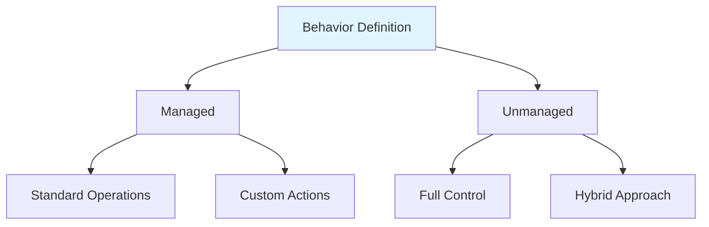

### Managed Behavior Definition

**Example: Managed Behavior**

```abap
managed implementation in class zbp_i_customer unique;
strict;

define behavior for ZI_CUSTOMER alias Customer
persistent table zcustomer
lock master
authorization master ( instance )
{
  // Standard operations
  create;
  update;
  delete;
  
  // Field control
  field ( readonly ) customer_id;
  field ( mandatory ) customer_name, email;
  
  // Validation
  validation validate_email on save
    { field email; }
  
  // Actions
  action ( features : instance ) activate;
  action ( features : instance ) deactivate;
  
  // Determinations
  determination calculate_credit_limit on save
    { field customer_name, country; }
}
```

### Unmanaged Behavior Definition

**Example: Unmanaged Behavior**

```abap
unmanaged implementation in class zbp_i_customer unique;

define behavior for ZI_CUSTOMER alias Customer
{
  // Read-only
  read only;
  
  // Custom operations
  action ( features : instance ) create_customer;
  action ( features : instance ) update_customer;
  action ( features : instance ) delete_customer;
  
  // Functions
  function calculate_total_orders
    result [1] $self;
}
```

### Behavior Definition Features

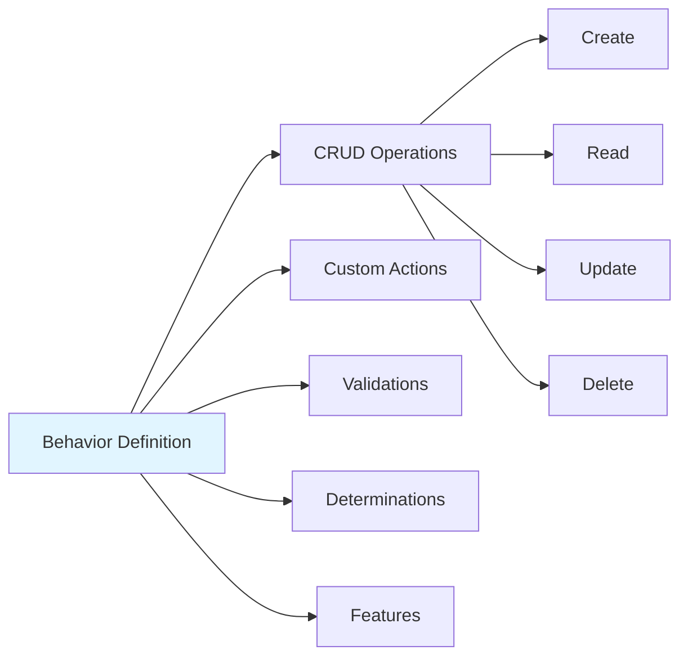

---

## Behavior Implementation

### Behavior Handler Class

**Example: Behavior Implementation**

```abap
CLASS zbp_i_customer DEFINITION PUBLIC ABSTRACT FINAL
  FOR BEHAVIOR OF ZI_CUSTOMER.
  
  PUBLIC SECTION.
    CLASS-DATA: customer_buffer TYPE REF TO /dmo/cl_customer_buffer.
    
  PRIVATE SECTION.
    METHODS: validate_email FOR VALIDATE ON SAVE
      IMPORTING keys FOR Customer~validate_email,
             calculate_credit_limit FOR DETERMINATION ON SAVE
      IMPORTING keys FOR Customer~calculate_credit_limit,
             activate FOR MODIFY
      IMPORTING keys FOR ACTION Customer~activate RESULT result,
             deactivate FOR MODIFY
      IMPORTING keys FOR ACTION Customer~deactivate RESULT result.
ENDCLASS.

CLASS zbp_i_customer IMPLEMENTATION.
  
  METHOD validate_email.
    " Read changed data
    READ ENTITIES OF ZI_CUSTOMER IN LOCAL MODE
      ENTITY Customer
      FIELDS ( email )
      WITH CORRESPONDING #( keys )
      RESULT DATA(lt_customers).
    
    " Validate email format
    LOOP AT lt_customers INTO DATA(ls_customer).
      IF ls_customer-email IS NOT INITIAL.
        " Email validation logic
        IF NOT contains( val = ls_customer-email sub = '@' ).
          APPEND VALUE #( %tky = ls_customer-%tky ) TO failed-customer.
          APPEND VALUE #( %tky = ls_customer-%tky
                          %msg = new_message( id = 'ZCUSTOMER'
                                              number = '001'
                                              severity = if_abap_behv_message=>severity-error )
                          %element-email = if_abap_behv=>mk-on ) TO reported-customer.
        ENDIF.
      ENDIF.
    ENDLOOP.
  ENDMETHOD.
  
  METHOD calculate_credit_limit.
    " Determination logic
    READ ENTITIES OF ZI_CUSTOMER IN LOCAL MODE
      ENTITY Customer
      FIELDS ( customer_name country credit_limit )
      WITH CORRESPONDING #( keys )
      RESULT DATA(lt_customers).
    
    MODIFY ENTITIES OF ZI_CUSTOMER IN LOCAL MODE
      ENTITY Customer
      UPDATE FIELDS ( credit_limit )
      WITH VALUE #( FOR customer IN lt_customers
                    ( %tky = customer-%tky
                      credit_limit = calculate_limit( customer-country ) ) ).
  ENDMETHOD.
  
  METHOD activate.
    " Action implementation
    MODIFY ENTITIES OF ZI_CUSTOMER IN LOCAL MODE
      ENTITY Customer
      UPDATE FIELDS ( status )
      WITH VALUE #( FOR key IN keys
                    ( %tky = key-%tky
                      status = 'A' ) ).
    
    READ ENTITIES OF ZI_CUSTOMER IN LOCAL MODE
      ENTITY Customer
      ALL FIELDS
      WITH CORRESPONDING #( keys )
      RESULT result.
  ENDMETHOD.
  
  METHOD deactivate.
    " Action implementation
    MODIFY ENTITIES OF ZI_CUSTOMER IN LOCAL MODE
      ENTITY Customer
      UPDATE FIELDS ( status )
      WITH VALUE #( FOR key IN keys
                    ( %tky = key-%tky
                      status = 'I' ) ).
    
    READ ENTITIES OF ZI_CUSTOMER IN LOCAL MODE
      ENTITY Customer
      ALL FIELDS
      WITH CORRESPONDING #( keys )
      RESULT result.
  ENDMETHOD.
  
ENDCLASS.
```

### Behavior Implementation Flow

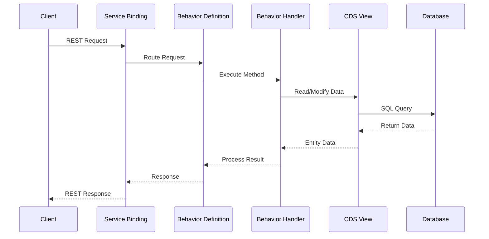

---

## Service Bindings

### What are Service Bindings?

Service bindings connect CDS views with behavior definitions to create OData services automatically.

### Service Binding Types

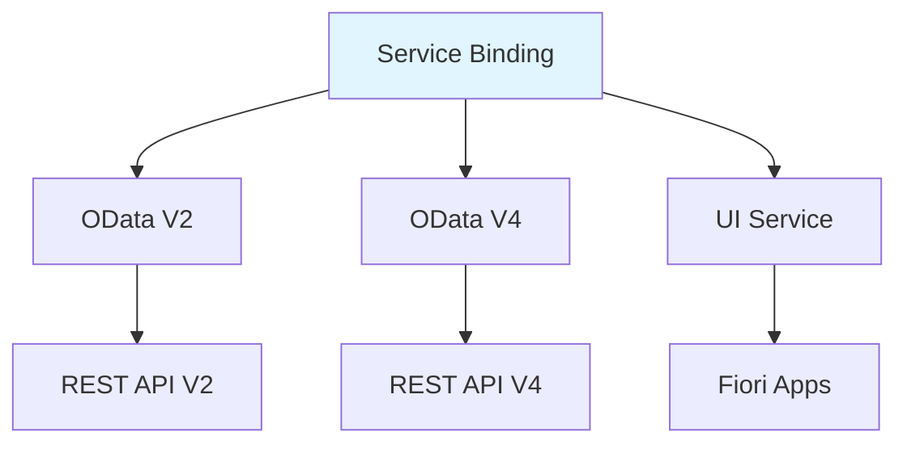

### Creating Service Binding

**Step-by-Step Tutorial**:

1. **Transaction**: ADT (Eclipse)
2. **Create**: New Service Binding
3. **Select**: Projection view
4. **Configure**: Service type (OData V2/V4)
5. **Activate**: Service binding

### Service Binding Configuration

```abap
" Service binding automatically generated
" Binds projection view to OData service
" Service URL: /sap/bc/rest/zcustomer_srv
```

### Service Binding Flow

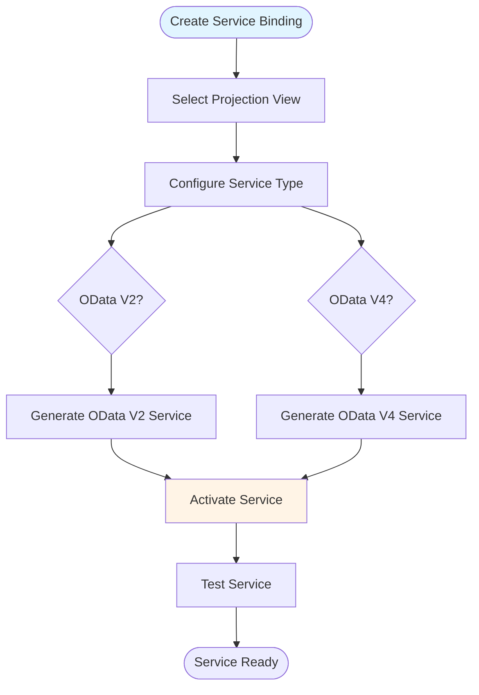

---

## Modern ABAP Syntax

### Modern ABAP Features

RAP leverages modern ABAP syntax introduced in S/4HANA.

### Inline Declarations

**Before (Traditional)**:
```abap
DATA: lt_materials TYPE TABLE OF mara,
      ls_material TYPE mara.

SELECT * FROM mara INTO TABLE lt_materials.
LOOP AT lt_materials INTO ls_material.
  " Process
ENDLOOP.
```

**After (Modern)**:
```abap
SELECT * FROM mara INTO TABLE @DATA(lt_materials).
LOOP AT lt_materials INTO DATA(ls_material).
  " Process
ENDLOOP.
```

### String Templates

**Before**:
```abap
CONCATENATE 'Customer' lv_customer_id 'found' INTO lv_message SEPARATED BY space.
```

**After**:
```abap
DATA(lv_message) = |Customer { lv_customer_id } found|.
```

### Table Expressions

**Before**:
```abap
READ TABLE lt_materials INTO ls_material
  WITH KEY matnr = 'MAT001'.
IF sy-subrc = 0.
  " Process
ENDIF.
```

**After**:
```abap
DATA(ls_material) = lt_materials[ matnr = 'MAT001' ].
IF ls_material IS NOT INITIAL.
  " Process
ENDIF.
```

### FOR Expressions

**Example: Generate Data**

```abap
" Generate table using FOR
DATA(lt_numbers) = VALUE tt_numbers(
  FOR i = 1 WHILE i <= 100
  ( number = i )
).

" Filter and transform
DATA(lt_even_squares) = VALUE tt_numbers(
  FOR i = 1 WHILE i <= 10
  WHERE ( i MOD 2 = 0 )
  ( number = i * i )
).
```

### REDUCE Expression

**Example: Aggregation**

```abap
" Sum all amounts
DATA(lv_total) = REDUCE dmbtr(
  INIT sum = 0
  FOR ls_order IN lt_orders
  NEXT sum = sum + ls_order-amount
).

" Count matching records
DATA(lv_count) = REDUCE i(
  INIT count = 0
  FOR ls_material IN lt_materials
  WHERE ( matnr LIKE 'MAT%' )
  NEXT count = count + 1
).
```

### COND Expression

**Example: Conditional Assignment**

```abap
" Traditional
IF lv_amount > 1000.
  lv_discount = '0.20'.
ELSEIF lv_amount > 500.
  lv_discount = '0.10'.
ELSE.
  lv_discount = '0.05'.
ENDIF.

" Modern
DATA(lv_discount) = COND p(
  WHEN lv_amount > 1000 THEN '0.20'
  WHEN lv_amount > 500 THEN '0.10'
  ELSE '0.05'
).
```

### SWITCH Expression

**Example: Value Mapping**

```abap
" Traditional
CASE lv_status.
  WHEN 'A'.
    lv_status_text = 'Active'.
  WHEN 'I'.
    lv_status_text = 'Inactive'.
  WHEN OTHERS.
    lv_status_text = 'Unknown'.
ENDCASE.

" Modern
DATA(lv_status_text) = SWITCH string( lv_status
  WHEN 'A' THEN 'Active'
  WHEN 'I' THEN 'Inactive'
  ELSE 'Unknown' ).
```

---

## RAP Development Workflow

### Complete RAP Development Process

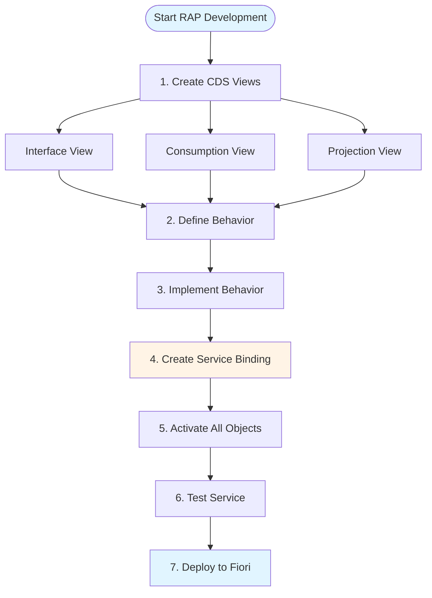

### Step-by-Step RAP Development

**Step 1: Create Interface CDS View**

```abap
@AbapCatalog.viewEnhancementCategory: [#NONE]
@AccessControl.authorizationCheck: #CHECK
@EndUserText.label: 'Customer Interface'
define view entity ZI_CUSTOMER
  as select from zcustomer
{
  key customer_id,
      customer_name,
      email,
      city,
      country,
      credit_limit
}
```

**Step 2: Create Consumption View**

```abap
@EndUserText.label: 'Customer Consumption'
define view entity ZC_CUSTOMER
  as projection on ZI_CUSTOMER
{
  key customer_id,
      customer_name,
      email,
      city,
      country,
      credit_limit
}
```

**Step 3: Create Projection View**

```abap
@EndUserText.label: 'Customer Projection'
define view entity ZP_CUSTOMER
  as projection on ZC_CUSTOMER
{
  key customer_id,
      customer_name,
      email,
      city,
      country
}
```

**Step 4: Define Behavior**

```abap
managed implementation in class zbp_i_customer unique;

define behavior for ZI_CUSTOMER alias Customer
persistent table zcustomer
{
  create;
  update;
  delete;
  
  field ( readonly ) customer_id;
  field ( mandatory ) customer_name, email;
}
```

**Step 5: Implement Behavior**

```abap
CLASS zbp_i_customer DEFINITION PUBLIC ABSTRACT FINAL
  FOR BEHAVIOR OF ZI_CUSTOMER.
ENDCLASS.

CLASS zbp_i_customer IMPLEMENTATION.
  " Implementation methods
ENDCLASS.
```

**Step 6: Create Service Binding**

1. Right-click projection view
2. New → Service Binding
3. Select OData V4
4. Activate

**Step 7: Test Service**

```bash
# Service URL
GET /sap/bc/rest/zcustomer_srv/CustomerSet

# Response
{
  "value": [
    {
      "customer_id": "CUST001",
      "customer_name": "John Doe",
      "email": "john@example.com"
    }
  ]
}
```

---

## Best Practices

### 1. Layer Separation

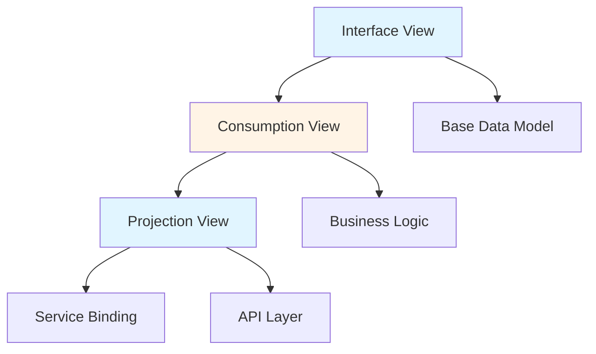

### 2. Use Managed Behavior When Possible

**Managed Behavior** (Preferred):
- Standard CRUD operations
- Automatic handling
- Less code

**Unmanaged Behavior** (When Needed):
- Complex business logic
- Custom operations
- Legacy system integration

### 3. Optimize CDS Views

```abap
" ✅ Good: Select only needed fields
define view entity ZI_CUSTOMER
  as select from zcustomer
{
  key customer_id,
      customer_name,
      email
}

" ❌ Bad: Select all fields
define view entity ZI_CUSTOMER
  as select from zcustomer
{
  key customer_id,
      @*: true  " All fields
}
```

### 4. Use Associations

```abap
" Define associations for relationships
define view entity ZI_CUSTOMER
{
  key customer_id,
      customer_name,
      
      _Order : redirected to child ZI_ORDER
        where customer_id = ZI_CUSTOMER.customer_id
}
```

### 5. Error Handling

```abap
METHOD validate_email.
  " Always use proper error handling
  TRY.
      " Validation logic
    CATCH cx_root INTO DATA(lx_error).
      " Log error
      APPEND VALUE #( %tky = key-%tky
                      %msg = new_message( ... ) ) TO reported-customer.
  ENDTRY.
ENDMETHOD.
```

---

## Common Pitfalls

### 1. Not Using Projection Views

**Bad**:
```abap
" Exposing consumption view directly
Service Binding → ZC_CUSTOMER
```

**Good**:
```abap
" Use projection view for service
Service Binding → ZP_CUSTOMER
```

### 2. Missing Field Control

**Bad**:
```abap
define behavior for ZI_CUSTOMER
{
  create;
  update;
  delete;
  " No field control
}
```

**Good**:
```abap
define behavior for ZI_CUSTOMER
{
  create;
  update;
  delete;
  
  field ( readonly ) customer_id;
  field ( mandatory ) customer_name;
}
```

### 3. Not Handling Errors

**Bad**:
```abap
METHOD validate_email.
  " No error handling
  IF email IS INITIAL.
    " Error not reported
  ENDIF.
ENDMETHOD.
```

**Good**:
```abap
METHOD validate_email.
  IF email IS INITIAL.
    APPEND VALUE #( %tky = key-%tky
                    %msg = new_message( ... )
                    %element-email = if_abap_behv=>mk-on ) TO reported-customer.
    APPEND VALUE #( %tky = key-%tky ) TO failed-customer.
  ENDIF.
ENDMETHOD.
```

---

## Real-World Examples

### Example 1: Complete Customer RAP Application

**Interface View**:
```abap
@AbapCatalog.viewEnhancementCategory: [#NONE]
@AccessControl.authorizationCheck: #CHECK
@EndUserText.label: 'Customer Interface'
define view entity ZI_CUSTOMER
  as select from zcustomer
{
  key customer_id,
      customer_name,
      email,
      phone,
      city,
      country,
      credit_limit,
      status,
      created_date,
      created_by,
      last_changed_date,
      last_changed_by
}
```

**Behavior Definition**:
```abap
managed implementation in class zbp_i_customer unique;

define behavior for ZI_CUSTOMER alias Customer
persistent table zcustomer
lock master
authorization master ( instance )
{
  create;
  update;
  delete;
  
  field ( readonly ) customer_id, created_date, created_by;
  field ( mandatory ) customer_name, email;
  
  validation validate_email on save { field email; }
  validation validate_credit_limit on save { field credit_limit; }
  
  determination calculate_credit_limit on save
    { field customer_name, country; }
  
  action ( features : instance ) activate;
  action ( features : instance ) deactivate;
}
```

**Behavior Implementation**:
```abap
CLASS zbp_i_customer DEFINITION PUBLIC ABSTRACT FINAL
  FOR BEHAVIOR OF ZI_CUSTOMER.
  
  PRIVATE SECTION.
    METHODS: validate_email FOR VALIDATE ON SAVE
      IMPORTING keys FOR Customer~validate_email,
             validate_credit_limit FOR VALIDATE ON SAVE
      IMPORTING keys FOR Customer~validate_credit_limit,
             calculate_credit_limit FOR DETERMINATION ON SAVE
      IMPORTING keys FOR Customer~calculate_credit_limit,
             activate FOR MODIFY
      IMPORTING keys FOR ACTION Customer~activate RESULT result,
             deactivate FOR MODIFY
      IMPORTING keys FOR ACTION Customer~deactivate RESULT result.
ENDCLASS.

CLASS zbp_i_customer IMPLEMENTATION.
  
  METHOD validate_email.
    READ ENTITIES OF ZI_CUSTOMER IN LOCAL MODE
      ENTITY Customer
      FIELDS ( email )
      WITH CORRESPONDING #( keys )
      RESULT DATA(lt_customers).
    
    LOOP AT lt_customers INTO DATA(ls_customer).
      IF ls_customer-email IS NOT INITIAL AND
         NOT contains( val = ls_customer-email sub = '@' ).
        APPEND VALUE #( %tky = ls_customer-%tky ) TO failed-customer.
        APPEND VALUE #( %tky = ls_customer-%tky
                        %msg = new_message( id = 'ZCUSTOMER'
                                            number = '001'
                                            severity = if_abap_behv_message=>severity-error )
                        %element-email = if_abap_behv=>mk-on ) TO reported-customer.
      ENDIF.
    ENDLOOP.
  ENDMETHOD.
  
  METHOD validate_credit_limit.
    READ ENTITIES OF ZI_CUSTOMER IN LOCAL MODE
      ENTITY Customer
      FIELDS ( credit_limit )
      WITH CORRESPONDING #( keys )
      RESULT DATA(lt_customers).
    
    LOOP AT lt_customers INTO DATA(ls_customer).
      IF ls_customer-credit_limit < 0.
        APPEND VALUE #( %tky = ls_customer-%tky ) TO failed-customer.
        APPEND VALUE #( %tky = ls_customer-%tky
                        %msg = new_message( id = 'ZCUSTOMER'
                                            number = '002'
                                            severity = if_abap_behv_message=>severity-error )
                        %element-credit_limit = if_abap_behv=>mk-on ) TO reported-customer.
      ENDIF.
    ENDLOOP.
  ENDMETHOD.
  
  METHOD calculate_credit_limit.
    " Calculate credit limit based on country
    READ ENTITIES OF ZI_CUSTOMER IN LOCAL MODE
      ENTITY Customer
      FIELDS ( country credit_limit )
      WITH CORRESPONDING #( keys )
      RESULT DATA(lt_customers).
    
    MODIFY ENTITIES OF ZI_CUSTOMER IN LOCAL MODE
      ENTITY Customer
      UPDATE FIELDS ( credit_limit )
      WITH VALUE #( FOR customer IN lt_customers
                    ( %tky = customer-%tky
                      credit_limit = get_default_credit_limit( customer-country ) ) ).
  ENDMETHOD.
  
  METHOD activate.
    MODIFY ENTITIES OF ZI_CUSTOMER IN LOCAL MODE
      ENTITY Customer
      UPDATE FIELDS ( status )
      WITH VALUE #( FOR key IN keys
                    ( %tky = key-%tky
                      status = 'A' ) ).
    
    READ ENTITIES OF ZI_CUSTOMER IN LOCAL MODE
      ENTITY Customer
      ALL FIELDS
      WITH CORRESPONDING #( keys )
      RESULT result.
  ENDMETHOD.
  
  METHOD deactivate.
    MODIFY ENTITIES OF ZI_CUSTOMER IN LOCAL MODE
      ENTITY Customer
      UPDATE FIELDS ( status )
      WITH VALUE #( FOR key IN keys
                    ( %tky = key-%tky
                      status = 'I' ) ).
    
    READ ENTITIES OF ZI_CUSTOMER IN LOCAL MODE
      ENTITY Customer
      ALL FIELDS
      WITH CORRESPONDING #( keys )
      RESULT result.
  ENDMETHOD.
  
ENDCLASS.
```

---

## Performance Considerations

### CDS View Performance

1. **Select Only Needed Fields**: Don't use `@*: true`
2. **Use Indexes**: Ensure WHERE clauses use indexed fields
3. **Limit Associations**: Avoid deep association chains
4. **Use Projections**: Project only required fields

### Behavior Implementation Performance

```abap
" ✅ Good: Bulk operations
READ ENTITIES OF ZI_CUSTOMER IN LOCAL MODE
  ENTITY Customer
  ALL FIELDS
  WITH CORRESPONDING #( keys )
  RESULT DATA(lt_customers).

" ❌ Bad: Loop with individual reads
LOOP AT keys INTO DATA(key).
  READ ENTITY ZI_CUSTOMER
    FROM VALUE #( ( %tky = key-%tky ) )
    RESULT DATA(ls_customer).
ENDLOOP.
```

### Caching Strategies

```abap
" Use local mode for better performance
READ ENTITIES OF ZI_CUSTOMER IN LOCAL MODE
  ENTITY Customer
  FIELDS ( customer_id customer_name )
  WITH CORRESPONDING #( keys )
  RESULT DATA(lt_customers).
```

---

## Security Considerations

### Authorization Checks

```abap
" In behavior definition
define behavior for ZI_CUSTOMER
authorization master ( instance )
{
  create;
  update;
  delete;
}
```

### Field-Level Security

```abap
" Control field access
field ( readonly ) customer_id;
field ( mandatory ) customer_name;
```

### Input Validation

```abap
" Always validate input
METHOD validate_email.
  " Validate email format
  " Check for SQL injection
  " Verify business rules
ENDMETHOD.
```

---

## Summary

### Key Takeaways

1. **RAP** is the modern framework for S/4HANA development
2. **CDS Views** define the data model (Interface → Consumption → Projection)
3. **Behavior Definitions** specify business logic and operations
4. **Behavior Implementations** contain the actual logic code
5. **Service Bindings** automatically generate OData services
6. **Modern ABAP** syntax improves code quality and maintainability
7. **Layer Separation** ensures maintainable architecture

### What You've Learned

- ✅ Understanding of RAP architecture and components
- ✅ Ability to create CDS views (Interface, Consumption, Projection)
- ✅ Knowledge of behavior definitions and implementations
- ✅ Skills to create and configure service bindings
- ✅ Modern ABAP syntax usage
- ✅ Best practices and performance optimization
- ✅ Security considerations in RAP

### Learning Path Complete

**Congratulations!** You've completed all 18 ABAP guides covering:
- Basics to advanced topics
- Traditional to modern ABAP
- On-premise to cloud development
- Complete S/4HANA development stack

Continue practicing and applying these concepts in real-world projects!

### Next Steps

- **Practice**: Build RAP applications
- **Explore**: Advanced RAP features
- **Stay Updated**: Follow SAP RAP developments
- **Community**: Join SAP Community discussions

---

## Resources

### SAP Official Documentation
- [SAP Help - RAP](https://help.sap.com/viewer/product/SAP_S4HANA_CLOUD/latest/en-US)
- [CDS Views Guide](https://help.sap.com/viewer/product/SAP_S4HANA_CLOUD/latest/en-US)
- [RAP Developer Guide](https://help.sap.com/viewer/923180ddb98240829d935862025004d6/Cloud/en-US)

### Learning Resources
- SAP Learning Hub: RAP courses
- openSAP: RAP and CDS courses
- SAP Community: [RAP Discussions](https://community.sap.com/topics/restful-abap)

### Tools
- **ADT**: ABAP Development Tools (Eclipse)
- **SAP Business Application Studio**: Cloud development

### Related Guides
- [17_SAP_ABAP_ODATA_SERVICES_GUIDE.md](./17_SAP_ABAP_ODATA_SERVICES_GUIDE.md) - Previous: OData Services
- [08_SAP_ABAP_OBJECTS_GUIDE.md](./08_SAP_ABAP_OBJECTS_GUIDE.md) - Object-oriented concepts
- [10_SAP_ABAP_PERFORMANCE_GUIDE.md](./10_SAP_ABAP_PERFORMANCE_GUIDE.md) - Performance optimization
- [SAP ABAP Programming Guide (Comprehensive)](../SAP_ABAP_PROGRAMMING_GUIDE.md) - Complete reference

---

**Last Updated**: 2024

**Related Guides**:
- [17_SAP_ABAP_ODATA_SERVICES_GUIDE.md](./17_SAP_ABAP_ODATA_SERVICES_GUIDE.md) - Previous: OData Services
- [SAP ABAP Programming Guide (Comprehensive)](../SAP_ABAP_PROGRAMMING_GUIDE.md) - Complete reference

**🎉 Congratulations on completing the complete ABAP learning path! You now have comprehensive knowledge from basics to modern S/4HANA development!**

