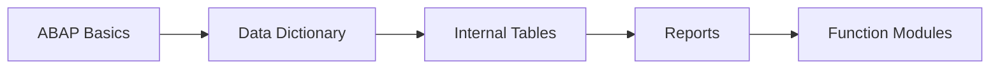
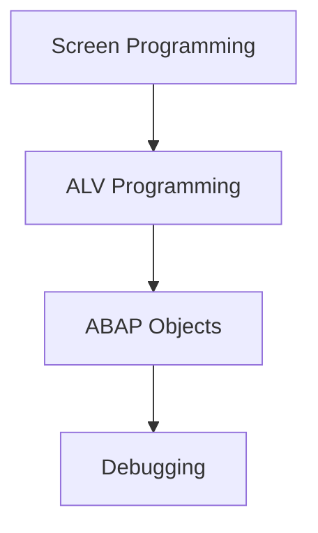
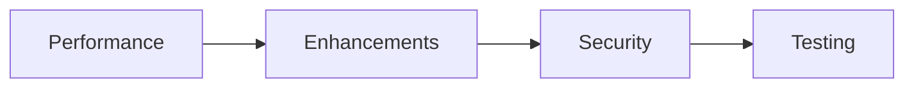
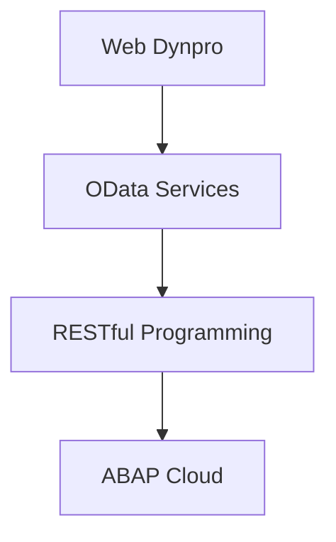

# ABAP Development Guides

**Complete guide collection for SAP ABAP programming**

---

## 📚 Guide Index

### 🟢 Fundamentals (Start Here)

1. **[01. ABAP Basics Guide](./01_SAP_ABAP_BASICS_GUIDE.md)** ✅
   - ABAP syntax and fundamentals
   - Data types and variables
   - Control structures
   - Basic programming concepts

2. **[02. Data Dictionary Guide](./02_SAP_ABAP_DATA_DICTIONARY_GUIDE.md)**
   - Tables, structures, and data elements
   - Domains and search helps
   - Views and lock objects
   - Table maintenance

3. **[03. Internal Tables Guide](./03_SAP_ABAP_INTERNAL_TABLES_GUIDE.md)**
   - Internal table types
   - Operations and methods
   - Performance optimization
   - Modern ABAP syntax

4. **[04. Reports Guide](./04_SAP_ABAP_REPORTS_GUIDE.md)**
   - Selection screens
   - Classic reports
   - Interactive reports
   - Report optimization

5. **[05. Function Modules Guide](./05_SAP_ABAP_FUNCTION_MODULES_GUIDE.md)**
   - Creating function modules
   - Import/export parameters
   - Exception handling
   - RFC and remote calls

### 🟡 Intermediate Topics

6. **[06. Screen Programming Guide](./06_SAP_ABAP_SCREEN_PROGRAMMING_GUIDE.md)**
   - Screen painter
   - PBO/PAI logic
   - Screen flow control
   - Dynamic screens

7. **[07. ALV Programming Guide](./07_SAP_ABAP_ALV_PROGRAMMING_GUIDE.md)**
   - ALV Grid
   - ALV List
   - ALV Tree
   - Custom ALV features

8. **[08. ABAP Objects Guide](./08_SAP_ABAP_OBJECTS_GUIDE.md)**
   - Classes and objects
   - Inheritance and polymorphism
   - Interfaces
   - Design patterns

9. **[09. Debugging Guide](./09_SAP_ABAP_DEBUGGING_GUIDE.md)**
   - Debugger tools
   - Breakpoints
   - Watchpoints
   - Performance analysis

### 🔴 Advanced Topics

10. **[10. Performance Guide](./10_SAP_ABAP_PERFORMANCE_GUIDE.md)**
    - Database optimization
    - Internal table performance
    - Memory management
    - Code optimization

11. **[11. Enhancement Framework Guide](./11_SAP_ABAP_ENHANCEMENT_FRAMEWORK_GUIDE.md)**
    - BAdIs
    - Enhancement points
    - Customer exits
    - Implicit enhancements

12. **[12. Best Practices Guide](./12_SAP_ABAP_BEST_PRACTICES_GUIDE.md)**
    - Coding standards
    - Naming conventions
    - Error handling
    - Documentation

13. **[13. Security Guide](./13_SAP_ABAP_SECURITY_GUIDE.md)**
    - Authorization checks
    - SQL injection prevention
    - Secure coding
    - Data protection

14. **[14. Unit Testing Guide](./14_SAP_ABAP_UNIT_TESTING_GUIDE.md)**
    - ABAP Unit framework
    - Test classes
    - Mock objects
    - Test coverage

15. **[15. Integration Guide](./15_SAP_ABAP_INTEGRATION_GUIDE.md)**
    - RFC communication
    - Web services
    - IDoc processing
    - File interfaces

### 🚀 Modern ABAP

16. **[16. Web Dynpro Guide](./16_SAP_ABAP_WEB_DYNPRO_GUIDE.md)**
    - Web Dynpro architecture
    - UI components
    - Navigation
    - Data binding

17. **[17. OData Services Guide](./17_SAP_ABAP_ODATA_SERVICES_GUIDE.md)**
    - OData fundamentals
    - Service implementation
    - RAP framework
    - Fiori integration

18. **[18. RESTful Programming Guide](./18_SAP_ABAP_RESTFUL_PROGRAMMING_GUIDE.md)**
    - REST principles
    - HTTP services
    - JSON processing
    - API development

---

## 🎯 Learning Path

### Beginner Path
1. ABAP Basics → Data Dictionary → Internal Tables → Reports

### Intermediate Path
1. Function Modules → Screen Programming → ALV → ABAP Objects

### Advanced Path
1. Performance → Enhancements → Security → Testing → Integration

### Modern Path
1. OData Services → RESTful Programming → Web Dynpro

---

## 📊 Guide Completion Status

| Guide | Status | Priority |
|-------|--------|----------|
| 01. ABAP Basics | ✅ Complete | High |
| 02. Data Dictionary | ⏳ Pending | High |
| 03. Internal Tables | ⏳ Pending | High |
| 04. Reports | ⏳ Pending | High |
| 05. Function Modules | ⏳ Pending | Medium |
| 06. Screen Programming | ⏳ Pending | Medium |
| 07. ALV Programming | ⏳ Pending | High |
| 08. ABAP Objects | ⏳ Pending | High |
| 09. Debugging | ⏳ Pending | Medium |
| 10. Performance | ⏳ Pending | High |
| 11. Enhancement Framework | ⏳ Pending | Medium |
| 12. Best Practices | ⏳ Pending | High |
| 13. Security | ⏳ Pending | High |
| 14. Unit Testing | ⏳ Pending | High |
| 15. Integration | ⏳ Pending | Medium |
| 16. Web Dynpro | ⏳ Pending | Low |
| 17. OData Services | ⏳ Pending | High |
| 18. RESTful Programming | ⏳ Pending | Medium |

---

## 🔥 Latest ABAP Features (2024-2025)

### ABAP Cloud
- Cloud-first development model
- Restricted ABAP language subset
- Enhanced security model

### Modern ABAP Syntax
- Constructor expressions (NEW, VALUE, CONV)
- Internal table expressions
- String templates
- Enhanced SQL capabilities

### RAP Framework
- Restful ABAP Programming
- Behavior definitions
- Service definitions
- Draft handling

---

## 📚 Additional Resources

- [SAP ABAP Documentation](https://help.sap.com/doc/abapdocu_latest_index_htm/latest/en-US/index.htm)
- [ABAP Keyword Documentation](https://help.sap.com/doc/abapdocu_latest_index_htm/latest/en-US/index.htm)
- [SAP Community - ABAP](https://community.sap.com/topics/abap)

---

**Start with [ABAP Basics Guide](./01_SAP_ABAP_BASICS_GUIDE.md) and progress through the guides based on your learning path!**

