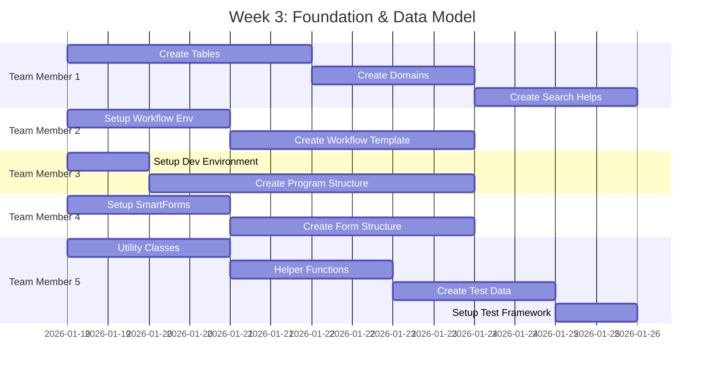

# Giai đoạn 2: Phát triển

**Thời gian**: Tuần 3-8  
**← [Quay lại README](README.md)** | **Trước: [Giai đoạn 1: Yêu cầu & Thiết kế](Phase1_Requirements_Design.md)** | **Tiếp theo: [Giai đoạn 3: Kiểm thử & QA](Phase3_Testing_QA.md)**

---

## Mục lục

1. [Tuần 3: Nền tảng & Mô hình Dữ liệu](#week-3-foundation--data-model)
2. [Tuần 4: Chức năng Ghi nhận Lỗi Cốt lõi](#week-4-core-bug-logging-functionality)
3. [Tuần 5: Triển khai Quy trình Phân công Workflow](#week-5-assignment-workflow-implementation)
4. [Tuần 6: Danh sách Lỗi & Lọc](#week-6-bug-list--filtering)
5. [Tuần 7: Thống kê & Báo cáo](#week-7-statistics--reporting)
6. [Tuần 8: Biểu mẫu, Email & Tích hợp](#week-8-forms-email--integration)
7. [Ví dụ Mã](#code-examples)
8. [Sơ đồ Tích hợp](#integration-diagrams)
9. [Điểm Kiểm tra](#testing-checkpoints)
10. [Tham khảo](#references)

---

## Tuần 3: Nền tảng & Mô hình Dữ liệu

**Tham khảo**: 
- **[Hướng dẫn Data Dictionary](../../ABAP-Guides/02_SAP_ABAP_DATA_DICTIONARY_GUIDE.md)** - Tạo bảng, domains, data elements, và search helps
- **[Hướng dẫn Thực hành Tốt nhất](../../ABAP-Guides/12_SAP_ABAP_BEST_PRACTICES_GUIDE.md)** - Coding standards và naming conventions

### Tiến độ Phát triển



### Thành viên Nhóm 1: Trưởng Nhóm Phát triển / Chuyên gia Mô hình Dữ liệu

#### Nhiệm vụ

- [ ] **Tạo Bảng ZBUG_HEADER (SE11)**

  **Giao dịch**: SE11  
  **Tên Bảng**: ZBUG_HEADER

  **Các bước**:
  1. Mở SE11, nhập tên bảng: ZBUG_HEADER
  2. Nhấp "Create"
  3. Nhập mô tả ngắn: "Bug Header Table"
  4. Chuyển đến tab "Delivery and Maintenance":
     - Delivery Class: A (Application table)
     - Data Browser/Table View: Display/Maintenance Allowed
  5. Chuyển đến tab "Fields" và thêm các trường:

  | Tên Trường | Data Element | Kiểu Dữ liệu | Độ dài | Khóa | Mô tả |
  |------------|--------------|-----------|--------|-----|-------------|
  | MANDT | MANDT | CLNT | 3 | X | Client |
  | BUG_ID | ZBUG_BUG_ID | CHAR | 10 | X | Bug ID |
  | REPORTER_ID | SYUNAME | CHAR | 12 | | Reporter User ID |
  | BUG_TITLE | ZBUG_TITLE | CHAR | 100 | | Bug Title |
  | BUG_DESCRIPTION | ZBUG_DESCRIPTION | STRING | 255 | | Bug Description |
  | BUG_TYPE | ZBUG_TYPE | CHAR | 4 | | Bug Type |
  | PRIORITY | ZBUG_PRIORITY | CHAR | 1 | | Priority |
  | STATUS | ZBUG_STATUS | CHAR | 1 | | Status |
  | ASSIGNED_TO | SYUNAME | CHAR | 12 | | Assigned Developer |
  | CREATED_DATE | DATUM | DATS | 8 | | Creation Date |
  | CREATED_BY | SYUNAME | CHAR | 12 | | Created By |
  | FIXED_DATE | DATUM | DATS | 8 | | Fixed Date |
  | CLOSED_DATE | DATUM | DATS | 8 | | Closed Date |

  6. Chuyển đến tab "Entry help/check":
     - Tạo search help cho BUG_TYPE
     - Tạo search help cho REPORTER_ID
  7. Kích hoạt bảng

- [ ] **Tạo Bảng ZBUG_ATTACHMENTS**

  Quy trình tương tự. Các trường khóa:
  - BUG_ID (Khóa Chính, Khóa Ngoại đến ZBUG_HEADER)
  - ATTACHMENT_ID (Khóa Chính)
  - FILE_NAME, FILE_TYPE, FILE_SIZE, FILE_CONTENT, UPLOAD_DATE, UPLOAD_BY

- [ ] **Tạo Domains và Data Elements**

  **Domain: ZBUG_BUG_ID**
  - Kiểu Dữ liệu: CHAR
  - Độ dài: 10
  - Mô tả: "Bug ID"

  **Domain: ZBUG_STATUS**
  - Kiểu Dữ liệu: CHAR
  - Độ dài: 1
  - Giá trị Cố định:
    - 'N' = New
    - 'A' = Assigned
    - 'I' = In Progress
    - 'F' = Fixed
    - 'R' = Rejected
    - 'C' = Closed

- [ ] **Kích hoạt Tất cả Bảng**

**Sản phẩm**:
- 5 bảng cơ sở dữ liệu được tạo và kích hoạt
- Domains và data elements được tạo
- Search helps được tạo

---

## Tuần 4: Chức năng Ghi nhận Lỗi Cốt lõi

**Tham khảo**: 
- **[Hướng dẫn ABAP Objects](../../ABAP-Guides/08_SAP_ABAP_OBJECTS_GUIDE.md)** - Tạo classes, methods, và design patterns
- **[Hướng dẫn Lập trình Màn hình](../../ABAP-Guides/06_SAP_ABAP_SCREEN_PROGRAMMING_GUIDE.md)** - Screen Painter và PBO/PAI logic
- **[Hướng dẫn Gỡ lỗi](../../ABAP-Guides/09_SAP_ABAP_DEBUGGING_GUIDE.md)** - Debugging techniques và breakpoints

### Thành viên Nhóm 1: Trưởng Nhóm Phát triển

#### Nhiệm vụ

- [ ] **Phát triển lớp ZCL_BUG_REQUEST (SE24)**

  **Tạo Class (SE24)**:
  1. Mở SE24, nhập class name: ZCL_BUG_REQUEST
  2. Chọn "Create"
  3. Đặt class type: "Usual ABAP Class"
  4. Thiết lập visibility sections

  **Phương thức CREATE_BUG**:
  ```abap
  METHODS create_bug
    IMPORTING is_bug_data TYPE zst_bug_data
    EXPORTING ev_bug_id TYPE zbug_bug_id
              et_messages TYPE bapiret2_t.
  ```
  - Validate bug data
  - Generate bug ID
  - Insert into ZBUG_HEADER
  - Log history (CREA action)
  - Trigger workflow
  - Return bug ID and messages

  **Phương thức UPDATE_BUG**:
  ```abap
  METHODS update_bug
    IMPORTING iv_bug_id TYPE zbug_bug_id
              is_bug_data TYPE zst_bug_data
    EXPORTING et_messages TYPE bapiret2_t.
  ```
  - Validate bug exists
  - Validate user permissions
  - Update ZBUG_HEADER
  - Log changes to ZBUG_ITEMS
  - Log history (UPDA action)

  **Phương thức GET_BUG**:
  ```abap
  METHODS get_bug
    IMPORTING iv_bug_id TYPE zbug_bug_id
    EXPORTING es_bug_data TYPE zst_bug_data
              et_messages TYPE bapiret2_t.
  ```
  - Read from ZBUG_HEADER
  - Return bug data

  **Phương thức GENERATE_BUG_ID (private)**:
  ```abap
  METHODS generate_bug_id
    RETURNING VALUE(rv_bug_id) TYPE zbug_bug_id.
  ```
  - Use NUMBER_GET_NEXT for sequence
  - Format: BUG-YYYYMMDD-XXX

- [ ] **Phát triển lớp ZCL_BUG_VALIDATOR (SE24)**

  **Tạo Class (SE24)**:
  - Class type: "Usual ABAP Class"
  - Static class (all methods static)

  **Phương thức VALIDATE_BUG**:
  ```abap
  CLASS-METHODS validate_bug
    IMPORTING is_bug_data TYPE zst_bug_data
    EXPORTING et_messages TYPE bapiret2_t
    RETURNING VALUE(rv_valid) TYPE abap_bool.
  ```
  - Validate all fields
  - Check required fields
  - Check field formats
  - Return validation result

  **Phương thức VALIDATE_REPORTER**:
  ```abap
  CLASS-METHODS validate_reporter
    IMPORTING iv_reporter_id TYPE syuname
    EXPORTING et_messages TYPE bapiret2_t
    RETURNING VALUE(rv_valid) TYPE abap_bool.
  ```
  - Check user exists in USR02
  - Check user is active
  - Return validation result

  **Phương thức VALIDATE_DESCRIPTION**:
  ```abap
  CLASS-METHODS validate_description
    IMPORTING iv_description TYPE string
    EXPORTING et_messages TYPE bapiret2_t
    RETURNING VALUE(rv_valid) TYPE abap_bool.
  ```
  - Check not empty
  - Check max length (255)
  - Return validation result

  **Phương thức VALIDATE_TYPE**:
  ```abap
  CLASS-METHODS validate_type
    IMPORTING iv_bug_type TYPE zbug_type
    EXPORTING et_messages TYPE bapiret2_t
    RETURNING VALUE(rv_valid) TYPE abap_bool.
  ```
  - Check valid type (FUNC, PERF, SECU, UIUX, INTE)
  - Return validation result

- [ ] **Triển khai logic tạo ID tự động**

  **Setup Number Range (SNRO)**:
  1. Mở SNRO
  2. Tạo number range object: ZBUG_ID
  3. Thiết lập interval: 001-999
  4. Thiết lập reset: Daily

  **Implementation**:
  - Use NUMBER_GET_NEXT
  - Format: BUG-YYYYMMDD-XXX
  - Handle errors

### Thành viên Nhóm 3: Chuyên gia UI

#### Nhiệm vụ

- [ ] **Phát triển chương trình ZBUG_LOG (SE38)**

  **Tạo Program (SE38)**:
  1. Mở SE38, nhập program name: ZBUG_LOG
  2. Chọn "Create"
  3. Thiết lập program attributes

  **Màn hình Lựa chọn (Selection Screen)**:
  ```abap
  SELECTION-SCREEN BEGIN OF BLOCK b1 WITH FRAME TITLE TEXT-001.
  PARAMETERS: p_title TYPE zbug_title OBLIGATORY,
              p_type TYPE zbug_type OBLIGATORY,
              p_priority TYPE zbug_priority OBLIGATORY.
  SELECTION-SCREEN END OF BLOCK b1.
  ```

  **Màn hình 0100 (Screen Painter SE51)**:
  - Tạo screen 0100
  - Thiết kế layout với các trường:
    - Bug Title (input field)
    - Bug Type (dropdown)
    - Priority (dropdown)
    - Description (text area)
    - Attach Evidence button
  - Thiết kế buttons: Save, Cancel, Clear

  **Triển khai Logic**:
  ```abap
  MODULE user_command_0100 INPUT.
    CASE sy-ucomm.
      WHEN 'SAVE'.
        PERFORM save_bug.
      WHEN 'CANCEL'.
        LEAVE TO SCREEN 0.
      WHEN 'CLEAR'.
        PERFORM clear_fields.
    ENDCASE.
  ENDMODULE.
  ```

  **Kết nối với Classes**:
  - Use ZCL_BUG_REQUEST for create
  - Use ZCL_BUG_VALIDATOR for validation
  - Display messages

### Thành viên Nhóm 2: Chuyên gia Workflow

#### Nhiệm vụ

- [ ] **Thiết lập Workflow Trigger**

  **Workflow Trigger trong ZCL_BUG_REQUEST**:
  - Trigger workflow sau khi bug được tạo
  - Pass bug data to workflow container
  - Handle workflow errors

### Thành viên Nhóm 4: Chuyên gia Biểu mẫu

#### Nhiệm vụ

- [ ] **Thiết kế Email Template Cơ bản**

  **Email Template Structure**:
  - Subject line
  - Body content
  - Variable placeholders

### Thành viên Nhóm 5: Chuyên gia Phát triển

#### Nhiệm vụ

- [ ] **Phát triển Lớp Tiện ích ZCL_BUG_UTILITIES**

  **Phương thức FORMAT_DATE**:
  ```abap
  CLASS-METHODS format_date
    IMPORTING iv_date TYPE datum
    RETURNING VALUE(rv_formatted_date) TYPE string.
  ```

  **Phương thức GET_USER_NAME**:
  ```abap
  CLASS-METHODS get_user_name
    IMPORTING iv_user_id TYPE syuname
    RETURNING VALUE(rv_user_name) TYPE string.
  ```

**Sản phẩm**:
- Chương trình ZBUG_LOG hoạt động
- Lớp ZCL_BUG_REQUEST hoàn chỉnh với tất cả phương thức
- Lớp ZCL_BUG_VALIDATOR hoàn chỉnh
- Number range setup hoàn chỉnh

---

## Tuần 5: Triển khai Quy trình Phân công Workflow

**Tham khảo**: **[Hướng dẫn SAP Workflow](../../SAP-General-Guides/SAP_WORKFLOW_GUIDE.md)** - Workflow Builder (SWDD), tasks, và agent determination

### Thành viên Nhóm 2: Chuyên gia Workflow

#### Nhiệm vụ

- [ ] **Hoàn thiện mẫu workflow ZBUG_WF**
- [ ] **Triển khai logic phân công developer**
  - Phân công theo loại lỗi
  - Phân công theo độ ưu tiên
- [ ] **Triển khai xác định developer**
- [ ] **Tạo workflow binding**
- [ ] **Kiểm thử workflow phân công end-to-end**

**Sản phẩm**:
- Mẫu workflow (ZBUG_WF) hoàn chỉnh
- Logic phân công developer hoạt động

---

## Tuần 6: Danh sách Lỗi & Lọc

**Tham khảo**: 
- **[Hướng dẫn Lập trình ALV](../../ABAP-Guides/07_SAP_ABAP_ALV_PROGRAMMING_GUIDE.md)** - ALV Grid, filtering, sorting, và Excel export
- **[Hướng dẫn Internal Tables](../../ABAP-Guides/03_SAP_ABAP_INTERNAL_TABLES_GUIDE.md)** - Internal table operations và performance

### Thành viên Nhóm 3: Chuyên gia UI

#### Nhiệm vụ

- [ ] **Phát triển chương trình ZBUG_LIST**
  - Màn hình lựa chọn với bộ lọc (trạng thái, loại, độ ưu tiên, developer)
  - Hiển thị ALV
  - Xem chi tiết
- [ ] **Triển khai logic lọc**
- [ ] **Thêm chức năng sắp xếp**
- [ ] **Triển khai chức năng tìm kiếm**

**Sản phẩm**:
- Chương trình ZBUG_LIST hoàn chỉnh
- Bộ lọc hoạt động đúng

---

## Tuần 7: Thống kê & Báo cáo

**Tham khảo**: 
- **[Hướng dẫn Reports](../../ABAP-Guides/04_SAP_ABAP_REPORTS_GUIDE.md)** - Report development và selection screens
- **[Hướng dẫn Lập trình ALV](../../ABAP-Guides/07_SAP_ABAP_ALV_PROGRAMMING_GUIDE.md)** - ALV reports và Excel export

### Thành viên Nhóm 3: Chuyên gia UI

#### Nhiệm vụ

- [ ] **Phát triển chương trình ZBUG_STATISTICS**
  - Màn hình lựa chọn
  - Hiển thị ALV Grid
  - Tính toán thống kê (fixed, waiting, pending)
  - Chức năng xuất Excel
- [ ] **Triển khai thanh công cụ ALV**
- [ ] **Thêm xuất Excel (XLSX)**

**Sản phẩm**:
- Chương trình ZBUG_STATISTICS hoàn chỉnh
- Thống kê tính toán đúng
- Xuất Excel hoạt động

---

## Tuần 8: Biểu mẫu, Email & Tích hợp

**Tham khảo**: 
- **[Hướng dẫn Biểu mẫu SAP](../../SAP-General-Guides/SAP_FORMS_GUIDE.md)** - SmartForms design và output types
- **[Hướng dẫn Tích hợp ABAP](../../ABAP-Guides/15_SAP_ABAP_INTEGRATION_GUIDE.md)** - Email integration và SO_DOCUMENT_SEND_API1
- **[Hướng dẫn Hiệu suất](../../ABAP-Guides/10_SAP_ABAP_PERFORMANCE_GUIDE.md)** - File handling performance optimization

### Thành viên Nhóm 4: Chuyên gia Biểu mẫu

#### Nhiệm vụ

- [ ] **Hoàn thiện SmartForm ZBUG_FORM**
- [ ] **Triển khai chức năng in**
- [ ] **Hoàn thiện hệ thống thông báo email**
  - Email lỗi đã ghi nhận
  - Email lỗi đã phân công
  - Email lỗi đã sửa
  - Email lỗi bị từ chối
- [ ] **Triển khai xử lý đính kèm file**
  - Upload file
  - Download file
  - Validation file

**Sản phẩm**:
- SmartForm (ZBUG_FORM) hoàn chỉnh
- 4+ mẫu email hoạt động
- Xử lý đính kèm file hoạt động

---

## Ví dụ Mã

### Ví dụ 1: Tạo Bug

**Tham khảo**: **[Hướng dẫn ABAP Objects](../../ABAP-Guides/08_SAP_ABAP_OBJECTS_GUIDE.md)** - Class methods và error handling

```abap
DATA: lo_bug_request TYPE REF TO zcl_bug_request,
      ls_bug_data TYPE zst_bug_data,
      lv_bug_id TYPE zbug_bug_id,
      lt_messages TYPE bapiret2_t.

" Get singleton instance
lo_bug_request = zcl_bug_request=>get_instance( ).

" Prepare bug data
ls_bug_data-reporter_id = sy-uname.
ls_bug_data-bug_title = 'Login button not working'.
ls_bug_data-bug_description = 'Login button does not respond when clicked'.
ls_bug_data-bug_type = 'FUNC'.
ls_bug_data-priority = 'H'.
ls_bug_data-status = 'N'. " New

" Create bug
lo_bug_request->create_bug(
  EXPORTING is_bug_data = ls_bug_data
  IMPORTING ev_bug_id = lv_bug_id
            et_messages = lt_messages
).

" Check messages
IF lt_messages IS INITIAL.
  MESSAGE |Bug created successfully: { lv_bug_id }| TYPE 'S'.
ELSE.
  " Display error messages
  LOOP AT lt_messages INTO DATA(ls_message).
    MESSAGE ls_message-message TYPE ls_message-type.
  ENDLOOP.
ENDIF.
```

### Ví dụ 2: Validate Bug

**Tham khảo**: **[Hướng dẫn ABAP Objects](../../ABAP-Guides/08_SAP_ABAP_OBJECTS_GUIDE.md)** - Static methods và validation patterns

```abap
DATA: lt_messages TYPE bapiret2_t,
      lv_valid TYPE abap_bool,
      ls_bug_data TYPE zst_bug_data.

" Prepare bug data
ls_bug_data-reporter_id = sy-uname.
ls_bug_data-bug_title = 'Test Bug'.
ls_bug_data-bug_description = 'Test Description'.
ls_bug_data-bug_type = 'FUNC'.
ls_bug_data-priority = 'H'.

" Validate
lv_valid = zcl_bug_validator=>validate_bug(
  EXPORTING is_bug_data = ls_bug_data
  IMPORTING et_messages = lt_messages
).

IF lv_valid = abap_true.
  " Proceed with creation
ELSE.
  " Display validation errors
  LOOP AT lt_messages INTO DATA(ls_message).
    MESSAGE ls_message-message TYPE ls_message-type.
  ENDLOOP.
ENDIF.
```

### Ví dụ 3: Get Bug List with Filters

**Tham khảo**: 
- **[Hướng dẫn Internal Tables](../../ABAP-Guides/03_SAP_ABAP_INTERNAL_TABLES_GUIDE.md)** - Internal table operations
- **[Hướng dẫn Lập trình ALV](../../ABAP-Guides/07_SAP_ABAP_ALV_PROGRAMMING_GUIDE.md)** - ALV data preparation

```abap
DATA: lo_bug_report TYPE REF TO zcl_bug_report,
      ls_selection TYPE zst_bug_selection,
      lt_bugs TYPE ztt_bug_list,
      lt_messages TYPE bapiret2_t.

CREATE OBJECT lo_bug_report.

" Set selection criteria
ls_selection-status = 'A'. " Assigned
ls_selection-bug_type = 'FUNC'.
ls_selection-date_from = '20260101'.
ls_selection-date_to = sy-datum.

" Get bug list
lo_bug_report->get_bug_list(
  EXPORTING is_selection = ls_selection
  IMPORTING et_bugs = lt_bugs
            et_messages = lt_messages
).

" Display in ALV
" ... ALV display code ...
```

### Ví dụ 4: Upload Attachment

**Tham khảo**: **[Hướng dẫn Hiệu suất](../../ABAP-Guides/10_SAP_ABAP_PERFORMANCE_GUIDE.md)** - File handling và RAW data type performance

```abap
DATA: lo_attachment TYPE REF TO zcl_bug_attachment,
      lv_attachment_id TYPE zbug_attachment_id,
      lt_messages TYPE bapiret2_t,
      lv_file_content TYPE xstring,
      lv_file_name TYPE string,
      lv_file_type TYPE string,
      lv_file_size TYPE i.

CREATE OBJECT lo_attachment.

" Read file (example)
" ... file reading code ...

" Upload
lo_attachment->upload_file(
  EXPORTING iv_bug_id = 'BUG-20260119-001'
            iv_file_name = lv_file_name
            iv_file_type = lv_file_type
            iv_file_size = lv_file_size
            iv_file_content = lv_file_content
  IMPORTING ev_attachment_id = lv_attachment_id
            et_messages = lt_messages
).

IF lt_messages IS INITIAL.
  MESSAGE |File uploaded successfully: { lv_attachment_id }| TYPE 'S'.
ENDIF.
```

### Ví dụ 5: Calculate Statistics

**Tham khảo**: **[Hướng dẫn Reports](../../ABAP-Guides/04_SAP_ABAP_REPORTS_GUIDE.md)** - Report calculations và data aggregation

```abap
DATA: lo_statistics TYPE REF TO zcl_bug_statistics,
      ls_statistics TYPE zst_bug_statistics,
      lt_messages TYPE bapiret2_t.

CREATE OBJECT lo_statistics.

" Get statistics
lo_statistics->get_statistics(
  EXPORTING iv_date_from = '20260101'
            iv_date_to = sy-datum
  IMPORTING es_statistics = ls_statistics
            et_messages = lt_messages
).

" Display statistics
WRITE: / 'Total Bugs:', ls_statistics-total_bugs,
       / 'Fixed:', ls_statistics-fixed_bugs,
       / 'Waiting:', ls_statistics-waiting_bugs,
       / 'Pending:', ls_statistics-pending_bugs.
```

---

## Điểm Kiểm tra

### Tuần 3
- [ ] Tất cả bảng được tạo và kích hoạt
- [ ] Domains được tạo

### Tuần 4
- [ ] Ghi nhận lỗi hoạt động
- [ ] Validation hoạt động

### Tuần 5
- [ ] Workflow phân công hoạt động

### Tuần 6
- [ ] Danh sách lỗi với bộ lọc hoạt động

### Tuần 7
- [ ] Thống kê tính toán đúng
- [ ] Xuất Excel hoạt động

### Tuần 8
- [ ] Tất cả tính năng hoạt động
- [ ] Email gửi đúng
- [ ] Đính kèm file hoạt động

---

## Tham khảo

### Tài liệu Dự án
- **[Giai đoạn 1: Yêu cầu & Thiết kế](Phase1_Requirements_Design.md)** - Thiết kế chi tiết
- **[Kiến trúc Kỹ thuật](Technical_Architecture.md)** - Đặc tả kỹ thuật

### Hướng dẫn Kỹ thuật
- **[Hướng dẫn Data Dictionary](../../ABAP-Guides/02_SAP_ABAP_DATA_DICTIONARY_GUIDE.md)** - Tạo bảng và data elements
- **[Hướng dẫn ABAP Objects](../../ABAP-Guides/08_SAP_ABAP_OBJECTS_GUIDE.md)** - Class development
- **[Hướng dẫn Lập trình Màn hình](../../ABAP-Guides/06_SAP_ABAP_SCREEN_PROGRAMMING_GUIDE.md)** - Screen development
- **[Hướng dẫn Lập trình ALV](../../ABAP-Guides/07_SAP_ABAP_ALV_PROGRAMMING_GUIDE.md)** - ALV reports
- **[Hướng dẫn Reports](../../ABAP-Guides/04_SAP_ABAP_REPORTS_GUIDE.md)** - Report development
- **[Hướng dẫn Internal Tables](../../ABAP-Guides/03_SAP_ABAP_INTERNAL_TABLES_GUIDE.md)** - Internal table operations
- **[Hướng dẫn SAP Workflow](../../SAP-General-Guides/SAP_WORKFLOW_GUIDE.md)** - Workflow implementation
- **[Hướng dẫn Biểu mẫu SAP](../../SAP-General-Guides/SAP_FORMS_GUIDE.md)** - SmartForms
- **[Hướng dẫn Tích hợp ABAP](../../ABAP-Guides/15_SAP_ABAP_INTEGRATION_GUIDE.md)** - Email integration
- **[Hướng dẫn Hiệu suất](../../ABAP-Guides/10_SAP_ABAP_PERFORMANCE_GUIDE.md)** - Performance optimization
- **[Hướng dẫn Gỡ lỗi](../../ABAP-Guides/09_SAP_ABAP_DEBUGGING_GUIDE.md)** - Debugging techniques
- **[Hướng dẫn Thực hành Tốt nhất](../../ABAP-Guides/12_SAP_ABAP_BEST_PRACTICES_GUIDE.md)** - Coding standards

---

**← [Quay lại README](README.md)** | **Trước: [Giai đoạn 1: Yêu cầu & Thiết kế](Phase1_Requirements_Design.md)** | **Tiếp theo: [Giai đoạn 3: Kiểm thử & QA](Phase3_Testing_QA.md)**

