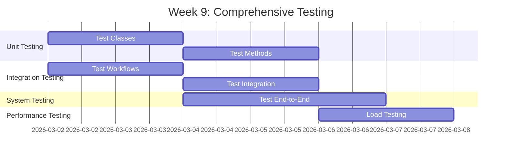

# Giai đoạn 3: Kiểm thử & Đảm bảo Chất lượng

**Thời gian**: Tuần 9-10  
**← [Quay lại README](README.md)** | **Trước: [Giai đoạn 2: Phát triển](Phase2_Development.md)** | **Tiếp theo: [Giai đoạn 4: Tài liệu & Trình bày](Phase4_Documentation_Presentation.md)**

---

## Mục lục

1. [Tuần 9: Kiểm thử Toàn diện](#week-9-comprehensive-testing)
2. [Tuần 10: Kiểm thử Chấp nhận Người dùng & Tinh chỉnh](#week-10-user-acceptance-testing--refinement)
3. [Cấu trúc Kế hoạch Kiểm thử](#test-plan-structure)
4. [Mẫu Trường hợp Kiểm thử](#test-case-templates)
5. [Kịch bản Kiểm thử](#testing-scenarios)
6. [Quy trình Theo dõi Lỗi](#bug-tracking-process)
7. [Kiểm thử Hiệu suất](#performance-testing)
8. [Kiểm thử Bảo mật](#security-testing)
9. [Kịch bản và Script UAT](#uat-scenarios-and-scripts)
10. [Tham khảo](#references)

---

## Tuần 9: Kiểm thử Toàn diện

**Tham khảo**: 
- **[Hướng dẫn Kiểm thử Đơn vị](../../ABAP-Guides/14_SAP_ABAP_UNIT_TESTING_GUIDE.md)** - ABAP Unit framework, test classes, và assertions
- **[Hướng dẫn Kiểm thử](../../SAP-General-Guides/SAP_TESTING_GUIDE.md)** - Test planning, test case templates, và test execution

### Tiến độ Kiểm thử

### Tất cả Thành viên Nhóm: Trách nhiệm Kiểm thử Chung

#### Nhiệm vụ Kiểm thử Chung

- [ ] **Hoàn thành Kiểm thử Đơn vị**
  - Mỗi thành viên xem lại và hoàn thành kiểm thử đơn vị cho các thành phần của mình
  - Đảm bảo 80%+ phủ sóng mã cho các thành phần của mình
  - Sửa kiểm thử thất bại trong các thành phần của mình

- [ ] **Kiểm thử Thành phần**
  - Kiểm thử kỹ lưỡng các thành phần của mình
  - Kiểm thử xử lý lỗi trong các thành phần của mình
  - Kiểm thử trường hợp biên cho các thành phần của mình

- [ ] **Kiểm thử Tích hợp**

  **Tham khảo**: **[Hướng dẫn Tích hợp ABAP](../../ABAP-Guides/15_SAP_ABAP_INTEGRATION_GUIDE.md)** - Integration testing patterns và best practices

  - Tham gia phiên kiểm thử tích hợp
  - Kiểm thử tích hợp các thành phần của mình với các thành phần khác
  - Kiểm thử tích hợp workflow
  - Kiểm thử tích hợp email
  - Kiểm thử tích hợp đính kèm file

- [ ] **Kiểm thử Hệ thống**
  - Tham gia kịch bản kiểm thử end-to-end
  - Kiểm thử quy trình người dùng liên quan đến các thành phần của mình

- [ ] **Kiểm thử Hiệu suất**
  - Kiểm thử hiệu suất các thành phần của mình
  - Tham gia kiểm thử tải

- [ ] **Kiểm thử Bảo mật**
  - Kiểm thử phân quyền cho các thành phần của mình
  - Kiểm thử kiểm soát truy cập dữ liệu

---

## Tuần 10: Kiểm thử Chấp nhận Người dùng & Tinh chỉnh

### Tất cả Thành viên Nhóm

#### Nhiệm vụ

- [ ] **Chuẩn bị Kiểm thử Chấp nhận Người dùng**
  - Chuẩn bị kịch bản UAT cho các thành phần của mình
  - Tạo script kiểm thử cho các tính năng của mình
  - Chuẩn bị dữ liệu kiểm thử

- [ ] **Thực thi UAT**
  - Hỗ trợ người dùng trong UAT
  - Thu thập phản hồi
  - Tài liệu hóa kết quả UAT

- [ ] **Tinh chỉnh Dựa trên Phản hồi**
  - Xử lý phản hồi UAT cho các thành phần của mình
  - Triển khai các thay đổi được yêu cầu
  - Sửa lỗi cuối cùng

---

## Kịch bản Kiểm thử

### Kịch bản 1: Ghi nhận Lỗi

**Mô tả**: Người dùng ghi nhận lỗi mới trong hệ thống

**Các bước**:
1. Mở chương trình ZBUG_LOG
2. Nhập thông tin lỗi (Title, Description, Type, Priority)
3. Đính kèm file bằng chứng (nếu có)
4. Nhấn Save

**Kết quả Mong đợi**:
- Lỗi được tạo với ID tự động
- Email được gửi đến team Developer
- File đính kèm được lưu trữ

### Kịch bản 2: Phân công Developer

**Mô tả**: Workflow phân công developer cho lỗi

**Các bước**:
1. Lỗi được ghi nhận
2. Workflow được kích hoạt
3. Developer được phân công tự động
4. Developer nhận thông báo email

**Kết quả Mong đợi**:
- Developer được phân công đúng
- Email thông báo được gửi
- Trạng thái lỗi được cập nhật

### Kịch bản 3: Danh sách Lỗi với Bộ lọc

**Mô tả**: Hiển thị danh sách lỗi với các bộ lọc

**Các bước**:
1. Mở chương trình ZBUG_LIST
2. Chọn bộ lọc (Status, Type, Priority, Developer)
3. Nhấn Execute

**Kết quả Mong đợi**:
- Danh sách lỗi được hiển thị đúng với bộ lọc
- ALV Grid hiển thị đúng

### Kịch bản 4: Thống kê Lỗi

**Mô tả**: Hiển thị thống kê lỗi (fixed, waiting, pending)

**Các bước**:
1. Mở chương trình ZBUG_STATISTICS
2. Chọn tham số
3. Nhấn Execute

**Kết quả Mong đợi**:
- Thống kê được tính toán đúng
- Có thể xuất Excel

### Kịch bản 5: Đính kèm File

**Mô tả**: Đính kèm file bằng chứng vào lỗi

**Các bước**:
1. Mở lỗi trong chương trình ZBUG_LOG
2. Chọn file để đính kèm
3. Upload file

**Kết quả Mong đợi**:
- File được upload thành công
- File được lưu trữ trong bảng ZBUG_ATTACHMENTS
- Có thể download file

---

## Quy trình Theo dõi Lỗi

### Trạng thái Lỗi

- **New**: Lỗi mới được ghi nhận
- **Assigned**: Lỗi đã được phân công cho developer
- **In Progress**: Developer đang xử lý
- **Fixed**: Lỗi đã được sửa
- **Rejected**: Lỗi bị từ chối
- **Closed**: Lỗi đã được đóng

---

## Kiểm thử Hiệu suất

**Tham khảo**: **[Hướng dẫn Hiệu suất](../../ABAP-Guides/10_SAP_ABAP_PERFORMANCE_GUIDE.md)** - Performance testing, SQL trace (ST05), và performance analysis (SAT)

### Yêu cầu Hiệu suất

- Báo cáo thống kê: < 2 giây
- Danh sách lỗi với bộ lọc: < 3 giây
- Upload file: < 5 giây (file < 10MB)

---

## Kiểm thử Bảo mật

**Tham khảo**: **[Hướng dẫn Bảo mật ABAP](../../ABAP-Guides/13_SAP_ABAP_SECURITY_GUIDE.md)** - Security testing, authorization checks, và secure coding practices

### Kiểm thử Phân quyền

**Mô hình Phân quyền**: 2 Business Roles + 3 RBAC Functions

**Reporter Role** (BUG_BASIC):
- Chỉ có thể xem và tạo lỗi của mình
- Không thể xem lỗi của người khác
- Không thể xem lỗi được phân công cho developer khác

**Developer Role** (BUG_BASIC + BUG_WORK):
- Có thể xem và xử lý lỗi được phân công (assigned_to = sy-uname)
- Có thể tạo lỗi mới (BUG_BASIC)
- Không thể xem tất cả lỗi (trừ khi có BUG_ADMIN)

**Lead Developer / Admin** (BUG_BASIC + BUG_WORK + BUG_ADMIN):
- Có thể xem tất cả lỗi
- Có thể re-assign lỗi
- Có thể quản lý cấu hình và xem thống kê đầy đủ

---

## Kịch bản và Script UAT

### Script UAT 1: Ghi nhận Lỗi

1. Đăng nhập với quyền Reporter
2. Mở ZBUG_LOG
3. Nhập thông tin lỗi
4. Verify: Lỗi được tạo, Email được gửi

### Script UAT 2: Phân công Developer

1. Đăng nhập với quyền Admin
2. Xem lỗi mới
3. Verify: Developer được phân công tự động

---

## Tham khảo

### Tài liệu Dự án
- **[Giai đoạn 2: Phát triển](Phase2_Development.md)** - Các thành phần đã phát triển

### Hướng dẫn Kiểm thử
- **[Hướng dẫn Kiểm thử Đơn vị](../../ABAP-Guides/14_SAP_ABAP_UNIT_TESTING_GUIDE.md)** - ABAP Unit framework, test classes, và assertions
- **[Hướng dẫn Kiểm thử](../../SAP-General-Guides/SAP_TESTING_GUIDE.md)** - Test planning, test case templates, và test execution
- **[Hướng dẫn Tích hợp ABAP](../../ABAP-Guides/15_SAP_ABAP_INTEGRATION_GUIDE.md)** - Integration testing patterns
- **[Hướng dẫn Hiệu suất](../../ABAP-Guides/10_SAP_ABAP_PERFORMANCE_GUIDE.md)** - Performance testing và optimization
- **[Hướng dẫn Bảo mật ABAP](../../ABAP-Guides/13_SAP_ABAP_SECURITY_GUIDE.md)** - Security testing và authorization
- **[Hướng dẫn Gỡ lỗi](../../ABAP-Guides/09_SAP_ABAP_DEBUGGING_GUIDE.md)** - Debugging techniques và breakpoints

---

**← [Quay lại README](README.md)** | **Trước: [Giai đoạn 2: Phát triển](Phase2_Development.md)** | **Tiếp theo: [Giai đoạn 4: Tài liệu & Trình bày](Phase4_Documentation_Presentation.md)**

