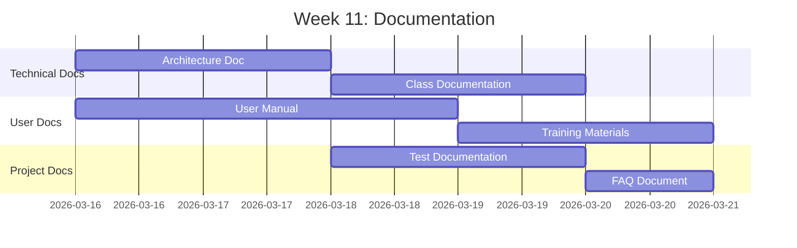

# Giai đoạn 4: Tài liệu & Trình bày

**Thời gian**: Tuần 11-12  
**← [Quay lại README](README.md)** | **Trước: [Giai đoạn 3: Kiểm thử & QA](Phase3_Testing_QA.md)**

---

## Mục lục

1. [Tuần 11: Tài liệu](#week-11-documentation)
2. [Tuần 12: Trình bày & Hoàn thiện](#week-12-presentation--finalization)
3. [Mẫu Tài liệu](#documentation-templates)
4. [Cấu trúc Tài liệu](#documentation-structure)
5. [Cấu trúc Trình bày](#presentation-structure)
6. [Kịch bản Demo](#demo-scenarios)
7. [Chuẩn bị Q&A](#qa-preparation)
8. [Tham khảo](#references)

---

## Tuần 11: Tài liệu

### Tiến độ Tài liệu

### Tất cả Thành viên Nhóm: Trách nhiệm Tài liệu Chung

#### Tài liệu hóa Thành phần (Mỗi Thành viên Tài liệu hóa Thành phần Của mình)

**Thành viên Nhóm 1: Trưởng Nhóm Phát triển / Chuyên gia Mô hình Dữ liệu**

- [ ] **Tài liệu Kỹ thuật**
  - Tài liệu hóa kiến trúc hệ thống
  - Tài liệu hóa mô hình dữ liệu
  - Tài liệu hóa lớp ABAP của mình
  - Tài liệu hóa API

- [ ] **Tài liệu hóa Mã**
  - Thêm nhận xét nội tuyến vào mã của mình
  - Tài liệu hóa logic phức tạp

**Thành viên Nhóm 2: Chuyên gia Workflow**

- [ ] **Tài liệu Workflow**
  - Tài liệu hóa mẫu workflow
  - Tài liệu hóa quy trình phân công
  - Hướng dẫn cấu hình

**Thành viên Nhóm 3: Chuyên gia UI & Báo cáo**

- [ ] **Hướng dẫn Người dùng**

  **Tham khảo**: **[Hướng dẫn Capstone](../../SAP-General-Guides/SAP_CAPSTONE_PROJECT_GUIDE.md)** - Documentation templates và user guide structure

  - Hướng dẫn điều hướng màn hình
  - Hướng dẫn sử dụng báo cáo
  - Hướng dẫn sử dụng bộ lọc

**Thành viên Nhóm 4: Chuyên gia Biểu mẫu & Tích hợp**

- [ ] **Tài liệu SmartForm**
  - Tài liệu hóa SmartForm
  - Hướng dẫn cấu hình email
  - Hướng dẫn xử lý đính kèm file

**Thành viên Nhóm 5: Chuyên gia Phát triển & Chất lượng**

- [ ] **Điều phối Tài liệu**
  - Tổng hợp tài liệu từ tất cả thành viên
  - Tài liệu đào tạo người dùng
  - Tài liệu FAQ

---

## Tuần 12: Trình bày & Hoàn thiện

### Tất cả Thành viên Nhóm

#### Nhiệm vụ

- [ ] **Chuẩn bị Trình bày**
  - Chuẩn bị phần trình bày cho các thành phần của mình
  - Tạo kịch bản demo cho các tính năng của mình
  - Luyện tập trình bày

- [ ] **Demo**
  - Demo tính năng ghi nhận lỗi
  - Demo tính năng phân công developer
  - Demo tính năng danh sách lỗi với bộ lọc
  - Demo tính năng thống kê
  - Demo tính năng đính kèm file

- [ ] **Q&A Preparation**
  - Chuẩn bị câu trả lời cho câu hỏi thường gặp
  - Chuẩn bị giải thích kỹ thuật

---

## Cấu trúc Trình bày

### Phần 1: Tổng quan Dự án (5 phút)
- Giới thiệu dự án
- Mục tiêu và phạm vi
- Cấu trúc nhóm

### Phần 2: Kiến trúc & Thiết kế (10 phút)
- Kiến trúc hệ thống
- Mô hình dữ liệu
- Workflow

### Phần 3: Demo Tính năng (20 phút)
- Ghi nhận lỗi
- Phân công developer
- Danh sách lỗi với bộ lọc
- Thống kê
- Đính kèm file

### Phần 4: Kết quả & Bài học (5 phút)
- Kết quả đạt được
- Bài học học được
- Cải thiện trong tương lai

### Phần 5: Q&A (10 phút)

---

## Kịch bản Demo

### Demo 1: Ghi nhận Lỗi
1. Mở ZBUG_LOG
2. Nhập thông tin lỗi
3. Đính kèm file bằng chứng
4. Save và verify email

### Demo 2: Phân công Developer
1. Xem lỗi mới
2. Verify workflow được kích hoạt
3. Verify developer được phân công
4. Verify email thông báo

### Demo 3: Danh sách Lỗi
1. Mở ZBUG_LIST
2. Áp dụng bộ lọc
3. Verify kết quả
4. Export to Excel

### Demo 4: Thống kê
1. Mở ZBUG_STATISTICS
2. Xem thống kê (fixed, waiting, pending)
3. Export to Excel

---

## Chuẩn bị Q&A

### Câu hỏi Thường gặp

**Q: Làm thế nào để phân công developer?**
A: Workflow tự động phân công developer dựa trên loại lỗi và độ ưu tiên.

**Q: Có thể đính kèm bao nhiêu file?**
A: Có thể đính kèm nhiều file, mỗi file tối đa 10MB.

**Q: Làm thế nào để xuất báo cáo?**
A: Sử dụng chức năng Export to Excel trong ALV Grid.

---

## Tham khảo

### Tài liệu Dự án
- **[Giai đoạn 3: Kiểm thử & QA](Phase3_Testing_QA.md)** - Kết quả kiểm thử
- **[Kiến trúc Kỹ thuật](Technical_Architecture.md)** - Đặc tả kỹ thuật

### Hướng dẫn Tài liệu
- **[Hướng dẫn Capstone](../../SAP-General-Guides/SAP_CAPSTONE_PROJECT_GUIDE.md)** - Documentation templates và standards
- **[Hướng dẫn Thực hành Tốt nhất](../../ABAP-Guides/12_SAP_ABAP_BEST_PRACTICES_GUIDE.md)** - Documentation best practices
- **[Hướng dẫn ABAP Objects](../../ABAP-Guides/08_SAP_ABAP_OBJECTS_GUIDE.md)** - Code documentation standards

---

**← [Quay lại README](README.md)** | **Trước: [Giai đoạn 3: Kiểm thử & QA](Phase3_Testing_QA.md)**

