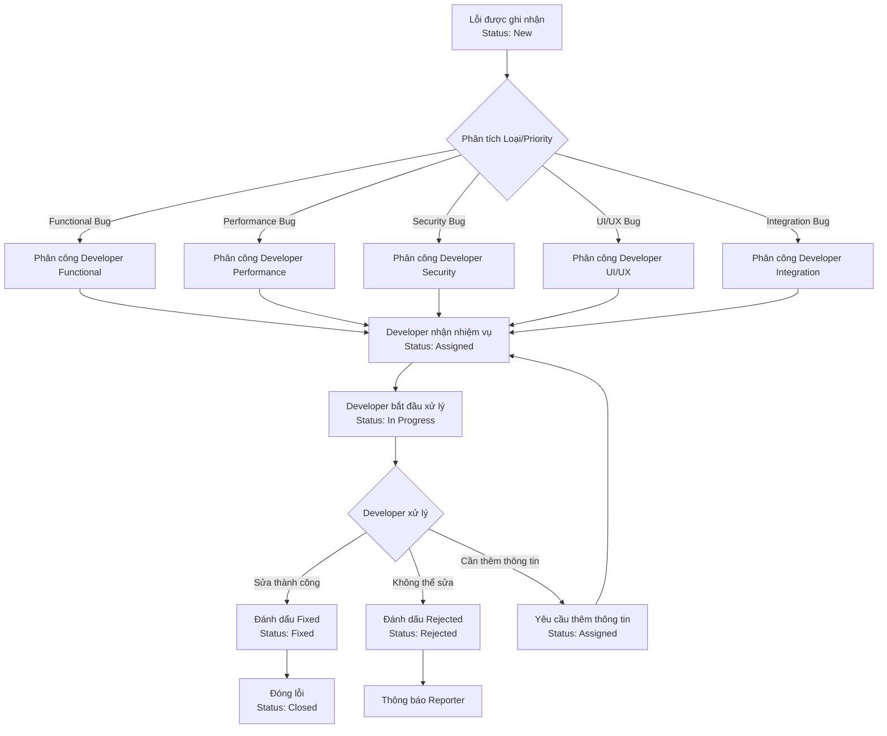

# Giai đoạn 1: Yêu cầu & Thiết kế

**Thời gian**: Tuần 1-2  
**← [Quay lại README](README.md)** | **Tiếp theo: [Giai đoạn 2: Phát triển](Phase2_Development.md)**

---

## Mục lục

1. [Tuần 1: Thu thập & Phân tích Yêu cầu](#week-1-requirements-gathering--analysis)
2. [Tuần 2: Thiết kế & Kiến trúc Chi tiết](#week-2-detailed-design--architecture)
3. [Thiết kế Mô hình Dữ liệu](#data-model-design)
4. [Thiết kế Workflow](#workflow-design)
5. [Thiết kế UI/UX](#uiux-design)
6. [Đặc tả Kỹ thuật](#technical-specifications)
7. [Ví dụ & Mẫu](#examples--templates)
8. [Tham khảo](#references)

---

## Tuần 1: Thu thập & Phân tích Yêu cầu

### Thành viên Nhóm 1: Trưởng Nhóm Phát triển / Chuyên gia Mô hình Dữ liệu

#### Nhiệm vụ

- [ ] **Phân tích Yêu cầu Nghiệp vụ**
  - Xem lại [tài liệu yêu cầu dự án](../Abap-8.md)
  - Xác định tất cả yêu cầu chức năng
  - Tài liệu hóa yêu cầu phi chức năng
  - Tạo ma trận truy vết yêu cầu

- [ ] **Xác định Yêu cầu Mô hình Dữ liệu**
  - Xác định tất cả thực thể dữ liệu cần thiết
  - Ánh xạ yêu cầu nghiệp vụ với cấu trúc dữ liệu
  - Xác định quan hệ giữa các thực thể
  - Tài liệu hóa yêu cầu lưu trữ dữ liệu

- [ ] **Xác định Điểm Tích hợp User Management**
  - Xem lại cấu trúc hệ thống quản lý người dùng của SAP
  - Xác định bảng tiêu chuẩn sử dụng
  - Tài liệu hóa yêu cầu tích hợp
  - Xác định yêu cầu ánh xạ dữ liệu

- [ ] **Tạo Tài liệu Đặc tả Kỹ thuật**
  - Tài liệu hóa kiến trúc hệ thống
  - Xác định ràng buộc kỹ thuật
  - Tài liệu hóa điểm tích hợp
  - Tạo sơ đồ luồng dữ liệu

- [ ] **Thiết kế Cấu trúc Bảng Cơ sở Dữ liệu**
  - Thiết kế cấu trúc bảng ZBUG_HEADER
  - Thiết kế cấu trúc bảng ZBUG_ITEMS
  - Thiết kế cấu trúc bảng ZBUG_HISTORY
  - Thiết kế cấu trúc bảng ZBUG_CONFIG
  - Thiết kế cấu trúc bảng ZBUG_ATTACHMENTS

**Sản phẩm**:
- Tài liệu đặc tả yêu cầu
- Tài liệu thiết kế mô hình dữ liệu
- Tài liệu đặc tả kỹ thuật
- Đặc tả tích hợp User Management

**Tham khảo**:
- [Hướng dẫn ABAP Data Dictionary](../../ABAP-Guides/02_SAP_ABAP_DATA_DICTIONARY_GUIDE.md) - Thiết kế bảng
- [Hướng dẫn Cơ bản ABAP](../../ABAP-Guides/01_SAP_ABAP_BASICS_GUIDE.md#data-types-and-variables) - Kiểu dữ liệu

---

### Thành viên Nhóm 2: Chuyên gia Workflow & Phân công

#### Nhiệm vụ

- [ ] **Xác định Yêu cầu Workflow Phân công**
  - Tài liệu hóa logic phân công developer cần thiết
  - Xác định quy tắc phân công dựa trên loại/độ ưu tiên lỗi
  - Tài liệu hóa logic định tuyến phân công
  - Xác định developer được phân công

- [ ] **Ánh xạ Logic Phân công**
  - Phân công theo loại lỗi (Functional, Performance, Security, UI/UX, Integration)
  - Phân công theo độ ưu tiên (Low, Medium, High, Critical)
  - Phân công theo kỹ năng developer
  - Tài liệu hóa quy tắc phân công tự động

- [ ] **Xác định Yêu cầu Phân quyền**
  - Xác định đối tượng phân quyền cần thiết
  - Tài liệu hóa yêu cầu truy cập dựa trên vai trò
  - Xác định quy tắc quyền phân công
  - Tài liệu hóa yêu cầu bảo mật

- [ ] **Thiết kế Sơ đồ Workflow**
  - Tạo luồng quy trình workflow
  - Tài liệu hóa nhiệm vụ workflow
  - Xác định sự kiện workflow
  - Tài liệu hóa phần tử workflow container

- [ ] **Tài liệu hóa Quy tắc Phân công**
  - Tiêu chí phân công
  - Tiêu chí từ chối phân công
  - Quy tắc chuyển giao
  - Quy tắc timeout

**Sản phẩm**:
- Tài liệu yêu cầu workflow
- Tài liệu quy tắc phân công
- Sơ đồ thiết kế workflow
- Ma trận phân quyền

**Tham khảo**:
- [Hướng dẫn SAP Workflow](../../SAP_WORKFLOW_GUIDE.md) - Khái niệm workflow
- [Hướng dẫn Capstone](../../SAP_CAPSTONE_PROJECT_GUIDE.md) - Ví dụ workflow tương tự

---

### Thành viên Nhóm 3: Chuyên gia UI & Báo cáo

#### Nhiệm vụ

- [ ] **Xác định Yêu cầu Giao diện Người dùng**
  - Tài liệu hóa yêu cầu màn hình
  - Xác định luồng tương tác người dùng
  - Tài liệu hóa yêu cầu khả năng sử dụng
  - Tạo user personas

- [ ] **Thiết kế Bố cục Màn hình**
  - Màn hình ghi nhận lỗi
  - Màn hình phân công developer
  - Màn hình danh sách lỗi với bộ lọc
  - Màn hình thống kê

- [ ] **Xác định Yêu cầu Báo cáo**
  - Tài liệu hóa loại báo cáo cần thiết
  - Xác định tham số báo cáo
  - Tài liệu hóa yêu cầu lọc
  - Xác định yêu cầu xuất

- [ ] **Tạo Mockup/Wireframe UI**
  - Mockup bố cục màn hình
  - Vị trí trường và nhãn
  - Luồng điều hướng
  - Vị trí nút

- [ ] **Tài liệu hóa Yêu cầu Lọc**
  - Lọc theo trạng thái (New, Assigned, In Progress, Fixed, Rejected, Closed)
  - Lọc theo loại lỗi (Functional, Performance, Security, UI/UX, Integration)
  - Lọc theo độ ưu tiên (Low, Medium, High, Critical)
  - Lọc theo developer

**Sản phẩm**:
- Tài liệu yêu cầu UI
- Mockup/wireframe màn hình
- Tài liệu yêu cầu báo cáo
- Tài liệu thiết kế trải nghiệm người dùng

**Tham khảo**:
- [Hướng dẫn Lập trình Màn hình](../../ABAP-Guides/06_SAP_ABAP_SCREEN_PROGRAMMING_GUIDE.md) - Thiết kế màn hình
- [Hướng dẫn Lập trình ALV](../../ABAP-Guides/07_SAP_ABAP_ALV_PROGRAMMING_GUIDE.md) - Thiết kế báo cáo

---

### Thành viên Nhóm 4: Chuyên gia Biểu mẫu & Tích hợp

#### Nhiệm vụ

**Tham khảo**: 
- **[Hướng dẫn Biểu mẫu SAP](../../SAP-General-Guides/SAP_FORMS_GUIDE.md)** - SmartForms design và implementation
- **[Hướng dẫn Tích hợp ABAP](../../ABAP-Guides/15_SAP_ABAP_INTEGRATION_GUIDE.md)** - Email integration patterns

- [ ] **Xác định Yêu cầu SmartForm**
  - Tài liệu hóa yêu cầu bố cục biểu mẫu
  - Xác định trường biểu mẫu cần thiết
  - Tài liệu hóa yêu cầu thương hiệu
  - Xác định yêu cầu in

- [ ] **Thiết kế Bố cục Biểu mẫu**
  - Thiết kế phần header
  - Thiết kế phần chi tiết lỗi
  - Thiết kế phần thông tin developer
  - Thiết kế phần trạng thái
  - Thiết kế phần footer

- [ ] **Xác định Kích hoạt Thông báo Email**
  - Thông báo lỗi đã được ghi nhận
  - Thông báo lỗi đã được phân công
  - Thông báo lỗi đã được sửa
  - Thông báo lỗi bị từ chối
  - Thông báo thay đổi trạng thái

- [ ] **Xác định Mẫu Thông báo**
  - Dòng chủ đề email
  - Mẫu nội dung email
  - Yêu cầu định dạng email
  - Yêu cầu đính kèm

- [ ] **Tài liệu hóa Yêu cầu Xử lý Đính kèm**
  - Yêu cầu upload file
  - Yêu cầu download file
  - Validation loại file và kích thước
  - Lưu trữ file bằng chứng

**Sản phẩm**:
- Tài liệu yêu cầu SmartForm
- Thiết kế bố cục biểu mẫu
- Đặc tả thông báo email
- Tài liệu yêu cầu xử lý đính kèm

**Tham khảo**:
- **[Hướng dẫn Biểu mẫu SAP](../../SAP-General-Guides/SAP_FORMS_GUIDE.md)** - SmartForms
- **[Hướng dẫn Tích hợp ABAP](../../ABAP-Guides/15_SAP_ABAP_INTEGRATION_GUIDE.md)** - Email integration patterns
- **[Hướng dẫn Capstone](../../SAP-General-Guides/SAP_CAPSTONE_PROJECT_GUIDE.md)** - Ví dụ tích hợp

---

### Thành viên Nhóm 5: Chuyên gia Phát triển & Chất lượng

#### Nhiệm vụ

- [ ] **Xác định Yêu cầu Thành phần Tiện ích**
  - Xác định hàm tiện ích chung cần thiết
  - Xác định yêu cầu lớp trợ giúp
  - Tài liệu hóa đặc tả hàm tiện ích
  - Lập kế hoạch kiến trúc thành phần tiện ích

- [ ] **Tạo Kế hoạch Kiểm thử**
  - Xác định chiến lược kiểm thử
  - Tài liệu hóa cấp kiểm thử (Đơn vị, Tích hợp, UAT)
  - Xác định yêu cầu môi trường kiểm thử
  - Tạo lịch trình kiểm thử

- [ ] **Xác định Kịch bản Kiểm thử**
  - Kịch bản ghi nhận lỗi
  - Kịch bản quy trình phân công workflow
  - Kịch bản danh sách lỗi với bộ lọc
  - Kịch bản thống kê
  - Kịch bản xử lý đính kèm
  - Kịch bản xử lý lỗi

- [ ] **Tạo Ma trận Truy vết Yêu cầu**
  - Ánh xạ yêu cầu với trường hợp kiểm thử
  - Tài liệu hóa phủ sóng kiểm thử
  - Xác định tiêu chí chấp nhận
  - Tạo mẫu trường hợp kiểm thử

**Sản phẩm**:
- Đặc tả thành phần tiện ích
- Tài liệu kế hoạch kiểm thử
- Tài liệu kịch bản kiểm thử
- Ma trận truy vết yêu cầu

**Tham khảo**:
- [Hướng dẫn ABAP Objects](../../ABAP-Guides/08_SAP_ABAP_OBJECTS_GUIDE.md) - Thiết kế lớp
- [Hướng dẫn Kiểm thử Đơn vị](../../ABAP-Guides/14_SAP_ABAP_UNIT_TESTING_GUIDE.md) - Cách tiếp cận kiểm thử

---

## Tuần 2: Thiết kế & Kiến trúc Chi tiết

### Thành viên Nhóm 1: Trưởng Nhóm Phát triển / Chuyên gia Mô hình Dữ liệu

#### Nhiệm vụ

- [ ] **Hoàn thiện Thiết kế Data Dictionary**

  **ZBUG_HEADER (Bảng Header)**
  - Hoàn thiện định nghĩa trường với đầy đủ chi tiết
  - Xác định kiểu dữ liệu và độ dài chính xác
  - Tạo domains và search helps
  - Xác định khóa chính (MANDT, BUG_ID)
  - Xác định khóa ngoại (nếu có)
  - Xác định chỉ mục cho các trường thường xuyên truy vấn (STATUS, ASSIGNED_TO, CREATED_DATE)
  - Thiết kế ràng buộc dữ liệu

  **ZBUG_ITEMS (Bảng Items)**
  - Hoàn thiện định nghĩa trường
  - Xác định quan hệ với header (Foreign Key: BUG_ID)
  - Tạo domains
  - Xác định khóa chính (MANDT, BUG_ID, ITEM_NO)
  - Thiết kế cho việc lưu trữ thay đổi chi tiết

  **ZBUG_HISTORY (Nhật ký Kiểm tra)**
  - Hoàn thiện định nghĩa trường
  - Xác định yêu cầu dấu vết kiểm tra đầy đủ
  - Tạo domains
  - Xác định khóa chính (MANDT, BUG_ID, SEQUENCE_NO)
  - Thiết kế cho audit trail

  **ZBUG_CONFIG (Bảng Cấu hình)**
  - Hoàn thiện định nghĩa trường
  - Xác định tham số cấu hình (BUG_TYPE mapping, Priority rules, Assignment rules)
  - Tạo domains
  - Xác định khóa chính (MANDT, CONFIG_KEY)
  - Thiết kế cho maintenance view (SM30)

  **ZBUG_ATTACHMENTS (Bảng Đính kèm)**
  - Hoàn thiện định nghĩa trường
  - Xác định yêu cầu lưu trữ file (RAW type cho FILE_CONTENT)
  - Tạo domains
  - Xác định khóa chính (MANDT, BUG_ID, ATTACHMENT_ID)
  - Thiết kế validation cho FILE_SIZE (max 10MB)
  - Thiết kế validation cho FILE_TYPE (allowed types: PDF, JPG, PNG, TXT, DOC, DOCX)

- [ ] **Thiết kế Cấu trúc Lớp ABAP**

  **ZCL_BUG_REQUEST (Lớp Chính)**
  - Xác định cấu trúc lớp (Singleton pattern)
  - Xác định phương thức công khai:
    - CREATE_BUG (is_bug_data, ev_bug_id, et_messages)
    - UPDATE_BUG (iv_bug_id, is_bug_data, et_messages)
    - GET_BUG (iv_bug_id, es_bug_data, et_messages)
    - DELETE_BUG (iv_bug_id, et_messages)
    - CHANGE_STATUS (iv_bug_id, iv_new_status, et_messages)
  - Xác định phương thức riêng tư:
    - GENERATE_BUG_ID (returning ev_bug_id)
    - VALIDATE_BUG_DATA (is_bug_data, et_messages)
    - LOG_HISTORY (iv_bug_id, iv_action, iv_old_status, iv_new_status)
  - Tài liệu hóa giao diện lớp
  - Xác định thuộc tính (nếu có)

  **ZCL_BUG_VALIDATOR (Lớp Xác thực)**
  - Xác định cấu trúc lớp (Static class)
  - Xác định phương thức xác thực:
    - VALIDATE_BUG (is_bug_data, et_messages)
    - VALIDATE_REPORTER (iv_reporter_id, et_messages)
    - VALIDATE_DESCRIPTION (iv_description, et_messages)
    - VALIDATE_TYPE (iv_bug_type, et_messages)
    - VALIDATE_PRIORITY (iv_priority, et_messages)
  - Tài liệu hóa quy tắc xác thực
  - Xác định kiểu trả về (BAPI return messages)

  **ZCL_BUG_STATISTICS (Lớp Thống kê)**
  - Xác định cấu trúc lớp (Static class)
  - Xác định phương thức tính toán:
    - GET_STATISTICS (iv_date_from, iv_date_to, es_statistics)
    - CALCULATE_METRICS (it_bugs, es_metrics)
    - GET_BUGS_BY_STATUS (iv_status, iv_date_from, iv_date_to, et_bugs)
    - GET_BUGS_BY_TYPE (iv_bug_type, iv_date_from, iv_date_to, et_bugs)
    - GET_BUGS_BY_PRIORITY (iv_priority, iv_date_from, iv_date_to, et_bugs)
  - Tài liệu hóa logic thống kê
  - Xác định cấu trúc dữ liệu thống kê

  **ZCL_BUG_ATTACHMENT (Lớp Xử lý Đính kèm)**
  - Xác định cấu trúc lớp
  - Xác định phương thức upload/download:
    - UPLOAD_FILE (iv_bug_id, iv_file_name, iv_file_type, iv_file_size, iv_file_content, ev_attachment_id, et_messages)
    - DOWNLOAD_FILE (iv_bug_id, iv_attachment_id, ev_file_content, ev_file_name, et_messages)
    - DELETE_FILE (iv_bug_id, iv_attachment_id, et_messages)
    - GET_ATTACHMENTS (iv_bug_id, et_attachments)
  - Tài liệu hóa validation file:
    - Validate file type (allowed: PDF, JPG, PNG, TXT, DOC, DOCX)
    - Validate file size (max 10MB)
    - Validate file name (no special characters)

  **ZCL_BUG_REPORT (Lớp Báo cáo)**
  - Xác định cấu trúc lớp
  - Xác định phương thức báo cáo:
    - GET_BUG_LIST (is_selection, et_bugs)
    - EXPORT_TO_EXCEL (it_bugs, iv_file_path, et_messages)
    - GENERATE_SMARTFORM (iv_bug_id, iv_output_type, et_messages)

- [ ] **Thiết kế Tích hợp với Hệ thống Người dùng**
  - Tài liệu hóa tích hợp với bảng USR02 (User Master)
  - Tài liệu hóa tích hợp với bảng USR21 (User Address)
  - Xác định ánh xạ dữ liệu (REPORTER_ID, ASSIGNED_TO)
  - Tài liệu hóa xử lý lỗi khi user không tồn tại

- [ ] **Tạo Sơ đồ Luồng Dữ liệu**
  - Luồng ghi nhận lỗi (Reporter → UI → Business Logic → Database → Workflow → Email)
  - Luồng phân công developer (Workflow → Business Logic → Database → Email)
  - Luồng danh sách lỗi với bộ lọc (UI → Business Logic → Database → ALV)
  - Luồng thống kê (UI → Business Logic → Database → Statistics → ALV)
  - Luồng đính kèm file (UI → Business Logic → File System → Database)

- [ ] **Tài liệu hóa Giao diện API**
  - Chữ ký phương thức chi tiết
  - Định nghĩa tham số với kiểu dữ liệu
  - Kiểu trả về
  - Xử lý ngoại lệ
  - Ví dụ sử dụng

**Sản phẩm**:
- Thiết kế data dictionary hoàn chỉnh với đầy đủ chi tiết
- Tài liệu thiết kế lớp với chữ ký phương thức
- Tài liệu thiết kế tích hợp
- Sơ đồ luồng dữ liệu chi tiết

---

### Thành viên Nhóm 2: Chuyên gia Workflow & Phân công

#### Nhiệm vụ

- [ ] **Thiết kế Mẫu Workflow (SWDD)**

  **Cấu trúc Workflow ZBUG_WF**:
  - Xác định cấu trúc workflow chi tiết
  - Xác định bước workflow (Start Event, Tasks, End Event)
  - Xác định nhiệm vụ workflow (Assign, Fix, Reject, Close)
  - Xác định sự kiện workflow (Bug Created, Bug Assigned, Bug Fixed, Bug Rejected)
  - Xác định điều kiện routing

- [ ] **Xác định Nhiệm vụ Workflow**

  **ZBUG_ASSIGN_TASK (Nhiệm vụ Phân công)**:
  - Loại Nhiệm vụ: Standard Task
  - Phương thức: ZBUG_ASSIGN_METHOD
  - Đại lý: Xác định bởi Agent Determination
  - Container: BUG_ID, BUG_TYPE, PRIORITY, ASSIGNED_TO

  **ZBUG_FIX_TASK (Nhiệm vụ Sửa lỗi)**:
  - Loại Nhiệm vụ: Standard Task
  - Phương thức: ZBUG_FIX_METHOD
  - Đại lý: Developer được phân công
  - Container: BUG_ID, RESOLUTION

  **ZBUG_REJECT_TASK (Nhiệm vụ Từ chối)**:
  - Loại Nhiệm vụ: Standard Task
  - Phương thức: ZBUG_REJECT_METHOD
  - Đại lý: Developer được phân công
  - Container: BUG_ID, REJECTION_REASON

- [ ] **Thiết kế Xác định Đại lý Phân công**

  **Agent Determination Logic**:
  - Xác định developer dựa trên BUG_TYPE
  - Xác định developer dựa trên PRIORITY
  - Xác định developer dựa trên tải công việc hiện tại
  - Quy tắc dự phòng (fallback developer)

- [ ] **Tạo Phần tử Workflow Container**

  **Container Elements**:
  - BUG_ID (Type: ZBUG_BUG_ID)
  - BUG_TYPE (Type: ZBUG_TYPE)
  - PRIORITY (Type: ZBUG_PRIORITY)
  - REPORTER_ID (Type: SYUNAME)
  - ASSIGNED_TO (Type: SYUNAME)
  - STATUS (Type: ZBUG_STATUS)
  - WORKFLOW_STATUS (Type: CHAR)

- [ ] **Thiết kế Kích hoạt Sự kiện Workflow**

  **Events**:
  - Bug Created: Kích hoạt khi bug được tạo
  - Bug Assigned: Kích hoạt khi bug được phân công
  - Bug Fixed: Kích hoạt khi bug được sửa
  - Bug Rejected: Kích hoạt khi bug bị từ chối
  - Bug Closed: Kích hoạt khi bug được đóng

- [ ] **Tài liệu hóa Cấu hình Workflow**

  **Cấu hình**:
  - Cài đặt workflow (SWDD)
  - Quy tắc xác định đại lý (Agent Determination)
  - Liên kết sự kiện (Event Binding)
  - Cấu hình timeout (nếu có)
  - Cấu hình escalation (nếu có)

**Sản phẩm**:
- Thiết kế mẫu workflow hoàn chỉnh
- Đặc tả nhiệm vụ workflow
- Logic xác định đại lý
- Tài liệu cấu hình workflow

---

### Thành viên Nhóm 3: Chuyên gia UI & Báo cáo

#### Nhiệm vụ

- [ ] **Hoàn thiện Thiết kế Màn hình**

  **Màn hình ZBUG_LOG (Bug Logging)**:
  - Hoàn thiện bố cục màn hình chi tiết
  - Xác định vị trí trường và nhãn
  - Xác định luồng điều hướng
  - Xác định vị trí nút và chức năng
  - Thiết kế validation messages
  - Thiết kế error handling

  **Màn hình ZBUG_LIST (Bug List)**:
  - Hoàn thiện bố cục màn hình lựa chọn
  - Xác định bộ lọc và vị trí
  - Thiết kế ALV Grid layout
  - Xác định cột ALV và định dạng
  - Thiết kế toolbar buttons
  - Thiết kế context menu

  **Màn hình ZBUG_STATISTICS (Statistics)**:
  - Hoàn thiện bố cục màn hình thống kê
  - Thiết kế hiển thị thống kê (tables, charts)
  - Xác định tham số báo cáo
  - Thiết kế export functionality

- [ ] **Thiết kế ALV Reports**

  **ALV Grid Configuration**:
  - Cấu hình cột (field catalog)
  - Cấu hình sắp xếp (sort)
  - Cấu hình lọc (filter)
  - Cấu hình màu sắc (color coding cho Priority, Status)
  - Cấu hình toolbar
  - Cấu hình context menu

- [ ] **Thiết kế User Experience**

  **UX Guidelines**:
  - Luồng điều hướng giữa các màn hình
  - Thông báo thành công/lỗi
  - Xử lý lỗi và validation
  - Help text và tooltips
  - Keyboard shortcuts

- [ ] **Tạo Wireframes Chi tiết**

  Tạo wireframes cho tất cả màn hình với đầy đủ chi tiết:
  - Màn hình ghi nhận lỗi
  - Màn hình danh sách lỗi
  - Màn hình thống kê
  - Màn hình phân công developer

**Sản phẩm**:
- Thiết kế màn hình hoàn chỉnh
- ALV report configuration
- Wireframes chi tiết
- UX guidelines

---

### Thành viên Nhóm 4: Chuyên gia Biểu mẫu & Tích hợp

#### Nhiệm vụ

- [ ] **Hoàn thiện Thiết kế SmartForm**

  **SmartForm ZBUG_FORM**:
  - Hoàn thiện bố cục biểu mẫu chi tiết
  - Thiết kế phần header (logo, title, date)
  - Thiết kế phần chi tiết lỗi (tất cả trường)
  - Thiết kế phần thông tin developer
  - Thiết kế phần trạng thái và lịch sử
  - Thiết kế phần footer
  - Xác định giao diện biểu mẫu (import parameters)

- [ ] **Thiết kế Mẫu Email**

  **Email Template 1: Bug Logged**:
  - Subject line format
  - Body content structure
  - Variable placeholders
  - Formatting requirements

  **Email Template 2: Bug Assigned**:
  - Subject line format
  - Body content structure
  - Variable placeholders
  - Formatting requirements

  **Email Template 3: Bug Fixed**:
  - Subject line format
  - Body content structure
  - Variable placeholders
  - Formatting requirements

  **Email Template 4: Bug Rejected**:
  - Subject line format
  - Body content structure
  - Variable placeholders
  - Formatting requirements

- [ ] **Thiết kế Xử lý Đính kèm File**

  **Upload Functionality**:
  - File selection dialog
  - File validation (type, size)
  - Upload progress indicator
  - Error handling

  **Download Functionality**:
  - File download dialog
  - File preview (nếu có thể)
  - Error handling

- [ ] **Tài liệu hóa Tích hợp Email**

  **Email Integration**:
  - Sử dụng SO_DOCUMENT_SEND_API1
  - Cấu hình email server
  - Xử lý lỗi email
  - Logging email status

**Sản phẩm**:
- Thiết kế SmartForm hoàn chỉnh
- Mẫu email templates
- Đặc tả xử lý đính kèm file
- Tài liệu tích hợp email

---

### Thành viên Nhóm 5: Chuyên gia Phát triển & Chất lượng

#### Nhiệm vụ

- [ ] **Thiết kế Lớp Tiện ích**

  **ZCL_BUG_UTILITIES (Lớp Tiện ích)**:
  - Xác định phương thức tiện ích:
    - FORMAT_DATE (iv_date, rv_formatted_date)
    - GET_USER_NAME (iv_user_id, rv_user_name)
    - VALIDATE_FILE (iv_file_name, iv_file_type, iv_file_size, et_messages)
    - GET_STATUS_TEXT (iv_status, rv_text)
    - GET_TYPE_TEXT (iv_bug_type, rv_text)
    - GET_PRIORITY_TEXT (iv_priority, rv_text)
    - LOG_MESSAGE (iv_message, iv_type)
  - Tài liệu hóa phương thức
  - Xác định kiểu trả về

- [ ] **Hoàn thiện Kế hoạch Kiểm thử**

  **Tham khảo**: 
  - **[Hướng dẫn Kiểm thử Đơn vị](../../ABAP-Guides/14_SAP_ABAP_UNIT_TESTING_GUIDE.md)** - ABAP Unit framework và test classes
  - **[Hướng dẫn Kiểm thử](../../SAP-General-Guides/SAP_TESTING_GUIDE.md)** - Test planning và test case templates

  **Test Plan Structure**:
  - Unit Test Plan (cho tất cả classes)
  - Integration Test Plan (workflow, email, attachments)
  - System Test Plan (end-to-end scenarios)
  - UAT Plan (user acceptance scenarios)
  - Performance Test Plan
  - Security Test Plan

- [ ] **Tạo Test Case Templates**

  **Test Case Template**:
  - Test Case ID
  - Test Case Description
  - Preconditions
  - Test Steps
  - Expected Results
  - Actual Results
  - Status (Pass/Fail)
  - Comments

- [ ] **Xác định Test Data Requirements**

  **Test Data**:
  - Test users (Reporter, Developer, Admin)
  - Test bugs (various types, priorities, statuses)
  - Test attachments (various file types and sizes)
  - Test configuration data

- [ ] **Thiết lập Test Environment**

  **Test Environment Setup**:
  - Development system configuration
  - Test user accounts
  - Test data setup scripts
  - Test tools setup (ABAP Unit, debugging)

**Sản phẩm**:
- Thiết kế lớp tiện ích hoàn chỉnh
- Kế hoạch kiểm thử chi tiết
- Test case templates
- Test data requirements
- Test environment setup documentation

---

## Thiết kế Mô hình Dữ liệu

**Tham khảo**: 
- **[Hướng dẫn Data Dictionary](../../ABAP-Guides/02_SAP_ABAP_DATA_DICTIONARY_GUIDE.md)** - Thiết kế bảng, domains, data elements, và indexes
- **[Hướng dẫn Internal Tables](../../ABAP-Guides/03_SAP_ABAP_INTERNAL_TABLES_GUIDE.md)** - Thao tác internal tables cho data processing

### Bảng ZBUG_HEADER

**Mô tả**: Bảng header lưu trữ thông tin chính của lỗi

| Trường | Data Element | Kiểu | Độ dài | Khóa | Bắt buộc | Mô tả |
|--------|--------------|------|--------|------|----------|-------|
| MANDT | MANDT | CLNT | 3 | X | X | Client |
| BUG_ID | ZBUG_BUG_ID | CHAR | 10 | X | X | Bug ID (Khóa chính, Format: BUG-YYYYMMDD-XXX) |
| REPORTER_ID | SYUNAME | CHAR | 12 | | X | Reporter User ID |
| BUG_TITLE | ZBUG_TITLE | CHAR | 100 | | X | Bug Title |
| BUG_DESCRIPTION | ZBUG_DESCRIPTION | STRING | 255 | | X | Bug Description |
| BUG_TYPE | ZBUG_TYPE | CHAR | 4 | | X | Bug Type (FUNC=Functional, PERF=Performance, SECU=Security, UIUX=UI/UX, INTE=Integration) |
| PRIORITY | ZBUG_PRIORITY | CHAR | 1 | | X | Priority (L=Low, M=Medium, H=High, C=Critical) |
| STATUS | ZBUG_STATUS | CHAR | 1 | | X | Status (N=New, A=Assigned, I=In Progress, F=Fixed, R=Rejected, C=Closed) |
| ASSIGNED_TO | SYUNAME | CHAR | 12 | | | Assigned Developer |
| CREATED_DATE | DATUM | DATS | 8 | | X | Creation Date |
| CREATED_BY | SYUNAME | CHAR | 12 | | X | Created By |
| CREATED_TIME | TIMS | TIMS | 6 | | | Creation Time |
| FIXED_DATE | DATUM | DATS | 8 | | | Fixed Date |
| FIXED_TIME | TIMS | TIMS | 6 | | | Fixed Time |
| CLOSED_DATE | DATUM | DATS | 8 | | | Closed Date |
| CLOSED_TIME | TIMS | TIMS | 6 | | | Closed Time |
| RESOLUTION | ZBUG_RESOLUTION | STRING | 255 | | | Resolution Notes |
| REJECTION_REASON | ZBUG_REJECTION | STRING | 255 | | | Rejection Reason |

**Chỉ mục**:
- Primary Key: MANDT, BUG_ID
- Secondary Index 1: STATUS, CREATED_DATE (for filtering)
- Secondary Index 2: ASSIGNED_TO, STATUS (for developer view)
- Secondary Index 3: REPORTER_ID, CREATED_DATE (for reporter view)

**Search Helps**:
- ZBUG_TYPE: Search help for bug type
- ZBUG_REPORTER: Search help for reporter (from USR02)

---

### Bảng ZBUG_ITEMS

**Mô tả**: Bảng items lưu trữ chi tiết thay đổi của lỗi

| Trường | Data Element | Kiểu | Độ dài | Khóa | Bắt buộc | Mô tả |
|--------|--------------|------|--------|------|----------|-------|
| MANDT | MANDT | CLNT | 3 | X | X | Client |
| BUG_ID | ZBUG_BUG_ID | CHAR | 10 | X | X | Bug ID (Foreign Key to ZBUG_HEADER) |
| ITEM_NO | NUMC | NUMC | 5 | X | X | Item Number (Khóa chính) |
| FIELD_NAME | ZBUG_FIELD_NAME | CHAR | 30 | | X | Field Name |
| OLD_VALUE | ZBUG_FIELD_VALUE | STRING | 255 | | | Old Value |
| NEW_VALUE | ZBUG_FIELD_VALUE | STRING | 255 | | | New Value |
| CHANGE_DATE | DATUM | DATS | 8 | | X | Change Date |
| CHANGE_TIME | TIMS | TIMS | 6 | | | Change Time |
| CHANGE_BY | SYUNAME | CHAR | 12 | | X | Changed By |

**Chỉ mục**:
- Primary Key: MANDT, BUG_ID, ITEM_NO
- Foreign Key: BUG_ID → ZBUG_HEADER.BUG_ID

---

### Bảng ZBUG_HISTORY

**Mô tả**: Bảng history lưu trữ nhật ký kiểm tra (audit trail) của lỗi

| Trường | Data Element | Kiểu | Độ dài | Khóa | Bắt buộc | Mô tả |
|--------|--------------|------|--------|------|----------|-------|
| MANDT | MANDT | CLNT | 3 | X | X | Client |
| BUG_ID | ZBUG_BUG_ID | CHAR | 10 | X | X | Bug ID (Foreign Key to ZBUG_HEADER) |
| SEQUENCE_NO | NUMC | NUMC | 5 | X | X | Sequence Number (Khóa chính) |
| ACTION | ZBUG_ACTION | CHAR | 4 | | X | Action (CREA=Created, ASSI=Assigned, UPDA=Updated, STAT=Status Changed, FIXE=Fixed, REJE=Rejected, CLOS=Closed) |
| ACTION_DATE | DATUM | DATS | 8 | | X | Action Date |
| ACTION_TIME | TIMS | TIMS | 6 | | X | Action Time |
| ACTION_BY | SYUNAME | CHAR | 12 | | X | Action By |
| OLD_STATUS | ZBUG_STATUS | CHAR | 1 | | | Old Status |
| NEW_STATUS | ZBUG_STATUS | CHAR | 1 | | | New Status |
| COMMENTS | ZBUG_COMMENTS | STRING | 255 | | | Comments |

**Chỉ mục**:
- Primary Key: MANDT, BUG_ID, SEQUENCE_NO
- Foreign Key: BUG_ID → ZBUG_HEADER.BUG_ID
- Secondary Index: ACTION_DATE, ACTION_BY (for audit reports)

---

### Bảng ZBUG_CONFIG

**Mô tả**: Bảng config lưu trữ cấu hình hệ thống

| Trường | Data Element | Kiểu | Độ dài | Khóa | Bắt buộc | Mô tả |
|--------|--------------|------|--------|------|----------|-------|
| MANDT | MANDT | CLNT | 3 | X | X | Client |
| CONFIG_KEY | ZBUG_CONFIG_KEY | CHAR | 30 | X | X | Config Key (Khóa chính) |
| CONFIG_VALUE | ZBUG_CONFIG_VALUE | STRING | 255 | | X | Config Value |
| DESCRIPTION | ZBUG_CONFIG_DESC | CHAR | 100 | | | Description |
| ACTIVE | ZBUG_ACTIVE | CHAR | 1 | | X | Active Flag (X=Active, space=Inactive) |

**Ví dụ Config Keys**:
- BUG_TYPE_FUNC_DEVELOPER: Developer mặc định cho Functional bugs
- BUG_TYPE_PERF_DEVELOPER: Developer mặc định cho Performance bugs
- BUG_TYPE_SECU_DEVELOPER: Developer mặc định cho Security bugs
- MAX_FILE_SIZE: Kích thước file tối đa (bytes)
- ALLOWED_FILE_TYPES: Loại file được phép (comma-separated)

---

### Bảng ZBUG_ATTACHMENTS

**Mô tả**: Bảng attachments lưu trữ file bằng chứng đính kèm

| Trường | Data Element | Kiểu | Độ dài | Khóa | Bắt buộc | Mô tả |
|--------|--------------|------|--------|------|----------|-------|
| MANDT | MANDT | CLNT | 3 | X | X | Client |
| BUG_ID | ZBUG_BUG_ID | CHAR | 10 | X | X | Bug ID (Foreign Key to ZBUG_HEADER) |
| ATTACHMENT_ID | NUMC | NUMC | 5 | X | X | Attachment ID (Khóa chính) |
| FILE_NAME | ZBUG_FILE_NAME | CHAR | 255 | | X | File Name |
| FILE_TYPE | ZBUG_FILE_TYPE | CHAR | 10 | | X | File Type (PDF, JPG, PNG, TXT, DOC, DOCX) |
| FILE_SIZE | INT4 | INT4 | 10 | | X | File Size (bytes, max 10MB = 10485760) |
| FILE_CONTENT | RAW | RAW | 0 | | X | File Content (stored as RAW) |
| UPLOAD_DATE | DATUM | DATS | 8 | | X | Upload Date |
| UPLOAD_TIME | TIMS | TIMS | 6 | | | Upload Time |
| UPLOAD_BY | SYUNAME | CHAR | 12 | | X | Uploaded By |
| DESCRIPTION | ZBUG_ATTACH_DESC | STRING | 255 | | | File Description |

**Chỉ mục**:
- Primary Key: MANDT, BUG_ID, ATTACHMENT_ID
- Foreign Key: BUG_ID → ZBUG_HEADER.BUG_ID
- Secondary Index: UPLOAD_DATE, UPLOAD_BY (for audit)

**Ràng buộc**:
- FILE_SIZE <= 10485760 (10MB)
- FILE_TYPE IN ('PDF', 'JPG', 'PNG', 'TXT', 'DOC', 'DOCX')

---

## Thiết kế Workflow

**Tham khảo**: **[Hướng dẫn SAP Workflow](../../SAP-General-Guides/SAP_WORKFLOW_GUIDE.md)** - Thiết kế workflow, tasks, agent determination, và workflow patterns

### Quy trình Phân công Developer



### Logic Phân công Developer

**Quy tắc Phân công**:

1. **Phân công theo Loại Lỗi**:
   - Functional Bug → Developer nhóm Functional
   - Performance Bug → Developer nhóm Performance
   - Security Bug → Developer nhóm Security
   - UI/UX Bug → Developer nhóm UI/UX
   - Integration Bug → Developer nhóm Integration

2. **Phân công theo Độ Ưu tiên**:
   - Critical Priority → Senior Developer
   - High Priority → Experienced Developer
   - Medium/Low Priority → Any Developer

3. **Phân công theo Tải công việc**:
   - Chọn developer có ít lỗi đang xử lý nhất
   - Cân bằng tải giữa các developer

### Workflow Container Elements

| Element Name | Type | Description |
|-------------|------|-------------|
| BUG_ID | ZBUG_BUG_ID | Bug ID |
| BUG_TYPE | ZBUG_TYPE | Bug Type |
| PRIORITY | ZBUG_PRIORITY | Priority |
| REPORTER_ID | SYUNAME | Reporter ID |
| ASSIGNED_TO | SYUNAME | Assigned Developer |
| STATUS | ZBUG_STATUS | Current Status |
| WORKFLOW_STATUS | CHAR | Workflow Status |

### Workflow Tasks

| Task Name | Type | Method | Agent |
|-----------|------|--------|-------|
| ZBUG_ASSIGN_TASK | Standard Task | ZBUG_ASSIGN_METHOD | Determined by Agent Determination |
| ZBUG_FIX_TASK | Standard Task | ZBUG_FIX_METHOD | Assigned Developer |
| ZBUG_REJECT_TASK | Standard Task | ZBUG_REJECT_METHOD | Assigned Developer |
| ZBUG_CLOSE_TASK | Standard Task | ZBUG_CLOSE_METHOD | Reporter or Admin |

---

## Thiết kế UI/UX

**Tham khảo**: 
- **[Hướng dẫn Lập trình Màn hình](../../ABAP-Guides/06_SAP_ABAP_SCREEN_PROGRAMMING_GUIDE.md)** - Screen Painter, PBO/PAI logic, và screen flow control
- **[Hướng dẫn Lập trình ALV](../../ABAP-Guides/07_SAP_ABAP_ALV_PROGRAMMING_GUIDE.md)** - ALV Grid design, filtering, và Excel export

### Màn hình Ghi nhận Lỗi (ZBUG_LOG - Screen 0100)

**Mô tả**: Màn hình cho phép người dùng ghi nhận lỗi mới

**Bố cục Màn hình**:

```
┌─────────────────────────────────────────────────────────┐
│ Bug Tracking System - Log New Bug                       │
├─────────────────────────────────────────────────────────┤
│                                                          │
│ Bug Title:        [___________________________]         │
│                                                          │
│ Bug Type:         [Dropdown: FUNC/PERF/SECU/UIUX/INTE] │
│                                                          │
│ Priority:         [Dropdown: L/M/H/C]                   │
│                                                          │
│ Description:      [___________________________]         │
│                   [___________________________]         │
│                   [___________________________]         │
│                                                          │
│ Attach Evidence:  [Browse...] [Upload]                  │
│                   File: [filename.pdf] [Remove]         │
│                                                          │
│                   [Save] [Cancel] [Clear]                │
└─────────────────────────────────────────────────────────┘
```

**Trường Màn hình**:
- P_BUG_TITLE (CHAR 100): Bug Title (Required)
- P_BUG_TYPE (CHAR 4): Bug Type (Required, Dropdown)
- P_PRIORITY (CHAR 1): Priority (Required, Dropdown)
- P_BUG_DESCRIPTION (STRING 255): Bug Description (Required, Multi-line)
- P_FILE_PATH (CHAR 255): File Path for Attachment (Optional)

**Nút Chức năng**:
- Save: Lưu lỗi và kích hoạt workflow
- Cancel: Hủy và quay lại
- Clear: Xóa tất cả trường
- Attach Evidence: Mở dialog chọn file

**Validation**:
- Bug Title: Required, max 100 characters
- Bug Description: Required, max 255 characters
- Bug Type: Required, must be valid type
- Priority: Required, must be valid priority
- File: Max size 10MB, allowed types: PDF, JPG, PNG, TXT, DOC, DOCX

---

### Màn hình Danh sách Lỗi (ZBUG_LIST - Selection Screen)

**Mô tả**: Màn hình hiển thị danh sách lỗi với bộ lọc

**Bố cục Màn hình Lựa chọn**:

```
┌─────────────────────────────────────────────────────────┐
│ Bug List - Selection Criteria                          │
├─────────────────────────────────────────────────────────┤
│                                                          │
│ Status:          [ ] New  [ ] Assigned  [ ] In Progress │
│                  [ ] Fixed  [ ] Rejected  [ ] Closed   │
│                                                          │
│ Bug Type:        [Dropdown: All/FUNC/PERF/SECU/...]    │
│                                                          │
│ Priority:        [Dropdown: All/L/M/H/C]                │
│                                                          │
│ Developer:       [___________________] [F4 Help]        │
│                                                          │
│ Created Date:    From: [__.__.____] To: [__.__.____]   │
│                                                          │
│ Reporter:        [___________________] [F4 Help]        │
│                                                          │
│                   [Execute] [Cancel]                     │
└─────────────────────────────────────────────────────────┘
```

**ALV Grid Columns**:

| Column | Width | Description |
|--------|-------|-------------|
| Bug ID | 12 | Bug ID (clickable for detail) |
| Title | 30 | Bug Title |
| Type | 8 | Bug Type |
| Priority | 8 | Priority (with color coding) |
| Status | 10 | Status (with color coding) |
| Reporter | 12 | Reporter ID |
| Assigned To | 12 | Assigned Developer |
| Created Date | 10 | Creation Date |
| Fixed Date | 10 | Fixed Date (if applicable) |

**Chức năng ALV**:
- Sort: Click header để sắp xếp
- Filter: Right-click để filter
- Export to Excel: Toolbar button
- View Detail: Double-click hoặc F2
- Refresh: Toolbar button

---

### Màn hình Thống kê (ZBUG_STATISTICS)

**Mô tả**: Màn hình hiển thị thống kê lỗi

**Bố cục Màn hình**:

```
┌─────────────────────────────────────────────────────────┐
│ Bug Statistics Report                                   │
├─────────────────────────────────────────────────────────┤
│                                                          │
│ Period: From: [__.__.____] To: [__.__.____]            │
│                                                          │
│ Statistics Summary:                                      │
│ ┌──────────────────────────────────────────────────┐   │
│ │ Total Bugs:           150                        │   │
│ │ Fixed:                80  (53.3%)                │   │
│ │ Waiting:              40  (26.7%)                │   │
│ │ Pending:              30  (20.0%)                │   │
│ └──────────────────────────────────────────────────┘   │
│                                                          │
│ [Execute] [Export Excel] [Cancel]                       │
└─────────────────────────────────────────────────────────┘
```

**Thống kê Hiển thị**:
- Total Bugs: Tổng số lỗi
- Fixed: Số lỗi đã sửa
- Waiting: Số lỗi đang chờ (Assigned + In Progress)
- Pending: Số lỗi chờ xử lý (New)
- By Type: Phân bổ theo loại lỗi
- By Priority: Phân bổ theo độ ưu tiên
- By Developer: Phân bổ theo developer

---

## Đặc tả Kỹ thuật

### Kiến trúc Hệ thống

- **Presentation Layer**: Screens, ALV Reports
- **Business Logic Layer**: ABAP Classes
- **Workflow Layer**: SAP Workflow
- **Data Layer**: Database Tables
- **Integration Layer**: Email, File System

---

## Ví dụ & Mẫu

### Mẫu Bug ID Generation

```abap
" Generate Bug ID: BUG-YYYYMMDD-XXX
" Example: BUG-20260119-001

CLASS-METHODS generate_bug_id
  RETURNING VALUE(rv_bug_id) TYPE zbug_bug_id.

METHOD generate_bug_id.
  DATA: lv_date_str TYPE string,
        lv_sequence TYPE n LENGTH 3,
        lv_number TYPE n.

  " Get date string (YYYYMMDD)
  lv_date_str = sy-datum.

  " Get next sequence number
  CALL FUNCTION 'NUMBER_GET_NEXT'
    EXPORTING
      nr_range_nr = '01'
      object      = 'ZBUG_ID'
    IMPORTING
      number      = lv_number
    EXCEPTIONS
      interval_not_found = 1
      number_range_not_intern = 2
      object_not_found = 3
      quantity_is_0 = 4
      quantity_is_not_1 = 5
      interval_overflow = 6
      buffer_overflow = 7
      OTHERS = 8.

  IF sy-subrc <> 0.
    " Error handling
    RETURN.
  ENDIF.

  lv_sequence = lv_number.

  " Format: BUG-YYYYMMDD-XXX
  rv_bug_id = |BUG-{ lv_date_str }-{ lv_sequence }|.
ENDMETHOD.
```

### Mẫu Class Definition

```abap
CLASS zcl_bug_request DEFINITION
  PUBLIC
  FINAL
  CREATE PRIVATE.

  PUBLIC SECTION.
    " Singleton pattern
    CLASS-METHODS get_instance
      RETURNING VALUE(ro_instance) TYPE REF TO zcl_bug_request.

    " Create bug
    METHODS create_bug
      IMPORTING is_bug_data TYPE zst_bug_data
      EXPORTING ev_bug_id TYPE zbug_bug_id
                et_messages TYPE bapiret2_t.

    " Update bug
    METHODS update_bug
      IMPORTING iv_bug_id TYPE zbug_bug_id
                is_bug_data TYPE zst_bug_data
      EXPORTING et_messages TYPE bapiret2_t.

    " Get bug
    METHODS get_bug
      IMPORTING iv_bug_id TYPE zbug_bug_id
      EXPORTING es_bug_data TYPE zst_bug_data
                et_messages TYPE bapiret2_t.

    " Change status
    METHODS change_status
      IMPORTING iv_bug_id TYPE zbug_bug_id
                iv_new_status TYPE zbug_status
                iv_comments TYPE string OPTIONAL
      EXPORTING et_messages TYPE bapiret2_t.

  PRIVATE SECTION.
    CLASS-DATA: go_instance TYPE REF TO zcl_bug_request.

    " Generate bug ID
    METHODS generate_bug_id
      RETURNING VALUE(rv_bug_id) TYPE zbug_bug_id.

    " Validate bug data
    METHODS validate_bug_data
      IMPORTING is_bug_data TYPE zst_bug_data
      EXPORTING et_messages TYPE bapiret2_t.

    " Log history
    METHODS log_history
      IMPORTING iv_bug_id TYPE zbug_bug_id
                iv_action TYPE zbug_action
                iv_old_status TYPE zbug_status OPTIONAL
                iv_new_status TYPE zbug_status OPTIONAL
                iv_comments TYPE string OPTIONAL.

ENDCLASS.
```

### Mẫu Data Structure

```abap
" Structure for Bug Data
TYPES: BEGIN OF zst_bug_data,
         reporter_id TYPE syuname,
         bug_title TYPE zbug_title,
         bug_description TYPE zbug_description,
         bug_type TYPE zbug_type,
         priority TYPE zbug_priority,
         status TYPE zbug_status,
         assigned_to TYPE syuname,
       END OF zst_bug_data.

" Internal Table for Bug List
TYPES: BEGIN OF zst_bug_list,
         bug_id TYPE zbug_bug_id,
         bug_title TYPE zbug_title,
         bug_type TYPE zbug_type,
         priority TYPE zbug_priority,
         status TYPE zbug_status,
         reporter_id TYPE syuname,
         assigned_to TYPE syuname,
         created_date TYPE datum,
         fixed_date TYPE datum,
       END OF zst_bug_list.

TYPES: ztt_bug_list TYPE STANDARD TABLE OF zst_bug_list.
```

### Mẫu Email Template

**Email Template 1: Bug Logged Notification**

```
Subject: New Bug Reported - [BUG_ID] - [BUG_TITLE]

Dear Developer Team,

A new bug has been reported in the system:

Bug ID: [BUG_ID]
Title: [BUG_TITLE]
Type: [BUG_TYPE]
Priority: [PRIORITY]
Reporter: [REPORTER_ID]
Created Date: [CREATED_DATE]

Description:
[BUG_DESCRIPTION]

Please review and assign the bug to the appropriate developer.

Thank you.
```

**Email Template 2: Bug Assigned Notification**

```
Subject: Bug Assigned to You - [BUG_ID] - [BUG_TITLE]

Dear [DEVELOPER_NAME],

A bug has been assigned to you:

Bug ID: [BUG_ID]
Title: [BUG_TITLE]
Type: [BUG_TYPE]
Priority: [PRIORITY]
Reporter: [REPORTER_ID]

Please review and start working on this bug.

Thank you.
```

---

## Tham khảo

- **[Yêu cầu Dự án](../Abap-8.md)** - Đặc tả gốc
- **[Hướng dẫn Capstone](../../SAP_CAPSTONE_PROJECT_GUIDE.md)** - Hướng dẫn chung
- **[Kiến trúc Kỹ thuật](Technical_Architecture.md)** - Đặc tả kỹ thuật chi tiết

---

**← [Quay lại README](README.md)** | **Tiếp theo: [Giai đoạn 2: Phát triển](Phase2_Development.md)**

