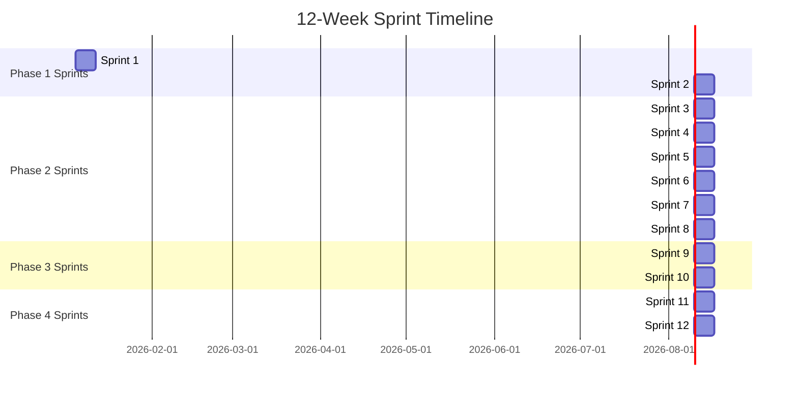

# Kế hoạch Quản lý Dự án Capstone

## Tổng quan Quản lý Dự án

**Dự án**: Hệ thống Quản lý theo dõi Lỗi  
**Thời gian**: 12 tuần (12 sprints)  
**Thời lượng Sprint**: 1 tuần  
**Quy mô Nhóm**: 5 thành viên  
**Phương pháp**: Agile/Scrum (điều chỉnh cho capstone)

---

## Cấu trúc Sprint

### Phân tích Sprint 12 Tuần



### Lịch trình Sprint

| Sprint | Tuần | Ngày | Giai đoạn | Trọng tâm | Mục tiêu Story Points |
|--------|------|-------|-------|-------|-------------------|
| **Sprint 1** | Tuần 1 | 5-9 tháng 1, 2026 | Giai đoạn 1 | Thu thập Yêu cầu | 20-25 |
| **Sprint 2** | Tuần 2 | 12-16 tháng 1, 2026 | Giai đoạn 1 | Thiết kế Chi tiết | 20-25 |
| **Sprint 3** | Tuần 3 | 19-23 tháng 1, 2026 | Giai đoạn 2 | Nền tảng & Mô hình Dữ liệu | 25-30 |
| **Sprint 4** | Tuần 4 | 26-30 tháng 1, 2026 | Giai đoạn 2 | Chức năng Cốt lõi | 30-35 |
| **Sprint 5** | Tuần 5 | 2-6 tháng 2, 2026 | Giai đoạn 2 | Triển khai Workflow | 30-35 |
| **Sprint 6** | Tuần 6 | 9-13 tháng 2, 2026 | Giai đoạn 2 | Danh sách & Lọc | 25-30 |
| **Sprint 7** | Tuần 7 | 16-20 tháng 2, 2026 | Giai đoạn 2 | Thống kê & Báo cáo | 25-30 |
| **Sprint 8** | Tuần 8 | 23-27 tháng 2, 2026 | Giai đoạn 2 | Biểu mẫu & Tích hợp | 25-30 |
| **Sprint 9** | Tuần 9 | 2-6 tháng 3, 2026 | Giai đoạn 3 | Kiểm thử Toàn diện | 20-25 |
| **Sprint 10** | Tuần 10 | 9-13 tháng 3, 2026 | Giai đoạn 3 | UAT & Tinh chỉnh | 15-20 |
| **Sprint 11** | Tuần 11 | 16-20 tháng 3, 2026 | Giai đoạn 4 | Tài liệu | 20-25 |
| **Sprint 12** | Tuần 12 | 23-27 tháng 3, 2026 | Giai đoạn 4 | Trình bày | 15-20 |

**Tổng Story Points**: ~290-350 điểm

---

## Work Breakdown Structure (WBS)

**Tham khảo**: [WBS Chi tiết](WBS.md) - Cấu trúc phân tích công việc đầy đủ với dependencies, resources, và estimates

### Tổng quan WBS

Dự án được chia thành:
- **Level 1**: Project (1.0)
- **Level 2**: 4 Phases (1.1 - 1.4)
- **Level 3**: 12 Sprints (1.1.1 - 1.4.2)
- **Level 4**: Work Packages (~66 work packages)
- **Level 5**: Tasks (~200+ tasks)

### Cấu trúc WBS Nhanh

| Phase | Sprints | Work Packages | Story Points |
|-------|---------|---------------|--------------|
| Phase 1: Requirements & Design | 2 | 12 | 40-50 |
| Phase 2: Development | 6 | 36 | 180-210 |
| Phase 3: Testing & QA | 2 | 10 | 35-45 |
| Phase 4: Documentation | 2 | 8 | 35-45 |
| **Total** | **12** | **66** | **290-350** |

### Quy ước Đánh số WBS

- **Level 1**: Project = 1.0
- **Level 2**: Phase = 1.1, 1.2, 1.3, 1.4
- **Level 3**: Sprint = 1.1.1, 1.1.2, etc.
- **Level 4**: Work Package = 1.1.1.1, 1.1.1.2, etc.
- **Level 5**: Task = 1.1.1.1.1, 1.1.1.1.2, etc.

Xem [WBS.md](WBS.md) để biết chi tiết đầy đủ với dependencies, resource assignments, và estimates cho từng work package và task.

---

## Đánh giá Story Point

### Thang Fibonacci

| Điểm | Mô tả | Công sức | Ví dụ |
|--------|-------------|--------|----------|
| **1** | Tầm thường | < 2 giờ | Sửa lỗi đơn giản, tài liệu nhỏ |
| **2** | Rất Dễ | 2-4 giờ | Hàm tiện ích nhỏ, trường màn hình đơn giản |
| **3** | Dễ | 4-8 giờ | Triển khai phương thức đơn, xác thực cơ bản |
| **5** | Trung bình | 1-2 ngày | Phương thức lớp hoàn chỉnh, màn hình với xác thực |
| **8** | Lớn | 2-3 ngày | Chương trình hoàn chỉnh, nhiệm vụ workflow, lớp phức tạp |
| **13** | Rất Lớn | 3-5 ngày | Tính năng đa thành phần, tích hợp phức tạp |
| **21** | Epic | 1+ tuần | Mô-đun hoàn chỉnh, tính năng chính |

### Quy trình Ước tính Story Point

1. **Phiên Planning Poker** (Lập kế hoạch Sprint)
   - Mỗi thành viên nhóm ước tính độc lập
   - Thảo luận khác biệt
   - Ước tính lại cho đến khi đồng thuận
   - Sử dụng thang Fibonacci

2. **Yếu tố Ước tính**
   - **Độ phức tạp**: Nhiệm vụ phức tạp đến mức nào?
   - **Công sức**: Cần bao nhiêu công việc?
   - **Sự không chắc chắn**: Chúng ta hiểu yêu cầu đến mức nào?
   - **Phụ thuộc**: Có phụ thuộc chặn không?

3. **Stories Tham khảo** (Cơ sở)
   - **1 Điểm**: Tạo domain đơn giản trong SE11
   - **3 Điểm**: Triển khai phương thức xác thực đơn
   - **5 Điểm**: Tạo màn hình hoàn chỉnh với PBO/PAI
   - **8 Điểm**: Phát triển chương trình ABAP hoàn chỉnh
   - **13 Điểm**: Triển khai mẫu workflow hoàn chỉnh

---

## Quy trình Lập kế hoạch Sprint

### Lập kế hoạch Trước Sprint (Ngày 0 - Thứ Sáu trước Sprint)

**Hoạt động**:
- Xem lại kết quả sprint trước
- Cập nhật product backlog
- Ưu tiên mục backlog
- Chuẩn bị sprint backlog

**Người tham gia**: Tất cả thành viên nhóm  
**Thời lượng**: 1-2 giờ

### Cuộc họp Lập kế hoạch Sprint (Ngày 1 - Thứ Hai)

**Chương trình**:
1. **Định nghĩa Mục tiêu Sprint** (15 phút)
   - Xác định sprint sẽ đạt được gì
   - Đồng bộ với mục tiêu giai đoạn

2. **Xem lại Backlog** (30 phút)
   - Xem lại mục backlog đã ưu tiên
   - Thảo luận yêu cầu
   - Làm rõ câu hỏi

3. **Ước tính Story Point** (45 phút)
   - Ước tính mỗi user story
   - Sử dụng planning poker
   - Tài liệu hóa ước tính

4. **Tạo Sprint Backlog** (30 phút)
   - Chọn stories cho sprint
   - Gán stories cho thành viên nhóm
   - Chia nhỏ stories thành nhiệm vụ

5. **Lập kế hoạch Năng lực** (15 phút)
   - Tính toán năng lực nhóm
   - Xác minh cam kết sprint
   - Xác định rủi ro

**Tổng Thời lượng**: ~2 giờ  
**Đầu ra**: Sprint backlog với stories đã ước tính

### Mẫu Sprint Backlog

| Story ID | User Story | Story Points | Gán cho | Trạng thái | Nhiệm vụ |
|----------|------------|--------------|-------------|--------|-------|
| US-001 | Là một người dùng, tôi muốn ghi nhận lỗi | 8 | Thành viên 1, 3 | To Do | T-001, T-002, T-003 |
| US-002 | Là một developer, tôi muốn được phân công lỗi | 13 | Thành viên 2 | In Progress | T-004, T-005 |

---

## Cuộc họp Daily Standup

### Định dạng

**Thời gian**: 15 phút  
**Tần suất**: Hàng ngày (Thứ Hai-Thứ Sáu)  
**Thời gian**: 9:00 AM (hoặc thời gian đã thỏa thuận)

### Ba Câu hỏi

1. **Tôi đã hoàn thành gì hôm qua?**
2. **Tôi sẽ làm gì hôm nay?**
3. **Có chướng ngại vật nào không?**

### Mẫu Standup

| Thành viên | Hôm qua | Hôm nay | Chướng ngại vật |
|--------|-----------|-------|----------|
| Thành viên 1 | Đã hoàn thành tạo bảng | Đang làm lớp xác thực | Không |
| Thành viên 2 | Đã thiết kế workflow | Đang tạo mẫu workflow | Cần truy cập bảng user |
| Thành viên 3 | Đã tạo cấu trúc chương trình | Đang phát triển màn hình | Đang chờ lớp của Thành viên 1 |
| Thành viên 4 | Đã thiết lập SmartForms | Đang tạo bố cục biểu mẫu | Không |
| Thành viên 5 | Đã tạo lớp tiện ích | Đang viết hàm trợ giúp | Không |

### Quy tắc Standup

- Giữ ngắn gọn (2-3 phút mỗi người)
- Tập trung vào tiến độ và chướng ngại vật
- Không thảo luận kỹ thuật chi tiết (lên lịch cuộc họp riêng)
- Cập nhật bảng sprint sau standup

---

## Xem lại Sprint (Cuối Sprint)

### Cuộc họp Xem lại Sprint

**Thời gian**: 1 giờ  
**Tần suất**: Cuối mỗi sprint (Thứ Sáu)  
**Người tham gia**: Tất cả thành viên nhóm

### Chương trình

1. **Tóm tắt Sprint** (10 phút)
   - Đạt được mục tiêu sprint
   - Stories hoàn thành
   - Story points hoàn thành

2. **Demo** (30 phút)
   - Demo tính năng đã hoàn thành
   - Hiển thị chức năng hoạt động
   - Thu thập phản hồi

3. **Thảo luận** (15 phút)
   - Phản hồi về tính năng
   - Đề xuất cải thiện
   - Câu hỏi và trả lời

4. **Cập nhật Backlog** (5 phút)
   - Cập nhật product backlog
   - Thêm stories mới nếu cần
   - Ưu tiên lại backlog

---

## Hồi cứu Sprint

### Cuộc họp Hồi cứu Sprint

**Thời gian**: 30-45 phút  
**Tần suất**: Cuối mỗi sprint (sau Sprint Review)  
**Người tham gia**: Tất cả thành viên nhóm

### Định dạng "Start, Stop, Continue"

1. **Start**: Điều gì chúng ta nên bắt đầu làm?
2. **Stop**: Điều gì chúng ta nên dừng làm?
3. **Continue**: Điều gì chúng ta nên tiếp tục làm?

### Mẫu Hồi cứu

| Thể loại | Điểm | Hành động |
|--------|------|----------|
| **Start** | Tạo mẫu sớm hơn | Bắt đầu tạo mẫu trong tuần đầu |
| **Stop** | Đợi phụ thuộc | Giao tiếp sớm hơn về phụ thuộc |
| **Continue** | Standup hàng ngày | Tiếp tục standup hiệu quả |

---

## Quản lý Product Backlog

### Cấu trúc Backlog

| Story ID | User Story | Story Points | Ưu tiên | Giai đoạn | Trạng thái |
|----------|------------|--------------|----------|-------|--------|
| US-101 | Ghi nhận lỗi | 8 | P0 | Phase 2 | Done |
| US-102 | Phân công developer | 13 | P0 | Phase 2 | In Progress |

### Ưu tiên Backlog

- **P0**: Phải có (Critical)
- **P1**: Nên có (High)
- **P2**: Có thể có (Medium)
- **P3**: Tùy chọn (Low)

---

## Theo dõi Velocity

### Velocity Chart

| Sprint | Story Points Cam kết | Story Points Hoàn thành | Velocity |
|--------|---------------------|------------------------|----------|
| Sprint 1 | 23 | 23 | 23 |
| Sprint 2 | 25 | 24 | 24 |
| Sprint 3 | 28 | 27 | 27 |

**Velocity Trung bình**: ~25 điểm/sprint

---

## Biểu đồ Burndown

### Mẫu Burndown Chart

```
Story Points
30 |                                    /
   |                                 /
25 |                              /
   |                           /
20 |                        /
   |                     /
15 |                  /
   |               /
10 |            /
   |         /
 5 |      /
   |   /
 0 |__/_____________________________
   Mon  Tue  Wed  Thu  Fri
```

---

## Quản lý Nhiệm vụ

### Trạng thái Nhiệm vụ

- **To Do**: Chưa bắt đầu
- **In Progress**: Đang làm
- **Review**: Đang xem xét
- **Done**: Hoàn thành
- **Blocked**: Bị chặn

---

## Quản lý Rủi ro

### Ma trận Rủi ro

| Rủi ro | Xác suất | Tác động | Chiến lược Giảm thiểu | Chủ sở hữu |
|------|------------|--------|-------------------|-------|
| Workflow phức tạp | Trung bình | Cao | Tạo mẫu sớm | Thành viên 2 |
| Xử lý file | Trung bình | Cao | Kiểm thử sớm | Thành viên 4 |

---

## Chỉ số và KPI

### Chỉ số Sprint

- **Velocity**: Story points hoàn thành/sprint
- **Burndown Rate**: Tỷ lệ hoàn thành công việc
- **Blocked Tasks**: Số nhiệm vụ bị chặn
- **Code Review Time**: Thời gian xem xét mã

### KPI Dự án

- **On-Time Delivery**: % sprint hoàn thành đúng hạn
- **Quality**: % stories không có lỗi nghiêm trọng
- **Team Satisfaction**: Điểm hài lòng nhóm

---

## Kế hoạch Giao tiếp

### Cuộc họp Thường xuyên

- **Daily Standup**: Hàng ngày, 9:00 AM
- **Sprint Planning**: Thứ Hai, 10:00 AM
- **Sprint Review**: Thứ Sáu, 2:00 PM
- **Retrospective**: Thứ Sáu, 3:00 PM

### Kênh Giao tiếp

- **Slack/Teams**: Giao tiếp hàng ngày
- **Email**: Thông báo quan trọng
- **Documentation**: Tài liệu dự án

---

**Cập nhật lần cuối**: 2026  
**Trạng thái**: Hoạt động

