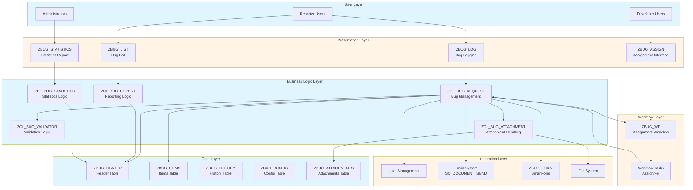
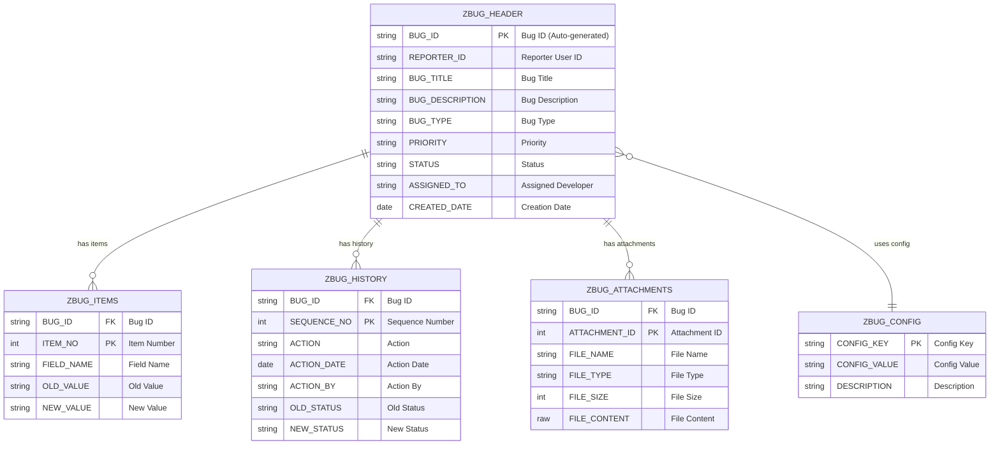
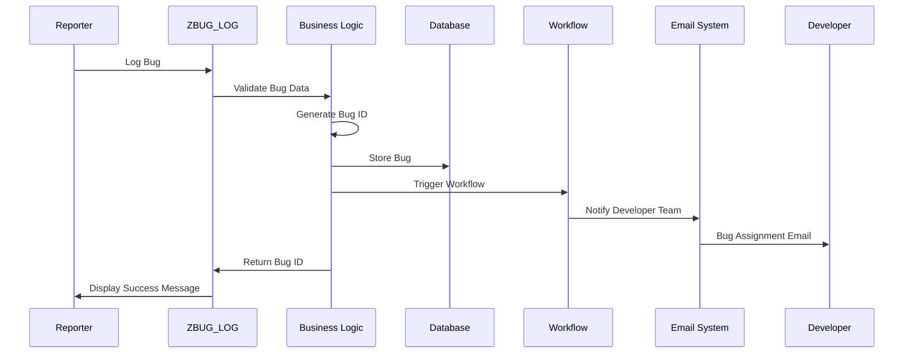
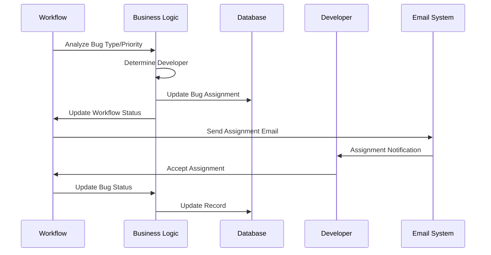
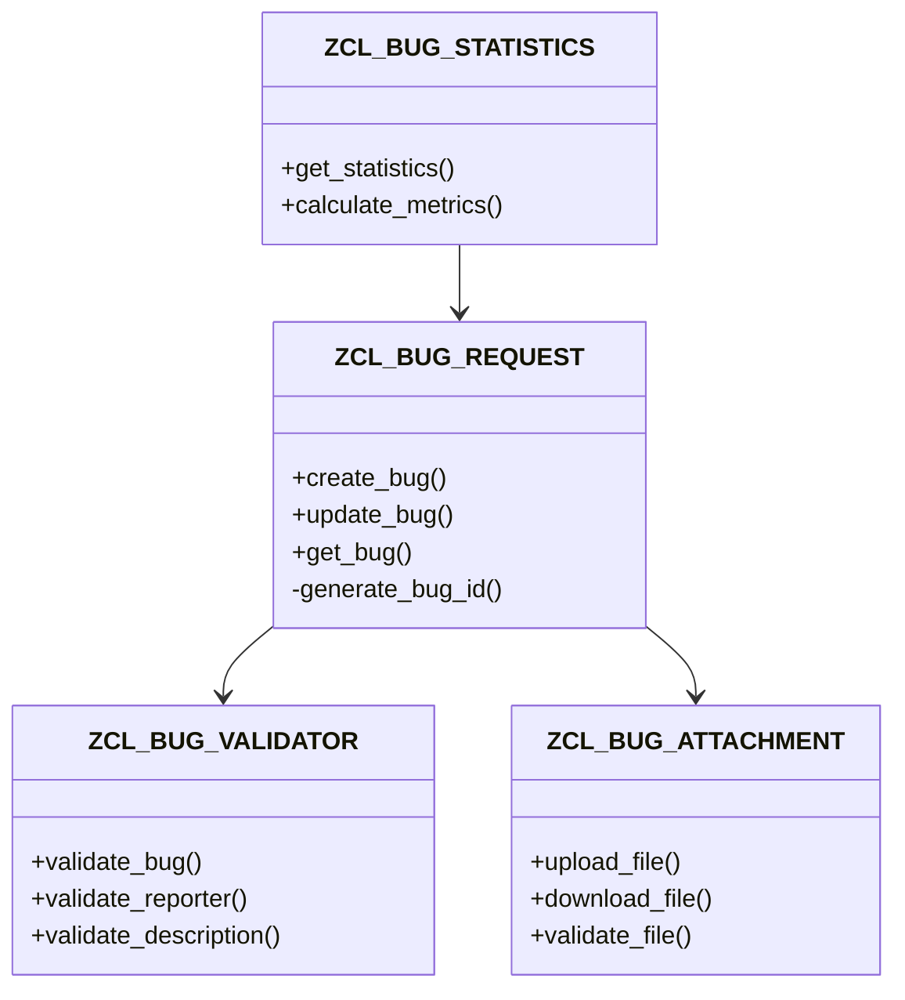
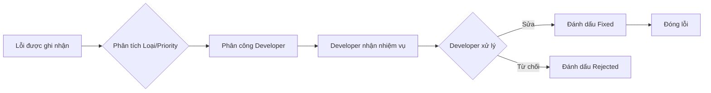

# Kiến trúc Kỹ thuật

**← [Quay lại README](README.md)**

---

## Mục lục

1. [Kiến trúc Hệ thống](#system-architecture)
2. [Mô hình Dữ liệu](#data-model)
3. [Sơ đồ Trình tự](#sequence-diagrams)
4. [Sơ đồ Lớp](#class-diagrams)
5. [Kiến trúc Tích hợp](#integration-architecture)
6. [Đặc tả Cơ sở Dữ liệu](#database-specifications)
7. [Đặc tả API/Giao diện](#apiinterface-specifications)
8. [Kiến trúc Workflow](#workflow-architecture)
9. [Kiến trúc Bảo mật](#security-architecture)

---

## Kiến trúc Hệ thống

### Kiến trúc Cấp cao



---

## Mô hình Dữ liệu

### Sơ đồ Quan hệ Thực thể



---

## Sơ đồ Trình tự

### Quy trình Ghi nhận Lỗi



### Quy trình Phân công Developer



---

## Sơ đồ Lớp

**Tham khảo**: **[Hướng dẫn ABAP Objects](../../ABAP-Guides/08_SAP_ABAP_OBJECTS_GUIDE.md)** - Thiết kế lớp, interfaces, và design patterns

### Cấu trúc Lớp Chính



---

## Đặc tả Cơ sở Dữ liệu

**Tham khảo**: **[Hướng dẫn Data Dictionary](../../ABAP-Guides/02_SAP_ABAP_DATA_DICTIONARY_GUIDE.md)** - Thiết kế bảng, domains, data elements, và indexes

### Bảng ZBUG_HEADER

**Mô tả**: Bảng header lưu trữ thông tin chính của lỗi

| Trường | Data Element | Kiểu | Độ dài | Khóa | Bắt buộc | Mô tả |
|--------|--------------|------|--------|------|----------|-------|
| MANDT | MANDT | CLNT | 3 | X | X | Client |
| BUG_ID | ZBUG_BUG_ID | CHAR | 10 | X | X | Bug ID (Format: BUG-YYYYMMDD-XXX) |
| REPORTER_ID | SYUNAME | CHAR | 12 | | X | Reporter User ID |
| BUG_TITLE | ZBUG_TITLE | CHAR | 100 | | X | Bug Title |
| BUG_DESCRIPTION | ZBUG_DESCRIPTION | STRING | 255 | | X | Bug Description |
| BUG_TYPE | ZBUG_TYPE | CHAR | 4 | | X | Bug Type (FUNC/PERF/SECU/UIUX/INTE) |
| PRIORITY | ZBUG_PRIORITY | CHAR | 1 | | X | Priority (L/M/H/C) |
| STATUS | ZBUG_STATUS | CHAR | 1 | | X | Status (N/A/I/F/R/C) |
| ASSIGNED_TO | SYUNAME | CHAR | 12 | | | Assigned Developer |
| CREATED_DATE | DATUM | DATS | 8 | | X | Creation Date |
| CREATED_BY | SYUNAME | CHAR | 12 | | X | Created By |
| CREATED_TIME | TIMS | TIMS | 6 | | | Creation Time |
| FIXED_DATE | DATUM | DATS | 8 | | | Fixed Date |
| FIXED_TIME | TIMS | TIMS | 6 | | | Fixed Time |
| CLOSED_DATE | DATUM | DATS | 8 | | | Closed Date |
| CLOSED_TIME | TIMS | TIMS | 6 | | | Closed Time |
| RESOLUTION | ZBUG_RESOLUTION | STRING | 255 | | | Resolution Notes |
| REJECTION_REASON | ZBUG_REJECTION | STRING | 255 | | | Rejection Reason |

**Chỉ mục**:
- Primary Key: MANDT, BUG_ID
- Secondary Index 1: STATUS, CREATED_DATE
- Secondary Index 2: ASSIGNED_TO, STATUS
- Secondary Index 3: REPORTER_ID, CREATED_DATE

---

### Bảng ZBUG_ITEMS

**Mô tả**: Bảng items lưu trữ chi tiết thay đổi của lỗi

| Trường | Data Element | Kiểu | Độ dài | Khóa | Bắt buộc | Mô tả |
|--------|--------------|------|--------|------|----------|-------|
| MANDT | MANDT | CLNT | 3 | X | X | Client |
| BUG_ID | ZBUG_BUG_ID | CHAR | 10 | X | X | Bug ID (FK to ZBUG_HEADER) |
| ITEM_NO | NUMC | NUMC | 5 | X | X | Item Number |
| FIELD_NAME | ZBUG_FIELD_NAME | CHAR | 30 | | X | Field Name |
| OLD_VALUE | ZBUG_FIELD_VALUE | STRING | 255 | | | Old Value |
| NEW_VALUE | ZBUG_FIELD_VALUE | STRING | 255 | | | New Value |
| CHANGE_DATE | DATUM | DATS | 8 | | X | Change Date |
| CHANGE_TIME | TIMS | TIMS | 6 | | | Change Time |
| CHANGE_BY | SYUNAME | CHAR | 12 | | X | Changed By |

**Chỉ mục**:
- Primary Key: MANDT, BUG_ID, ITEM_NO
- Foreign Key: BUG_ID → ZBUG_HEADER.BUG_ID

---

### Bảng ZBUG_HISTORY

**Mô tả**: Bảng history lưu trữ nhật ký kiểm tra (audit trail)

| Trường | Data Element | Kiểu | Độ dài | Khóa | Bắt buộc | Mô tả |
|--------|--------------|------|--------|------|----------|-------|
| MANDT | MANDT | CLNT | 3 | X | X | Client |
| BUG_ID | ZBUG_BUG_ID | CHAR | 10 | X | X | Bug ID (FK to ZBUG_HEADER) |
| SEQUENCE_NO | NUMC | NUMC | 5 | X | X | Sequence Number |
| ACTION | ZBUG_ACTION | CHAR | 4 | | X | Action (CREA/ASSI/UPDA/STAT/FIXE/REJE/CLOS) |
| ACTION_DATE | DATUM | DATS | 8 | | X | Action Date |
| ACTION_TIME | TIMS | TIMS | 6 | | X | Action Time |
| ACTION_BY | SYUNAME | CHAR | 12 | | X | Action By |
| OLD_STATUS | ZBUG_STATUS | CHAR | 1 | | | Old Status |
| NEW_STATUS | ZBUG_STATUS | CHAR | 1 | | | New Status |
| COMMENTS | ZBUG_COMMENTS | STRING | 255 | | | Comments |

**Chỉ mục**:
- Primary Key: MANDT, BUG_ID, SEQUENCE_NO
- Foreign Key: BUG_ID → ZBUG_HEADER.BUG_ID
- Secondary Index: ACTION_DATE, ACTION_BY

---

### Bảng ZBUG_CONFIG

**Mô tả**: Bảng config lưu trữ cấu hình hệ thống

| Trường | Data Element | Kiểu | Độ dài | Khóa | Bắt buộc | Mô tả |
|--------|--------------|------|--------|------|----------|-------|
| MANDT | MANDT | CLNT | 3 | X | X | Client |
| CONFIG_KEY | ZBUG_CONFIG_KEY | CHAR | 30 | X | X | Config Key |
| CONFIG_VALUE | ZBUG_CONFIG_VALUE | STRING | 255 | | X | Config Value |
| DESCRIPTION | ZBUG_CONFIG_DESC | CHAR | 100 | | | Description |
| ACTIVE | ZBUG_ACTIVE | CHAR | 1 | | X | Active Flag |

**Chỉ mục**:
- Primary Key: MANDT, CONFIG_KEY

---

### Bảng ZBUG_ATTACHMENTS

**Mô tả**: Bảng attachments lưu trữ file bằng chứng đính kèm

| Trường | Data Element | Kiểu | Độ dài | Khóa | Bắt buộc | Mô tả |
|--------|--------------|------|--------|------|----------|-------|
| MANDT | MANDT | CLNT | 3 | X | X | Client |
| BUG_ID | ZBUG_BUG_ID | CHAR | 10 | X | X | Bug ID (FK to ZBUG_HEADER) |
| ATTACHMENT_ID | NUMC | NUMC | 5 | X | X | Attachment ID |
| FILE_NAME | ZBUG_FILE_NAME | CHAR | 255 | | X | File Name |
| FILE_TYPE | ZBUG_FILE_TYPE | CHAR | 10 | | X | File Type |
| FILE_SIZE | INT4 | INT4 | 10 | | X | File Size (bytes, max 10MB) |
| FILE_CONTENT | RAW | RAW | 0 | | X | File Content |
| UPLOAD_DATE | DATUM | DATS | 8 | | X | Upload Date |
| UPLOAD_TIME | TIMS | TIMS | 6 | | | Upload Time |
| UPLOAD_BY | SYUNAME | CHAR | 12 | | X | Uploaded By |
| DESCRIPTION | ZBUG_ATTACH_DESC | STRING | 255 | | | File Description |

**Chỉ mục**:
- Primary Key: MANDT, BUG_ID, ATTACHMENT_ID
- Foreign Key: BUG_ID → ZBUG_HEADER.BUG_ID
- Secondary Index: UPLOAD_DATE, UPLOAD_BY

**Ràng buộc**:
- FILE_SIZE <= 10485760 (10MB)
- FILE_TYPE IN ('PDF', 'JPG', 'PNG', 'TXT', 'DOC', 'DOCX')

---

## Kiến trúc Workflow

**Tham khảo**: **[Hướng dẫn SAP Workflow](../../SAP-General-Guides/SAP_WORKFLOW_GUIDE.md)** - Thiết kế workflow, tasks, và agent determination

### Quy trình Workflow Phân công



---

## Đặc tả API/Giao diện

**Tham khảo**: 
- **[Hướng dẫn Function Modules](../../ABAP-Guides/05_SAP_ABAP_FUNCTION_MODULES_GUIDE.md)** - Thiết kế function modules và interfaces
- **[Hướng dẫn ABAP Objects](../../ABAP-Guides/08_SAP_ABAP_OBJECTS_GUIDE.md)** - Thiết kế class methods và signatures

### Class ZCL_BUG_REQUEST

**Method: CREATE_BUG**

```abap
METHODS create_bug
  IMPORTING is_bug_data TYPE zst_bug_data
  EXPORTING ev_bug_id TYPE zbug_bug_id
            et_messages TYPE bapiret2_t.
```

**Parameters**:
- `is_bug_data`: Bug data structure (reporter_id, bug_title, bug_description, bug_type, priority)
- `ev_bug_id`: Generated bug ID
- `et_messages`: Return messages (success/error)

**Return Codes**:
- Success: Message type 'S'
- Error: Message type 'E'

---

**Method: UPDATE_BUG**

```abap
METHODS update_bug
  IMPORTING iv_bug_id TYPE zbug_bug_id
            is_bug_data TYPE zst_bug_data
  EXPORTING et_messages TYPE bapiret2_t.
```

**Parameters**:
- `iv_bug_id`: Bug ID to update
- `is_bug_data`: Updated bug data
- `et_messages`: Return messages

---

**Method: GET_BUG**

```abap
METHODS get_bug
  IMPORTING iv_bug_id TYPE zbug_bug_id
  EXPORTING es_bug_data TYPE zst_bug_data
            et_messages TYPE bapiret2_t.
```

**Parameters**:
- `iv_bug_id`: Bug ID to retrieve
- `es_bug_data`: Bug data structure
- `et_messages`: Return messages

---

### Class ZCL_BUG_ATTACHMENT

**Method: UPLOAD_FILE**

```abap
METHODS upload_file
  IMPORTING iv_bug_id TYPE zbug_bug_id
            iv_file_name TYPE string
            iv_file_type TYPE string
            iv_file_size TYPE i
            iv_file_content TYPE xstring
  EXPORTING ev_attachment_id TYPE zbug_attachment_id
            et_messages TYPE bapiret2_t.
```

**Validation**:
- File size <= 10MB
- File type in allowed list
- Bug ID exists

---

**Method: DOWNLOAD_FILE**

```abap
METHODS download_file
  IMPORTING iv_bug_id TYPE zbug_bug_id
            iv_attachment_id TYPE zbug_attachment_id
  EXPORTING ev_file_content TYPE xstring
            ev_file_name TYPE string
            et_messages TYPE bapiret2_t.
```

---

## Kiến trúc Tích hợp

**Tham khảo**: 
- **[Hướng dẫn Tích hợp ABAP](../../ABAP-Guides/15_SAP_ABAP_INTEGRATION_GUIDE.md)** - Patterns tích hợp và email integration
- **[Hướng dẫn Tích hợp SAP](../../SAP-General-Guides/SAP_INTEGRATION_GUIDE.md)** - Tích hợp hệ thống và best practices

### Tích hợp User Management

**Bảng SAP Standard**:
- USR02: User Master Data
- USR21: User Address Data

**Tích hợp**:
- REPORTER_ID → USR02.BNAME
- ASSIGNED_TO → USR02.BNAME
- Validate user exists and is active

---

### Tích hợp Email System

**Function Module**: SO_DOCUMENT_SEND_API1

**Email Templates**:
1. Bug Logged Notification
2. Bug Assigned Notification
3. Bug Fixed Notification
4. Bug Rejected Notification

**Email Structure**:
- Subject: Dynamic based on bug ID and title
- Body: HTML formatted with bug details
- Recipients: Developer team or assigned developer

---

### Tích hợp SmartForm

**SmartForm**: ZBUG_FORM

**Input Parameters**:
- IV_BUG_ID: Bug ID
- IV_OUTPUT_TYPE: Output type (PDF, HTML)

**Output**:
- PDF document or HTML output

---

## Kiến trúc Bảo mật

**Tham khảo**: 
- **[Hướng dẫn Bảo mật ABAP](../../ABAP-Guides/13_SAP_ABAP_SECURITY_GUIDE.md)** - Secure coding và authorization checks
- **[Hướng dẫn Phân quyền SAP](../../SAP-General-Guides/SAP_SECURITY_AUTHORIZATION_GUIDE.md)** - Authorization objects và role-based access control

### Phân quyền

**Authorization Objects**:

1. **Z_BUG_CREATE** (Create Bug):
   - Activity: 01 (Create)
   - User: All authenticated users

2. **Z_BUG_VIEW** (View Bug):
   - Activity: 03 (Display)
   - User: Reporter (own bugs), Developer (assigned bugs), Admin (all bugs)

3. **Z_BUG_UPDATE** (Update Bug):
   - Activity: 02 (Change)
   - User: Reporter (own bugs, status = New), Developer (assigned bugs), Admin (all bugs)

4. **Z_BUG_ASSIGN** (Assign Bug):
   - Activity: 02 (Change)
   - User: Admin, Workflow system

5. **Z_BUG_ADMIN** (Admin):
   - Activity: All
   - User: Admin only

### Role-Based Access Control

**Reporter Role**:
- Create bugs
- View own bugs
- Update own bugs (only if status = New)
- Upload attachments to own bugs

**Developer Role**:
- View assigned bugs
- Update assigned bugs
- Change status (In Progress, Fixed, Rejected)
- Download attachments from assigned bugs

**Admin Role**:
- All permissions
- Assign bugs
- View all bugs
- Manage configuration
- View statistics

### Data Security

**Data Encryption**:
- File attachments stored as RAW (encrypted at database level)
- Sensitive data in descriptions (if applicable)

**Audit Trail**:
- All changes logged in ZBUG_HISTORY
- User actions tracked (who, when, what)
- Cannot delete history records

---

## Tham khảo

### Tài liệu Dự án
- **[Tổng quan Dự án](00_Project_Overview.md)** - Tổng quan dự án
- **[Giai đoạn 1: Yêu cầu & Thiết kế](Phase1_Requirements_Design.md)** - Thiết kế chi tiết
- **[Giai đoạn 2: Phát triển](Phase2_Development.md)** - Triển khai
- **[Tham khảo & Tài nguyên](References_Resources.md)** - Hướng dẫn SAP và tài nguyên

### Hướng dẫn Kỹ thuật
- **[Hướng dẫn Data Dictionary](../../ABAP-Guides/02_SAP_ABAP_DATA_DICTIONARY_GUIDE.md)** - Thiết kế bảng và data elements
- **[Hướng dẫn ABAP Objects](../../ABAP-Guides/08_SAP_ABAP_OBJECTS_GUIDE.md)** - Thiết kế lớp và interfaces
- **[Hướng dẫn Tích hợp ABAP](../../ABAP-Guides/15_SAP_ABAP_INTEGRATION_GUIDE.md)** - Email và system integration
- **[Hướng dẫn Bảo mật ABAP](../../ABAP-Guides/13_SAP_ABAP_SECURITY_GUIDE.md)** - Secure coding practices
- **[Hướng dẫn SAP Workflow](../../SAP-General-Guides/SAP_WORKFLOW_GUIDE.md)** - Workflow design và implementation

---

**← [Quay lại README](README.md)**

