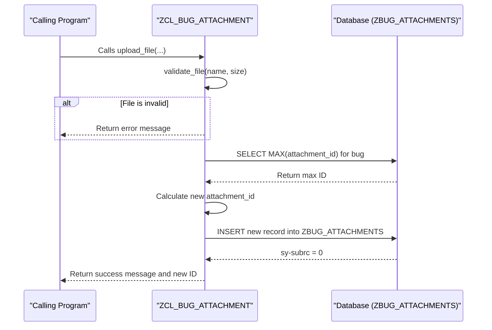
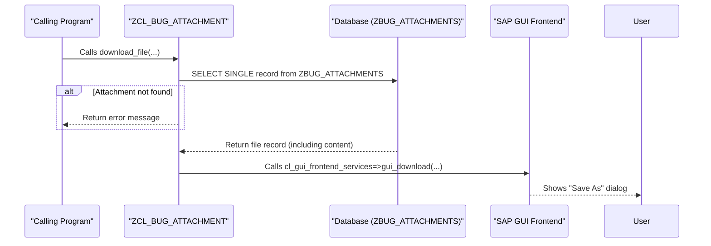

# ABAP Class: ZCL_BUG_ATTACHMENT

This file contains the ABAP source code for the class that handles file attachments. It encapsulates all logic related to uploading, downloading, validating, and retrieving attachment data.

---

### Upload Flow Diagram

This diagram shows the sequence of events when a user uploads a file.



### Download Flow Diagram


---

````abap
CLASS zcl_bug_attachment DEFINITION
  PUBLIC
  FINAL
  CREATE PUBLIC.

  PUBLIC SECTION.
    " Uploads a new file attachment for a given bug.
    METHODS upload_file
      IMPORTING
        iv_bug_id       TYPE zbug_bug_id
        iv_file_name    TYPE string
        iv_file_content TYPE xstring " File content is passed as a binary string
      EXPORTING
        ev_attachment_id TYPE zbug_attachment_id
        et_messages      TYPE bapiret2_t.

    " Downloads an existing attachment to the user's local machine.
    METHODS download_file
      IMPORTING
        iv_bug_id        TYPE zbug_bug_id
        iv_attachment_id TYPE zbug_attachment_id
      EXPORTING
        et_messages      TYPE bapiret2_t.

    " Retrieves a list of all attachment metadata for a specific bug.
    METHODS get_attachments_for_bug
      IMPORTING
        iv_bug_id     TYPE zbug_bug_id
      RETURNING
        VALUE(rt_attachments) TYPE STANDARD TABLE OF zbug_attachments WITH EMPTY KEY.

  PRIVATE SECTION.
    " Global constant for the maximum allowed file size in bytes.
    CONSTANTS:
      gc_max_file_size TYPE i VALUE 10485760. " 10 MB

    " Private validation method.
    METHODS validate_file
      IMPORTING
        iv_file_name TYPE string
        iv_file_size TYPE i
      RETURNING
        VALUE(rv_is_valid) TYPE abap_bool.

ENDCLASS.


CLASS zcl_bug_attachment IMPLEMENTATION.

  METHOD upload_file.
    DATA ls_attachment TYPE zbug_attachments.
    DATA lv_file_size TYPE i.
    DATA lv_file_type TYPE string.
    DATA lt_messages  TYPE bapiret2_t.

    " Get the size of the binary content.
    lv_file_size = xstrlen( iv_file_content ).

    " 1. Validate the file before proceeding.
    IF me->validate_file( iv_file_name = iv_file_name iv_file_size = lv_file_size ) = abap_false.
      APPEND VALUE #( type = 'E' message = 'File is not valid. Check size (max 10MB) and type.' ) TO lt_messages.
      et_messages = lt_messages.
      RETURN.
    ENDIF.

    " Extract the file extension to store as the file type.
    SPLIT iv_file_name AT '.' INTO TABLE DATA(lt_parts).
    DESCRIBE TABLE lt_parts LINES DATA(lv_lines).
    IF lv_lines > 1.
      READ TABLE lt_parts INDEX lv_lines INTO lv_file_type.
      TRANSLATE lv_file_type TO UPPER CASE.
    ENDIF.

    " 2. Prepare the data record for the database table.
    ls_attachment-bug_id      = iv_bug_id.
    ls_attachment-file_name   = iv_file_name.
    ls_attachment-file_type   = lv_file_type.
    ls_attachment-file_size   = lv_file_size.
    ls_attachment-file_content = iv_file_content.
    ls_attachment-upload_by   = sy-uname.
    ls_attachment-upload_date = sy-datum.
    ls_attachment-upload_time = sy-uzeit.

    " 3. Determine the next attachment ID for this specific bug.
    SELECT MAX( attachment_id ) FROM zbug_attachments
      INTO ls_attachment-attachment_id
      WHERE bug_id = @iv_bug_id.
    ls_attachment-attachment_id = ls_attachment-attachment_id + 1.

    " 4. Insert the new record into the database.
    INSERT zbug_attachments FROM ls_attachment.
    IF sy-subrc = 0.
      ev_attachment_id = ls_attachment-attachment_id.
      APPEND VALUE #( type = 'S' message = 'File uploaded successfully.' ) TO lt_messages.
    ELSE.
      APPEND VALUE #( type = 'E' message = 'Database error while saving attachment.' ) TO lt_messages.
    ENDIF.

    et_messages = lt_messages.

  ENDMETHOD.


  METHOD download_file.
    DATA ls_attachment TYPE zbug_attachments.

    " 1. Retrieve the file record (including its binary content) from the database.
    SELECT SINGLE * FROM zbug_attachments
      INTO ls_attachment
      WHERE bug_id = @iv_bug_id AND attachment_id = @iv_attachment_id.

    IF sy-subrc <> 0.
      APPEND VALUE #( type = 'E' message = 'Attachment not found.' ) TO et_messages.
      RETURN.
    ENDIF.

    " 2. Use the standard frontend services class to trigger a download dialog in the user's SAP GUI.
    cl_gui_frontend_services=>gui_download(
      EXPORTING
        bin_filesize = ls_attachment-file_size
        filename     = ls_attachment-file_name
        filetype     = 'BIN' " Binary file type
      CHANGING
        data_tab     = ls_attachment-file_content
      EXCEPTIONS
        OTHERS       = 1
    ).

    IF sy-subrc <> 0.
      APPEND VALUE #( type = 'E' message = 'File download failed. Could not access frontend.' ) TO et_messages.
    ENDIF.

  ENDMETHOD.


  METHOD get_attachments_for_bug.
    " Simple retrieval of all attachment metadata for a given bug.
    SELECT * FROM zbug_attachments
      INTO TABLE rt_attachments
      WHERE bug_id = @iv_bug_id.
  ENDMETHOD.


  METHOD validate_file.
    DATA: lv_extension TYPE string.
    rv_is_valid = abap_true.

    " 1. Check file size against the globally defined constant.
    IF iv_file_size > gc_max_file_size.
      rv_is_valid = abap_false.
      RETURN.
    ENDIF.

    " 2. Check for a valid file extension.
    SPLIT iv_file_name AT '.' INTO TABLE DATA(lt_parts).
    DESCRIBE TABLE lt_parts LINES DATA(lv_lines).
    IF lv_lines > 1.
      READ TABLE lt_parts INDEX lv_lines INTO lv_extension.
      TRANSLATE lv_extension TO UPPER CASE.
    ELSE.
      " If there's no '.', it has no extension. Invalid.
      rv_is_valid = abap_false.
      RETURN.
    ENDIF.

    " Check against a whitelist of allowed extensions.
    CASE lv_extension.
      WHEN 'JPG' OR 'JPEG' OR 'PNG' OR 'GIF' OR 'PDF' OR 'TXT' OR 'LOG' OR 'DOCX' OR 'XLSX'.
        " Valid extension
      WHEN OTHERS.
        rv_is_valid = abap_false.
    ENDCASE.
  ENDMETHOD.

ENDCLASS.
````
