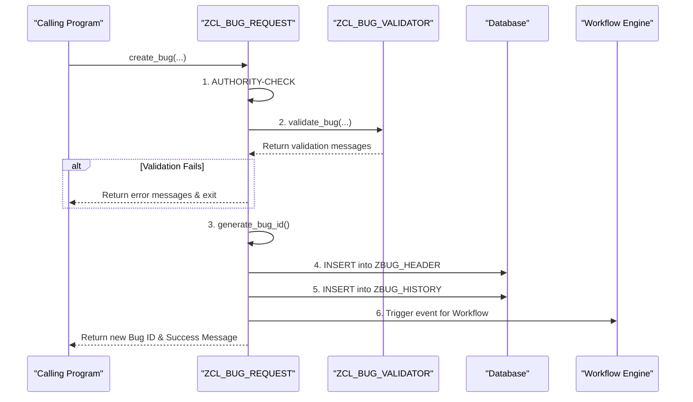

# ABAP Class: ZCL_BUG_REQUEST

This file contains the ABAP source code for the main bug handling class. It acts as the central entry point for all business logic related to creating and modifying bug reports.

---

### Create Bug - Sequence Diagram

This diagram illustrates the flow of the `CREATE_BUG` method, showing the sequence of checks, database operations, and integrations.



---

````abap
CLASS zcl_bug_request DEFINITION
  PUBLIC
  FINAL
  CREATE PRIVATE.

  PUBLIC SECTION.
    " Singleton pattern to ensure only one instance of this class exists
    " per session, providing a global point of access.
    CLASS-METHODS get_instance
      RETURNING
        VALUE(ro_instance) TYPE REF TO zcl_bug_request.

    " Creates a new bug based on the provided data structure.
    " Handles validation, DB insertion, history logging, and workflow trigger.
    METHODS create_bug
      IMPORTING
        is_bug_data   TYPE zst_bug_data
      EXPORTING
        ev_bug_id     TYPE zbug_bug_id
        et_messages   TYPE bapiret2_t.

    " Updates an existing bug. Handles partial updates and logs all changes.
    METHODS update_bug
      IMPORTING
        iv_bug_id     TYPE zbug_bug_id
        is_bug_data   TYPE zst_bug_data_update " Use a separate structure for updates
      EXPORTING
        et_messages   TYPE bapiret2_t.

    " Re-assigns a bug to a new developer. Restricted to Admins.
    METHODS reassign_bug
      IMPORTING
        iv_bug_id         TYPE zbug_bug_id
        iv_new_assignee   TYPE syuname
      EXPORTING
        et_messages       TYPE bapiret2_t.

    " Retrieves the header details for a single bug.
    METHODS get_bug
      IMPORTING
        iv_bug_id     TYPE zbug_bug_id
      EXPORTING
        es_bug_data   TYPE zbug_header
        et_messages   TYPE bapiret2_t.

  PRIVATE SECTION.
    CLASS-DATA go_instance TYPE REF TO zcl_bug_request.

    " Generates a new unique bug ID using a number range object.
    METHODS generate_bug_id
      RETURNING
        VALUE(rv_bug_id) TYPE zbug_bug_id.

    " Logs a high-level action (e.g., 'Create', 'Update') to the history table.
    METHODS log_history
      IMPORTING
        iv_bug_id     TYPE zbug_bug_id
        iv_action     TYPE zbug_action
        iv_new_status TYPE zbug_status OPTIONAL
        iv_comments   TYPE string OPTIONAL.

    " Logs an individual field change to the items table for detailed auditing.
    METHODS log_field_change
        IMPORTING
          iv_bug_id      TYPE zbug_bug_id
          iv_field_name  TYPE string
          iv_old_value   TYPE string
          iv_new_value   TYPE string.

    " Logs a system message for monitoring purposes.
    METHODS log_message
      IMPORTING
        iv_message_text TYPE string
        iv_message_type TYPE syst_msgty DEFAULT 'I'.

ENDCLASS.


CLASS zcl_bug_request IMPLEMENTATION.

  METHOD get_instance.
    IF go_instance IS NOT BOUND.
      CREATE OBJECT go_instance.
    ENDIF.
    ro_instance = go_instance.
  ENDMETHOD.


  METHOD create_bug.
    " 1. Initialization
    CLEAR: ev_bug_id, et_messages.

    " 2. Authorization Check: Use the granular object for creation.
    AUTHORITY-CHECK OBJECT 'Z_BUG_CREATE' ID 'ACTVT' FIELD '01'.
    IF sy-subrc <> 0.
      APPEND VALUE #( type = 'E' id = 'ZBUG' number = '001' message = 'You do not have permission to create a bug.' ) TO et_messages.
      RETURN.
    ENDIF.

    " 3. Validation
    DATA(lt_validation_messages) = zcl_bug_validator=>validate_bug( is_bug_data ).
    IF lt_validation_messages IS NOT INITIAL.
      et_messages = lt_validation_messages;
      RETURN.
    ENDIF.

    " 4. Generate Bug ID
    DATA(lv_new_bug_id) = me->generate_bug_id( ).
    IF lv_new_bug_id IS INITIAL.
      APPEND VALUE #( type = 'E' id = 'ZBUG' number = '002' message = 'System Error: Could not generate Bug ID.' ) TO et_messages;
      RETURN.
    ENDIF.

    " 5. Prepare Database Record
    DATA ls_bug_header TYPE zbug_header.
    ls_bug_header = CORRESPONDING #( is_bug_data ).
    ls_bug_header-bug_id        = lv_new_bug_id.
    ls_bug_header-status        = 'N'. " New
    ls_bug_header-created_by    = sy-uname.
    ls_bug_header-created_date  = sy-datum.
    ls_bug_header-created_time  = sy-uzeit.
    ls_bug_header-reporter_id   = sy-uname.

    " 6. Database Transaction
    INSERT zbug_header FROM ls_bug_header.
    IF sy-subrc <> 0.
      APPEND VALUE #( type = 'A' id = 'ZBUG' number = '003' message = 'Critical DB Error on bug creation.' ) TO et_messages;
      RETURN.
    ENDIF.

    " 7. Log History
    me->log_history( iv_bug_id = lv_new_bug_id, iv_action = 'CREA', iv_new_status = 'N', iv_comments = 'Bug logged successfully.' ).

    " 8. Trigger Workflow
    DATA(lv_objkey) = CONV sweinstcou-objkey( lv_new_bug_id ).
    CALL FUNCTION 'SWE_EVENT_CREATE'
      EXPORTING
        objtype           = 'ZBUS_BUG'
        objkey            = lv_objkey
        event             = 'Created'
      EXCEPTIONS
        objtype_not_found = 1
        OTHERS            = 2.
    IF sy-subrc <> 0.
      me->log_message( iv_message_text = |Workflow trigger failed for Bug ID { lv_new_bug_id }| iv_message_type = 'E' ).
    ENDIF.

    " 9. Finalization
    ev_bug_id = lv_new_bug_id.
    APPEND VALUE #( type = 'S' id = 'ZBUG' number = '004' message = |Bug successfully created with ID: { ev_bug_id }| ) TO et_messages.

  ENDMETHOD.


  METHOD update_bug.
    " 1. Initialization
    CLEAR et_messages.

    " 2. Get existing data
    SELECT SINGLE * FROM zbug_header INTO DATA(ls_existing_bug) WHERE bug_id = @iv_bug_id.
    IF sy-subrc <> 0.
      APPEND VALUE #( type = 'E' message = |Bug '{ iv_bug_id }' not found.| ) TO et_messages;
      RETURN.
    ENDIF.

    " 3. Authorization Check
    AUTHORITY-CHECK OBJECT 'Z_BUG_ADMIN' ID 'ACTVT' FIELD '02'.
    IF sy-subrc <> 0.
      " If not admin, check if user is the assigned developer and has update rights.
      AUTHORITY-CHECK OBJECT 'Z_BUG_UPDATE' ID 'ACTVT' FIELD '02'.
      IF sy-subrc <> 0 OR ls_existing_bug-assigned_to <> sy-uname.
        APPEND VALUE #( type = 'E' message = 'You are not authorized to change this bug.' ) TO et_messages;
        RETURN.
      ENDIF.
    ENDIF.

    " 4. Compare incoming values and log changes.
    DATA(ls_update_struc) = ls_existing_bug.
    DATA lv_status_changed TYPE abap_bool.

    " Check and log change for STATUS
    IF is_bug_data-status IS SUPPLIED AND is_bug_data-status <> ls_existing_bug-status.
        me->log_field_change( iv_bug_id = iv_bug_id, iv_field_name = 'STATUS', iv_old_value = ls_existing_bug-status, iv_new_value = is_bug_data-status ).
        ls_update_struc-status = is_bug_data-status.
        lv_status_changed = abap_true.
    ENDIF.

    " Check and log change for PRIORITY
    IF is_bug_data-priority IS SUPPLIED AND is_bug_data-priority <> ls_existing_bug-priority.
        me->log_field_change( iv_bug_id = iv_bug_id, iv_field_name = 'PRIORITY', iv_old_value = ls_existing_bug-priority, iv_new_value = is_bug_data-priority ).
        ls_update_struc-priority = is_bug_data-priority.
    ENDIF.

    " Check and log change for RESOLUTION
    IF is_bug_data-resolution IS SUPPLIED AND is_bug_data-resolution <> ls_existing_bug-resolution.
        me->log_field_change( iv_bug_id = iv_bug_id, iv_field_name = 'RESOLUTION', iv_old_value = ls_existing_bug-resolution, iv_new_value = is_bug_data-resolution ).
        ls_update_struc-resolution = is_bug_data-resolution.
    ENDIF.

    " 5. Database Update
    UPDATE zbug_header FROM ls_update_struc.
    IF sy-subrc <> 0.
        APPEND VALUE #( type = 'E' message = 'Error updating bug in database.' ) TO et_messages;
        RETURN.
    ENDIF.

    " 6. Log main action in History table.
    IF lv_status_changed = abap_true.
         me->log_history( iv_bug_id = iv_bug_id, iv_action = 'STAT', iv_new_status = ls_update_struc-status, iv_comments = 'Status changed.' ).
    ELSE.
         me->log_history( iv_bug_id = iv_bug_id, iv_action = 'UPDA', iv_comments = 'Bug details updated.' ).
    ENDIF.

    " 7. Finalization
    APPEND VALUE #( type = 'S' message = |Bug { iv_bug_id } updated successfully.| ) TO et_messages.
  ENDMETHOD.


  METHOD reassign_bug.
    " 1. Initialization
    CLEAR et_messages.

    " 2. Authorization: Only users with specific assignment rights can execute this.
    AUTHORITY-CHECK OBJECT 'Z_BUG_ASSIGN' ID 'ACTVT' FIELD '02'.
    IF sy-subrc <> 0.
      APPEND VALUE #( type = 'E' message = 'You are not authorized to re-assign bugs.' ) TO et_messages.
      RETURN.
    ENDIF.

    " 3. Get existing data
    SELECT SINGLE bug_id, assigned_to, status FROM zbug_header INTO DATA(ls_existing_bug) WHERE bug_id = @iv_bug_id.
    IF sy-subrc <> 0.
      APPEND VALUE #( type = 'E' message = |Bug '{ iv_bug_id }' not found.| ) TO et_messages;
      RETURN.
    ENDIF.

    " 4. Check if a real change is being made
    IF iv_new_assignee = ls_existing_bug-assigned_to.
      APPEND VALUE #( type = 'W' message = |Bug is already assigned to { iv_new_assignee }.| ) TO et_messages;
      RETURN.
    ENDIF.

    " 5. Log the specific field change
    me->log_field_change( iv_bug_id = iv_bug_id, iv_field_name = 'ASSIGNED_TO', iv_old_value = ls_existing_bug-assigned_to, iv_new_value = iv_new_assignee ).

    " 6. Update database and reset status
    UPDATE zbug_header SET assigned_to = @iv_new_assignee, status = 'A' WHERE bug_id = @iv_bug_id.
    IF sy-subrc <> 0.
      APPEND VALUE #( type = 'E' message = 'Error re-assigning bug in database.' ) TO et_messages;
      ROLLBACK WORK.
      RETURN.
    ENDIF.

    " 7. Log history
    me->log_history( iv_bug_id = iv_bug_id, iv_action = 'ASSI', iv_new_status = 'A', iv_comments = |Re-assigned to { iv_new_assignee }| ).

    " 8. Finalization
    APPEND VALUE #( type = 'S' message = |Bug { iv_bug_id } reassigned successfully to { iv_new_assignee }.| ) TO et_messages.
  ENDMETHOD.


  METHOD get_bug.
    " Retrieves a bug record after checking authorization.
    DATA lv_is_admin TYPE abap_bool.

    " 1. Check if bug exists
    SELECT SINGLE * FROM zbug_header INTO @es_bug_data WHERE bug_id = @iv_bug_id.
    IF sy-subrc <> 0.
       APPEND VALUE #( type = 'E' message = |Bug with ID { iv_bug_id } not found.| ) TO et_messages.
       RETURN.
    ENDIF.

    " 2. Authorization Check
    AUTHORITY-CHECK OBJECT 'Z_BUG_ADMIN' ID 'ACTVT' FIELD '03'. " Admin can view all
    IF sy-subrc = 0.
      RETURN. " Admin is authorized, exit method successfully
    ENDIF.

    " If not admin, check for standard view rights
    AUTHORITY-CHECK OBJECT 'Z_BUG_VIEW' ID 'ACTVT' FIELD '03'.
    IF sy-subrc = 0.
      " User has basic view rights, but are they allowed to see THIS bug?
      IF es_bug_data-reporter_id = sy-uname OR es_bug_data-assigned_to = sy-uname.
        RETURN. " User is reporter or assignee, authorized.
      ENDIF.
    ENDIF.

    " If we reach here, the user is not authorized.
    APPEND VALUE #( type = 'E' message = 'You are not authorized to view this bug.' ) TO et_messages.
    CLEAR es_bug_data. " Clear the data to prevent any accidental exposure

  ENDMETHOD.


  METHOD generate_bug_id.
    " Private helper to get a unique ID from a number range object.
    DATA lv_sequence_nr TYPE i.
    CALL FUNCTION 'NUMBER_GET_NEXT'
      EXPORTING
        nr_range_nr       = '01'
        object            = 'ZBUG_ID'
      IMPORTING
        number            = lv_sequence_nr
      EXCEPTIONS
        interval_not_found = 1
        OTHERS             = 2.
    IF sy-subrc = 0.
      rv_bug_id = |BUG-{ sy-datum }-{ lv_sequence_nr CWIDTH=3 ALPHA=OUT }|.
    ELSE.
      CLEAR rv_bug_id.
    ENDIF.
  ENDMETHOD.


  METHOD log_history.
    " Private helper to create an entry in the main audit log.
    DATA ls_history TYPE zbug_history.
    ls_history-bug_id      = iv_bug_id.
    ls_history-action      = iv_action.
    ls_history-new_status  = iv_new_status.
    ls_history-comments    = iv_comments.
    ls_history-action_by   = sy-uname.
    ls_history-action_date = sy-datum.
    ls_history-action_time = sy-uzeit.

    SELECT MAX( sequence_no ) FROM zbug_history INTO @DATA(lv_max_seq) WHERE bug_id = @iv_bug_id.
    ls_history-sequence_no = lv_max_seq + 1.
    INSERT zbug_history FROM ls_history.
  ENDMETHOD.


  METHOD log_field_change.
    " Private helper to log a change to a single field in the ZBUG_ITEMS table.
    DATA ls_item TYPE zbug_items.
    ls_item-bug_id      = iv_bug_id.
    ls_item-field_name  = iv_field_name.
    ls_item-old_value   = iv_old_value.
    ls_item-new_value   = iv_new_value.
    ls_item-change_by   = sy-uname.
    ls_item-change_date = sy-datum.
    ls_item-change_time = sy-uzeit.

    SELECT MAX( item_no ) FROM zbug_items INTO @DATA(lv_max_item) WHERE bug_id = @iv_bug_id.
    ls_item-item_no = lv_max_item + 1.
    INSERT zbug_items FROM ls_item.
  ENDMETHOD.


  METHOD log_message.
    " Writes a message to the system log (can be viewed in SM21).
    MESSAGE iv_message_text TYPE iv_message_type.
  ENDMETHOD.

ENDCLASS.
````
