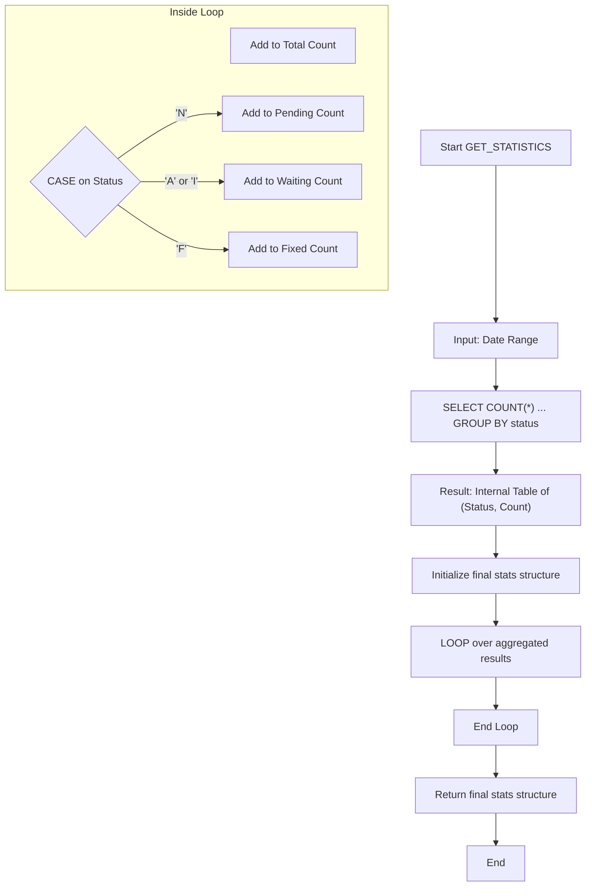

# ABAP Class: ZCL_BUG_STATISTICS

This file contains the ABAP source code for the bug statistics calculation class. This class encapsulates the logic for querying and aggregating bug data to produce summary statistics.

---

### Data Aggregation Flow

This flowchart shows how the `GET_STATISTICS` method processes data to generate the final summary.



---

````abap
CLASS zcl_bug_statistics DEFINITION
  PUBLIC
  FINAL
  CREATE PUBLIC.

  PUBLIC SECTION.
    " Structure for returning the calculated statistics
    TYPES:
      BEGIN OF tys_statistics,
        total_bugs   TYPE i,
        fixed_bugs   TYPE i,
        waiting_bugs TYPE i, " Represents bugs that are Assigned or In Progress
        pending_bugs TYPE i, " Represents bugs that are New
      END OF tys_statistics.

    " Main static method to get statistics.
    " Accepts an optional date range; if not provided, it queries all data.
    CLASS-METHODS get_statistics
      IMPORTING
        iv_date_from TYPE datum DEFAULT '19000101'
        iv_date_to   TYPE datum DEFAULT '99991231'
      RETURNING
        VALUE(rs_stats) TYPE tys_statistics.

ENDCLASS.


CLASS zcl_bug_statistics IMPLEMENTATION.

  METHOD get_statistics.
    " Define an internal table to hold the results of the aggregate query.
    DATA: lt_counts TYPE TABLE OF (
        BEGIN OF ty_group,
          status TYPE zbug_status,
          count  TYPE i,
        END OF ty_group
      ).

    " This is the core of the logic. Instead of selecting all rows, we ask the
    " database to do the counting and grouping for us, which is much more efficient.
    SELECT status, COUNT( * ) AS count
      FROM zbug_header
      WHERE created_date BETWEEN @iv_date_from AND @iv_date_to
      GROUP BY status
      INTO TABLE @lt_counts.

    IF sy-subrc <> 0.
      " If the SELECT fails or finds no data, return the initial (zeroed) structure.
      RETURN.
    ENDIF.

    " Now, process the aggregated results from the database to bucket them
    " into the categories required by the report.
    DATA ls_stats TYPE tys_statistics.
    LOOP AT lt_counts INTO DATA(ls_count).
      " Increment the total count for every status group found.
      ls_stats-total_bugs = ls_stats-total_bugs + ls_count-count.

      " Bucket the counts into the correct semantic category.
      CASE ls_count-status.
        WHEN 'N'. " New
          ls_stats-pending_bugs = ls_stats-pending_bugs + ls_count-count.
        WHEN 'A' OR 'I'. " Assigned or In Progress
          ls_stats-waiting_bugs = ls_stats-waiting_bugs + ls_count-count.
        WHEN 'F'. " Fixed
          ls_stats-fixed_bugs = ls_stats-fixed_bugs + ls_count-count.
        WHEN OTHERS.
          " This handles 'R' (Rejected) and 'C' (Closed). They are included
          " in the total_bugs count but do not have their own separate counter
          " in this statistics structure.
      ENDCASE.
    ENDLOOP.

    " Return the final, populated statistics structure.
    rs_stats = ls_stats.

  ENDMETHOD.

ENDCLASS.
````
