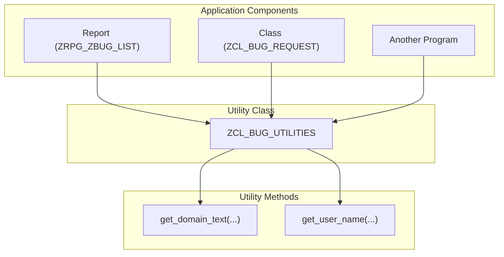

# ABAP Class: ZCL_BUG_UTILITIES

This file contains the ABAP source code for a general-purpose utility class. This class provides helper functions that can be used across the entire application.

---

### Class Purpose

This class centralizes reusable functions to avoid code duplication and ensure consistency. For example, instead of hard-coding status descriptions in reports, we can call a method here to get the correct text based on the domain value.



---

````abap
CLASS zcl_bug_utilities DEFINITION
  PUBLIC
  FINAL
  CREATE PUBLIC.

  PUBLIC SECTION.
    " Gets the full name of a user from their user ID.
    CLASS-METHODS get_user_name
      IMPORTING
        iv_user_id      TYPE syuname
      RETURNING
        VALUE(rv_user_name) TYPE ad_name1.

    " Gets the descriptive text for a domain's fixed value.
    CLASS-METHODS get_domain_text
      IMPORTING
        iv_domain_name  TYPE domname
        iv_value        TYPE domvalue_l
      RETURNING
        VALUE(rv_text)  TYPE val_text.

ENDCLASS.


CLASS zcl_bug_utilities IMPLEMENTATION.

  METHOD get_user_name.
    " This method retrieves a user's full name for display purposes.
    " It joins user master data with address data to get the name.
    IF iv_user_id IS INITIAL.
      RETURN.
    ENDIF.

    SELECT SINGLE name_first, name_last
      FROM usr21
      INNER JOIN adrp ON usr21~persnumber = adrp~persnumber
      WHERE usr21~bname = @iv_user_id
      INTO (@DATA(lv_fname), @DATA(lv_lname)).

    IF sy-subrc = 0.
      rv_user_name = |{ lv_fname } { lv_lname }|.
    ELSE.
      " If name is not found, just return the ID as a fallback.
      rv_user_name = iv_user_id.
    ENDIF.
  ENDMETHOD.


  METHOD get_domain_text.
    " This is a reusable helper to get the short text for any domain's
    " fixed value. This avoids hardcoding descriptions in reports.
    DATA: lt_domvalues TYPE TABLE OF dd07v.

    IF iv_domain_name IS INITIAL OR iv_value IS INITIAL.
      RETURN.
    ENDIF.

    " Use the standard function module to read domain values.
    " We buffer this in a static variable in a real-world scenario for performance.
    CALL FUNCTION 'DD_DOMVALUES_GET'
      EXPORTING
        domname        = iv_domain_name
        textlangu      = sy-langu
      TABLES
        dd07v_tab      = lt_domvalues
      EXCEPTIONS
        wrong_textlangu = 1
        OTHERS         = 2.

    IF sy-subrc <> 0.
      rv_text = 'Error reading domain'.
      RETURN.
    ENDIF.

    " Find the specific value and return its description.
    READ TABLE lt_domvalues INTO DATA(ls_domvalue)
      WITH KEY domvalue_l = iv_value.
    IF sy-subrc = 0.
      rv_text = ls_domvalue-ddtext.
    ELSE.
      rv_text = 'Unknown value'.
    ENDIF.
  ENDMETHOD.

ENDCLASS.
````
