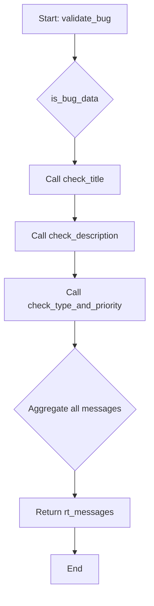

# ABAP Class: ZCL_BUG_VALIDATOR

This file contains the ABAP source code for the bug data validation utility class. This class uses static methods so that it does not need to be instantiated.

---

### Logic Flow Diagram

This flowchart illustrates how the main `VALIDATE_BUG` method orchestrates calls to private helper methods, each responsible for a specific set of checks, and then aggregates the messages.



---

````abap
CLASS zcl_bug_validator DEFINITION
  PUBLIC
  FINAL
  CREATE PUBLIC.

  PUBLIC SECTION.
    " Main validation method that orchestrates all checks.
    " It returns a table of BAPIRET2 messages. An empty table means success.
    CLASS-METHODS validate_bug
      IMPORTING
        is_bug_data   TYPE zst_bug_data
      RETURNING
        VALUE(rt_messages) TYPE bapiret2_t.

  PRIVATE SECTION.
    " Private helper methods for specific, granular checks.

    " Checks if the title is provided.
    CLASS-METHODS check_title
      IMPORTING
        iv_title      TYPE zbug_title
      CHANGING
        ct_messages   TYPE bapiret2_t.

    " Checks if the description is provided and meets length requirements.
    CLASS-METHODS check_description
      IMPORTING
        iv_description TYPE zbug_description
      CHANGING
        ct_messages    TYPE bapiret2_t.

    " Checks if Type and Priority have valid values.
    CLASS-METHODS check_type_and_priority
      IMPORTING
        iv_type       TYPE zbug_type
        iv_priority   TYPE zbug_priority
      CHANGING
        ct_messages   TYPE bapiret2_t.

ENDCLASS.


CLASS zcl_bug_validator IMPLEMENTATION.

  METHOD validate_bug.
    " This method orchestrates all validation checks.
    DATA lt_messages TYPE bapiret2_t.

    " Perform each check sequentially. Each method appends messages to the
    " internal table if validation fails.
    check_title(
      EXPORTING iv_title = is_bug_data-bug_title
      CHANGING  ct_messages = lt_messages
    ).

    check_description(
      EXPORTING iv_description = is_bug_data-bug_description
      CHANGING  ct_messages    = lt_messages
    ).

    check_type_and_priority(
      EXPORTING iv_type     = is_bug_data-bug_type
                iv_priority = is_bug_data-priority
      CHANGING  ct_messages = lt_messages
    ).

    " Return all collected messages. If the table is empty, validation passed.
    rt_messages = lt_messages.
  ENDMETHOD.


  METHOD check_title.
    " Validates that the bug title is not empty.
    IF iv_title IS INITIAL.
      APPEND VALUE #(
        type    = 'E' " Error
        id      = 'ZBUG'
        number  = '005'
        message = 'Please enter a title for the bug.'
      ) TO ct_messages.
    ENDIF.
  ENDMETHOD.


  METHOD check_description.
    " Validates that the description exists and is longer than a minimum length.
    IF iv_description IS INITIAL.
      APPEND VALUE #(
        type    = 'E'
        id      = 'ZBUG'
        number  = '006'
        message = 'Please enter a description for the bug.'
      ) TO ct_messages.
    ELSEIF strlen( iv_description ) < 10.
      APPEND VALUE #(
        type    = 'E'
        id      = 'ZBUG'
        number  = '007'
        message = 'Description must be at least 10 characters long.'
      ) TO ct_messages.
    ENDIF.
  ENDMETHOD.


  METHOD check_type_and_priority.
    " In a real system, this would check against a customizing table
    " or use a function module to read domain fixed values for robustness.
    DATA lt_valid_types TYPE TABLE OF dd07v-domvalue_l.
    DATA lt_valid_priorities TYPE TABLE OF dd07v-domvalue_l.

    " Check Bug Type
    IF iv_type IS INITIAL.
      APPEND VALUE #( type = 'E' id = 'ZBUG' number = '008' message = 'Please select a bug type.' ) TO ct_messages.
    ELSE.
      " This is a simplified check for the prototype.
      " A robust solution would read domain values from DD07V table.
      IF iv_type <> 'FUNC' AND iv_type <> 'PERF' AND iv_type <> 'SECU' AND iv_type <> 'UIUX' AND iv_type <> 'INTE'.
         APPEND VALUE #( type = 'E' id = 'ZBUG' number = '009' message = |Invalid bug type: { iv_type }| ) TO ct_messages.
      ENDIF.
    ENDIF.

    " Check Priority
    IF iv_priority IS INITIAL.
      APPEND VALUE #( type = 'E' id = 'ZBUG' number = '010' message = 'Please select a priority.' ) TO ct_messages.
    ELSE.
      " Simplified check for the prototype.
      IF iv_priority <> 'L' AND iv_priority <> 'M' AND iv_priority <> 'H' AND iv_priority <> 'C'.
         APPEND VALUE #( type = 'E' id = 'ZBUG' number = '011' message = |Invalid priority: { iv_priority }| ) TO ct_messages.
      ENDIF.
    ENDIF.

  ENDMETHOD.

ENDCLASS.
````
