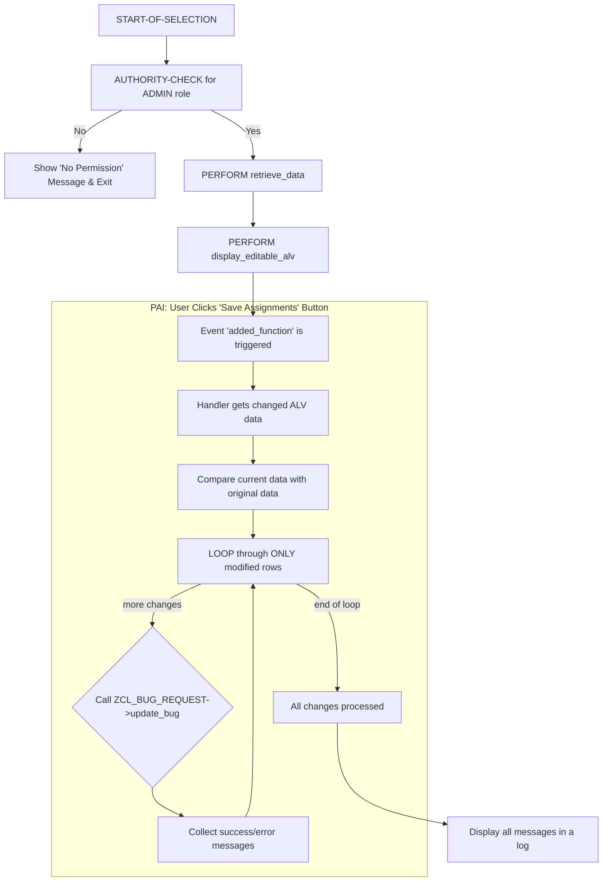

# ABAP Program: ZRPG_ZBUG_ASSIGN

This file contains the ABAP source code for the manual bug assignment program, intended for Lead Developers.
**[FIXED]** The save logic has been corrected to use a custom toolbar button and to process only modified rows.

---

### Program Flow

This program allows a user with ADMIN rights to view a list of bugs and change the `ASSIGNED_TO` field.



---

````abap
REPORT zrpg_zbug_assign.

*&---------------------------------------------------------------------*
*& Global Data
*&---------------------------------------------------------------------*
" This display structure includes an editable 'ASSIGNED_TO' field.
TYPES: BEGIN OF tys_assign_display,
         bug_id      TYPE zbug_bug_id,
         bug_title   TYPE zbug_title,
         status      TYPE zbug_status,
         reporter_id TYPE syuname,
         assigned_to TYPE syuname,
         style       TYPE lvc_t_styl, " For making cells editable
       END OF tys_assign_display.

DATA: gt_assign_display      TYPE TABLE OF tys_assign_display,
      gt_assign_display_orig LIKE gt_assign_display, " For comparing changes
      go_alv                 TYPE REF TO cl_salv_table.


*&---------------------------------------------------------------------*
*& Selection Screen
*&---------------------------------------------------------------------*
" Allow selection of bugs that are in an open state
SELECT-OPTIONS:
  so_id   FOR zbug_header-bug_id,
  so_stat FOR zbug_header-status DEFAULT 'N', 'A', 'I'.


*&---------------------------------------------------------------------*
*& Main Program Flow
*&---------------------------------------------------------------------*
INITIALIZATION.
  " Initial authority check. If the user is not an admin, they cannot even run this report.
  AUTHORITY-CHECK OBJECT 'Z_BUG_AUTH'
    ID 'ACTVT'     FIELD '02' " Change
    ID 'ZBUG_ROLE' FIELD 'ADMIN'.
  IF sy-subrc <> 0.
    MESSAGE 'You do not have administrative permissions to run this program.' TYPE 'E'.
    LEAVE PROGRAM.
  ENDIF.

START-OF-SELECTION.
  PERFORM retrieve_data.
  IF gt_assign_display IS NOT INITIAL.
    PERFORM display_editable_alv.
  ENDIF.

*&---------------------------------------------------------------------*
*&      Form  RETRIEVE_DATA
*&---------------------------------------------------------------------*
FORM retrieve_data.
  SELECT bug_id, bug_title, status, reporter_id, assigned_to
    FROM zbug_header
    WHERE bug_id IN so_id
      AND status IN so_stat
    INTO TABLE @DATA(lt_bugs).

  IF lt_bugs IS INITIAL.
    MESSAGE 'No open bugs found for selection.' TYPE 'S'.
    RETURN.
  ENDIF.

  " Prepare data for editable ALV
  LOOP AT lt_bugs INTO DATA(ls_bug).
      DATA ls_display TYPE tys_assign_display.
      ls_display = CORRESPONDING #( ls_bug ).

      " Make the 'ASSIGNED_TO' cell editable
      APPEND VALUE #( fieldname = 'ASSIGNED_TO' style = cl_gui_alv_grid=>mc_style_enabled ) TO ls_display-style.

      APPEND ls_display TO gt_assign_display.
  ENDLOOP.
  
  " Create a backup of the original data to compare against for changes
  gt_assign_display_orig = gt_assign_display.

ENDFORM.

*&---------------------------------------------------------------------*
*&      Form  DISPLAY_EDITABLE_ALV
*&---------------------------------------------------------------------*
FORM display_editable_alv.
  TRY.
      cl_salv_table=>factory(
        IMPORTING r_salv_table = go_alv
        CHANGING  t_table      = gt_assign_display ).
    CATCH cx_salv_msg.
      RETURN.
  ENDTRY.

  " --- Setup Functions ---
  DATA(lo_functions) = go_alv->get_functions( ).
  lo_functions->set_all( abap_true ).
  " Deactivate the standard, problematic save button
  lo_functions->set_save( abap_false ).
  " Add our own custom save button
  lo_functions->add_function( name = 'SAVE_ASSIGN' icon = '@42@' text = 'Save Assignments' tooltip = 'Save Changes' position = if_salv_c_function_position=>left_of_standard ).

  " --- Setup Layout ---
  go_alv->get_layout( )->set_key( VALUE #( report = sy-repid ) ).
  go_alv->get_layout( )->set_save_restriction( if_salv_c_layout=>restrict_none ).

  " --- Setup Editable Columns ---
  DATA(lo_columns) = go_alv->get_columns( ).
  lo_columns->set_optimize( abap_true ).
  " Set the 'ASSIGNED_TO' column to be editable
  lo_columns->get_column( 'ASSIGNED_TO' )->set_edit( abap_true ).
  " Use the style column to control which cells are editable at runtime
  lo_columns->set_style_column( 'STYLE' ).

  " --- Register Event Handlers ---
  DATA: lo_events TYPE REF TO cl_salv_events_table.
  lo_events = go_alv->get_event( ).

  DATA: lo_event_handler TYPE REF TO lcl_event_handler.
  CREATE OBJECT lo_event_handler.
  " Set the handler for our custom button ('added_function' is the correct event for this)
  SET HANDLER lo_event_handler->on_user_command FOR lo_events.

  go_alv->display( ).
ENDFORM.

*&---------------------------------------------------------------------*
*& Local Class for Event Handling
*&---------------------------------------------------------------------*
CLASS lcl_event_handler DEFINITION FINAL.
  PUBLIC SECTION.
    METHODS on_user_command
      FOR EVENT added_function OF cl_salv_events
      IMPORTING
        e_salv_function.
ENDCLASS.

CLASS lcl_event_handler IMPLEMENTATION.
  METHOD on_user_command.
    " Check if the user clicked our custom save button
    IF e_salv_function = 'SAVE_ASSIGN'.
      DATA lt_all_messages TYPE bapiret2_t.

      " This refreshes the ALV internal data with changes made by the user
      go_alv->get_alv_grid( )->check_changed_data( ).
      
      " Loop through the current data and compare with the original
      LOOP AT gt_assign_display INTO DATA(ls_display) WHERE assigned_to IS NOT INITIAL.
        READ TABLE gt_assign_display_orig INTO DATA(ls_orig) WITH KEY bug_id = ls_display-bug_id.
        
        " PROCESS ONLY IF THE 'ASSIGNED_TO' FIELD WAS ACTUALLY CHANGED
        IF sy-subrc = 0 AND ls_display-assigned_to <> ls_orig-assigned_to.
          
          DATA ls_update_data TYPE zst_bug_data.
          ls_update_data-assigned_to = ls_display-assigned_to.
          
          " Call the UPDATE method of the main class.
          " This requires UPDATE_BUG to be fully implemented.
          zcl_bug_request=>get_instance( )->update_bug(
            EXPORTING
              iv_bug_id     = ls_display-bug_id
              is_bug_data = ls_update_data
            IMPORTING
              et_messages = DATA(lt_messages)
          ).
          
          " Collect all messages instead of displaying them one by one
          APPEND LINES OF lt_messages TO lt_all_messages.
        ENDIF.
      ENDLOOP.
      
      " After processing all changes, display a log of what happened
      IF lt_all_messages IS NOT INITIAL.
        " TODO: Display messages in a popup log for better UX
        LOOP AT lt_all_messages INTO DATA(ls_msg).
           MESSAGE ls_msg-message TYPE ls_msg-type.
        ENDLOOP.
      ELSE.
        MESSAGE 'No changes were made or saved.' TYPE 'S'.
      ENDIF.
      
      " Refresh the ALV display to show any changes and clear modification logs
      go_alv->refresh( ).
    ENDIF.
  ENDMETHOD.
ENDCLASS.
````
