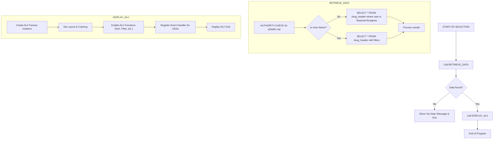

# ABAP Program: ZRPG_ZBUG_LIST

This file contains the ABAP source code for the main ALV list report. This report serves as the main entry point for users to view and interact with bugs.

---

### Program Execution Flow

This flowchart illustrates the main execution path of the report from start to finish.



---

````abap
REPORT zrpg_zbug_list.

*&---------------------------------------------------------------------*
*& Global Data
*&---------------------------------------------------------------------*
" This structure is used for the final ALV display. It includes a
" 'line_color' field which is a special ALV technique to color rows.
TYPES: BEGIN OF tys_bug_list_display,
         bug_id      TYPE zbug_bug_id,
         bug_title   TYPE zbug_title,
         bug_type    TYPE zbug_type,
         priority    TYPE zbug_priority,
         status      TYPE zbug_status,
         reporter_id TYPE syuname,
         assigned_to TYPE syuname,
         created_date TYPE datum,
         line_color  TYPE lvc_t_scol, " For row/cell coloring
       END OF tys_bug_list_display.

DATA: gt_bugs_display TYPE TABLE OF tys_bug_list_display.

*&---------------------------------------------------------------------*
*& Selection Screen
*&---------------------------------------------------------------------*
" SELECT-OPTIONS provide a flexible range-based selection for users
" on the report's entry screen.
SELECT-OPTIONS:
  so_stat FOR zbug_header-status,
  so_type FOR zbug_header-bug_type,
  so_prio FOR zbug_header-priority,
  so_rep  FOR zbug_header-reporter_id,
  so_asgn FOR zbug_header-assigned_to,
  so_crdt FOR zbug_header-created_date.


*&---------------------------------------------------------------------*
*& Main Program Flow
*&---------------------------------------------------------------------*
START-OF-SELECTION.
  PERFORM retrieve_data.
  IF gt_bugs_display IS NOT INITIAL.
    PERFORM display_alv.
  ENDIF.


*&---------------------------------------------------------------------*
*&      Form  RETRIEVE_DATA
*&---------------------------------------------------------------------*
FORM retrieve_data.
  DATA: lt_bugs TYPE TABLE OF zbug_header.

  " This is a critical security check. It determines if the user has ADMIN
  " privileges. The result dictates which SELECT statement is executed.
  AUTHORITY-CHECK OBJECT 'Z_BUG_AUTH'
    ID 'ACTVT'     FIELD '03' " Display
    ID 'ZBUG_ROLE' FIELD 'ADMIN'.

  IF sy-subrc = 0.
    " If user is an ADMIN, they can see all bugs that match the filters.
    SELECT * FROM zbug_header
      INTO TABLE lt_bugs
      WHERE status IN so_stat
        AND bug_type IN so_type
        AND priority IN so_prio
        AND reporter_id IN so_rep
        AND assigned_to IN so_asgn
        AND created_date IN so_crdt.
  ELSE.
    " If not an ADMIN, the user can only see bugs they reported OR are assigned to.
    " This ensures data segregation between users.
    SELECT * FROM zbug_header
      INTO TABLE lt_bugs
      WHERE ( reporter_id = @sy-uname OR assigned_to = @sy-uname )
        AND status IN so_stat
        AND bug_type IN so_type
        AND priority IN so_prio
        AND reporter_id IN so_rep
        AND assigned_to IN so_asgn
        AND created_date IN so_crdt.
  ENDIF.

  IF lt_bugs IS INITIAL.
    MESSAGE 'No data found for the given selection.' TYPE 'S'.
    RETURN.
  ENDIF.

  " Prepare data for ALV display, including special properties like colors.
  LOOP AT lt_bugs INTO DATA(ls_bug).
    DATA ls_display TYPE tys_bug_list_display.
    ls_display = CORRESPONDING #( ls_bug ).

    " Add cell coloring logic. The LVC_T_SCOL structure allows us to
    " color individual cells. We add an entry for each cell we want to color.
    CASE ls_bug-priority.
      WHEN 'C'. " Critical -> Red
        APPEND VALUE #( fname = 'PRIORITY' color-col = 5 color-int = 1 ) TO ls_display-line_color.
      WHEN 'H'. " High -> Yellow
        APPEND VALUE #( fname = 'PRIORITY' color-col = 6 color-int = 1 ) TO ls_display-line_color.
    ENDCASE.
    
    CASE ls_bug-status.
        WHEN 'F'. "Fixed -> Green
            APPEND VALUE #( fname = 'STATUS' color-col = 3 color-int = 1 ) TO ls_display-line_color.
    ENDCASE.

    APPEND ls_display TO gt_bugs_display.
  ENDLOOP.

ENDFORM.


*&---------------------------------------------------------------------*
*&      Form  DISPLAY_ALV
*&---------------------------------------------------------------------*
FORM display_alv.
  DATA: lo_alv TYPE REF TO cl_salv_table.

  TRY.
      " The SALV factory method is the modern way to create an ALV grid.
      cl_salv_table=>factory(
        IMPORTING r_salv_table = lo_alv
        CHANGING  t_table      = gt_bugs_display ).
    CATCH cx_salv_msg.
      MESSAGE 'ALV factory creation failed.' TYPE 'E'.
      RETURN.
  ENDTRY.

  " --- Configure ALV Appearance and Behavior ---

  " Set layout properties. This allows users to save their own variants.
  DATA(lo_layout) = lo_alv->get_layout( ).
  lo_layout->set_key( VALUE #( report = sy-repid ) ).
  lo_layout->set_save_restriction( if_salv_c_layout=>restrict_none ).
  " Tell the ALV which column holds the color information.
  lo_layout->set_color_column( 'LINE_COLOR' ).

  " Enable standard ALV functions like sorting, filtering, exporting, etc.
  lo_alv->get_functions( )->set_all( abap_true ).

  " Set the report header text.
  lo_alv->get_display_settings( )->set_list_header( 'Bug List Report' ).
  
  " Make the BUG_ID column a "hotspot" (clickable link).
  DATA(lo_columns) = lo_alv->get_columns( ).
  TRY.
    DATA(lo_column_id) = CAST cl_salv_column_table( lo_columns->get_column( 'BUG_ID' ) ).
    lo_column_id->set_cell_type( if_salv_c_cell_type=>hotspot ).
  CATCH cx_salv_not_found. " Ignore if column not found
  ENDTRY.

  " --- Register Event Handlers ---
  " This is how we react to user interactions like clicks.
  DATA: lo_events TYPE REF TO cl_salv_events_table.
  lo_events = lo_alv->get_event( ).

  DATA: lo_event_handler TYPE REF TO lcl_event_handler.
  CREATE OBJECT lo_event_handler.
  " Link our local handler class's method to the ALV's double_click event.
  SET HANDLER lo_event_handler->on_double_click FOR lo_events.

  " Finally, display the ALV grid.
  lo_alv->display( ).

ENDFORM.

*&---------------------------------------------------------------------*
*& Local Class for Event Handling
*&---------------------------------------------------------------------*
CLASS lcl_event_handler DEFINITION FINAL.
  PUBLIC SECTION.
    " This method will be executed when a hotspot is clicked.
    METHODS on_double_click
      FOR EVENT double_click OF cl_salv_events_table
      IMPORTING
        row
        column.
ENDCLASS.

CLASS lcl_event_handler IMPLEMENTATION.
  METHOD on_double_click.
    " User double-clicked on a row.
    " Find the data for the row that was clicked.
    READ TABLE gt_bugs_display INDEX row INTO DATA(ls_clicked_bug).
    IF sy-subrc = 0.
      " TODO: Implement drill-down logic. A real application would
      " call a transaction or another screen to show bug details.
      " Example: SET PARAMETER ID 'ZBUG_ID' FIELD ls_clicked_bug-bug_id.
      "          CALL TRANSACTION 'ZBUG_DETAIL'.
      MESSAGE |You clicked on Bug ID: { ls_clicked_bug-bug_id }| TYPE 'I'.
    ENDIF.
  ENDMETHOD.
ENDCLASS.
````
