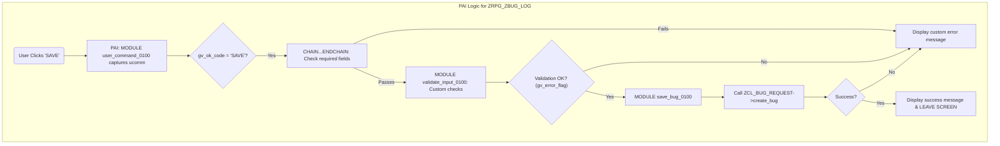

# ABAP Program: ZRPG_ZBUG_LOG

This file contains the ABAP source code for the bug logging screen program. This program is the primary interface for users to create new bug reports.

---

### Screen PAI Logic Flowchart

This diagram illustrates the logic flow in the Process After Input (PAI) event of screen 100, specifically when the user clicks the 'SAVE' button.



---

````abap
REPORT zrpg_zbug_log.

TABLES: sscrfields. "Needed for screen field processing

*&---------------------------------------------------------------------*
*& Global Data
*&---------------------------------------------------------------------*
DATA:
  gv_ok_code      TYPE sy-ucomm,
  gv_first_run    TYPE abap_bool VALUE abap_true, "Flag to run PBO setup only once
  gv_error_flag   TYPE abap_bool, "Flag to check for validation errors
  gt_priority_values TYPE TABLE OF vrm_value, "Table for priority dropdown
  gt_type_values     TYPE TABLE OF vrm_value. "Table for type dropdown

*&---------------------------------------------------------------------*
*& Selection Screen (Can be used for direct T-code parameter passing)
*&---------------------------------------------------------------------*
" Although we call a screen, having a selection-screen can be useful
" for testing or for future enhancements.
SELECTION-SCREEN BEGIN OF BLOCK b1 WITH FRAME TITLE TEXT-001.
PARAMETERS:
  p_title  TYPE zbug_title,
  p_descr  TYPE zbug_description,
  p_type   TYPE zbug_type,
  p_pri    TYPE zbug_priority.
SELECTION-SCREEN END OF BLOCK b1.


*&---------------------------------------------------------------------*
*& Main Program Flow
*&---------------------------------------------------------------------*
INITIALIZATION.
  " This event is for setting default values on the selection screen.

START-OF-SELECTION.
  " Main entry point of the program. It simply calls the main screen.
  CALL SCREEN 100.


*&---------------------------------------------------------------------*
*&      Module  STATUS_0100  OUTPUT
*&---------------------------------------------------------------------*
MODULE status_0100 OUTPUT.
  " PBO (Process Before Output) module. Runs before the screen is displayed.
  
  " Set the GUI Status (for toolbar buttons) and Title for screen 100.
  SET PF-STATUS 'ZBUG_LOG_100'.
  SET TITLEBAR 'TITLE_100' WITH 'Log a New Bug Report'.

  " This logic runs only the first time PBO is processed to avoid
  " re-populating dropdowns on every user interaction (e.g., on error).
  IF gv_first_run = abap_true.
    " Use a standard function module to get the fixed values and texts
    " from the corresponding data domain to populate dropdown lists.
    " This avoids hard-coding and respects language settings.
    CALL FUNCTION 'VRM_SET_VALUES'
      EXPORTING
        id     = 'P_PRI' " Name of the screen field for Priority
        values = zcl_bug_utilities=>get_domain_values( 'ZBUG_PRIORITY' ).
    CALL FUNCTION 'VRM_SET_VALUES'
      EXPORTING
        id     = 'P_TYPE' " Name of the screen field for Type
        values = zcl_bug_utilities=>get_domain_values( 'ZBUG_TYPE' ).

    CLEAR gv_first_run.
  ENDIF.
ENDMODULE.


*&---------------------------------------------------------------------*
*&      Module  USER_COMMAND_0100  INPUT
*&---------------------------------------------------------------------*
MODULE user_command_0100 INPUT.
  " PAI: This module captures the user's action (e.g., button click).
  gv_ok_code = sy-ucomm.

  CASE gv_ok_code.
    WHEN 'BACK' OR 'EXIT' OR 'CANCEL'.
      LEAVE TO SCREEN 0. " Exit the program/transaction
    WHEN 'CLEAR'.
      " Clear all input fields on the screen
      CLEAR: p_title, p_descr, p_type, p_pri.
  ENDCASE.
ENDMODULE.


*&---------------------------------------------------------------------*
*&      Module  VALIDATE_INPUT_0100  INPUT
*&---------------------------------------------------------------------*
MODULE validate_input_0100 INPUT.
  " PAI: This module is called within a CHAIN...ENDCHAIN block, which
  " already ensures that the fields are not empty.
  CLEAR gv_error_flag.

  " Here you can add more complex business logic validations.
  IF strlen( p_descr ) < 10.
    MESSAGE 'Bug Description must be at least 10 characters long.' TYPE 'E'.
    gv_error_flag = abap_true; " Set error flag to prevent saving
  ENDIF.
ENDMODULE.


*&---------------------------------------------------------------------*
*&      Module  SAVE_BUG_0100  INPUT
*&---------------------------------------------------------------------*
MODULE save_bug_0100 INPUT.
  " PAI: This module handles the final save logic.
  
  " Only proceed if no validation errors were found in previous steps.
  CHECK gv_error_flag = abap_false.

  " 1. Prepare Data: Collect data from screen fields into the structure
  "    that the backend class method expects.
  DATA ls_bug_data TYPE zst_bug_data.
  ls_bug_data-bug_title       = p_title.
  ls_bug_data-bug_description = p_descr.
  ls_bug_data-bug_type        = p_type.
  ls_bug_data-priority        = p_pri.

  " 2. Call Backend Class to Create the Bug
  DATA: lv_bug_id   TYPE zbug_bug_id,
        lt_messages TYPE bapiret2_t.

  TRY.
      zcl_bug_request=>get_instance( )->create_bug(
        EXPORTING
          is_bug_data = ls_bug_data
        IMPORTING
          ev_bug_id   = lv_bug_id
          et_messages = lt_messages
      ).
    CATCH cx_root INTO DATA(lx_root).
      MESSAGE lx_root->get_text( ) TYPE 'E'.
      RETURN.
  ENDTRY.

  " 3. Process Return Messages from the backend class.
  LOOP AT lt_messages INTO DATA(ls_message).
    MESSAGE ID ls_message-id
            TYPE ls_message-type
            NUMBER ls_message-number
            WITH ls_message-message_v1 ls_message-message_v2
                 ls_message-message_v3 ls_message-message_v4.

    " If the message type is 'S' (Success), it means the bug was created,
    " so we can exit the screen.
    IF ls_message-type = 'S'.
      LEAVE TO SCREEN 0.
    ENDIF.
  ENDLOOP.
ENDMODULE.

" ******************************************************************
" * Example Screen 100 Flow Logic (To be defined in SE51)
" ******************************************************************
" PROCESS BEFORE OUTPUT.
"   MODULE status_0100.
"
" PROCESS AFTER INPUT.
"   MODULE user_command_0100.
"
"   CHAIN.
"     FIELD p_title.
"     FIELD p_descr.
"     MODULE validate_input_0100 ON CHAIN-REQUEST.
"   ENDCHAIN.
"
"   IF gv_ok_code = 'SAVE'.
"     MODULE save_bug_0100.
"   ENDIF.
" ******************************************************************
````
