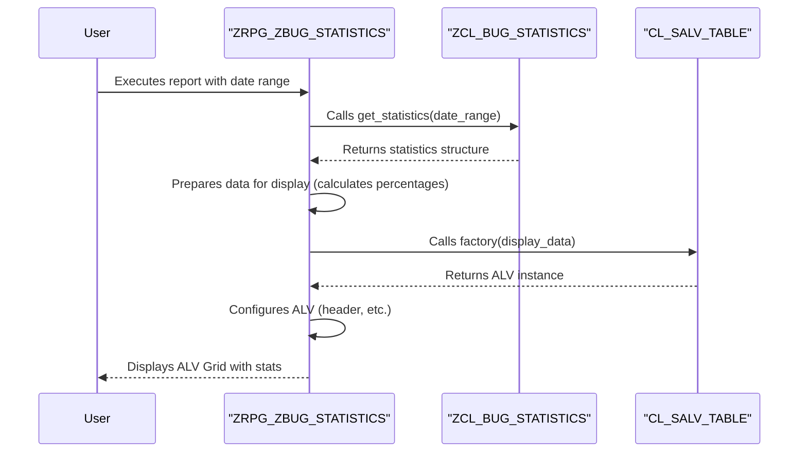

# ABAP Program: ZRPG_ZBUG_STATISTICS

This file contains the ABAP source code for the bug statistics report. This program is responsible for gathering user input (a date range) and displaying the statistical summary in an ALV grid.

---

### Program Interaction Flow

This sequence diagram shows how the report program interacts with the statistics utility class to get and display data.



---

````abap
REPORT zrpg_zbug_statistics.

*&---------------------------------------------------------------------*
*& Global Data
*&---------------------------------------------------------------------*
" This structure is specifically for the ALV display table.
TYPES: BEGIN OF tys_stats_display,
         category TYPE string,
         count    TYPE i,
         percent  TYPE p DECIMALS 2,
       END OF tys_stats_display.

DATA: gt_stats_display TYPE TABLE OF tys_stats_display.

*&---------------------------------------------------------------------*
*& Selection Screen
*&---------------------------------------------------------------------*
" Define a date range for the user to select the reporting period.
" It is mandatory and defaults to the current date.
SELECT-OPTIONS:
  so_crdt FOR zbug_header-created_date OBLIGATORY DEFAULT sy-datum.


*&---------------------------------------------------------------------*
*& Main Program Flow
*&---------------------------------------------------------------------*
START-OF-SELECTION.
  PERFORM get_and_prepare_stats.
  IF gt_stats_display IS NOT INITIAL.
    PERFORM display_stats_alv.
  ENDIF.

*&---------------------------------------------------------------------*
*&      Form  GET_AND_PREPARE_STATS
*&---------------------------------------------------------------------*
FORM get_and_prepare_stats.
  " 1. Call the statistics class to do the heavy lifting of data aggregation.
  " This separates the presentation logic (in this report) from the business logic.
  DATA(ls_stats) = zcl_bug_statistics=>get_statistics(
    iv_date_from = so_crdt-low  " Pass the low end of the date range
    iv_date_to   = so_crdt-high " Pass the high end of the date range
  ).

  " If the class returns no bugs, inform the user and exit.
  IF ls_stats-total_bugs = 0.
    MESSAGE 'No bugs found in the selected period.' TYPE 'S'.
    RETURN.
  ENDIF.

  " 2. Prepare the aggregated data for a user-friendly ALV display.
  " We convert the structure into a table format.
  APPEND VALUE #( category = 'Total Bugs' count = ls_stats-total_bugs ) TO gt_stats_display.
  APPEND VALUE #( category = 'Pending (New)' count = ls_stats-pending_bugs ) TO gt_stats_display.
  APPEND VALUE #( category = 'Waiting (Assigned/In Progress)' count = ls_stats-waiting_bugs ) TO gt_stats_display.
  APPEND VALUE #( category = 'Fixed' count = ls_stats-fixed_bugs ) TO gt_stats_display.

  " 3. Perform final calculations, like percentages.
  LOOP AT gt_stats_display INTO DATA(ls_display).
    IF ls_stats-total_bugs > 0 AND ls_display-category <> 'Total Bugs'.
      ls_display-percent = ( ls_display-count / ls_stats-total_bugs ) * 100.
      MODIFY gt_stats_display FROM ls_display.
    ENDIF.
  ENDLOOP.

ENDFORM.

*&---------------------------------------------------------------------*
*&      Form  DISPLAY_STATS_ALV
*&---------------------------------------------------------------------*
FORM display_stats_alv.
  DATA: lo_alv TYPE REF TO cl_salv_table.

  " Create the ALV instance.
  TRY.
      cl_salv_table=>factory(
        IMPORTING r_salv_table = lo_alv
        CHANGING  t_table      = gt_stats_display ).
    CATCH cx_salv_msg.
      MESSAGE 'Error creating ALV display.' TYPE 'E'.
      RETURN.
  ENDTRY.
  
  " Enable standard functions like export, sort, etc.
  lo_alv->get_functions( )->set_all( abap_true ).
  
  " Set a dynamic header for the report.
  lo_alv->get_display_settings( )->set_list_header( |Bug Statistics for Period: { so_crdt-low } - { so_crdt-high }| ).
  
  " Display the final grid.
  lo_alv->display( ).

ENDFORM.
````
