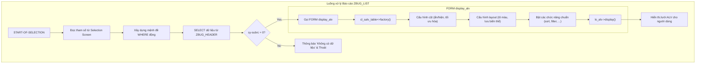

# Đặc tả Chi tiết: Báo cáo ALV ZBUG_LIST

**Tài liệu này bổ sung cho `Phase2_Development.md`**

---

## 1. Tổng quan

Tài liệu này cung cấp các đặc tả kỹ thuật để triển khai báo cáo danh sách lỗi (`ZBUG_LIST`) sử dụng `CL_SALV_TABLE`. Nó bao gồm các chi tiết về truy vấn dữ liệu, xây dựng Field Catalog, và các tùy chỉnh giao diện như tô màu các dòng.

---

## 2. Truy vấn Dữ liệu (Data Retrieval)

Logic này nên được đặt trong sự kiện `START-OF-SELECTION`.

```abap
START-OF-SELECTION.
  DATA lt_bugs TYPE ztt_bug_list. " Internal table có cấu trúc của danh sách bug

  " Xây dựng mệnh đề WHERE động dựa trên các tham số từ selection screen (p_status, p_type, etc.)
  DATA lt_range_status TYPE RANGE OF zbug_status.
  " ... điền vào các bảng range khác ...

  " Thêm các giá trị từ selection-screen vào bảng range
  IF p_status IS NOT INITIAL.
    APPEND VALUE #( sign = 'I' option = 'EQ' low = p_status ) TO lt_range_status.
  ENDIF.
  " ... làm tương tự cho các bộ lọc khác ...

  " Truy vấn dữ liệu từ CSDL
  SELECT
    bug_id,
    bug_title,
    bug_type,
    priority,
    status,
    reporter_id,
    assigned_to,
    created_date,
    fixed_date
  FROM zbug_header
  WHERE
    status IN lt_range_status AND
    bug_type IN lt_range_type AND
    " ... các điều kiện khác ...
  INTO TABLE @lt_bugs.

  IF sy-subrc <> 0.
    MESSAGE 'Không tìm thấy dữ liệu phù hợp.' TYPE 'I'.
    RETURN.
  ENDIF.

  " Gọi phương thức hiển thị ALV
  display_alv( CHANGING ct_bugs = lt_bugs ).
```

---

## 3. Hiển thị ALV

Phương thức `display_alv` sẽ chịu trách nhiệm cấu hình và hiển thị lưới ALV.

```abap
FORM display_alv CHANGING ct_bugs TYPE ztt_bug_list.
  DATA: lo_alv TYPE REF TO cl_salv_table.

  " 1. Tạo đối tượng ALV
  " =====================
  TRY.
      cl_salv_table=>factory(
        IMPORTING
          r_salv_table = lo_alv
        CHANGING
          t_table      = ct_bugs
      ).
    CATCH cx_salv_msg.
      MESSAGE 'Lỗi khởi tạo ALV.' TYPE 'E'.
      RETURN.
  ENDTRY.

  " 2. Cấu hình Cột (Columns)
  " ========================
  DATA(lo_columns) = lo_alv->get_columns( ).
  
  " Tối ưu hóa tất cả các cột
  lo_columns->set_optimize( abap_true ).

  " Ẩn các cột kỹ thuật hoặc không cần thiết mặc định
  TRY.
      lo_columns->get_column( 'FIXED_DATE' )->set_technical( abap_true ).
    CATCH cx_salv_not_found. " Bỏ qua nếu cột không tồn tại
  ENDTRY.
  
  " 3. Cấu hình Bố cục (Layout) và Tô màu
  " ========================================
  DATA(lo_layout) = lo_alv->get_layout( ).
  
  " Đặt key cho layout để người dùng có thể lưu biến thể
  lo_layout->set_key( VALUE #( report = sy-repid ) ).
  lo_layout->set_save_restriction( if_salv_c_layout=>restrict_none ).

  " Logic tô màu cho các dòng dựa trên độ ưu tiên (Priority)
  DATA ls_color TYPE lvc_s_laci.
  ls_color-color-col = '6'. " Màu Vàng cho 'High'
  ls_color-color-int = '1'.
  lo_columns->get_column( 'PRIORITY' )->set_color( ls_color ).
  " Tương tự, set màu Đỏ (col 5) cho 'Critical', Xanh lá (col 4) cho 'Low'

  " Logic tô màu cho cột Status
  ls_color-color-col = '4'. " Màu Xanh cho 'Fixed'
  lo_columns->get_column( 'STATUS' )->set_color( ls_color ).

  " 4. Cấu hình Chức năng (Functions)
  " ===================================
  " Bật tất cả các chức năng chuẩn như Sắp xếp, Lọc, Xuất Excel...
  lo_alv->get_functions( )->set_all( abap_true ).
  
  " 5. Đặt tiêu đề cho báo cáo
  " ===========================
  lo_alv->get_display_settings( )->set_list_header( 'Danh sách Lỗi (Bug List)' ).

  " 6. Hiển thị ALV
  " ===============
  lo_alv->display( ).

ENDFORM.
```

### Logic Tô màu Dòng (Row Coloring)

Để tô màu cho cả dòng thay vì chỉ một cột, bạn cần lặp qua dữ liệu và set màu cho từng dòng. Đây là một kỹ thuật nâng cao hơn.

```abap
" Để tô màu cho cả dòng, bạn cần một cột màu trong internal table
TYPES: BEGIN OF zst_bug_list_display,
         " ... bao gồm tất cả các trường từ zst_bug_list ...
         line_color(4) TYPE c, " Cột để chứa mã màu
       END OF zst_bug_list_display.
DATA lt_display TYPE STANDARD TABLE OF zst_bug_list_display.

" Sau khi truy vấn dữ liệu, lặp qua và điền màu
LOOP AT lt_bugs INTO DATA(ls_bug).
  DATA ls_display TYPE zst_bug_list_display.
  ls_display = CORRESPONDING #( ls_bug ).
  
  CASE ls_bug-priority.
    WHEN 'C'. " Critical
      ls_display-line_color = 'C510'. " Nền Đỏ
    WHEN 'H'. " High
      ls_display-line_color = 'C610'. " Nền Vàng
  ENDCASE.
  
  APPEND ls_display TO lt_display.
ENDLOOP.

" Khi cấu hình layout ALV
DATA(lo_layout) = lo_alv->get_layout( ).
lo_layout->set_color_fieldname( 'LINE_COLOR' ). " Báo cho ALV cột nào chứa thông tin màu
```

---

## 4. Luồng Xử lý Báo cáo

Sơ đồ này tóm tắt luồng xử lý của báo cáo `ZBUG_LIST` từ lúc bắt đầu cho đến khi hiển thị kết quả.


