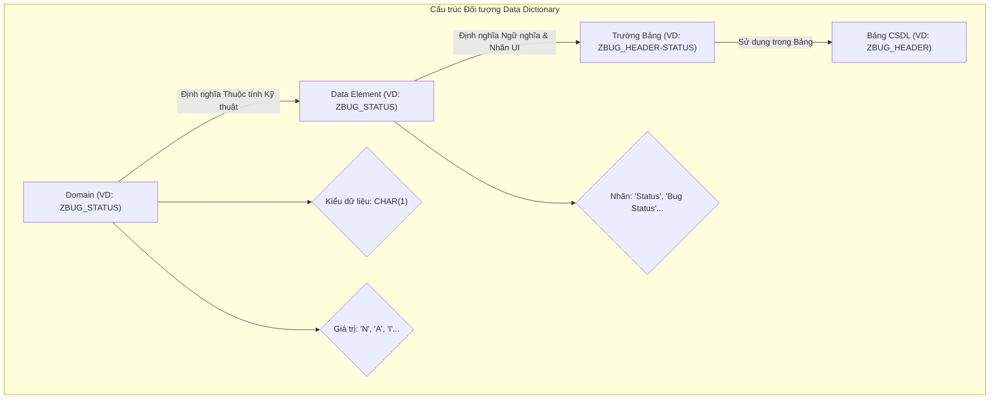

# Đặc tả Chi tiết: Data Dictionary

**Tài liệu này bổ sung cho `Phase1_Requirements_Design.md`**

---

## 1. Tổng quan

Tài liệu này cung cấp các thuộc tính chi tiết cho các Domain và Data Element (DE) tùy chỉnh được sử dụng trong dự án ZBUG. Việc định nghĩa rõ ràng các đối tượng này là rất quan trọng để đảm bảo tính nhất quán trên toàn bộ giao diện người dùng (UI) và logic ứng dụng.

---

## 2. Định nghĩa Domain

Đây là các giá trị cốt lõi và các thuộc tính kỹ thuật.

### Domain: `ZBUG_STATUS`
- **Mô tả**: Trạng thái của một Bug
- **Kiểu dữ liệu**: `CHAR`, dài `1`
- **Tab "Value Range" (Giá trị cố định)**:
  | Giá trị | Mô tả ngắn |
  | :--- | :--- |
  | `N` | New |
  | `A` | Assigned |
  | `I` | In Progress |
  | `F` | Fixed |
  | `R` | Rejected |
  | `C` | Closed |

### Domain: `ZBUG_PRIORITY`
- **Mô tả**: Mức độ ưu tiên của một Bug
- **Kiểu dữ liệu**: `CHAR`, dài `1`
- **Tab "Value Range" (Giá trị cố định)**:
  | Giá trị | Mô tả ngắn |
  | :--- | :--- |
  | `L` | Low |
  | `M` | Medium |
  | `H` | High |
  | `C` | Critical |

### Domain: `ZBUG_TYPE`
- **Mô tả**: Phân loại của một Bug
- **Kiểu dữ liệu**: `CHAR`, dài `4`
- **Tab "Value Range" (Giá trị cố định)**:
  | Giá trị | Mô tả ngắn |
  | :--- | :--- |
  | `FUNC` | Functional |
  | `PERF` | Performance |
  | `SECU` | Security |
  | `UIUX` | UI/UX |
  | `INTE` | Integration |

---

## 3. Định nghĩa Data Element (DE)

Đây là các định nghĩa ngữ nghĩa và nhãn UI cho các trường.

### DE: `ZBUG_BUG_ID`
- **Mô tả**: ID duy nhất của Bug
- **Domain**: `ZBUG_BUG_ID` (CHAR 10)
- **Tab "Field Label" (Nhãn)**:
  | Độ dài | Nhãn |
  | :--- | :--- |
  | Short | Bug ID |
  | Medium | Bug ID |
  | Long | Bug Identification |
  | Heading | Bug ID |
- **F1 Help**: "ID được hệ thống tự động tạo cho mỗi lỗi (định dạng: BUG-YYYYMMDD-XXX)."

### DE: `ZBUG_TITLE`
- **Mô tả**: Tiêu đề của Bug
- **Domain**: `ZBUG_TITLE` (CHAR 100)
- **Tab "Field Label" (Nhãn)**:
  | Độ dài | Nhãn |
  | :--- | :--- |
  | Short | Title |
  | Medium | Bug Title |
  | Long | Title of the Bug |
  | Heading | Title |
- **F1 Help**: "Nhập một tiêu đề ngắn gọn, súc tích mô tả vấn đề."

### DE: `ZBUG_STATUS`
- **Mô tả**: Trạng thái hiện tại của Bug
- **Domain**: `ZBUG_STATUS` (CHAR 1)
- **Tab "Field Label" (Nhãn)**:
  | Độ dài | Nhãn |
  | :--- | :--- |
  | Short | Status |
  | Medium | Bug Status |
  | Long | Current Status of the Bug |
  | Heading | Status |
- **F1 Help**: "Trạng thái của lỗi trong quy trình xử lý."

### DE: `ZBUG_PRIORITY`
- **Mô tả**: Mức độ ưu tiên của Bug
- **Domain**: `ZBUG_PRIORITY` (CHAR 1)
- **Tab "Field Label" (Nhãn)**:
  | Độ dài | Nhãn |
  | :--- | :--- |
  | Short | Priority |
  | Medium | Bug Priority |
  | Long | Priority Level of the Bug |
  | Heading | Priority |
- **F1 Help**: "Chọn mức độ ưu tiên để xử lý lỗi."

---

## 4. Sơ đồ Cấu trúc Đối tượng

Sơ đồ này minh họa mối quan hệ phân cấp giữa các đối tượng trong Data Dictionary.

