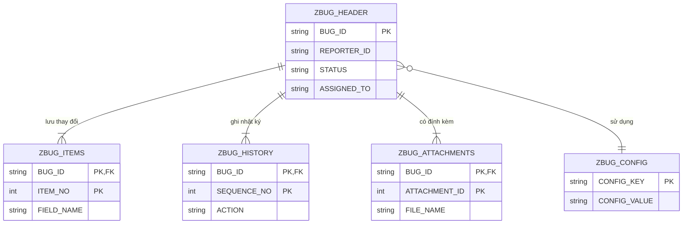

# Đặc tả Chi tiết: Bảng Dữ liệu (Data Tables)

**Tài liệu này bổ sung cho `Phase1_Requirements_Design.md` và `Technical_Architecture.md`**

---

## 1. Tổng quan

Tài liệu này cung cấp định nghĩa chi tiết cho tất cả các bảng cơ sở dữ liệu tùy chỉnh (Z-tables) được sử dụng trong dự án Hệ thống Quản lý Theo dõi Lỗi (ZBUG).

---

## 2. Bảng `ZBUG_HEADER`

**Mô tả**: Bảng chính lưu trữ thông tin cấp cao cho mỗi lỗi được ghi nhận.

| Trường (Field) | Data Element | Khóa (Key) | Mô tả |
| :--- | :--- | :--- | :--- |
| `MANDT` | `MANDT` | X | Client |
| `BUG_ID` | `ZBUG_BUG_ID` | X | ID duy nhất của Lỗi (Khóa chính) |
| `REPORTER_ID` | `SYUNAME` | | ID Người báo cáo |
| `BUG_TITLE` | `ZBUG_TITLE` | | Tiêu đề của Lỗi |
| `BUG_DESCRIPTION`| `ZBUG_DESCRIPTION`| | Mô tả chi tiết Lỗi |
| `BUG_TYPE` | `ZBUG_TYPE` | | Loại Lỗi (FUNC, PERF, etc.) |
| `PRIORITY` | `ZBUG_PRIORITY` | | Độ ưu tiên (L, M, H, C) |
| `STATUS` | `ZBUG_STATUS` | | Trạng thái (N, A, I, F, R, C) |
| `ASSIGNED_TO` | `SYUNAME` | | ID Developer được phân công |
| `CREATED_DATE` | `DATUM` | | Ngày tạo |
| `CREATED_BY` | `SYUNAME` | | Người tạo |
| `CREATED_TIME` | `TIMS` | | Thời gian tạo |
| `FIXED_DATE` | `DATUM` | | Ngày sửa xong |
| `FIXED_TIME` | `TIMS` | | Thời gian sửa xong |
| `CLOSED_DATE` | `DATUM` | | Ngày đóng |
| `CLOSED_TIME` | `TIMS` | | Thời gian đóng |
| `RESOLUTION` | `ZBUG_RESOLUTION` | | Ghi chú giải quyết |
| `REJECTION_REASON`| `ZBUG_REJECTION`| | Lý do từ chối |

**Chỉ mục (Indexes)**:
- **Primary Key**: `MANDT`, `BUG_ID`
- **Secondary Index 1 (`Z01`)**: `STATUS`, `CREATED_DATE` (Để lọc theo trạng thái và ngày)
- **Secondary Index 2 (`Z02`)**: `ASSIGNED_TO`, `STATUS` (Để Developer xem lỗi của mình)
- **Secondary Index 3 (`Z03`)**: `REPORTER_ID`, `CREATED_DATE` (Để Reporter xem lỗi của mình)

---

## 3. Bảng `ZBUG_ITEMS`

**Mô tả**: Lưu trữ lịch sử thay đổi chi tiết của các trường trong một lỗi. Mỗi khi một trường quan trọng trên `ZBUG_HEADER` được cập nhật, một bản ghi sẽ được tạo tại đây.

| Trường (Field) | Data Element | Khóa (Key) | Mô tả |
| :--- | :--- | :--- | :--- |
| `MANDT` | `MANDT` | X | Client |
| `BUG_ID` | `ZBUG_BUG_ID` | X | ID duy nhất của Lỗi (FK) |
| `ITEM_NO` | `NUMC5` | X | Số thứ tự của mục thay đổi |
| `FIELD_NAME` | `ZBUG_FIELD_NAME`| | Tên trường đã thay đổi |
| `OLD_VALUE` | `ZBUG_FIELD_VALUE`| | Giá trị cũ |
| `NEW_VALUE` | `ZBUG_FIELD_VALUE`| | Giá trị mới |
| `CHANGE_DATE` | `DATUM` | | Ngày thay đổi |
| `CHANGE_TIME` | `TIMS` | | Thời gian thay đổi |
| `CHANGE_BY` | `SYUNAME` | | Người thay đổi |

**Khóa ngoại (Foreign Key)**:
- `ZBUG_ITEMS.BUG_ID` tham chiếu đến `ZBUG_HEADER.BUG_ID`.

---

## 4. Bảng `ZBUG_HISTORY`

**Mô tả**: Bảng nhật ký kiểm toán (audit trail), ghi lại tất cả các hành động chính xảy ra trên một lỗi (tạo, thay đổi trạng thái, đóng).

| Trường (Field) | Data Element | Khóa (Key) | Mô tả |
| :--- | :--- | :--- | :--- |
| `MANDT` | `MANDT` | X | Client |
| `BUG_ID` | `ZBUG_BUG_ID` | X | ID duy nhất của Lỗi (FK) |
| `SEQUENCE_NO` | `NUMC5` | X | Số thứ tự của hành động |
| `ACTION` | `ZBUG_ACTION` | | Hành động (CREA, ASSI, UPDA, etc.) |
| `ACTION_DATE` | `DATUM` | | Ngày thực hiện |
| `ACTION_TIME` | `TIMS` | | Thời gian thực hiện |
| `ACTION_BY` | `SYUNAME` | | Người thực hiện |
| `OLD_STATUS` | `ZBUG_STATUS` | | Trạng thái cũ (nếu có) |
| `NEW_STATUS` | `ZBUG_STATUS` | | Trạng thái mới (nếu có) |
| `COMMENTS` | `ZBUG_COMMENTS` | | Ghi chú cho hành động |

**Khóa ngoại (Foreign Key)**:
- `ZBUG_HISTORY.BUG_ID` tham chiếu đến `ZBUG_HEADER.BUG_ID`.

---

## 5. Bảng `ZBUG_CONFIG`

**Mô tả**: Bảng cấu hình hệ thống, lưu trữ các quy tắc nghiệp vụ và tham số có thể thay đổi mà không cần sửa mã nguồn.

| Trường (Field) | Data Element | Khóa (Key) | Mô tả |
| :--- | :--- | :--- | :--- |
| `MANDT` | `MANDT` | X | Client |
| `CONFIG_KEY` | `ZBUG_CONFIG_KEY` | X | Khóa cấu hình (VD: 'BUG_TYPE_FUNC_DEVELOPER') |
| `CONFIG_VALUE` |`ZBUG_CONFIG_VALUE`| | Giá trị cấu hình (VD: 'DEV_TEAM_A') |
| `DESCRIPTION` | `ZBUG_CONFIG_DESC`| | Mô tả về cấu hình |
| `ACTIVE` | `ZBUG_ACTIVE` | | Cờ hoạt động ('X' = Active) |

**Ghi chú**:
- Bảng này nên được quản lý thông qua một giao diện bảo trì bảng (Table Maintenance Generator - T-Code `SM30`) để cho phép quản trị viên cập nhật các quy tắc một cách dễ dàng.

---

## 6. Bảng `ZBUG_ATTACHMENTS`

**Mô tả**: Lưu trữ các tệp tin bằng chứng (ảnh chụp màn hình, logs) được đính kèm vào một lỗi.

| Trường (Field) | Data Element | Khóa (Key) | Mô tả |
| :--- | :--- | :--- | :--- |
| `MANDT` | `MANDT` | X | Client |
| `BUG_ID` | `ZBUG_BUG_ID` | X | ID duy nhất của Lỗi (FK) |
| `ATTACHMENT_ID`| `NUMC5` | X | ID của tệp tin đính kèm |
| `FILE_NAME` | `ZBUG_FILE_NAME` | | Tên tệp gốc |
| `FILE_TYPE` | `ZBUG_FILE_TYPE` | | Loại tệp (MIME type, e.g., 'image/jpeg') |
| `FILE_SIZE` | `INT4` | | Kích thước tệp (bytes) |
| `FILE_CONTENT` | `RAWSTRING` | | Nội dung tệp (dạng nhị phân) |
| `UPLOAD_DATE` | `DATUM` | | Ngày tải lên |
| `UPLOAD_TIME` | `TIMS` | | Thời gian tải lên |
| `UPLOAD_BY` | `SYUNAME` | | Người tải lên |
| `DESCRIPTION` | `ZBUG_ATTACH_DESC`| | Mô tả ngắn về tệp tin |

**Khóa ngoại (Foreign Key)**:
- `ZBUG_ATTACHMENTS.BUG_ID` tham chiếu đến `ZBUG_HEADER.BUG_ID`.

**Ràng buộc (Constraints)**:
- Logic ứng dụng phải kiểm tra `FILE_SIZE` <= 10,485,760 bytes (10MB).
- Logic ứng dụng phải kiểm tra `FILE_TYPE` nằm trong danh sách cho phép (PDF, JPG, PNG, TXT, DOC, DOCX).

---

## 7. Sơ đồ Quan hệ Thực thể (ERD)

Sơ đồ này minh họa mối quan hệ giữa các bảng dữ liệu trong hệ thống ZBUG.

