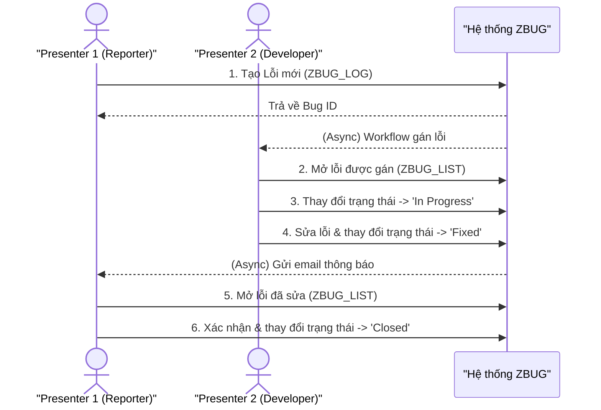

# Đặc tả Chi tiết: Tài liệu và Kịch bản Demo

**Tài liệu này bổ sung cho `Phase4_Documentation_Presentation.md`**

---

## 1. Tổng quan

Tài liệu này cung cấp các khung sườn chi tiết cho các sản phẩm của Giai đoạn 4, bao gồm đề cương cho Hướng dẫn Người dùng (User Manual) và một kịch bản chi tiết cho buổi demo cuối kỳ.

---

## 2. Đề cương Hướng dẫn Người dùng (User Manual Outline)

Dưới đây là một cấu trúc bảng mục lục chi tiết cho tài liệu hướng dẫn người dùng cuối.

### **Hệ thống Quản lý Theo dõi Lỗi (ZBUG) - Hướng dẫn Người dùng**

#### **1. Giới thiệu**
   1.1. Mục đích của Hệ thống ZBUG
   1.2. Đối tượng của tài liệu này (Reporter, Developer)
   1.3. Tổng quan về quy trình xử lý lỗi

#### **2. Bắt đầu**
   2.1. Cách truy cập hệ thống (T-Codes)
   2.2. Tổng quan giao diện chính (Màn hình Danh sách Lỗi - `ZBUG_LIST`)

#### **3. Hướng dẫn cho Người báo cáo (Reporter)**
   3.1. **Cách tạo một Lỗi mới (`ZBUG_LOG`)**
      3.1.1. Điều hướng đến màn hình tạo lỗi.
      3.1.2. Giải thích các trường: Title, Description, Type, Priority.
      3.1.3. Cách đính kèm tệp tin bằng chứng.
      3.1.4. Lưu lỗi và xác nhận.
   3.2. **Theo dõi các Lỗi đã báo cáo**
      3.2.1. Sử dụng bộ lọc trong `ZBUG_LIST` để tìm lỗi của bạn.
      3.2.2. Hiểu các trạng thái khác nhau của lỗi (New, Assigned, Fixed, etc.).
   3.3. **Xác nhận và Đóng một Lỗi đã được sửa (Fixed)**
      3.3.1. Cách kiểm tra một lỗi đã được đánh dấu là "Fixed".
      3.3.2. Quy trình thay đổi trạng thái thành "Closed".

#### **4. Hướng dẫn cho Nhà phát triển (Developer)**
   4.1. **Xem các Lỗi được phân công**
      4.1.1. Cách tìm các lỗi được gán cho bạn trong `ZBUG_LIST`.
   4.2. **Xử lý một Lỗi**
      4.2.1. Thay đổi trạng thái thành "In Progress".
      4.2.2. Thêm bình luận hoặc ghi chú kỹ thuật.
      4.2.3. Tải xuống các tệp tin đính kèm.
   4.3. **Hoàn thành hoặc Từ chối một Lỗi**
      4.3.1. Quy trình thay đổi trạng thái thành "Fixed" và thêm ghi chú giải quyết.
      4.3.2. Quy trình thay đổi trạng thái thành "Rejected" và cung cấp lý do.

#### **5. Câu hỏi Thường gặp (FAQ)**
   - Tôi phải làm gì nếu quên Bug ID?
   - Tại sao tôi không thể chỉnh sửa một lỗi đã được phân công?
   - Giới hạn kích thước tệp tin đính kèm là bao nhiêu?

---

## 3. Kịch bản Demo Chi tiết (Demo Script)

Kịch bản này mô tả một luồng "happy path" hoàn chỉnh để trình bày trong buổi demo cuối kỳ, thể hiện sự tương tác giữa các vai trò khác nhau.

**Diễn viên**:
- **Presenter 1**: Đóng vai Reporter (`TEST_REPORTER_A`)
- **Presenter 2**: Đóng vai Developer (`TEST_DEVELOPER`) và Lead (`TEST_LEAD`)

---

### **Phần 1: Reporter tạo một Lỗi mới** (Thực hiện bởi Presenter 1)

1.  **Đăng nhập**: "Bây giờ, tôi sẽ đăng nhập vào hệ thống với vai trò là một Reporter, người dùng cuối đã phát hiện ra một vấn đề." (Đăng nhập với user `TEST_REPORTER_A`).
2.  **Tạo Lỗi**: "Tôi sẽ bắt đầu bằng cách chạy giao dịch `ZBUG_LOG` để tạo một lỗi mới."
3.  **Điền thông tin**: "Tôi đã phát hiện ra rằng nút thanh toán không hoạt động. Tôi sẽ điền thông tin chi tiết:"
    - **Title**: `Nút Thanh toán không phản hồi trên màn hình giỏ hàng`
    - **Type**: `FUNC`
    - **Priority**: `C` (Critical)
    - **Description**: `Khi người dùng nhấp vào nút "Thanh toán", trang bị treo và không có gì xảy ra. Vấn đề này chặn tất cả các giao dịch mua hàng.`
4.  **Đính kèm Bằng chứng**: "Để giúp nhà phát triển, tôi sẽ đính kèm một ảnh chụp màn hình của lỗi." (Đính kèm tệp `image_small.jpg`).
5.  **Lưu**: "Bây giờ tôi sẽ lưu lỗi này." (Nhấn Save).
6.  **Xác nhận**: "Như bạn thấy, hệ thống đã tạo thành công lỗi và trả về một ID duy nhất. Đồng thời, một email đã được tự động gửi đến nhóm phát triển."

### **Phần 2: Workflow Phân công và Developer nhận việc** (Thực hiện bởi Presenter 2)

1.  **Hiển thị Phân công**: "Ngay sau khi lỗi được tạo, quy trình làm việc tự động của chúng tôi đã được kích hoạt. Dựa trên các quy tắc được định cấu hình, hệ thống đã xác định developer phù hợp nhất."
2.  **Đăng nhập với vai trò Developer**: "Bây giờ, tôi sẽ chuyển sang vai trò Developer." (Đăng nhập với user `TEST_DEVELOPER`).
3.  **Kiểm tra Danh sách Lỗi**: "Tôi sẽ chạy báo cáo `ZBUG_LIST` và lọc theo các lỗi được gán cho tôi." (Áp dụng bộ lọc `ASSIGNED_TO = 'TEST_DEVELOPER'`).
4.  **Hiển thị Lỗi mới**: "Đây là lỗi mới mà Reporter vừa tạo. Trạng thái của nó hiện là 'Assigned'. Tôi sẽ bắt đầu làm việc ngay bây giờ."
5.  **Bắt đầu Công việc**: (Mở lỗi) "Tôi sẽ thay đổi trạng thái thành 'In Progress' để mọi người biết tôi đang xử lý nó."

### **Phần 3: Developer Sửa lỗi và Hoàn thành** (Thực hiện bởi Presenter 2)

1.  **Phân tích Lỗi**: "Sau khi phân tích, tôi đã tìm ra nguyên nhân và đã sửa mã nguồn. Bây giờ tôi sẽ cập nhật trạng thái của lỗi."
2.  **Đánh dấu 'Fixed'**: "Tôi sẽ thay đổi trạng thái thành 'Fixed' và thêm một ghi chú giải quyết để giải thích những gì tôi đã làm."
    - **Resolution Note**: `Đã sửa lỗi logic trong function module Z_PROCESS_PAYMENT. Vui lòng kiểm tra lại.`
3.  **Lưu thay đổi**: (Nhấn Save). "Hệ thống bây giờ sẽ tự động thông báo cho Reporter ban đầu rằng lỗi đã được sửa và đang chờ xác nhận."

### **Phần 4: Reporter Xác nhận và Đóng Lỗi** (Thực hiện bởi Presenter 1)

1.  **Đăng nhập với vai trò Reporter**: "Tôi đã nhận được email thông báo rằng lỗi của tôi đã được sửa. Tôi sẽ đăng nhập lại để xác minh." (Đăng nhập với `TEST_REPORTER_A`).
2.  **Tìm Lỗi**: "Trong danh sách lỗi, tôi có thể thấy trạng thái của lỗi bây giờ là 'Fixed'." (Hiển thị lỗi trong `ZBUG_LIST`).
3.  **Xác minh**: "Tôi đã kiểm tra lại chức năng trên hệ thống thử nghiệm và xác nhận rằng nút thanh toán hoạt động bình thường."
4.  **Đóng Lỗi**: "Cuối cùng, tôi sẽ đóng lỗi này để hoàn tất quy trình." (Mở lỗi, thay đổi trạng thái thành `Closed`, thêm bình luận "Xác nhận đã sửa. Cảm ơn!").
5. **Kết luận Demo**: "Quy trình đã hoàn tất. Điều này cho thấy một vòng đời đầy đủ của một lỗi trong hệ thống ZBUG của chúng tôi, từ lúc tạo ra cho đến khi được giải quyết, với sự tham gia của các vai trò khác nhau và các quy trình tự động."

---

## 4. Luồng Kịch bản Demo

Sơ đồ tuần tự này minh họa sự tương tác giữa các vai trò (Presenter 1 và 2) và hệ thống trong suốt kịch bản demo.

