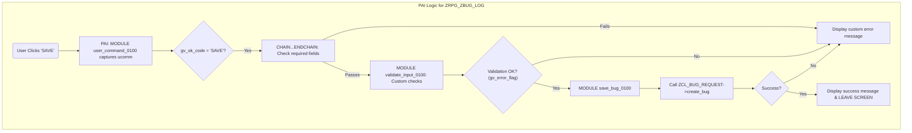

# Đặc tả Chi tiết: Logic Màn hình ZBUG_LOG

**Tài liệu này bổ sung cho `Phase2_Development.md`**

---

## 1. Tổng quan

Tài liệu này cung cấp chi tiết về logic cần triển khai cho màn hình `0100` của chương trình `ZBUG_LOG`, được sử dụng để ghi nhận một lỗi mới. Nó bao gồm logic cho các sự kiện PBO (Process Before Output) và PAI (Process After Input).

**Chương trình**: `ZBUG_LOG`  
**Màn hình**: `0100`

---

## 2. Logic PBO (Process Before Output)

Logic này được thực thi trước khi màn hình được hiển thị cho người dùng.

### Module: `STATUS_0100`

```abap
MODULE status_0100 OUTPUT.
  " 1. Thiết lập Tiêu đề Giao diện (GUI Title)
  " =======================================
  SET PF-STATUS 'ZBUG_LOG_100'. " PF-Status chứa các nút Save, Cancel, Clear
  SET TITLEBAR 'ZBUG_LOG_TITLE'. " Titlebar với văn bản "Ghi nhận Lỗi mới"

  " 2. Khởi tạo giá trị cho Dropdown
  " ===================================
  " Logic này chỉ cần chạy một lần khi màn hình được gọi lần đầu.
  IF gv_first_run = abap_true.
    " Lấy giá trị và mô tả cho Priority từ domain
    " (Sử dụng function module như 'DD_DOMVALUES_GET' để điền vào internal table)
    gt_priority_values = get_domain_values('ZBUG_PRIORITY').
    
    " Lấy giá trị và mô tả cho Bug Type từ domain
    gt_type_values = get_domain_values('ZBUG_TYPE').
    
    CLEAR gv_first_run.
  ENDIF.

  " 3. Điều khiển Thuộc tính Trường (Field Properties)
  " ===============================================
  " Trong màn hình tạo mới, tất cả các trường nhập liệu đều được bật.
  LOOP AT SCREEN.
    IF screen-group1 = 'EDIT'. " Gán các trường nhập liệu vào screen group 'EDIT'
      screen-input = '1'. " Bật nhập liệu
      MODIFY SCREEN.
    ENDIF.
  ENDLOOP.

ENDMODULE.
```
**Lưu ý**: Các dropdown trên Screen Painter cần được liên kết với các internal table `gt_priority_values` và `gt_type_values` thông qua Program-Driven Value Help.

---

## 3. Logic PAI (Process After Input)

Logic này xử lý hành động của người dùng sau khi họ tương tác với màn hình.

### Module: `USER_COMMAND_0100`

```abap
MODULE user_command_0100 INPUT.
  " Lưu mã lệnh người dùng để xử lý sau PAI validation
  gv_ok_code = sy-ucomm.

  CASE gv_ok_code.
    WHEN 'CANCEL' OR 'BACK' OR 'EXIT'.
      LEAVE TO SCREEN 0. " Quay lại màn hình trước đó

    WHEN 'CLEAR'.
      " Xóa nội dung của các trường trên màn hình
      p_bug_title = ''.
      p_bug_description = ''.
      p_bug_type = ''.
      p_priority = ''.
      " Xóa các trường khác...
  ENDCASE.
ENDMODULE.
```

### Logic Validation và Lưu trữ

Logic này được đặt trong Flow Logic của PAI, sau module `USER_COMMAND_0100`.

```abap
" PAI Flow Logic in Screen Painter
PROCESS AFTER INPUT.
  MODULE user_command_0100.

  " Chỉ thực thi logic lưu khi người dùng nhấn 'SAVE'
  IF gv_ok_code = 'SAVE'.
    " Bắt đầu chuỗi kiểm tra các trường bắt buộc
    CHAIN.
      FIELD: p_bug_title,
             p_bug_description,
             p_bug_type,
             p_priority.
      " Module này sẽ được gọi nếu tất cả các trường trong CHAIN đều không initial
      MODULE validate_input_0100.
    ENDCHAIN.

    " Nếu có lỗi (được set trong validate_input_0100), màn hình sẽ tự động hiển thị lại với thông báo.
    " Nếu không có lỗi, tiến hành lưu.
    MODULE save_bug_0100.
  ENDIF.
```

### Module: `validate_input_0100`

```abap
MODULE validate_input_0100 INPUT.
  " Module này kiểm tra logic nghiệp vụ phức tạp hơn nếu cần.
  " Ví dụ, kiểm tra độ dài tối thiểu của mô tả.
  IF strlen( p_bug_description ) < 10.
    MESSAGE 'Mô tả lỗi phải có ít nhất 10 ký tự.' TYPE 'E'.
    " Biến gv_error_flag có thể được sử dụng để ngăn việc lưu lại.
    gv_error_flag = abap_true.
  ELSE.
    CLEAR gv_error_flag.
  ENDIF.
ENDMODULE.
```

### Module: `save_bug_0100`

```abap
MODULE save_bug_0100 INPUT.
  " Chỉ thực thi nếu không có lỗi validation nào xảy ra.
  CHECK gv_error_flag = abap_false.

  " 1. Chuẩn bị Dữ liệu
  " =================
  DATA ls_bug_data TYPE zst_bug_data.
  ls_bug_data-bug_title       = p_bug_title.
  ls_bug_data-bug_description = p_bug_description.
  ls_bug_data-bug_type        = p_bug_type.
  ls_bug_data-priority      = p_priority.

  " 2. Gọi Class để Tạo Bug
  " =======================
  DATA: lv_bug_id   TYPE zbug_bug_id,
        lt_messages TYPE bapiret2_t.

  zcl_bug_request=>get_instance( )->create_bug(
    EXPORTING
      is_bug_data = ls_bug_data
    IMPORTING
      ev_bug_id   = lv_bug_id
      et_messages = lt_messages
  ).

  " 3. Xử lý Kết quả
  " =================
  " Hiển thị thông báo trả về từ phương thức create_bug.
  LOOP AT lt_messages INTO DATA(ls_message).
    " Chuyển đổi thông báo BAPI thành thông báo trên màn hình
    MESSAGE ID ls_message-id TYPE ls_message-type NUMBER ls_message-number
      WITH ls_message-message_v1 ls_message-message_v2 ls_message-message_v3 ls_message-message_v4.
    
    " Nếu tạo thành công, thoát khỏi màn hình
    IF ls_message-type = 'S'.
      LEAVE TO SCREEN 0.
    ENDIF.
  ENDLOOP.
ENDMODULE.

---

## 4. Luồng xử lý Logic PAI

Sơ đồ dưới đây minh họa luồng xử lý logic trong sự kiện PAI khi người dùng nhấn nút 'SAVE'.


```
