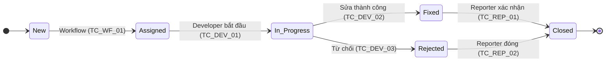

# Đặc tả Chi tiết: Các Trường hợp Kiểm thử (Test Cases)

**Tài liệu này bổ sung cho `Phase3_Testing_QA.md`**

---

## 1. Tổng quan

Tài liệu này cung cấp một tập hợp các trường hợp kiểm thử chi tiết, bao gồm các bước thực hiện và kết quả mong đợi. Nó mở rộng các kịch bản kiểm thử cấp cao đã được xác định trong kế hoạch kiểm thử.

---

## 2. Các Trường hợp Kiểm thử: Chức năng Ghi nhận Lỗi

**Kịch bản**: Ghi nhận một lỗi mới (`ZBUG_LOG`)

### TC_CREATE_01: Ghi nhận lỗi thành công (Happy Path)
- **Mô tả**: Kiểm tra quy trình ghi nhận lỗi thành công với tất cả dữ liệu hợp lệ.
- **Điều kiện tiên quyết**: Người dùng `TEST_REPORTER` đã đăng nhập.
- **Các bước thực hiện**:
  1. Chạy T-Code cho `ZBUG_LOG`.
  2. Điền vào các trường:
     - **Title**: "Login button is not responsive"
     - **Type**: "FUNC" (Functional)
     - **Priority**: "H" (High)
     - **Description**: "When the user clicks the main login button on the home screen, nothing happens. No error is shown."
  3. Nhấn nút "Save".
- **Kết quả mong đợi**:
  - Hệ thống hiển thị thông báo thành công: "Tạo lỗi thành công với ID: ZBUG-xxxxxxxx-xxx".
  - Người dùng được điều hướng trở lại màn hình chính hoặc danh sách lỗi.
  - Một email được gửi đến nhóm developer.
  - Một bản ghi mới được tạo trong bảng `ZBUG_HEADER` với `STATUS = 'N'`.

### TC_CREATE_02: Lỗi xác thực - Thiếu tiêu đề
- **Mô tả**: Kiểm tra validation của hệ thống khi trường bắt buộc (Title) bị bỏ trống.
- **Điều kiện tiên quyết**: Người dùng `TEST_REPORTER` đã đăng nhập.
- **Các bước thực hiện**:
  1. Chạy T-Code cho `ZBUG_LOG`.
  2. Để trống trường "Title".
  3. Điền vào các trường khác.
  4. Nhấn nút "Save".
- **Kết quả mong đợi**:
  - Hệ thống hiển thị một thông báo lỗi ở thanh trạng thái: "Vui lòng nhập Tiêu đề cho lỗi." (Please enter a Title for the bug).
  - Con trỏ chuột được đặt vào trường "Title".
  - Lỗi không được tạo.

### TC_CREATE_03: Đính kèm tệp tin thành công
- **Mô tả**: Kiểm tra chức năng đính kèm một tệp tin hợp lệ.
- **Điều kiện tiên quyết**: Đang ở màn hình `ZBUG_LOG`.
- **Các bước thực hiện**:
  1. Điền tất cả các trường bắt buộc.
  2. Nhấn nút "Attach Evidence".
  3. Chọn một tệp tin hợp lệ (ví dụ: `screenshot.jpg`, kích thước < 10MB).
  4. Nhấn nút "Save".
- **Kết quả mong đợi**:
  - Lỗi được tạo thành công.
  - Một bản ghi mới được tạo trong bảng `ZBUG_ATTACHMENTS` liên kết với Bug ID mới.

### TC_CREATE_04: Lỗi đính kèm - Tệp tin quá lớn
- **Mô tả**: Kiểm tra validation khi người dùng cố gắng đính kèm một tệp tin vượt quá giới hạn kích thước cho phép.
- **Điều kiện tiên quyết**: Đang ở màn hình `ZBUG_LOG`.
- **Các bước thực hiện**:
  1. Điền tất cả các trường bắt buộc.
  2. Nhấn nút "Attach Evidence".
  3. Chọn một tệp tin lớn (ví dụ: `video.mp4`, kích thước > 10MB).
  4. Nhấn nút "Save" hoặc nút "Upload".
- **Kết quả mong đợi**:
  - Hệ thống hiển thị thông báo lỗi: "Kích thước tệp tin không được vượt quá 10MB."
  - Tệp tin không được tải lên.

---

## 3. Các Trường hợp Kiểm thử: Phân quyền

**Kịch bản**: Kiểm tra quyền truy cập vào các chức năng.

### TC_AUTH_01: Developer không thể truy cập chức năng Admin
- **Mô tả**: Đảm bảo một người dùng với vai trò `Developer` không thể truy cập các chức năng chỉ dành cho `Lead Developer` (Admin).
- **Điều kiện tiên quyết**: Người dùng `TEST_DEVELOPER` (chỉ có quyền `BUG_BASIC` + `BUG_WORK`) đã đăng nhập.
- **Các bước thực hiện**:
  1. Cố gắng chạy T-Code cho chức năng re-assign lỗi (`ZBUG_ASSIGN`).
- **Kết quả mong đợi**:
  - Hệ thống hiển thị thông báo lỗi phân quyền: "Bạn không có quyền thực hiện hành động này."
  - Màn hình `ZBUG_ASSIGN` không được hiển thị.

### TC_AUTH_02: Reporter chỉ có thể xem lỗi của chính mình
- **Mô tả**: Đảm bảo người dùng `Reporter` không thể xem lỗi do người khác tạo.
- **Điều kiện tiên quyết**:
  - Người dùng `TEST_REPORTER_A` đã đăng nhập.
  - Tồn tại một lỗi (`BUG_1`) do `TEST_REPORTER_A` tạo.
  - Tồn tại một lỗi (`BUG_2`) do `TEST_REPORTER_B` tạo.
- **Các bước thực hiện**:
  1. Chạy báo cáo danh sách lỗi (`ZBUG_LIST`) mà không có bộ lọc nào.
- **Kết quả mong đợi**:
  - `BUG_1` được hiển thị trong danh sách.
  - `BUG_2` KHÔNG được hiển thị trong danh sách.

---

## 4. Đặc tả Dữ liệu Kiểm thử

Để thực hiện các kịch bản trên, cần chuẩn bị các dữ liệu sau:

### 4.1. Người dùng Kiểm thử
| User ID | Vai trò | Quyền PFCG được gán | Mô tả |
| :--- | :--- | :--- | :--- |
| `TEST_REPORTER_A`| Reporter | `Z_ROLE_BUG_REPORTER` | Người dùng cơ bản để tạo lỗi. |
| `TEST_REPORTER_B`| Reporter | `Z_ROLE_BUG_REPORTER` | Người dùng cơ bản thứ hai để kiểm tra cách ly dữ liệu. |
| `TEST_DEVELOPER` | Developer | `Z_ROLE_BUG_DEVELOPER` | Developer để kiểm tra việc phân công và sửa lỗi. |
| `TEST_LEAD` | Lead Developer | `Z_ROLE_BUG_LEAD` | Admin để kiểm tra các chức năng quản trị. |

### 4.2. Dữ liệu Lỗi (Bugs)
| Bug ID (ví dụ) | Title | Status | Reporter | Assigned To | Priority | Mô tả |
| :--- | :--- | :--- | :--- | :--- | :--- | :--- |
| `BUG_FIXED` | A previously fixed bug | `F` (Fixed) | `TEST_REPORTER_A` | `TEST_DEVELOPER` | `M` | Để kiểm tra bộ lọc trạng thái. |
| `BUG_OPEN` | An open bug | `A` (Assigned) |`TEST_REPORTER_B` | `TEST_DEVELOPER` | `H` | Để kiểm tra quy trình làm việc. |

### 4.3. Tệp tin Kiểm thử
- `image_small.jpg` (Kích thước: ~500KB)
- `document.pdf` (Kích thước: ~1MB)
- `large_file.zip` (Kích thước: ~15MB)

---

## 5. Sơ đồ Vòng đời Lỗi (Bug Lifecycle)

Sơ đồ trạng thái này minh họa vòng đời của một lỗi từ lúc được tạo ra cho đến khi bị đóng, và các trường hợp kiểm thử (TC) tương ứng với mỗi quá trình chuyển đổi.

