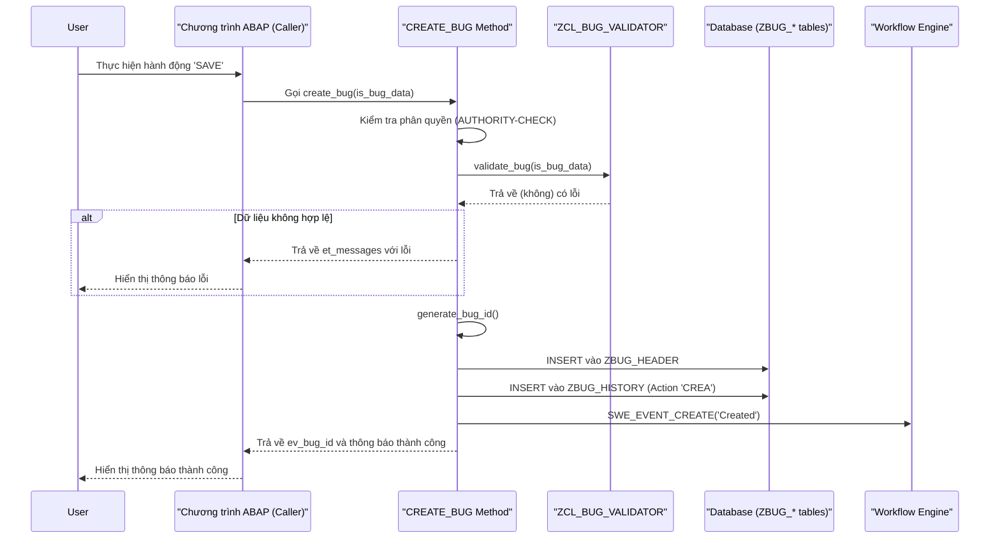

# Chi tiết Kỹ thuật: Lớp ZCL_BUG_REQUEST

**Tài liệu này bổ sung cho `Phase1_Requirements_Design.md` và `Technical_Architecture.md`**

---

## 1. Tổng quan

Tài liệu này cung cấp đặc tả triển khai chi tiết cho các phương thức (methods) quan trọng trong lớp `ZCL_BUG_REQUEST`. Nó nhằm mục đích hướng dẫn nhà phát triển (Thành viên Nhóm 1) về logic nghiệp vụ, xử lý lỗi, và các bước tích hợp cần thiết.

---

## 2. Phương thức: `CREATE_BUG`

Đây là phương thức cốt lõi để tạo một lỗi mới trong hệ thống.

### 2.1. Chữ ký (Signature)

```abap
METHODS create_bug
  IMPORTING
    is_bug_data   TYPE zst_bug_data
  EXPORTING
    ev_bug_id     TYPE zbug_bug_id
    et_messages   TYPE bapiret2_t.
```

### 2.2. Logic Triển khai Chi tiết (Pseudo-code)

```abap
METHOD create_bug.
  " 1. Khởi tạo
  " ===================
  " Xóa các tham số trả về để đảm bảo không có dữ liệu cũ.
  CLEAR: ev_bug_id, et_messages.

  " 2. Kiểm tra Phân quyền (Authorization Check)
  " ===========================================
  " Người dùng phải có quyền cơ bản để tạo lỗi.
  AUTHORITY-CHECK OBJECT 'Z_BUG_AUTH'
    ID 'ACTVT'     FIELD '01'      " 01 = Create
    ID 'ZBUG_ROLE' FIELD 'BASIC'.  " Yêu cầu quyền BUG_BASIC

  IF sy-subrc <> 0.
    " Thêm thông báo lỗi vào bảng và thoát.
    APPEND VALUE #( type = 'E' id = 'ZBUG' number = '001' message = 'Bạn không có quyền tạo lỗi.' ) TO et_messages.
    RETURN.
  ENDIF.

  " 3. Xác thực Dữ liệu đầu vào (Validation)
  " ======================================
  " Gọi lớp validator để kiểm tra tính hợp lệ của dữ liệu.
  DATA(lt_validation_messages) = zcl_bug_validator=>validate_bug( is_bug_data ).

  " Nếu có bất kỳ lỗi xác thực nào, sao chép chúng vào bảng thông báo trả về và thoát.
  IF lt_validation_messages IS NOT INITIAL.
    et_messages = lt_validation_messages.
    RETURN.
  ENDIF.

  " 4. Tạo Bug ID
  " =================
  " Gọi phương thức private để tạo ID duy nhất cho lỗi.
  DATA(lv_new_bug_id) = me->generate_bug_id( ).

  " Nếu không tạo được ID (lỗi number range), thoát.
  IF lv_new_bug_id IS INITIAL.
    APPEND VALUE #( type = 'E' id = 'ZBUG' number = '002' message = 'Lỗi hệ thống: Không thể tạo Bug ID.' ) TO et_messages.
    RETURN.
  ENDIF.

  " 5. Chuẩn bị Dữ liệu cho Bảng ZBUG_HEADER
  " ========================================
  DATA ls_bug_header TYPE zbug_header.

  ls_bug_header = CORRESPONDING #( is_bug_data ). " Di chuyển các trường tương ứng
  ls_bug_header-bug_id        = lv_new_bug_id.
  ls_bug_header-status        = 'N'. " Trạng thái ban đầu: New
  ls_bug_header-created_by    = sy-uname.
  ls_bug_header-created_date  = sy-datum.
  ls_bug_header-created_time  = sy-uzeit.
  ls_bug_header-reporter_id   = sy-uname. " Người báo cáo là người dùng hiện tại

  " 6. Ghi vào Cơ sở Dữ liệu (Database Transaction)
  " ===============================================
  INSERT zbug_header FROM ls_bug_header.

  IF sy-subrc <> 0.
    " Xử lý lỗi nghiêm trọng nếu không thể ghi vào CSDL.
    APPEND VALUE #( type = 'A' id = 'ZBUG' number = '003' message = 'Lỗi CSDL nghiêm trọng khi tạo lỗi. Liên hệ admin.' ) TO et_messages.
    " Nên ghi log lỗi ở đây.
    RETURN.
  ENDIF.

  " 7. Ghi Nhật ký Lịch sử (Log History)
  " ===================================
  " Ghi lại hành động 'tạo mới' vào bảng lịch sử.
  me->log_history(
    EXPORTING
      iv_bug_id     = lv_new_bug_id
      iv_action     = 'CREA' " CREA = Created
      iv_new_status = 'N'
      iv_comments   = 'Lỗi đã được tạo thành công.'
  ).

  " 8. Kích hoạt Workflow
  " ====================
  " Kích hoạt sự kiện 'Created' của Business Object để bắt đầu workflow phân công.
  DATA: lv_objkey TYPE sweinstcou-objkey.
  lv_objkey = lv_new_bug_id.

  CALL FUNCTION 'SWE_EVENT_CREATE'
    EXPORTING
      objtype           = 'ZBUS_BUG' " Tên Business Object tùy chỉnh
      objkey            = lv_objkey
      event             = 'Created'
    EXCEPTIONS
      objtype_not_found = 1
      OTHERS            = 2.

  IF sy-subrc <> 0.
    " Lỗi này không nên dừng quy trình, nhưng cần được ghi lại để admin kiểm tra.
    me->log_message( |Lỗi kích hoạt workflow cho Bug ID { lv_new_bug_id }| ).
  ENDIF.

  " 9. Hoàn tất
  " ===========
  " Trả về ID của lỗi mới được tạo và thông báo thành công.
  ev_bug_id = lv_new_bug_id.
  APPEND VALUE #( type = 'S' id = 'ZBUG' number = '004' message = |Tạo lỗi thành công với ID: { ev_bug_id }| ) TO et_messages.

  " Quan trọng: COMMIT WORK nên được gọi bởi chương trình gọi, không phải bên trong phương thức này
  " để đảm bảo tính toàn vẹn của đơn vị logic công việc (LUW).

ENDMETHOD.
```

### 2.3. Các Phương thức Phụ trợ (Private Methods)

#### `GENERATE_BUG_ID`
*   **Logic**: Sử dụng Function Module `NUMBER_GET_NEXT` với object `ZBUG_ID`. Định dạng chuỗi trả về thành `BUG-YYYYMMDD-XXX`.
*   **Xử lý lỗi**: Nếu `NUMBER_GET_NEXT` trả về lỗi, phương thức sẽ trả về giá trị `initial`.

#### `LOG_HISTORY`
*   **Logic**: Nhận thông tin hành động (`iv_action`, `iv_comments`, etc.) và tạo một bản ghi mới trong bảng `ZBUG_HISTORY`.
*   **Xử lý lỗi**: Việc ghi lỗi vào đây nên được bao trong khối `TRY...CATCH` để tránh làm hỏng giao dịch chính nếu có vấn đề.

---

## 4. Luồng Tuần tự (Sequence Flow)

Sơ đồ dưới đây minh họa luồng xử lý của phương thức `CREATE_BUG`, cho thấy sự tương tác giữa các đối tượng khác nhau trong hệ thống.



---
**Ghi chú**: Đặc tả này cung cấp một khung sườn logic. Nhà phát triển nên xem xét các khía cạnh về hiệu năng và xử lý transaction (LUW - Logical Unit of Work) một cách cẩn thận trong quá trình triển khai thực tế.
