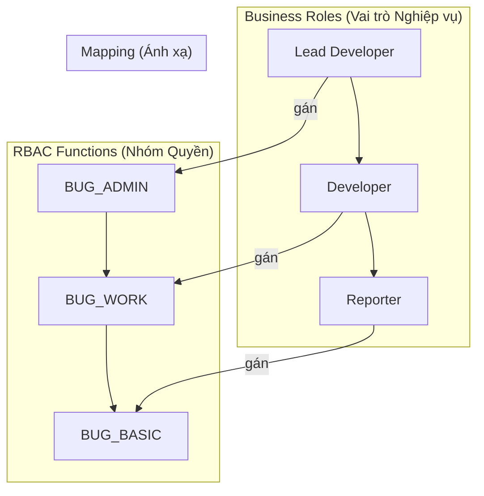
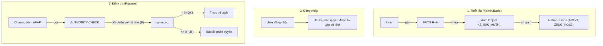
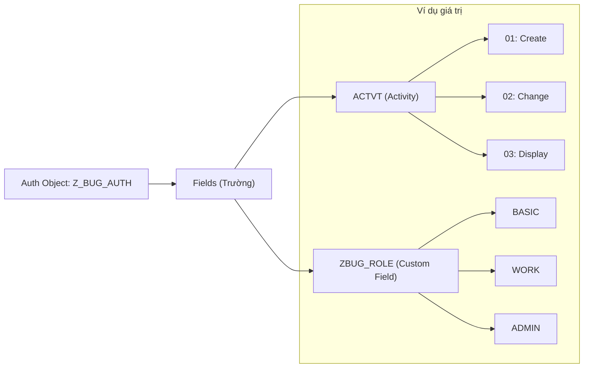
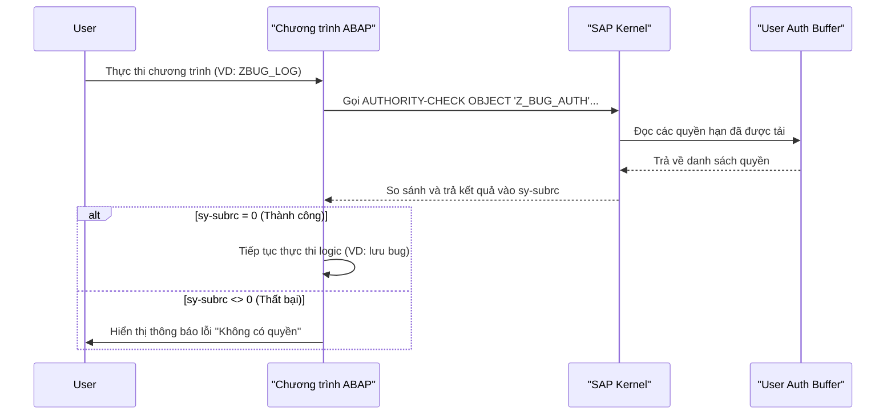
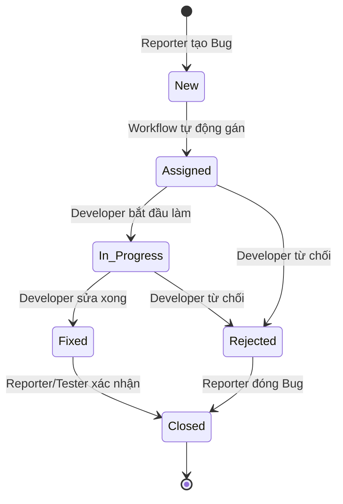
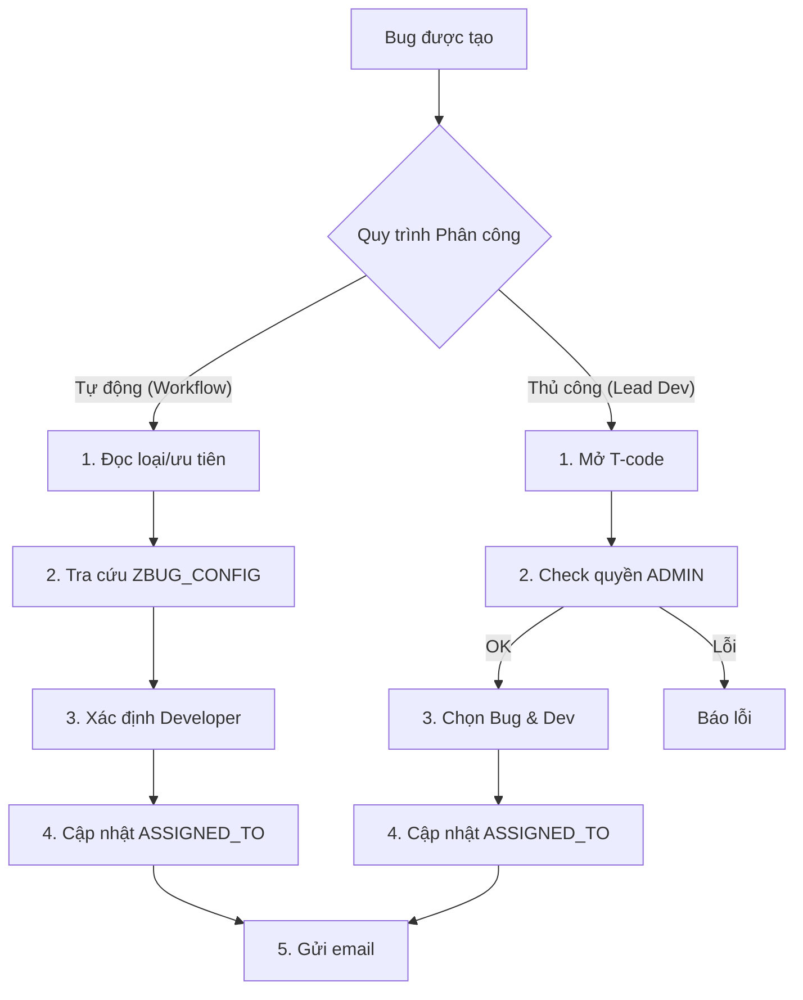

# Chiến lược Phân quyền và Phân công trong ABAP

Tài liệu này trình bày chi tiết chiến lược xác thực, phân quyền và phân công cho Hệ thống Quản lý Theo dõi Lỗi (Bug Tracking Management System) được xây dựng trên nền tảng SAP ABAP, dựa trên các tài liệu thiết kế của dự án.

## 1. Mô hình Bảo mật Cốt lõi

Dự án sử dụng mô hình Kiểm soát Truy cập Dựa trên Vai trò (Role-Based Access Control - RBAC) hiệu quả, phân biệt rõ ràng giữa **Business Roles** (vai trò nghiệp vụ của người dùng) và **RBAC Functions** (nhóm các quyền hạn cụ thể).

### Business Roles (Vai trò Nghiệp vụ):

*   **Reporter**: Người dùng báo cáo lỗi (tester, key user, end user).
*   **Developer**: Người dùng chịu trách nhiệm sửa lỗi.
*   **Lead Developer**: Developer có quyền quản trị đối với hệ thống theo dõi lỗi.

### RBAC Functions (Nhóm Quyền Chức năng):

Các nhóm quyền này xác định các cấp độ cho phép cụ thể:

*   **BUG_BASIC**: Cho phép tạo lỗi mới, xem và bình luận trên các lỗi của chính mình, và đính kèm tệp.
*   **BUG_WORK**: Cấp quyền xem và cập nhật các lỗi đã được phân công, thay đổi trạng thái và tải xuống các tệp đính kèm.
*   **BUG_ADMIN**: Cung cấp quyền kiểm soát quản trị toàn diện, bao gồm xem tất cả các lỗi, phân công lại lỗi, quản lý cấu hình hệ thống và truy cập báo cáo thống kê đầy đủ.

### Sơ đồ Ánh xạ Vai trò và Quyền hạn:

Sơ đồ này thể hiện mối quan hệ giữa các vai trò nghiệp vụ và các nhóm quyền chức năng được gán cho chúng.



| Business Role | RBAC Functions Được Gán |
| :--- | :--- |
| **Reporter** | `BUG_BASIC` |
| **Developer** | `BUG_BASIC` + `BUG_WORK` |
| **Lead Developer** | `BUG_BASIC` + `BUG_WORK` + `BUG_ADMIN` |

## 2. Cách Triển khai trong ABAP

Việc triển khai mô hình này trong ABAP đòi hỏi sự kết hợp giữa các Authorization Objects tùy chỉnh, các câu lệnh kiểm tra quyền trong mã nguồn, và các vai trò được tạo bởi Profile Generator (PFCG).

### Luồng kiểm tra phân quyền

Sơ đồ dưới đây minh họa toàn bộ quy trình phân quyền, từ lúc quản trị viên thiết lập vai trò cho đến khi chương trình kiểm tra quyền hạn của người dùng lúc chạy.



### 2.1. Authorization Objects (Transaction `SU21`)

Một đối tượng phân quyền tùy chỉnh, ví dụ `Z_BUG_AUTH`, sẽ được tạo để kiểm soát quyền truy cập vào các chức năng của hệ thống. 

#### Sơ đồ cấu trúc Authorization Object


Đối tượng này sẽ chứa các trường liên quan đến các RBAC Functions:

*   `ACTVT` (Activity): Trường tiêu chuẩn của SAP cho các hành động (ví dụ: `01`=Create, `02`=Change, `03`=Display).
*   `ZBUG_ROLE`: Một trường tùy chỉnh để ánh xạ tới các RBAC functions (`BASIC`, `WORK`, `ADMIN`).

### 2.2. Kiểm tra Phân quyền trong Mã ABAP (`AUTHORITY-CHECK`)

Tất cả các giao dịch quan trọng và các điểm truy cập dữ liệu phải chứa câu lệnh `AUTHORITY-CHECK`.

#### Luồng chi tiết của câu lệnh AUTHORITY-CHECK (Sequence Diagram)

Sơ đồ tuần tự này mô tả các bước tương tác giữa chương trình, lõi SAP (Kernel) và bộ nhớ đệm của người dùng khi một câu lệnh `AUTHORITY-CHECK` được thực thi.



**Ví dụ: Kiểm tra quyền tạo Bug**

```abap
" Kiểm tra quyền trước khi lưu bug mới
AUTHORITY-CHECK OBJECT 'Z_BUG_AUTH'
  ID 'ACTVT'     FIELD '01'      " Hoạt động: Tạo mới
  ID 'ZBUG_ROLE' FIELD 'BASIC'.  " Yêu cầu quyền BUG_BASIC

IF sy-subrc <> 0.
  MESSAGE 'Bạn không có quyền tạo lỗi.' TYPE 'E'.
  " Xử lý khi không có quyền (VD: thoát khỏi xử lý)
ENDIF.
```

**Ví dụ: Kiểm tra quyền Admin để xem tất cả Bug**

```abap
" Kiểm tra quyền admin trước khi lấy toàn bộ dữ liệu
AUTHORITY-CHECK OBJECT 'Z_BUG_AUTH'
  ID 'ACTVT'     FIELD '03'      " Hoạt động: Hiển thị
  ID 'ZBUG_ROLE' FIELD 'ADMIN'.  " Yêu cầu quyền BUG_ADMIN

IF sy-subrc = 0.
  " Người dùng có quyền admin, lấy tất cả bug
  SELECT * FROM zbug_header INTO TABLE @DATA(lt_all_bugs).
ELSE.
  " Người dùng không có quyền admin, chỉ lấy bug của họ hoặc được gán cho họ
  SELECT * FROM zbug_header
    WHERE reporter_id = @sy-uname OR assigned_to = @sy-uname
    INTO TABLE @DATA(lt_my_bugs).
ENDIF.
```

### 2.3. Vai trò PFCG (Transaction `PFCG`)

Các vai trò PFCG sẽ được tạo và duy trì bởi đội ngũ SAP Basis/Security để đóng gói các vai trò nghiệp vụ và quyền hạn tương ứng.

*   **`Z_ROLE_BUG_REPORTER`**: Vai trò này sẽ bao gồm đối tượng `Z_BUG_AUTH` với `ACTVT` cho phép tạo/hiển thị và `ZBUG_ROLE` được đặt là `BASIC`.
*   **`Z_ROLE_BUG_DEVELOPER`**: Vai trò này sẽ bao gồm `Z_BUG_AUTH` với `ACTVT` cho phép tạo/thay đổi/hiển thị và `ZBUG_ROLE` được đặt là `BASIC`, `WORK`.
*   **`Z_ROLE_BUG_LEAD`**: Vai trò này sẽ bao gồm `Z_BUG_AUTH` với `ACTVT` là `*` (tất cả hành động) và `ZBUG_ROLE` là `BASIC`, `WORK`, `ADMIN`.

## 3. Luồng Logic Phân công

Thiết kế của dự án chỉ định cả hai quy trình phân công tự động và thủ công.

### Sơ đồ Trạng thái của Bug (Bug Status Lifecycle)
Sơ đồ này mô tả các trạng thái mà một Bug có thể trải qua trong suốt vòng đời của nó.



### Sơ đồ Luồng Phân công


### 3.1. Phân công Tự động (SAP Workflow `ZBUG_WF`)

*   **Kích hoạt (Trigger)**: Khi một lỗi mới được tạo thành công thông qua `ZCL_BUG_REQUEST->CREATE_BUG`, một sự kiện sẽ được kích hoạt để khởi động workflow `ZBUG_WF`.
*   **Logic**: Workflow sẽ sử dụng các tác vụ nền (background tasks) hoặc các phương thức tùy chỉnh để:
    *   Đọc các đặc tính của lỗi (ví dụ: `BUG_TYPE`, `PRIORITY`) từ bảng `ZBUG_HEADER`.
    *   Truy vấn bảng cấu hình `ZBUG_CONFIG`, nơi lưu trữ các quy tắc để gán developer (ví dụ: "lỗi chức năng sẽ được gán cho Developer A").
    *   Cập nhật trường `ASSIGNED_TO` trong `ZBUG_HEADER` và trạng thái của lỗi.
    *   Gửi thông báo email tự động đến developer được phân công.

### 3.2. Phân công/Phân công lại Thủ công

*   **Công cụ**: Một chương trình hoặc giao dịch ABAP riêng (ví dụ: `ZBUG_ASSIGN`) sẽ được cung cấp cho chức năng này.
*   **Phân quyền**: Quyền truy cập vào chương trình này sẽ được kiểm soát chặt chẽ bởi đối tượng `Z_BUG_AUTH`, yêu cầu `ACTVT='02'` (Change) và `ZBUG_ROLE='ADMIN'` để đảm bảo chỉ có Lead Developer mới có thể thực hiện hành động này.
*   **Chức năng**: Công cụ này cho phép Lead Developer được ủy quyền chọn một lỗi và thay đổi trường `ASSIGNED_TO`, mang lại sự linh hoạt cho các tình huống cụ thể.

---

## Tài liệu tham khảo

*   **`@Capstone/Bug-Tracking-Management-VN/00_Project_Overview.md`**: Tổng quan cấp cao về dự án và các khái niệm bảo mật.
*   **`@Capstone/Bug-Tracking-Management-VN/Technical_Architecture.md`**: Kiến trúc bảo mật chi tiết và ánh xạ vai trò.
*   **`@Capstone/Bug-Tracking-Management-VN/Phase1_Requirements_Design.md`**: Chi tiết thêm về yêu cầu phân quyền và workflow.
*   **`@Capstone/Bug-Tracking-Management-VN/References_Resources.md`**: Các hướng dẫn chung về bảo mật và workflow trong SAP ABAP.
