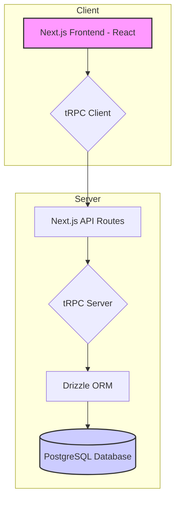
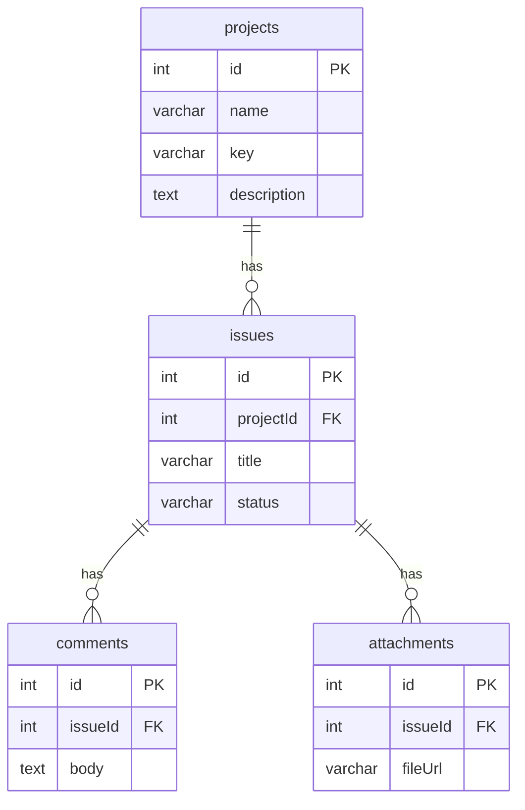
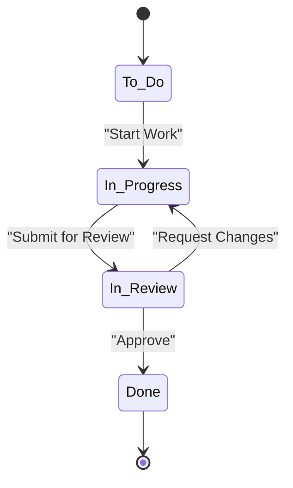
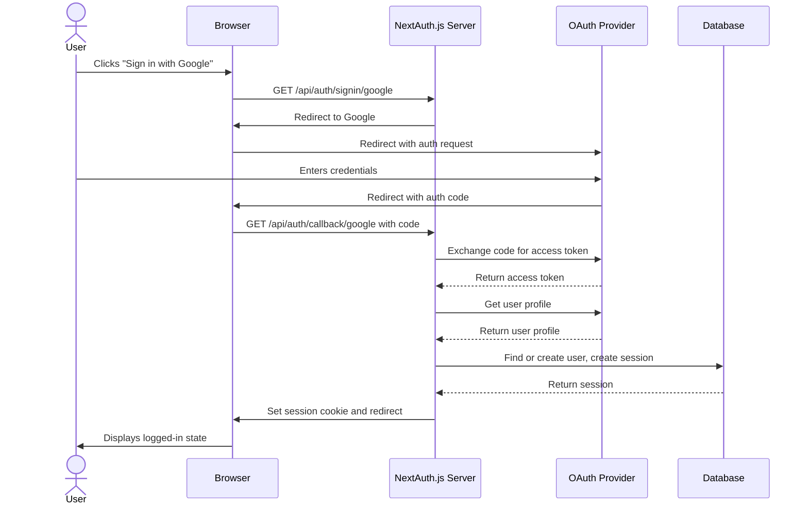
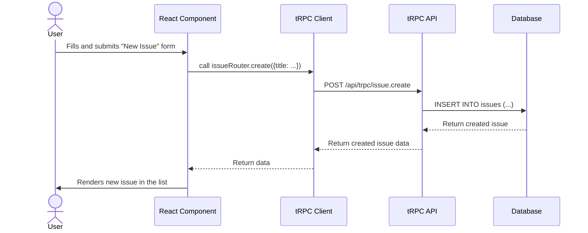
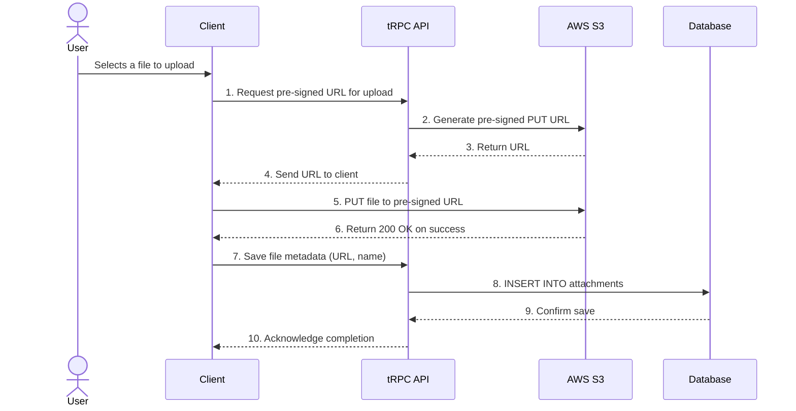
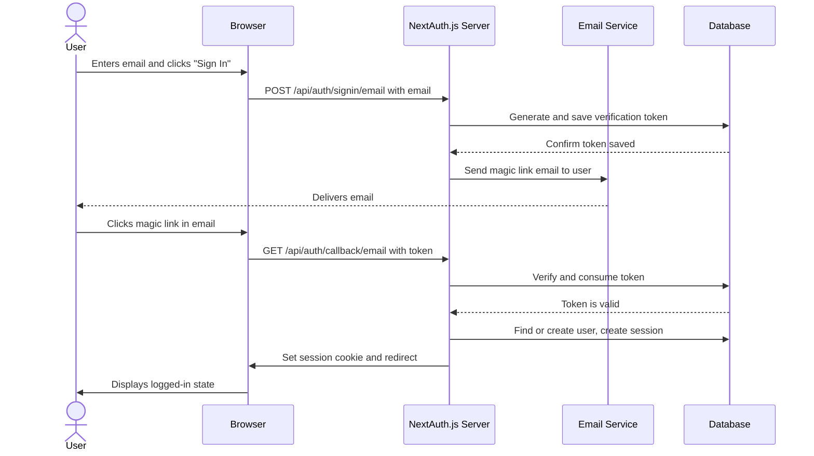

Package > Program/Class/Table/Screen > Bug

# Mock ABAP 8 - Project and Issue Tracker

This is a [T3 Stack](https://create.t3.gg/) project bootstrapped with `create-t3-app`. It serves as a project and issue tracking application.

## Table of Contents

- [Live Demo](#live-demo)
- [Application Architecture](#application-architecture)
- [Software Requirements Specification (SRS)](#software-requirements-specification-srs)
  - [1. Introduction](#1-introduction)
  - [2. User Roles and Permissions](#2-user-roles-and-permissions)
  - [3. Functional Requirements](#3-functional-requirements)
  - [4. Non-Functional Requirements](#4-non-functional-requirements)
- [System and Process Flows](#system-and-process-flows)
  - [5.1 Database Schema (ERD)](#51-database-schema-erd)
  - [5.2 Issue Lifecycle](#52-issue-lifecycle)
  - [5.3 User Authentication Flow (OAuth)](#53-user-authentication-flow-oauth)
  - [5.4 Create Issue Flow](#54-create-issue-flow)
  - [5.5 File Upload Flow](#55-file-upload-flow)
- [Implementation Plan and Recommendations](#implementation-plan-and-recommendations)
  - [1. Authentication and Authorization](#1-authentication-and-authorization)
  - [2. User Management](#2-user-management)
  - [3. File Uploads for Attachments](#3-file-uploads-for-attachments)
  - [4. Notifications](#4-notifications)
  - [5. Enhanced Search](#5-enhanced-search)
  - [6. Dashboard and Analytics](#6-dashboard-and-analytics)
  - [7. Testing](#7-testing)

## Live Demo

[Link to deployed application]

## Application Architecture

The application is built on the T3 Stack, which provides a modern, full-stack, and typesafe architecture.

---

# Software Requirements Specification (SRS)

## 1. Introduction

This document outlines the software requirements for the project and issue tracking application. The application allows users to manage software projects, track issues, and collaborate through comments and attachments.

## 2. User Roles and Permissions

| Role      | Description                                       | Permissions                                                                                                                                                             |
| :-------- | :------------------------------------------------ | :---------------------------------------------------------------------------------------------------------------------------------------------------------------------- |
| **Admin** | Has full access to all projects and settings.     | Create/Read/Update/Delete any project or issue. Manage users.                                                                                                           |
| **Member**| A standard user who can work on assigned projects.| Create issues within their projects. Read/Update issues they have access to. Comment on issues. Cannot create new projects or manage users.                               |
| **Viewer**| A read-only user.                                 | Can view projects and issues they have been granted access to, but cannot create, update, or delete anything.                                                            |

## 3. Functional Requirements

### 3.1 Project Management

- **3.1.1 Create Project:** Admins can create a new project.
  - **Fields:** `name` (text, required), `key` (text, required, unique, 3-5 chars), `description` (text, optional).
  - **Acceptance Criteria:** A new project is created in the database and the user is redirected to the project page.

- **3.1.2 View Projects:** All users can view a list of projects they have access to.
  - **Fields Displayed:** Project Name, Project Key.
  - **Acceptance Criteria:** A list of projects is displayed, and clicking on a project navigates to the project's issue list.

- **3.1.3 Update Project:** Admins can update the details of an existing project.
  - **Fields:** `name`, `description`. The `key` should be immutable.
  - **Acceptance Criteria:** The project's details are updated in the database.

- **3.1.4 Delete Project:** Admins can delete a project.
  - **Action:** A confirmation modal should be displayed before deletion.
  - **Acceptance Criteria:** The project and all its associated issues, comments, and attachments are deleted from the database.

### 3.2 Issue Management

- **3.2.1 Create Issue:** Members can create a new issue for a project.
  - **Fields:** `title` (required), `description`, `type`, `severity`, `priority`, `assignee`.
  - **Acceptance Criteria:** A new issue is created with a default status of "To Do".

- **3.2.2 Update Issue:** Members can update an issue's details.
  - **Acceptance Criteria:** The issue is updated, and an entry is added to the audit log.

- **3.2.3 Transition Issue Status:** Members can change an issue's status.
  - **Action:** This can be done via a dropdown or a drag-and-drop interface (Kanban board).
  - **Acceptance Criteria:** The issue's status is updated, and an entry is added to the audit log.

## 4. Non-Functional Requirements

- **4.1 Security:**
  - All access must be authenticated.
  - API endpoints must be authorized based on user roles.
  - Passwords must be hashed (if using password-based auth).
  - Data transfer must be over HTTPS.

- **4.2 Performance:**
  - API responses should be under 200ms for standard requests.
  - Page loads should be under 2 seconds.

- **4.3 Scalability:**
  - The application should be able to handle at least 1,000 concurrent users.
  - The database schema should be designed to handle millions of issues.

- **4.4 Maintainability:**
  - The codebase should adhere to a consistent style guide (e.g., Prettier).
  - All new features must be accompanied by tests.

---

# System and Process Flows

## 5.1 Database Schema (ERD)

## 5.2 Issue Lifecycle

## 5.3 User Authentication Flow (OAuth)

This diagram shows the sequence of events when a user logs in using an OAuth provider like Google.

## 5.4 Create Issue Flow

## 5.5 File Upload Flow

This flow uses a secure, pre-signed URL approach to avoid exposing server resources or credentials.

---

# Implementation Plan and Recommendations

Here is a more detailed breakdown of the implementation steps for the suggested improvements.

## 1. Authentication and Authorization

- **Tech Stack:** `next-auth` with `@next-auth/drizzle-adapter`.
- **Steps:**
  1.  **Install:** `npm install next-auth @next-auth/drizzle-adapter`
  2.  **Schema:** Add the required `users`, `accounts`, `sessions`, `verificationTokens` tables to your `src/server/db/schema.ts` and generate a migration.
  3.  **API Route:** Create a new API route `src/app/api/auth/[...nextauth]/route.ts`. Configure it with the Drizzle adapter and one or more of the authentication providers below.
  4.  **Protect Routes:**
      -   **tRPC:** Create a `protectedProcedure` in `src/server/api/trpc.ts` that checks for an active session. Use this for all your tRPC procedures.
      -   **Pages:** Use the `useSession` hook from `next-auth/react` to conditionally render content or redirect users.

### Option 1: OAuth Providers (e.g., Google, GitHub)

This is the recommended approach for easy integration with third-party services.

- **Implementation:**
  - In your `[...nextauth]/route.ts` file, add and configure providers like `GoogleProvider` or `GitHubProvider`.
  - You will need to get `clientId` and `clientSecret` from the respective OAuth providers.
  - The user flow for this is detailed in the "User Authentication Flow (OAuth)" diagram above.

### Option 2: Email (Passwordless Magic Link)

This method allows users to sign in with just their email address, without needing a password.

- **Tech Stack:** `next-auth`'s `EmailProvider`, `nodemailer`.
- **Steps:**
  1.  **Install:** `npm install nodemailer`
  2.  **Configure `EmailProvider`:** In your `[...nextauth]/route.ts` file, add the `EmailProvider`.
  3.  **Configure Email Server:** The `EmailProvider` needs a way to send emails. You'll need to provide SMTP server credentials or use an API-based email service in the provider configuration.
  4.  **User Flow:**
      - The user enters their email address on the login page.
      - NextAuth.js generates a unique, single-use token, saves it to the `verificationTokens` table, and sends an email to the user with a "magic link" containing the token.
      - The user clicks the link in the email.
      - NextAuth.js verifies the token, signs the user in, and invalidates the token.

- **Flow Diagram:**

## 2. User Management

- **Steps:**
  1.  **Update Schema:** In `src/server/db/schema.ts`, add a foreign key relationship from `issues` (`assigneeId`, `reporterId`), `comments` (`authorId`), etc., to the new `users` table's `id` field.
  2.  **Update tRPC Procedures:** Modify the `create` and `update` procedures to use the `id` of the logged-in user (`ctx.session.user.id`) instead of plain text strings.
  3.  **Update UI:** Display user avatars and names instead of just text.

## 3. File Uploads for Attachments

- **Tech Stack:** AWS S3, `aws-sdk`.
- **Approach:** Pre-signed URLs.
- **Steps:**
  1.  **tRPC Endpoint:** Create a new tRPC procedure `createPresignedUrl` that:
      -   Takes a `fileName` and `fileType` as input.
      -   Generates a pre-signed S3 URL for uploading.
      -   Returns the URL to the client.
  2.  **Client-Side:**
      -   When a user selects a file, call the `createPresignedUrl` procedure.
      -   Use the returned URL to `PUT` the file directly to S3 from the browser.
      -   On successful upload, call another tRPC procedure to save the file's metadata (URL, name, etc.) to the `attachments` table.

## 4. Notifications

- **Steps:**
  1.  **Schema:** Create a `notifications` table in `src/server/db/schema.ts` with fields like `id`, `userId`, `message`, `read`, `createdAt`.
  2.  **tRPC Procedures:**
      -   When an action occurs (e.g., new comment), create a new notification in the database for the relevant user.
      -   Create a `listNotifications` procedure to fetch unread notifications for the current user.
  3.  **UI:** Add a notification bell icon to the header that displays the number of unread notifications and a dropdown to view them.

## 5. Enhanced Search

- **Tech Stack:** PostgreSQL Full-Text Search.
- **Steps:**
  1.  **Schema:** In `src/server/db/schema.ts`, add a `tsvector` column to the `issues` table.
  2.  **Database Trigger:** Create a database trigger that automatically updates the `tsvector` column whenever an issue's `title` or `description` changes.
  3.  **tRPC Procedure:** Create a `searchIssues` procedure that takes a search query and uses the `to_tsquery` function to search against the `tsvector` column.

## 6. Dashboard and Analytics

- **Tech Stack:** `recharts` or `chart.js`.
- **Steps:**
  1.  **tRPC Procedures:** Create new procedures to aggregate data, e.g.:
      -   `getIssueCountByStatus`: Returns `{ status: 'To Do', count: 10 }`, etc.
      -   `getIssueCountByPriority`: Returns `{ priority: 'High', count: 5 }`, etc.
  2.  **UI:** Create a `/dashboard` page and use a charting library to visualize the data returned from your tRPC procedures.

## 7. Testing

- **Tech Stack:** `vitest`, `@testing-library/react`.
- **Steps:**
  1.  **Setup:** Install and configure `vitest` in your project.
  2.  **Component Tests:** For each React component, create a `*.test.tsx` file. Write tests that simulate user interactions and assert that the component behaves as expected.
  3.  **tRPC Tests:** You can write integration tests for your tRPC procedures by calling them directly and mocking the database context.

