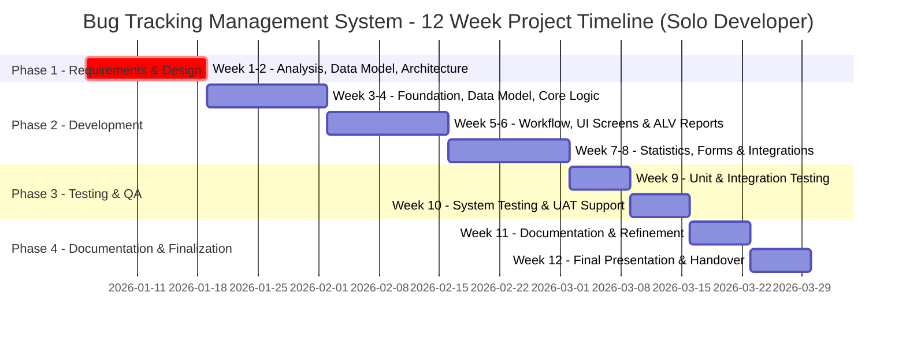
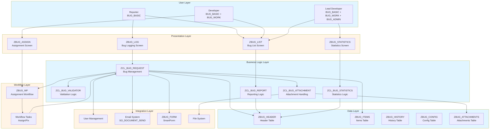
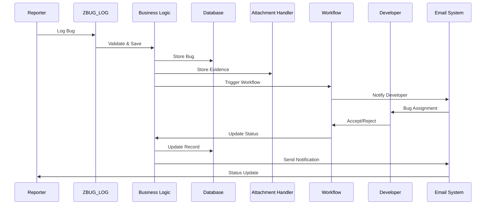

# Tổng quan Dự án - Hệ thống Quản lý theo dõi Lỗi (Solo Developer)

**← [Quay lại README](README.md)**

---

## Mục lục

1. [Thông tin Dự án](#project-information)
2. [Vai trò & Trách nhiệm](#roles--responsibilities)
3. [Tiến độ Dự án](#project-timeline)
4. [Tóm tắt Phạm vi & Công nghệ](#scope--technology-summary)
5. [Công nghệ Sử dụng](#technology-stack)
6. [Ánh xạ Yêu cầu](#requirements-mapping)
7. [Kiến trúc Cấp cao](#high-level-architecture)
8. [Quản lý Rủi ro](#risk-management)
9. [Tiêu chí Thành công](#success-criteria)

---

## Thông tin Dự án

**Tên Dự án**: Hệ thống Quản lý theo dõi Lỗi (ZBUG)  
**Mã Dự án**: ABAP8  
**Thời gian**: 12 tuần  
**Quy mô**: 1 Senior Developer (Solo)
**Loại Dự án**: Phát triển ABAP Tùy chỉnh SAP  
**Hệ thống Mục tiêu**: SAP ECC / S/4HANA

### Mục tiêu Dự án

1. **Tự động hóa Quản lý Lỗi**: Tối ưu hóa quy trình ghi nhận và xử lý lỗi
2. **Phân công Developer**: Triển khai quy trình phân công developer linh hoạt
3. **Báo cáo Toàn diện**: Cung cấp khả năng phân tích và báo cáo thống kê
4. **Trải nghiệm Người dùng**: Tạo giao diện trực quan cho người báo lỗi và developer
5. **Tích hợp**: Tích hợp liền mạch với hệ thống quản lý người dùng của SAP

### Giá trị Kinh doanh

- **Hiệu quả**: Giảm 70% thời gian xử lý lỗi thủ công
- **Minh bạch**: Khả năng hiển thị theo thời gian thực về trạng thái và tiến độ xử lý lỗi
- **Tuân thủ**: Đảm bảo phân quyền phù hợp và dấu vết kiểm tra
- **Sự hài lòng Người dùng**: Cải thiện trải nghiệm người dùng với khả năng theo dõi lỗi

---

## Tóm tắt Phạm vi & Công nghệ (Scope & Technology Summary)

### Phạm vi Nghiệp vụ

- **Đối tượng sử dụng**: Reporter, Developer, Lead Developer (Admin).
- **Quy trình lỗi chuẩn**: Ghi nhận, phân công, xử lý, và đóng lỗi.
- **Trạng thái lỗi**: New, Assigned, In Progress, Fixed, Rejected, Closed.
- **Tính năng cốt lõi (MVP)**: Ghi nhận lỗi với ID tự động, thông báo email, danh sách ALV, thống kê, đính kèm file.
- **Yêu cầu phi chức năng chính**: Hiệu năng (< 3 giây), Audit & Compliance.

### Công nghệ & Kiến trúc

- **Backend**: ABAP Objects, Z-Tables, SAP Business Workflow, User Management Integration.
- **Frontend/UI**: SAP GUI (Screen Painter, ALV), SmartForms.
- **Bảo mật & Phân quyền**: Mô hình RBAC với các đối tượng phân quyền tùy chỉnh.

Phần tóm tắt này dùng làm “clarified requirements” ở mức cao, giúp nhanh chóng nắm được phạm vi nghiệp vụ và lựa chọn công nghệ chính.

---

## Vai trò & Trách nhiệm

### Solo Senior ABAP Developer

Là một nhà phát triển duy nhất trong dự án này, tôi sẽ đảm nhận tất cả các vai trò và trách nhiệm, bao gồm nhưng không giới hạn ở:

**Trọng tâm Chính**: Full-Stack Development (Data, Backend, UI, Workflow, Integration, Testing, Documentation)

**Trách nhiệm Chính**:
- **Phân tích & Thiết kế**:
  - Phân tích yêu cầu nghiệp vụ và kỹ thuật.
  - Thiết kế kiến trúc tổng thể, mô hình dữ liệu, và quy trình workflow.
- **Phát triển Backend**:
  - Thiết kế và tạo tất cả các bảng cơ sở dữ liệu (ZBUG_*).
  - Phát triển các lớp ABAP Objects cốt lõi cho logic nghiệp vụ (`ZCL_BUG_REQUEST`, `ZCL_BUG_VALIDATOR`, `ZCL_BUG_STATISTICS`, etc.).
  - Tích hợp với hệ thống quản lý người dùng của SAP.
- **Phát triển Frontend**:
  - Lập trình màn hình (Screen Painter) để ghi nhận và quản lý lỗi.
  - Phát triển báo cáo ALV với các chức năng lọc, sắp xếp, và xuất Excel.
  - Thiết kế và triển khai giao diện người dùng trực quan.
- **Workflow & Tích hợp**:
  - Thiết kế và triển khai mẫu SAP Workflow (`ZBUG_WF`) cho quy trình phân công.
  - Phát triển logic phân công developer và các quy tắc liên quan.
  - Triển khai hệ thống thông báo qua email.
  - Phát triển SmartForm (`ZBUG_FORM`) cho việc in báo cáo.
  - Xử lý chức năng đính kèm file.
- **Kiểm thử & Đảm bảo Chất lượng**:
  - Viết và thực thi kiểm thử đơn vị (ABAP Unit).
  - Thực hiện kiểm thử tích hợp và kiểm thử hệ thống.
  - Điều phối và hỗ trợ Kiểm thử Chấp nhận Người dùng (UAT).
  - Theo dõi và sửa lỗi.
- **Tài liệu & Quản lý Dự án**:
  - Viết và duy trì tất cả tài liệu kỹ thuật và tài liệu người dùng.
  - Lập kế hoạch và theo dõi tiến độ dự án.
  - Chuẩn bị và thực hiện buổi trình bày cuối kỳ.

**Sản phẩm Chính**: Toàn bộ hệ thống ZBUG, bao gồm mã nguồn, các đối tượng SAP, và bộ tài liệu hoàn chỉnh.

---

## Tiến độ Dự án

### Tổng quan Lịch trình 12 Tuần

### Cột mốc

| Tuần | Cột mốc | Sản phẩm |
|------|-----------|--------------|
| **Tuần 2** | Thiết kế Hoàn thành | Thiết kế kỹ thuật, Mô hình dữ liệu, Thiết kế workflow |
| **Tuần 4** | Chức năng Cốt lõi | Ghi nhận lỗi hoạt động |
| **Tuần 6** | UI & Workflow Hoàn thành | Các màn hình chính và quy trình phân công hoạt động |
| **Tuần 8** | Phát triển Hoàn thành | Tất cả tính năng được triển khai |
| **Tuần 10** | Kiểm thử Hoàn thành | Tất cả kiểm thử đạt, UAT được phê duyệt |
| **Tuần 12** | Dự án Hoàn thành | Tài liệu và trình bày sẵn sàng |

---

## Công nghệ Sử dụng

| Thành phần | Công nghệ | Mục đích |
|-----------|-----------|---------|
| **Cơ sở Dữ liệu** | ABAP Data Dictionary (SE11) | Lưu trữ dữ liệu lỗi |
| **Lập trình** | ABAP Objects | Triển khai logic nghiệp vụ |
| **Workflow** | SAP Workflow (SWDD) | Tự động hóa quy trình phân công |
| **UI** | Screen Painter (SE51), ALV (CL_SALV_*) | Giao diện người dùng và báo cáo |
| **Biểu mẫu** | SmartForms | Biểu mẫu báo cáo lỗi có thể in |
| **Email** | SO_DOCUMENT_SEND_API1 | Thông báo email |
| **Kiểm thử** | ABAP Unit | Kiểm thử đơn vị |

---

## Ánh xạ Yêu cầu

| Tính năng | Triển khai |
|---|---|
| **1. Ghi nhận Lỗi** | Chương trình `ZBUG_LOG`, Bảng `ZBUG_HEADER`, Lớp `ZCL_BUG_REQUEST` |
| **2. Thông báo Email** | Kích hoạt email khi tạo lỗi, Tích hợp với `SO_DOCUMENT_SEND_API1` |
| **3. Hiển thị Danh sách Lỗi** | Chương trình `ZBUG_LIST` (ALV), SmartForm `ZBUG_FORM` |
| **4. Thống kê Lỗi** | Chương trình `ZBUG_STATISTICS`, Lớp `ZCL_BUG_STATISTICS` |
| **5. Đính kèm Bằng chứng** | Bảng `ZBUG_ATTACHMENTS`, Lớp `ZCL_BUG_ATTACHMENT` |

---

## Kiến trúc Cấp cao

Sơ đồ kiến trúc giữ nguyên như thiết kế ban đầu, bao gồm các tầng: User, Presentation, Business Logic, Workflow, Data, và Integration.

### Sơ đồ Kiến trúc Hệ thống

### Tổng quan Luồng Dữ liệu

---

## Quản lý Rủi ro

| Rủi ro | Xác suất | Tác động | Chiến lược Giảm thiểu |
|------|------------|--------|-------------------|
| **Phụ thuộc vào một người** | Cao | Cao | Tài liệu hóa cẩn thận, mã nguồn rõ ràng, tuân thủ best practices. Lập kế hoạch chi tiết và bám sát tiến độ. |
| **Độ phức tạp Workflow** | Trung bình | Cao | Bắt đầu với workflow đơn giản, lặp lại. Tạo mẫu sớm. |
| **Vấn đề Xử lý File** | Trung bình | Cao | Kiểm thử tích hợp sớm. Giới hạn kích thước file. |
| **Mở rộng Phạm vi** | Trung bình | Trung bình | Kiểm soát thay đổi nghiêm ngặt. Bám sát MVP. |
| **Thách thức Kỹ thuật** | Trung bình | Trung bình | Thăm dò kỹ thuật sớm (Proof of Concept). Tận dụng tài liệu và cộng đồng SAP. |

---

## Tiêu chí Thành công

Tiêu chí thành công về chức năng, kỹ thuật, chất lượng và dự án vẫn giữ nguyên. Mục tiêu là hoàn thành một sản phẩm chất lượng cao, đúng thời hạn.

---

## Tham khảo

- **[Kiến trúc Kỹ thuật](Technical_Architecture.md)** - Đặc tả kỹ thuật chi tiết
- **[Bug_Tracking_System_Review.md](Bug_Tracking_System_Review.md)** - Đánh giá chi tiết hệ thống và 5 yêu cầu cốt lõi
- **[Giai đoạn 1: Yêu cầu & Thiết kế](Phase1_Requirements_Design.md)** - Nhiệm vụ giai đoạn chi tiết
- **[Hướng dẫn Capstone SAP](../../SAP-General-Guides/SAP_CAPSTONE_PROJECT_GUIDE.md)**
- **[Tham khảo & Tài nguyên](References_Resources.md)**

---

**← [Quay lại README](README.md)** | **Tiếp theo: [Giai đoạn 1: Yêu cầu & Thiết kế](Phase1_Requirements_Design.md)**
