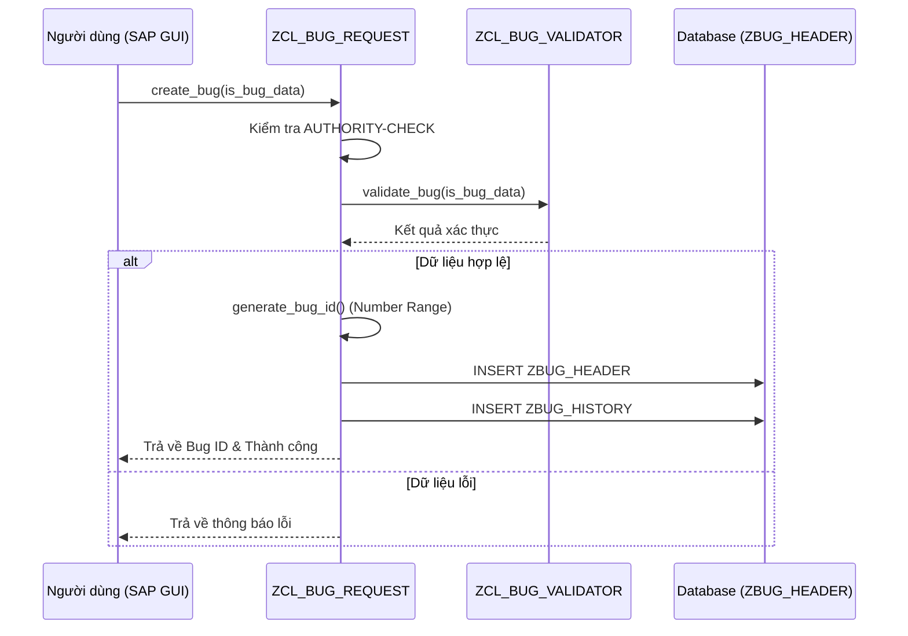
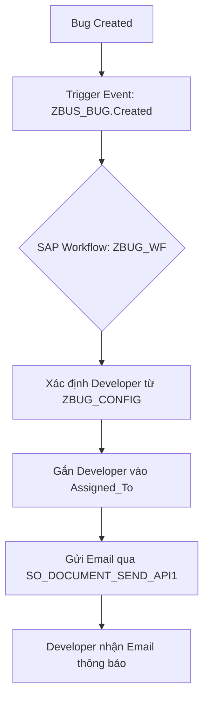
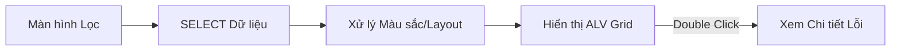
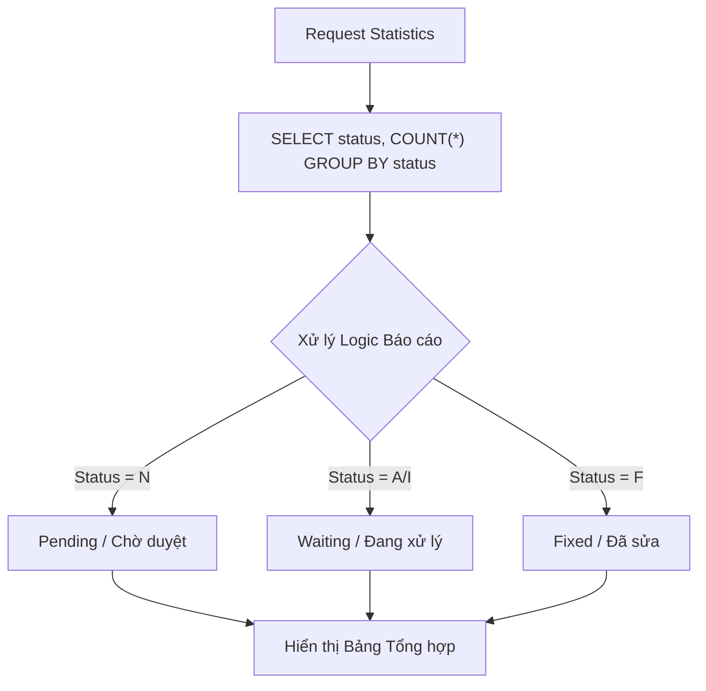
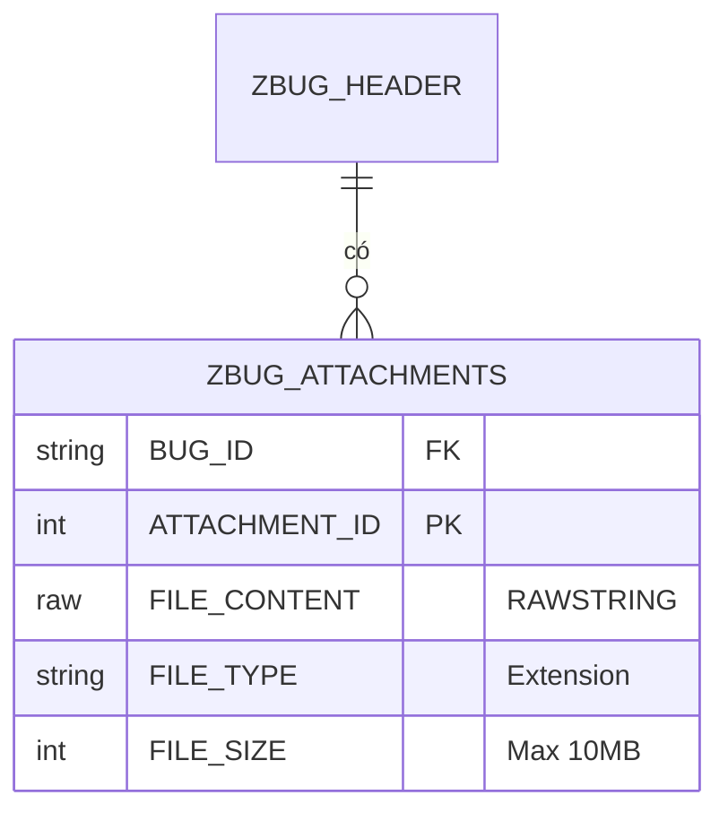

# Đặc tả Kỹ thuật Chi tiết: Hệ thống Quản lý Lỗi (ZBUG)

Tài liệu này cung cấp cái nhìn sâu sắc về cách thức 5 yêu cầu cốt lõi được triển khai trong hệ thống SAP ABAP ZBUG, bao gồm các sơ đồ quy trình và kiến trúc dữ liệu.

## 1. Cho phép người dùng ghi nhận lỗi (Bug Recording)
Quy trình ghi nhận lỗi được thiết kế với sự chú trọng vào tính toàn vẹn dữ liệu và phân quyền.

- **Lớp Xử lý Chính (`ZCL_BUG_REQUEST`)**: 
    - **Kiểm tra Phân quyền**: Sử dụng Authorization Object `Z_BUG_AUTH` (Activity `01`).
    - **Tạo ID**: Sử dụng FM `NUMBER_GET_NEXT` để tạo ID định dạng `BUG-YYYYMMDD-XXX`.
- **Cơ sở Dữ liệu**: Thông tin chính lưu vào `ZBUG_HEADER`, nhật ký ghi vào `ZBUG_HISTORY`.

## 2. Gửi Email đến team Developer (Email Notification)
Thông báo được tích hợp sâu thông qua hệ thống Workflow và Email chuẩn của SAP.

- **Kích hoạt**: Gọi `SWE_EVENT_CREATE` ngay khi tạo Bug thành công.
- **Email Content**: Chứa ID, Tiêu đề, Priority và link truy cập nhanh thông qua cấu hình SMTP chuẩn.

## 3. Hiển thị danh sách lỗi trong ALV và SmartForm
Hệ thống sử dụng `CL_SALV_TABLE` để cung cấp giao diện báo cáo mạnh mẽ.

- **ALV Enhancements**: 
    - Tô màu Priority (Vàng: High, Đỏ: Critical).
    - Hỗ trợ đầy đủ chức năng Sort, Filter, Export Excel.
- **SmartForm (`ZBUG_FORM`)**: Dùng để xuất phiếu in chi tiết lỗi, bao gồm cả lịch sử thay đổi từ `ZBUG_ITEMS`.

## 4. Thống kê số lỗi (Bug Statistics)
Khả năng phân tích dữ liệu nhanh chóng thông qua truy vấn tập hợp.

- **Hiệu năng**: Thay vì đọc từng dòng, hệ thống sử dụng `GROUP BY` tại tầng Database để tối ưu tốc độ.

## 5. Đính kèm bằng chứng (Attachments)
Quản lý tệp tin binary trực tiếp trong SAP.

- **Kiểm soát**: 
    - **Dung lượng**: Check `FILE_SIZE` <= 10MB.
    - **Định dạng**: Whitelist (JPG, PNG, PDF, LOG...).
- **Xử lý**: Sử dụng `CL_GUI_FRONTEND_SERVICES` để hỗ trợ Upload/Download linh hoạt.

---
> [!IMPORTANT]
> Toàn bộ kiến trúc tuân thủ mô hình phân tầng, tách biệt Logic nghiệp vụ và Giao diện người dùng.
