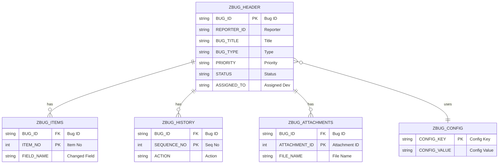
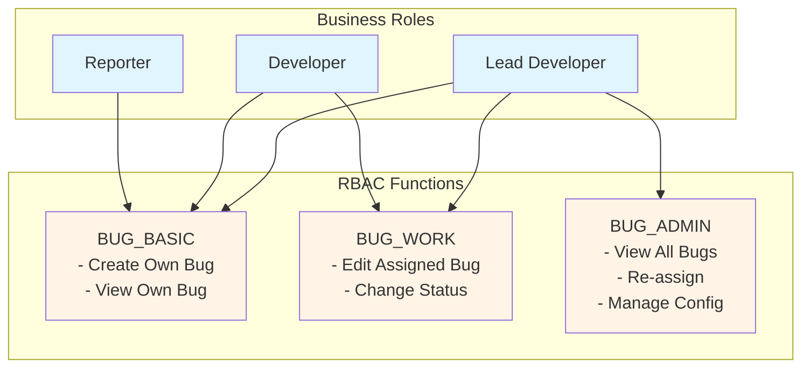
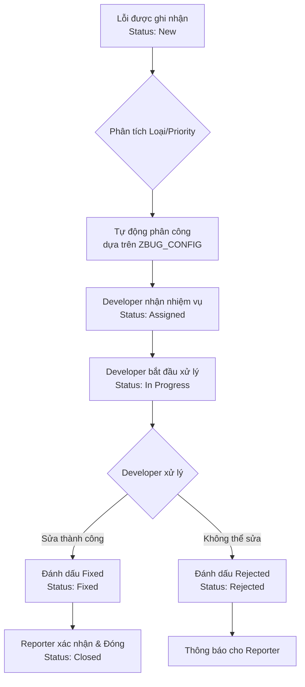
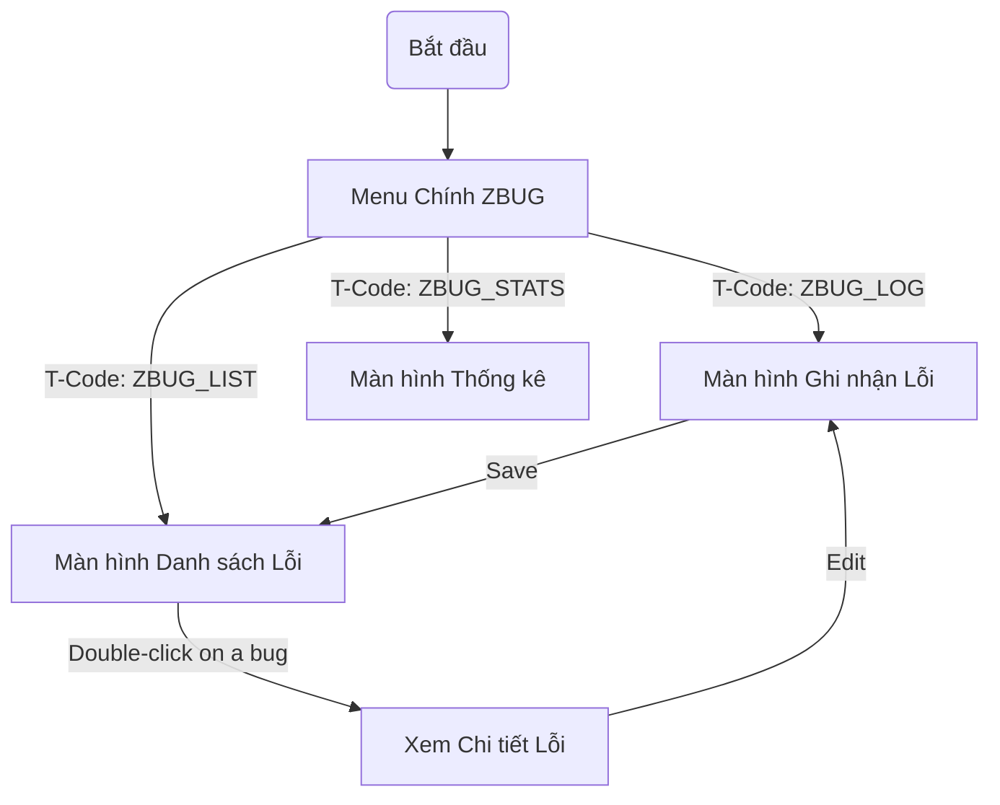

# Giai đoạn 1: Yêu cầu & Thiết kế (Solo Developer)

**Thời gian**: Tuần 1-2  
**← [Quay lại README](README.md)** | **Tiếp theo: [Giai đoạn 2: Phát triển](Phase2_Development.md)**

---

## Mục lục

1. [Nhiệm vụ Tuần 1: Phân tích & Thiết kế Sơ bộ](#nhiệm-vụ-tuần-1-phân-tích--thiết-kế-sơ-bộ)
2. [Nhiệm vụ Tuần 2: Thiết kế Chi tiết](#nhiệm-vụ-tuần-2-thiết-kế-chi-tiết)
3. [Thiết kế Mô hình Dữ liệu](#thiết-kế-mô-hình-dữ-liệu)
4. [Thiết kế Workflow](#thiết-kế-workflow)
5. [Thiết kế UI/UX](#thiết-kế-uiux)
6. [Đặc tả Kỹ thuật](#đặc-tả-kỹ-thuật)
7. [Tham khảo](#tham-khảo)

---

## Nhiệm vụ Tuần 1: Phân tích & Thiết kế Sơ bộ

Trong tuần này, tôi sẽ tập trung vào việc phân tích các yêu cầu và đưa ra các thiết kế ở mức cao.

### Phân tích Yêu cầu
- [ ] Xem lại và phân tích toàn bộ yêu cầu nghiệp vụ và chức năng từ tài liệu dự án.
- [ ] Tài liệu hóa các yêu cầu phi chức năng (hiệu năng, bảo mật, tuân thủ).
- [ ] Tạo ma trận truy vết yêu cầu để ánh xạ yêu cầu với các tính năng và trường hợp kiểm thử.

### Thiết kế Sơ bộ
- [ ] **Mô hình dữ liệu**:
  - Xác định tất cả các thực thể dữ liệu cần thiết (Bug, History, Attachments, Config).
  - Thiết kế cấu trúc sơ bộ cho 5 bảng Z-tables.
- [ ] **Workflow**:
  - Xác định logic và quy tắc phân công developer.
  - Thiết kế sơ đồ luồng quy trình workflow ở mức cao.
- [ ] **UI/UX**:
  - Xác định các màn hình cần thiết và luồng tương tác người dùng.
  - Tạo mockup/wireframe cho các màn hình chính (Ghi nhận lỗi, Danh sách lỗi, Thống kê).
- [ ] **Tích hợp & Bảo mật**:
  - Xác định các điểm tích hợp chính (User Management, Email).
  - Xác định mô hình phân quyền (Roles, Authorization Objects).
- [ ] **Lập kế hoạch kiểm thử**:
  - Xác định chiến lược và các cấp độ kiểm thử (Unit, Integration, UAT).
  - Xác định các kịch bản kiểm thử chính.

**Sản phẩm**:
- Tài liệu đặc tả yêu cầu (đã làm rõ).
- Thiết kế sơ bộ cho mô hình dữ liệu, workflow, và UI.
- Kế hoạch kiểm thử sơ bộ.

---

## Nhiệm vụ Tuần 2: Thiết kế Chi tiết

Tuần này, tôi sẽ hoàn thiện các thiết kế chi tiết cho từng thành phần của hệ thống.

### Thiết kế Data Dictionary & Lớp ABAP
- [ ] **Data Dictionary**:
  - Hoàn thiện thiết kế chi tiết cho 5 bảng: `ZBUG_HEADER`, `ZBUG_ITEMS`, `ZBUG_HISTORY`, `ZBUG_CONFIG`, `ZBUG_ATTACHMENTS`.
  - Định nghĩa đầy đủ các trường, kiểu dữ liệu, khóa chính, khóa ngoại, và chỉ mục.
  - Tạo các domain và data element cần thiết.
- [ ] **Lớp ABAP**:
  - Thiết kế chi tiết cấu trúc và phương thức cho các lớp ABAP chính: `ZCL_BUG_REQUEST`, `ZCL_BUG_VALIDATOR`, `ZCL_BUG_STATISTICS`, `ZCL_BUG_ATTACHMENT`, `ZCL_BUG_REPORT`.
  - Định nghĩa chữ ký phương thức, tham số và kiểu trả về.

### Thiết kế Workflow & Tích hợp
- [ ] **Workflow**:
  - Thiết kế chi tiết mẫu workflow `ZBUG_WF` trong SWDD, bao gồm các bước, nhiệm vụ, và sự kiện.
  - Thiết kế logic xác định agent (Agent Determination).
- [ ] **Tích hợp**:
  - Thiết kế chi tiết mẫu SmartForm `ZBUG_FORM`.
  - Thiết kế các mẫu email cho thông báo.
  - Đặc tả chi tiết cách xử lý upload/download file đính kèm.

### Thiết kế UI & Kế hoạch Kiểm thử
- [ ] **UI**:
  - Hoàn thiện wireframe chi tiết cho tất cả các màn hình.
  - Thiết kế cấu hình chi tiết cho các báo cáo ALV (cột, bộ lọc, toolbar).
- [ ] **Kiểm thử**:
  - Hoàn thiện kế hoạch kiểm thử chi tiết.
  - Tạo các mẫu trường hợp kiểm thử (Test Case Templates).
  - Xác định dữ liệu kiểm thử cần thiết.

**Sản phẩm**:
- Thiết kế Data Dictionary và Lớp ABAP hoàn chỉnh.
- Thiết kế Workflow và các điểm tích hợp chi tiết.
- Wireframes và kế hoạch kiểm thử cuối cùng.

---

## Thiết kế Mô hình Dữ liệu

**Tham khảo**: 
- **[Hướng dẫn Data Dictionary](../../ABAP-Guides/02_SAP_ABAP_DATA_DICTIONARY_GUIDE.md)**

Dữ liệu của hệ thống ZBUG được cấu trúc xoay quanh 5 bảng chính, với `ZBUG_HEADER` là bảng trung tâm.

### Sơ đồ Quan hệ Thực thể (ERD)



### Chi tiết các Bảng
- **ZBUG_HEADER**: Lưu thông tin chính của lỗi (tiêu đề, loại, trạng thái, người báo cáo, người xử lý).
- **ZBUG_ITEMS**: Lưu lịch sử thay đổi chi tiết của từng trường dữ liệu trong lỗi.
- **ZBUG_HISTORY**: Lưu nhật ký kiểm tra (audit trail) các hành động chính (tạo, sửa, đóng).
- **ZBUG_CONFIG**: Lưu cấu hình hệ thống (vd: mapping developer, max file size).
- **ZBUG_ATTACHMENTS**: Lưu file đính kèm (nội dung file được lưu dưới dạng RAW).

---

## Thiết kế Phân quyền (RBAC)

Hệ thống sử dụng mô hình **Role-Based Access Control** để quản lý quyền truy cập, bao gồm 2 Vai trò nghiệp vụ (Business Roles) và 3 Nhóm quyền chức năng (RBAC Functions).


- **Reporter**: Chỉ có quyền `BUG_BASIC` để tạo và xem lỗi của chính mình.
- **Developer**: Có quyền `BUG_BASIC` và `BUG_WORK` để xử lý các lỗi được phân công.
- **Lead Developer**: Có tất cả các quyền, bao gồm `BUG_ADMIN` để quản trị hệ thống.

---

## Thiết kế Workflow

**Tham khảo**: **[Hướng dẫn SAP Workflow](../../SAP-General-Guides/SAP_WORKFLOW_GUIDE.md)**

### Quy trình Phân công và Xử lý Lỗi

Sơ đồ sau minh họa luồng xử lý chính của một lỗi từ khi được tạo đến khi được đóng.



### Các thành phần Workflow
- **Workflow Template**: `ZBUG_WF`
- **Tasks**: `ZBUG_ASSIGN_TASK`, `ZBUG_FIX_TASK`, `ZBUG_REJECT_TASK`.
- **Container Elements**: `BUG_ID`, `BUG_TYPE`, `PRIORITY`, `ASSIGNED_TO`, etc.

---

## Thiết kế UI/UX

**Tham khảo**: 
- **[Hướng dẫn Lập trình Màn hình](../../ABAP-Guides/06_SAP_ABAP_SCREEN_PROGRAMMING_GUIDE.md)**
- **[Hướng dẫn Lập trình ALV](../../ABAP-Guides/07_SAP_ABAP_ALV_PROGRAMMING_GUIDE.md)**

### Luồng Điều hướng Màn hình



### Mô tả các Màn hình
- **ZBUG_LOG**: Cho phép người dùng ghi nhận lỗi mới hoặc chỉnh sửa lỗi đã có.
- **ZBUG_LIST**: Màn hình chính để xem danh sách lỗi với các bộ lọc mạnh mẽ.
- **ZBUG_STATS**: Hiển thị các báo cáo và thống kê tổng quan về tình hình lỗi.
- **Chi tiết Lỗi**: (Có thể là một màn hình riêng hoặc sử dụng lại `ZBUG_LOG` ở chế độ hiển thị) để xem toàn bộ thông tin của một lỗi.

---

## Đặc tả Kỹ thuật

### Mẫu Class Definition (ZCL_BUG_REQUEST)

```abap
CLASS zcl_bug_request DEFINITION PUBLIC FINAL CREATE PRIVATE.
  PUBLIC SECTION.
    CLASS-METHODS get_instance
      RETURNING VALUE(ro_instance) TYPE REF TO zcl_bug_request.

    METHODS create_bug
      IMPORTING is_bug_data TYPE zst_bug_data
      EXPORTING ev_bug_id TYPE zbug_bug_id
                et_messages TYPE bapiret2_t.

    METHODS update_bug
      IMPORTING iv_bug_id TYPE zbug_bug_id
                is_bug_data TYPE zst_bug_data
      EXPORTING et_messages TYPE bapiret2_t.
      
    METHODS change_status
      IMPORTING iv_bug_id TYPE zbug_bug_id
                iv_new_status TYPE zbug_status
      EXPORTING et_messages TYPE bapiret2_t.

  PRIVATE SECTION.
    CLASS-DATA: go_instance TYPE REF TO zcl_bug_request.
ENDCLASS.
```

### Mẫu Data Structure (zst_bug_data)
```abap
TYPES: BEGIN OF zst_bug_data,
         reporter_id TYPE syuname,
         bug_title TYPE zbug_title,
         bug_description TYPE zbug_description,
         bug_type TYPE zbug_type,
         priority TYPE zbug_priority,
       END OF zst_bug_data.
```

*(Các ví dụ và mẫu mã khác được giữ nguyên như trong tài liệu gốc)*

---

## Tham khảo

- **[Yêu cầu Dự án](../Abap-8.md)** - Đặc tả gốc
- **[Kiến trúc Kỹ thuật](Technical_Architecture.md)** - Đặc tả kỹ thuật chi tiết
- **[Hướng dẫn Capstone](../../SAP_CAPSTONE_PROJECT_GUIDE.md)** - Hướng dẫn chung

---

## Tham chiếu Đặc tả Chi tiết

Các quyết định thiết kế trong tài liệu này được dựa trên các đặc tả chi tiết hơn có trong thư mục `note/`. Các tài liệu này cung cấp bối cảnh và yêu cầu sâu hơn cho từng thành phần.

- **[Đặc tả Data Dictionary](../note/Data_Dictionary_Spec.md)**: Chi tiết về thiết kế các bảng, trường và kiểu dữ liệu.
- **[Đặc tả Báo cáo ALV](../note/ALV_Report_Spec.md)**: Yêu cầu chi tiết cho các báo cáo danh sách và thống kê.
- **[Đặc tả Logic Màn hình](../note/Screen_Logic_Spec.md)**: Mô tả chi tiết về luồng xử lý PBO/PAI cho các màn hình.
- **[Đặc tả Class ZCL_BUG_REQUEST](../note/ZCL_BUG_REQUEST_Spec.md)**: Phân tích và thiết kế chi tiết cho lớp logic nghiệp vụ chính.
- **[Chiến lược Phân quyền](../note/auth_assignment_strategy.md)**: Phân tích sâu hơn về mô hình và chiến lược phân quyền.

---

**← [Quay lại README](README.md)** | **Tiếp theo: [Giai đoạn 2: Phát triển](Phase2_Development.md)**
