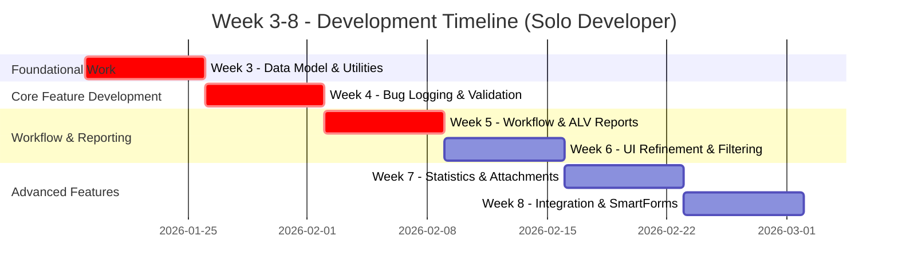

# Giai đoạn 2: Phát triển (Solo Developer)

**Thời gian**: Tuần 3-8  
**← [Quay lại README](README.md)** | **Trước: [Giai đoạn 1: Yêu cầu & Thiết kế](Phase1_Requirements_Design.md)** | **Tiếp theo: [Giai đoạn 3: Kiểm thử & QA](Phase3_Testing_QA.md)**

---

## Mục lục

1. [Tuần 3: Nền tảng & Mô hình Dữ liệu](#tuần-3-nền-tảng--mô-hình-dữ-liệu)
2. [Tuần 4: Chức năng Ghi nhận Lỗi Cốt lõi](#tuần-4-chức-năng-ghi-nhận-lỗi-cốt-lõi)
3. [Tuần 5: Triển khai Workflow & Báo cáo ALV](#tuần-5-triển-khai-workflow--báo-cáo-alv)
4. [Tuần 6: Hoàn thiện UI & Chức năng Lọc](#tuần-6-hoàn-thiện-ui--chức-năng-lọc)
5. [Tuần 7: Báo cáo Thống kê & Xử lý Đính kèm](#tuần-7-báo-cáo-thống-kê--xử-lý-đính-kèm)
6. [Tuần 8: Hoàn thiện Tích hợp & SmartForms](#tuần-8-hoàn-thiện-tích-hợp--smartforms)
7. [Ví dụ Mã](#ví-dụ-mã)
8. [Điểm Kiểm tra](#điểm-kiểm-tra)
9. [Tham khảo](#tham-khảo)

---

## Tiến độ Phát triển (Solo)

---

## Tuần 3: Nền tảng & Mô hình Dữ liệu

**Mục tiêu**: Xây dựng nền tảng vững chắc cho dự án, bao gồm cơ sở dữ liệu và các thành phần tiện ích.

- [ ] **Data Dictionary (SE11)**:
  - [ ] Tạo và kích hoạt tất cả 5 bảng: `ZBUG_HEADER`, `ZBUG_ITEMS`, `ZBUG_HISTORY`, `ZBUG_CONFIG`, `ZBUG_ATTACHMENTS`.
  - [ ] Tạo tất cả các Data Element và Domain cần thiết (ví dụ: `ZBUG_BUG_ID`, `ZBUG_STATUS`).
  - [ ] Tạo Search Help cho các trường cần thiết (ví dụ: `REPORTER_ID`).
- [ ] **Lớp Tiện ích (SE24)**:
  - [ ] Phát triển lớp `ZCL_BUG_UTILITIES` với các phương thức trợ giúp chung (ví dụ: `FORMAT_DATE`, `GET_USER_NAME`).
- [ ] **Khung kiểm thử**:
  - [ ] Thiết lập môi trường kiểm thử đơn vị (ABAP Unit).
  - [ ] Chuẩn bị dữ liệu kiểm thử ban đầu.

**Sản phẩm**: Cơ sở dữ liệu hoàn chỉnh, lớp tiện ích, môi trường kiểm thử sẵn sàng.

---

## Tuần 4: Chức năng Ghi nhận Lỗi Cốt lõi

**Mục tiêu**: Triển khai chức năng cốt lõi của hệ thống - ghi nhận một lỗi mới.

- [ ] **Phát triển Lớp ABAP (SE24)**:
  - [ ] Phát triển lớp `ZCL_BUG_VALIDATOR` với các phương thức xác thực dữ liệu đầu vào.
  - [ ] Phát triển lớp `ZCL_BUG_REQUEST` với các phương thức chính:
    - `CREATE_BUG`: Bao gồm logic xác thực, tạo ID, ghi vào CSDL.
    - `GENERATE_BUG_ID` (private): Sử dụng Number Range Object `ZBUG_ID`.
- [ ] **Phát triển UI (SE38/SE51)**:
  - [ ] Phát triển chương trình `ZBUG_LOG`.
  - [ ] Thiết kế Màn hình 0100 để người dùng nhập thông tin lỗi.
  - [ ] Viết logic PBO/PAI để xử lý tương tác người dùng và gọi đến các lớp backend.
- [ ] **Kiểm thử đơn vị**:
  - [ ] Viết và thực thi test case cho `ZCL_BUG_VALIDATOR` và `ZCL_BUG_REQUEST`.

**Sản phẩm**: Chương trình `ZBUG_LOG` hoạt động, có khả năng tạo lỗi mới và lưu vào CSDL.

---

## Tuần 5: Triển khai Workflow & Báo cáo ALV

**Mục tiêu**: Tự động hóa quy trình phân công và hiển thị dữ liệu lỗi cơ bản.

- [ ] **Workflow (SWDD)**:
  - [ ] Tạo mẫu workflow `ZBUG_WF`.
  - [ ] Thiết kế bước kích hoạt workflow sau khi tạo lỗi thành công.
  - [ ] Triển khai logic phân công developer cơ bản (dựa trên quy tắc trong `ZBUG_CONFIG`).
- [ ] **Báo cáo ALV (SE38)**:
  - [ ] Phát triển chương trình `ZBUG_LIST`.
  - [ ] Thiết kế màn hình lựa chọn (selection screen) với các bộ lọc cơ bản.
  - [ ] Sử dụng `CL_SALV_TABLE` để hiển thị danh sách lỗi.
- [ ] **Tích hợp Email**:
  - [ ] Tích hợp `SO_DOCUMENT_SEND_API1` để gửi email thông báo khi lỗi được tạo.

**Sản phẩm**: Workflow phân công được kích hoạt, báo cáo `ZBUG_LIST` hiển thị được dữ liệu.

---

## Tuần 6: Hoàn thiện UI & Chức năng Lọc

**Mục tiêu**: Cải thiện trải nghiệm người dùng và hoàn thiện chức năng báo cáo.

- [ ] **Hoàn thiện UI (SE51/SE38)**:
  - [ ] Tinh chỉnh giao diện các màn hình cho thân thiện hơn.
  - [ ] Thêm các chức năng phụ như `Clear`, `Cancel`.
- [ ] **Hoàn thiện ALV (`ZBUG_LIST`)**:
  - [ ] Triển khai logic lọc nâng cao trên màn hình lựa chọn.
  - [ ] Thêm các chức năng vào ALV toolbar (ví dụ: Refresh, Export to Excel).
  - [ ] Thêm màu sắc cho các cột Priority, Status để dễ nhận biết.
  - [ ] Triển khai chức năng double-click để xem chi tiết lỗi.

**Sản phẩm**: Giao diện người dùng hoàn thiện, báo cáo `ZBUG_LIST` với đầy đủ chức năng lọc và tương tác.

---

## Tuần 7: Báo cáo Thống kê & Xử lý Đính kèm

**Mục tiêu**: Cung cấp khả năng phân tích dữ liệu và xử lý file.

- [ ] **Báo cáo Thống kê (SE38)**:
  - [ ] Phát triển chương trình `ZBUG_STATISTICS`.
  - [ ] Phát triển lớp `ZCL_BUG_STATISTICS` để tổng hợp dữ liệu (số lỗi fixed, waiting, pending).
  - [ ] Hiển thị kết quả thống kê trên ALV.
- [ ] **Xử lý Đính kèm (SE24)**:
  - [ ] Phát triển lớp `ZCL_BUG_ATTACHMENT`.
  - [ ] Triển khai phương thức `UPLOAD_FILE` và `DOWNLOAD_FILE`.
  - [ ] Tích hợp chức năng upload vào màn hình `ZBUG_LOG`.
  - [ ] Thêm validation cho loại file và kích thước file.

**Sản phẩm**: Báo cáo thống kê hoạt động, người dùng có thể đính kèm và tải file.

---

## Tuần 8: Hoàn thiện Tích hợp & SmartForms

**Mục tiêu**: Hoàn thành các điểm tích hợp cuối cùng và chức năng in ấn.

- [ ] **Hoàn thiện Workflow & Email**:
  - [ ] Triển khai các email thông báo còn lại (Assigned, Fixed, Rejected).
  - [ ] Hoàn thiện các bước trong workflow (ví dụ: developer cập nhật trạng thái).
- [ ] **SmartForms (SMARTFORMS)**:
  - [ ] Thiết kế và phát triển SmartForm `ZBUG_FORM` để in chi tiết một lỗi.
  - [ ] Viết chương trình/logic để gọi và xuất form.
- [ ] **Kiểm thử tích hợp**:
  - [ ] Thực hiện kiểm thử toàn bộ luồng từ tạo lỗi -> phân công -> xử lý -> đóng lỗi.
  - [ ] Kiểm tra tất cả các điểm tích hợp (Email, Attachments, Forms).

**Sản phẩm**: Toàn bộ các tính năng đã được triển khai và tích hợp với nhau.

---

## Ví dụ Mã

*(Các ví dụ mã cho việc Tạo Bug, Validate Bug, Get Bug List, Upload Attachment, Calculate Statistics được giữ nguyên như trong tài liệu gốc để tham khảo kỹ thuật.)*

---

## Điểm Kiểm tra

- **Tuần 3**: CSDL đã được tạo và kích hoạt.
- **Tuần 4**: Chức năng ghi nhận lỗi hoạt động.
- **Tuần 5**: Workflow phân công được kích hoạt, ALV hiển thị dữ liệu.
- **Tuần 6**: Chức năng lọc và giao diện ALV hoàn chỉnh.
- **Tuần 7**: Báo cáo thống kê và xử lý đính kèm hoạt động.
- **Tuần 8**: Toàn bộ luồng nghiệp vụ hoạt động end-to-end.

---

## Tham khảo

- **[Giai đoạn 1: Yêu cầu & Thiết kế](Phase1_Requirements_Design.md)**
- **[Kiến trúc Kỹ thuật](Technical_Architecture.md)**
- **Các Hướng dẫn Kỹ thuật** trong file [References_Resources.md](References_Resources.md).

---

## Tham chiếu Mã nguồn

Các đoạn mã nguồn và định nghĩa đối tượng ABAP được phát triển trong giai đoạn này có thể được tham khảo chi tiết tại thư mục `code/`.

- **Các lớp ABAP (SE24)**:
  - [`ZCL_BUG_REQUEST.cls.md`](../code/ZCL_BUG_REQUEST.cls.md)
  - [`ZCL_BUG_VALIDATOR.cls.md`](../code/ZCL_BUG_VALIDATOR.cls.md)
  - [`ZCL_BUG_STATISTICS.cls.md`](../code/ZCL_BUG_STATISTICS.cls.md)
  - [`ZCL_BUG_ATTACHMENT.cls.md`](../code/ZCL_BUG_ATTACHMENT.cls.md)
  - [`ZCL_BUG_UTILITIES.cls.md`](../code/ZCL_BUG_UTILITIES.cls.md)
- **Các chương trình ABAP (SE38)**:
  - [`ZRPG_ZBUG_LOG.prog.md`](../code/ZRPG_ZBUG_LOG.prog.md)
  - [`ZRPG_ZBUG_LIST.prog.md`](../code/ZRPG_ZBUG_LIST.prog.md)
  - [`ZRPG_ZBUG_STATISTICS.prog.md`](../code/ZRPG_ZBUG_STATISTICS.prog.md)
  - [`ZRPG_ZBUG_ASSIGN.prog.md`](../code/ZRPG_ZBUG_ASSIGN.prog.md)

---

**← [Quay lại README](README.md)** | **Trước: [Giai đoạn 1: Yêu cầu & Thiết kế](Phase1_Requirements_Design.md)** | **Tiếp theo: [Giai đoạn 3: Kiểm thử & QA](Phase3_Testing_QA.md)**
