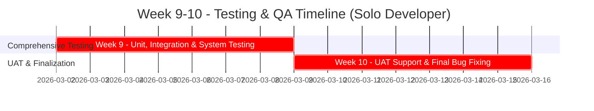

# Giai đoạn 3: Kiểm thử & Đảm bảo Chất lượng (Solo Developer)

**Thời gian**: Tuần 9-10  
**← [Quay lại README](README.md)** | **Trước: [Giai đoạn 2: Phát triển](Phase2_Development.md)** | **Tiếp theo: [Giai đoạn 4: Tài liệu & Trình bày](Phase4_Documentation_Presentation.md)**

---

## Mục lục

1. [Tuần 9: Kiểm thử Toàn diện](#tuần-9-kiểm-thử-toàn-diện)
2. [Tuần 10: Kiểm thử Chấp nhận Người dùng (UAT) & Tinh chỉnh](#tuần-10-kiểm-thử-chấp-nhận-người-dùng-uat--tinh-chỉnh)
3. [Chiến lược Kiểm thử](#chiến-lược-kiểm-thử)
4. [Kịch bản Kiểm thử](#kịch-bản-kiểm-thử)
5. [Kiểm thử Hiệu suất](#kiểm-thử-hiệu-suất)
6. [Kiểm thử Bảo mật](#kiểm-thử-bảo-mật)
7. [Quy trình Theo dõi Lỗi](#quy-trình-theo-dõi-lỗi)
8. [Tham khảo](#tham-khảo)

---

## Tiến độ Kiểm thử (Solo)

---

## Tuần 9: Kiểm thử Toàn diện

**Mục tiêu**: Đảm bảo chất lượng của từng thành phần và sự tích hợp giữa chúng.

#### Nhiệm vụ

- [ ] **Hoàn thành Kiểm thử Đơn vị (ABAP Unit)**
  - [ ] Rà soát và đảm bảo tất cả các lớp ABAP quan trọng (`ZCL_*`) đều có test class tương ứng.
  - [ ] Đảm bảo độ bao phủ mã (code coverage) đạt mục tiêu (>80%).
  - [ ] Sửa tất cả các test case bị lỗi.
- [ ] **Thực hiện Kiểm thử Tích hợp**
  - [ ] Kiểm thử luồng tích hợp giữa UI -> Lớp Business -> CSDL.
  - [ ] Kiểm thử luồng kích hoạt Workflow và gửi Email.
  - [ ] Kiểm thử tích hợp chức năng đính kèm file.
  - [ ] Kiểm thử tích hợp với SmartForms.
- [ ] **Thực hiện Kiểm thử Hệ thống**
  - [ ] Thực hiện các kịch bản kiểm thử end-to-end (từ A đến Z).
  - [ ] Kiểm thử các trường hợp biên (boundary cases) và xử lý lỗi.
- [ ] **Thực hiện Kiểm thử Hiệu suất & Bảo mật**
  - [ ] Chạy các bài kiểm tra hiệu năng cho các báo cáo và chức năng chính.
  - [ ] Kiểm tra lại các khía cạnh bảo mật và phân quyền.

**Sản phẩm**: Báo cáo kết quả kiểm thử đơn vị và tích hợp, danh sách các lỗi được phát hiện.

---

## Tuần 10: Kiểm thử Chấp nhận Người dùng (UAT) & Tinh chỉnh

**Mục tiêu**: Xác nhận hệ thống đáp ứng yêu cầu người dùng và hoàn thiện sản phẩm.

#### Nhiệm vụ

- [ ] **Chuẩn bị và Hỗ trợ UAT**
  - [ ] Chuẩn bị môi trường và dữ liệu cho UAT.
  - [ ] Viết tài liệu kịch bản và hướng dẫn UAT cho người dùng.
  - [ ] Hỗ trợ người dùng trong quá trình thực hiện UAT, ghi nhận phản hồi.
- [ ] **Xử lý Phản hồi và Sửa lỗi**
  - [ ] Tổng hợp và phân tích phản hồi từ UAT.
  - [ ] Ưu tiên và thực hiện các tinh chỉnh cần thiết.
  - [ ] Sửa các lỗi cuối cùng được phát hiện trong UAT.
- [ ] **Kiểm thử Hồi quy (Regression Testing)**
  - [ ] Thực hiện lại các bài kiểm thử quan trọng để đảm bảo các thay đổi không gây ra lỗi mới.
- [ ] **Đóng băng Mã nguồn (Code Freeze)**
  - [ ] Hoàn tất việc sửa lỗi và chuẩn bị cho việc chuyển giao.

**Sản phẩm**: Biên bản nghiệm thu UAT, hệ thống đã được tinh chỉnh và sẵn sàng để triển khai.

---

## Chiến lược Kiểm thử

Là một nhà phát triển duy nhất, tôi sẽ áp dụng một quy trình kiểm thử nhiều lớp để đảm bảo chất lượng:
1.  **Kiểm thử Đơn vị (Unit Testing)**: Sử dụng ABAP Unit để kiểm thử logic trong từng phương thức của các lớp ABAP.
2.  **Kiểm thử Tích hợp (Integration Testing)**: Kiểm tra sự tương tác giữa các thành phần khác nhau (UI, Backend, Workflow, Email).
3.  **Kiểm thử Hệ thống (System Testing)**: Kiểm thử toàn bộ ứng dụng như một hộp đen, dựa trên các kịch bản người dùng.
4.  **Kiểm thử Chấp nhận Người dùng (UAT)**: Người dùng cuối (key user) kiểm thử để xác nhận hệ thống đáp ứng nhu cầu.

---

## Kịch bản Kiểm thử

### Kịch bản 1: Ghi nhận Lỗi thành công
- **Mô tả**: Người dùng (Reporter) tạo một lỗi mới với đầy đủ thông tin hợp lệ và đính kèm file.
- **Kết quả mong đợi**: Lỗi được lưu vào CSDL với trạng thái 'New', ID được tạo tự động, email thông báo được gửi đến nhóm phát triển, file đính kèm được lưu thành công.

### Kịch bản 2: Workflow Phân công Tự động
- **Mô tả**: Một lỗi mới được tạo, hệ thống tự động phân công cho một developer dựa trên loại lỗi.
- **Kết quả mong đợi**: Trạng thái lỗi chuyển thành 'Assigned', trường `ASSIGNED_TO` được cập nhật, developer được phân công nhận email thông báo.

### Kịch bản 3: Báo cáo và Lọc Dữ liệu
- **Mô tả**: Người dùng mở báo cáo `ZBUG_LIST` và sử dụng các bộ lọc (ví dụ: Status='Fixed', Priority='High').
- **Kết quả mong đợi**: ALV chỉ hiển thị các bản ghi khớp với điều kiện lọc, chức năng xuất Excel hoạt động đúng.

### Kịch bản 4: Xử lý Lỗi của Developer
- **Mô tả**: Developer mở một lỗi được gán, cập nhật trạng thái sang 'Fixed' và thêm ghi chú giải quyết.
- **Kết quả mong đợi**: Trạng thái lỗi được cập nhật, lịch sử thay đổi được ghi lại trong `ZBUG_HISTORY`, email thông báo được gửi cho Reporter.

### Kịch bản 5: Kiểm tra Phân quyền
- **Mô tả**: Người dùng với vai trò 'Reporter' cố gắng xem lỗi của người khác.
- **Kết quả mong đợi**: Hệ thống từ chối truy cập và hiển thị thông báo lỗi phân quyền.

---

## Kiểm thử Hiệu suất

**Tham khảo**: **[Hướng dẫn Hiệu suất](../../ABAP-Guides/10_SAP_ABAP_PERFORMANCE_GUIDE.md)**

- **Mục tiêu**:
  - Báo cáo thống kê: < 2 giây.
  - Danh sách lỗi với bộ lọc (trên lượng dữ liệu lớn): < 3 giây.
  - Upload file < 10MB: < 5 giây.
- **Công cụ**: Sử dụng SQL Trace (ST05) để phân tích câu lệnh SELECT và ABAP Trace (SAT) để tìm các điểm nghẽn trong mã.

---

## Kiểm thử Bảo mật

**Tham khảo**: **[Hướng dẫn Bảo mật ABAP](../../ABAP-Guides/13_SAP_ABAP_SECURITY_GUIDE.md)**

- **Mục tiêu**: Đảm bảo người dùng chỉ có thể thực hiện các hành động được phép theo vai trò của họ.
- **Kịch bản chính**:
  - Kiểm tra các đối tượng phân quyền tùy chỉnh (`Z_BUG_*`) được gọi đúng chỗ.
  - Đăng nhập với các user có vai trò khác nhau (Reporter, Developer, Admin) để kiểm tra các giới hạn truy cập.
  - Kiểm tra không có cách nào để xem hoặc sửa dữ liệu mà không có quyền.

---

## Quy trình Theo dõi Lỗi

- **Trạng thái**: New, Assigned, In Progress, Fixed, Rejected, Closed.
- **Quy trình**: Mọi lỗi phát hiện trong giai đoạn này sẽ được ghi nhận lại chính trong hệ thống ZBUG (nếu đã đủ ổn định) hoặc qua một công cụ theo dõi khác (ví dụ: file Excel) để quản lý và sửa chữa.

---

## Tham khảo

- **[Giai đoạn 2: Phát triển](Phase2_Development.md)**
- **[Hướng dẫn Kiểm thử Đơn vị](../../ABAP-Guides/14_SAP_ABAP_UNIT_TESTING_GUIDE.md)**
- **[Hướng dẫn Kiểm thử](../../SAP-General-Guides/SAP_TESTING_GUIDE.md)**
- **[Hướng dẫn Hiệu suất](../../ABAP-Guides/10_SAP_ABAP_PERFORMANCE_GUIDE.md)**
- **[Hướng dẫn Bảo mật ABAP](../../ABAP-Guides/13_SAP_ABAP_SECURITY_GUIDE.md)**

---

**← [Quay lại README](README.md)** | **Trước: [Giai đoạn 2: Phát triển](Phase2_Development.md)** | **Tiếp theo: [Giai đoạn 4: Tài liệu & Trình bày](Phase4_Documentation_Presentation.md)**
