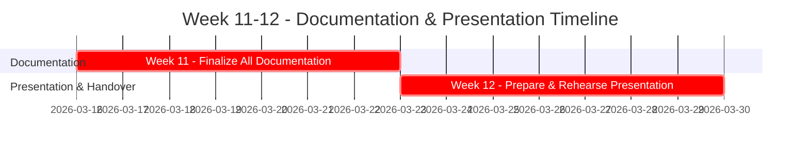

# Giai đoạn 4: Tài liệu & Trình bày (Solo Developer)

**Thời gian**: Tuần 11-12  
**← [Quay lại README](README.md)** | **Trước: [Giai đoạn 3: Kiểm thử & QA](Phase3_Testing_QA.md)**

---

## Mục lục

1. [Tuần 11: Hoàn thiện Tài liệu](#tuần-11-hoàn-thiện-tài-liệu)
2. [Tuần 12: Chuẩn bị Trình bày & Bàn giao](#tuần-12-chuẩn-bị-trình-bày--bàn-giao)
3. [Cấu trúc Tài liệu](#cấu-trúc-tài-liệu)
4. [Cấu trúc Trình bày](#cấu-trúc-trình-bày)
5. [Kịch bản Demo](#kịch-bản-demo)
6. [Chuẩn bị Q&A](#chuẩn-bị-qa)
7. [Tham khảo](#tham-khảo)

---

## Tiến độ Hoàn thiện (Solo)

---

## Tuần 11: Hoàn thiện Tài liệu

**Mục tiêu**: Hoàn thành tất cả các bộ tài liệu cần thiết cho dự án để đảm bảo khả năng bảo trì và chuyển giao kiến thức.

#### Nhiệm vụ

- [ ] **Tài liệu Kỹ thuật**:
  - [ ] Hoàn thiện tài liệu **Kiến trúc Kỹ thuật**, cập nhật các thay đổi cuối cùng.
  - [ ] Tài liệu hóa chi tiết các lớp ABAP, phương thức, và các đối tượng SAP quan trọng.
  - [ ] Tài liệu hóa cấu hình workflow, các quy tắc và các bước xử lý.
  - [ ] Thêm nhận xét (comments) vào mã nguồn ở những đoạn logic phức tạp.
- [ ] **Tài liệu Người dùng**:
  - [ ] Viết **Hướng dẫn Sử dụng** (User Manual) chi tiết cho các chức năng chính: ghi nhận lỗi, xem báo cáo, xử lý lỗi.
  - [ ] Viết **Hướng dẫn Quản trị** (Admin Guide) cho các cấu hình trong bảng `ZBUG_CONFIG`.
- [ ] **Tài liệu Kiểm thử**:
  - [ ] Tổng hợp kết quả kiểm thử (Unit Test, Integration Test, UAT).
  - [ ] Hoàn thiện tài liệu các trường hợp kiểm thử.
- [ ] **Tài liệu Bổ sung**:
  - [ ] Tạo tài liệu **Câu hỏi thường gặp (FAQ)**.
  - [ ] Đóng gói toàn bộ mã nguồn và tài liệu.

**Sản phẩm**: Bộ tài liệu hoàn chỉnh của dự án (kỹ thuật, người dùng, kiểm thử).

---

## Tuần 12: Chuẩn bị Trình bày & Bàn giao

**Mục tiêu**: Chuẩn bị cho buổi báo cáo cuối kỳ và hoàn tất các thủ tục bàn giao dự án.

#### Nhiệm vụ

- [ ] **Chuẩn bị Nội dung Trình bày**:
  - [ ] Xây dựng slide trình bày theo cấu trúc đã định.
  - [ ] Chuẩn bị các kịch bản demo cho các tính năng nổi bật.
- [ ] **Luyện tập**:
  - [ ] Chạy thử kịch bản demo nhiều lần để đảm bảo hoạt động trơn tru.
  - [ ] Luyện tập phần trình bày để đảm bảo đúng thời gian và thông điệp.
- [ ] **Chuẩn bị cho Q&A**:
  - [ ] Xem lại toàn bộ dự án và dự đoán các câu hỏi có thể được đặt ra.
  - [ ] Chuẩn bị sẵn câu trả lời súc tích và rõ ràng.
- [ ] **Hoàn tất & Bàn giao**:
  - [ ] Thực hiện buổi trình bày cuối kỳ.
  - [ ] Bàn giao toàn bộ sản phẩm: mã nguồn, tài liệu, và hệ thống đã triển khai.

**Sản phẩm**: Slide trình bày, demo hoạt động tốt, dự án được bàn giao thành công.

---

## Cấu trúc Tài liệu

1.  **Tài liệu Kỹ thuật**:
    -   **Kiến trúc hệ thống**: Sơ đồ, mô tả các tầng.
    -   **Thiết kế CSDL**: Chi tiết các bảng, trường, chỉ mục.
    -   **Thiết kế Đối tượng**: Chi tiết các lớp, chương trình, workflow.
    -   **Đánh giá Hệ thống**: [Bug_Tracking_System_Review.md](Bug_Tracking_System_Review.md) - Chi tiết kỹ thuật về 5 yêu cầu cốt lõi.
    -   **Hướng dẫn Cài đặt & Cấu hình**.
2.  **Hướng dẫn Sử dụng**:
    -   Hướng dẫn từng bước cho người dùng cuối (Reporter, Developer).
    -   Ảnh chụp màn hình minh họa.
3.  **Tài liệu Kiểm thử**:
    -   Kế hoạch kiểm thử, các trường hợp kiểm thử, và kết quả.

---

## Cấu trúc Trình bày

| Phần | Nội dung | Thời lượng |
|---|---|---|
| **1. Tổng quan** | Giới thiệu dự án, mục tiêu, phạm vi. | 5 phút |
| **2. Kiến trúc & Thiết kế** | Trình bày về kiến trúc, mô hình dữ liệu, workflow. | 10 phút |
| **3. Demo Tính năng** | Demo trực tiếp các chức năng chính của hệ thống. | 20 phút |
| **4. Kết quả & Bài học** | Kết quả đạt được, thách thức, bài học kinh nghiệm. | 5 phút |
| **5. Q&A** | Trả lời câu hỏi. | 10 phút |

---

## Kịch bản Demo

- **Demo 1: Luồng End-to-End của Reporter**
  1.  Đăng nhập với vai trò Reporter.
  2.  Tạo một lỗi mới, nhập đầy đủ thông tin, đính kèm file.
  3.  Lưu lại và nhận thông báo thành công.
  4.  Kiểm tra email nhận được thông báo lỗi đã được tạo.
- **Demo 2: Luồng của Developer & Workflow**
  1.  Hiển thị email thông báo phân công cho Developer.
  2.  Đăng nhập với vai trò Developer, xem lỗi vừa được gán.
  3.  Cập nhật trạng thái sang "In Progress", rồi sang "Fixed".
  4.  Hiển thị email thông báo trạng thái "Fixed" gửi cho Reporter.
- **Demo 3: Báo cáo & Thống kê**
  1.  Mở báo cáo `ZBUG_LIST`, sử dụng bộ lọc để tìm lỗi vừa xử lý.
  2.  Xuất danh sách ra Excel.
  3.  Mở báo cáo `ZBUG_STATISTICS` để xem tổng quan thống kê.

---

## Chuẩn bị Q&A

- **Câu hỏi về Kỹ thuật**:
  - *Tại sao lại chọn kiến trúc này?*
  - *Logic phân công developer hoạt động như thế nào? Có thể tùy chỉnh không?*
  - *Hệ thống xử lý file lớn như thế nào?*
- **Câu hỏi về Nghiệp vụ**:
  - *Hệ thống này mang lại lợi ích gì so với quy trình thủ công?*
  - *Làm thế nào để mở rộng hệ thống trong tương lai?*
- **Câu hỏi về Quản lý Dự án**:
  - *Thách thức lớn nhất khi làm dự án này một mình là gì?*
  - *Bài học kinh nghiệm rút ra là gì?*

---

## Tham khảo

- **[Giai đoạn 3: Kiểm thử & QA](Phase3_Testing_QA.md)**
- **[Kiến trúc Kỹ thuật](Technical_Architecture.md)**
- **[Hướng dẫn Capstone](../../SAP-General-Guides/SAP_CAPSTONE_PROJECT_GUIDE.md)**

---

**← [Quay lại README](README.md)** | **Trước: [Giai đoạn 3: Kiểm thử & QA](Phase3_Testing_QA.md)**
