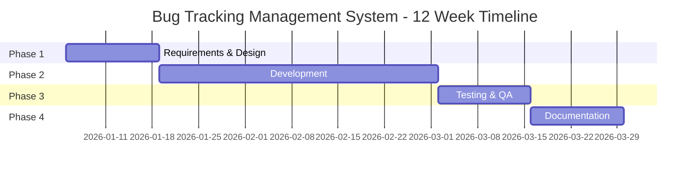

# Bug Tracking Management System

**Hệ thống Quản lý theo dõi lỗi**

---

## Tổng quan Dự án

Đây là dự án capstone SAP ABAP toàn diện kéo dài 12 tuần để phát triển Hệ thống Quản lý theo dõi Lỗi. Hệ thống tự động hóa toàn bộ quy trình quản lý lỗi từ việc ghi nhận lỗi, qua quy trình phân công developer, đến báo cáo thống kê và thông báo.

### Tính năng Chính

1. ✅ **Ghi nhận Lỗi** - Cho phép người dùng ghi nhận lỗi trong hệ thống SAP với ID tự động tạo
2. ✅ **Thông báo Email** - Gửi email đến team Developer sau khi ghi nhận lỗi
3. ✅ **Hiển thị Danh sách Lỗi** - Hiển thị danh sách lỗi trong ALV và SmartForm với bộ lọc (trạng thái, loại, độ ưu tiên, developer)
4. ✅ **Thống kê Lỗi** - Thống kê số lỗi (đã sửa, chờ duyệt, đang xử lý)
5. ✅ **Đính kèm Bằng chứng** - Đính kèm bằng chứng vào Bug System

### Công nghệ Sử dụng

- **Phát triển ABAP**: Logic lập trình cốt lõi
- **SAP Workflow**: Quy trình phân công developer
- **Báo cáo ALV**: Hiển thị dữ liệu và xuất Excel
- **SmartForms**: Tạo biểu mẫu báo cáo lỗi
- **Tích hợp Email**: Thông báo tự động
- **Xử lý Đính kèm**: Quản lý file bằng chứng

---

## Tiến độ Dự án

**Thời gian**: 12 tuần  
**Quy mô**: 1 Senior Developer  
**Loại Dự án**: Phát triển ABAP Tùy chỉnh

---

## Điều hướng

### 📋 Tài liệu Dự án

- **[00_Project_Overview.md](00_Project_Overview.md)** - Cấu trúc, tiến độ, tổng quan kiến trúc
- **[Technical_Architecture.md](Technical_Architecture.md)** - Đặc tả kỹ thuật chi tiết
- **[Bug_Tracking_System_Review.md](Bug_Tracking_System_Review.md)** - Đánh giá chi tiết hệ thống và các yêu cầu cốt lõi

### 📝 Tài liệu Giai đoạn

- **[Giai đoạn 1: Yêu cầu & Thiết kế](Phase1_Requirements_Design.md)** (Tuần 1-2)
- **[Giai đoạn 2: Phát triển](Phase2_Development.md)** (Tuần 3-8)
- **[Giai đoạn 3: Kiểm thử & QA](Phase3_Testing_QA.md)** (Tuần 9-10)
- **[Giai đoạn 4: Tài liệu & Trình bày](Phase4_Documentation_Presentation.md)** (Tuần 11-12)

### 📚 Tài nguyên

- **[Tham khảo & Tài nguyên](References_Resources.md)** - Hướng dẫn SAP, mã giao dịch, thực hành tốt nhất

---

## Cấu trúc Nhóm

| Vai trò | Trọng tâm Chính |
|------|--------------|
| **Solo Senior ABAP Developer** | Full-Stack Development (Data, Backend, UI, Workflow, Integration, Testing, Docs) |

---

## Bắt đầu Nhanh

### Hướng dẫn cho Developer

1. **Đọc README này** để hiểu cấu trúc dự án
2. **Xem lại [00_Project_Overview.md](00_Project_Overview.md)** để biết vai trò và tiến độ
3. **Kiểm tra tài liệu giai đoạn** để biết nhiệm vụ chi tiết
4. **Tham khảo [Technical_Architecture.md](Technical_Architecture.md)** để biết chi tiết kỹ thuật
5. **Sử dụng [References_Resources.md](References_Resources.md)** để xem hướng dẫn và ví dụ SAP

### Cho Người Xem xét Dự án

1. Bắt đầu với README này để xem tổng quan dự án
2. Xem lại [00_Project_Overview.md](00_Project_Overview.md) để biết phạm vi dự án
3. Kiểm tra [Technical_Architecture.md](Technical_Architecture.md) để biết thiết kế hệ thống
4. Xem lại **[Bug_Tracking_System_Review.md](Bug_Tracking_System_Review.md)** để biết chi tiết triển khai 5 yêu cầu chính
5. Xem lại tài liệu giai đoạn để biết chi tiết triển khai cụ thể theo từng tuần
5. Kiểm tra các sản phẩm trong mỗi tài liệu giai đoạn

---

## Tài liệu Gốc & Mã nguồn

Ngoài bộ tài liệu được biên soạn lại trong thư mục `solo/` này, dự án còn có các tài liệu đặc tả chi tiết và mã nguồn tham khảo ở các thư mục gốc.

- **[Thư mục `code/`](../code/)**: Chứa các đoạn mã nguồn ABAP (ví dụ: định nghĩa class, chương trình).
- **[Thư mục `note/`](../note/)**: Chứa các đặc tả kỹ thuật chi tiết ban đầu (ví dụ: đặc tả CSDL, đặc tả màn hình ALV).

Các tài liệu này đóng vai trò là nguồn tham khảo chi tiết cho các quyết định thiết kế và triển khai.

---

## Danh sách Kiểm tra Sản phẩm Chính

### Sản phẩm Kỹ thuật
- [ ] Bảng Cơ sở Dữ liệu (5 bảng)
- [ ] Lớp ABAP (5+ lớp)
- [ ] Chương trình ABAP (4 chương trình)
- [ ] Mẫu Workflow (ZBUG_WF)
- [ ] SmartForm (ZBUG_FORM)
- [ ] Mẫu Email (4+ mẫu)
- [ ] Xử lý Đính kèm File

### Sản phẩm Tài liệu
- [ ] Tài liệu Thiết kế Kỹ thuật
- [ ] Hướng dẫn Người dùng
- [ ] Hướng dẫn Quản trị viên
- [ ] Tài liệu Kiểm thử

### Sản phẩm Dự án
- [ ] Hệ thống Hoạt động
- [ ] Mã Nguồn
- [ ] Trường hợp Kiểm thử & Kết quả
- [ ] Trình bày & Demo

---

## Trạng thái Dự án

| Giai đoạn | Trạng thái | Tiến độ |
|-------|--------|----------|
| Giai đoạn 1: Yêu cầu & Thiết kế | 🟡 Đang tiến hành | 0% |
| Giai đoạn 2: Phát triển | ⚪ Chưa bắt đầu | 0% |
| Giai đoạn 3: Kiểm thử & QA | ⚪ Chưa bắt đầu | 0% |
| Giai đoạn 4: Tài liệu & Trình bày | 🟢 Hoàn thành | 100% |

**Chú giải**: 🟢 Hoàn thành | 🟡 Đang tiến hành | ⚪ Chưa bắt đầu

---

## Tiêu chí Thành công

1. ✅ Tất cả 5 tính năng được triển khai và hoạt động
2. ✅ Quy trình phân công developer hoạt động
3. ✅ Tất cả kiểm thử đạt (Unit, Integration, UAT)
4. ✅ Tài liệu hoàn chỉnh
5. ✅ Đạt được sự chấp nhận người dùng
6. ✅ Trình bày thành công

---

## Tài liệu Liên quan

- **[Yêu cầu Dự án](../Abap-8.md)** - Đặc tả dự án gốc
- **[Hướng dẫn Dự án Capstone SAP](../../SAP-General-Guides/SAP_CAPSTONE_PROJECT_GUIDE.md)** - Hướng dẫn capstone chung
- **[Tham khảo & Tài nguyên](References_Resources.md)** - Comprehensive SAP guides và resources

---

**Cập nhật lần cuối**: 2026  
**Phiên bản Dự án**: 1.0 (Solo Developer Version)
**Trạng thái**: Giai đoạn Kiểm thử & Tài liệu (Hoàn tất phần tài liệu cốt lõi)
