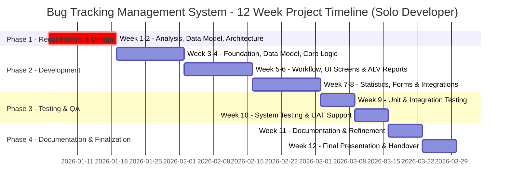
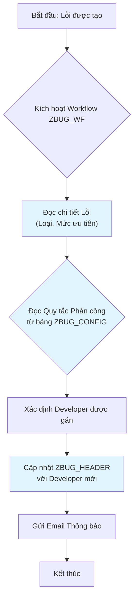

# Kế hoạch Phát triển Toàn diện (Solo Developer)

**← [Quay lại README](README.md)**

---

## 1. Giới thiệu

Tài liệu này là bản kế hoạch tổng hợp, đóng vai trò là kim chỉ nam cho việc phát triển dự án "Hệ thống Quản lý Theo dõi Lỗi (ZBUG)" bởi một nhà phát triển duy nhất (Solo Developer). Nó tổng hợp các thông tin quan trọng nhất từ các tài liệu thiết kế, kiến trúc và kế hoạch chi tiết thành một tài liệu duy nhất, dễ theo dõi.

---

## 2. Tổng quan Dự án

**Tên Dự án**: Hệ thống Quản lý theo dõi Lỗi (ZBUG)  
**Thời gian**: 12 tuần  
**Mục tiêu**:
1.  **Tự động hóa Quản lý Lỗi**: Tối ưu hóa quy trình ghi nhận và xử lý lỗi.
2.  **Phân công Developer**: Triển khai quy trình phân công developer linh hoạt, dựa trên quy tắc.
3.  **Báo cáo Toàn diện**: Cung cấp khả năng phân tích và báo cáo thống kê.
4.  **Trải nghiệm Người dùng**: Tạo giao diện trực quan cho người báo lỗi và developer.
5.  **Tích hợp**: Tích hợp liền mạch với hệ thống quản lý người dùng và email của SAP.

---

## 3. Vai trò & Trách nhiệm

### Solo Senior ABAP Developer

Là một nhà phát triển duy nhất, tôi sẽ đảm nhận tất cả các vai trò và trách nhiệm trong toàn bộ vòng đời dự án.

-   **Trọng tâm Chính**: Full-Stack Development (Data, Backend, UI, Workflow, Integration, Testing, Documentation).
-   **Trách nhiệm Chính**:
    -   **Phân tích & Thiết kế**: Phân tích yêu cầu, thiết kế kiến trúc, mô hình dữ liệu, và quy trình.
    -   **Phát triển Backend**: Xây dựng CSDL, các lớp ABAP Objects, và logic nghiệp vụ.
    -   **Phát triển Frontend**: Xây dựng các màn hình SAP GUI (Screen Painter) và báo cáo ALV.
    -   **Workflow & Tích hợp**: Triển khai SAP Workflow, tích hợp email và SmartForms.
    -   **Kiểm thử & Đảm bảo Chất lượng**: Thực hiện kiểm thử đơn vị, tích hợp, hệ thống và hỗ trợ UAT.
    -   **Tài liệu & Quản lý Dự án**: Viết tài liệu kỹ thuật, hướng dẫn người dùng và quản lý tiến độ dự án.

---

## 4. Kế hoạch Tổng thể (12 Tuần)

---

## 5. Các Thành phần Kỹ thuật Chính

### 5.1. Cơ sở dữ liệu (Database Tables)

| Tên Bảng | Mô tả |
| :--- | :--- |
| `ZBUG_HEADER` | Bảng chính, lưu thông tin tổng quan của mỗi lỗi. |
| `ZBUG_ITEMS` | Lưu lịch sử thay đổi chi tiết của từng trường. |
| `ZBUG_HISTORY` | Bảng nhật ký kiểm toán (audit trail) cho các hành động chính. |
| `ZBUG_CONFIG` | Bảng cấu hình hệ thống, đặc biệt là các quy tắc phân công tự động. |
| `ZBUG_ATTACHMENTS` | Lưu trữ các tệp tin đính kèm (dạng nhị phân). |

### 5.2. Lớp ABAP (ABAP Classes)

| Tên Lớp | Mô tả |
| :--- | :--- |
| `ZCL_BUG_REQUEST` | Lớp trung tâm xử lý logic nghiệp vụ: `create_bug`, `update_bug`, `reassign_bug`. |
| `ZCL_BUG_VALIDATOR` | Lớp tiện ích chứa các logic xác thực dữ liệu. |
| `ZCL_BUG_STATISTICS` | Lớp tính toán và tổng hợp dữ liệu thống kê cho báo cáo. |
| `ZCL_BUG_ATTACHMENT` | Lớp xử lý logic upload, download file đính kèm. |
| `ZCL_BUG_REPORT` | Lớp hỗ trợ logic chung cho các báo cáo ALV (ví dụ: xây dựng field catalog). |
| `ZCL_BUG_UTILITIES` | Lớp chứa các hàm tiện ích dùng chung (ví dụ: định dạng ngày, xử lý chuỗi). |

### 5.3. Chương trình (Programs & Screens)

| Tên Chương trình | T-Code (dự kiến) | Mô tả |
| :--- | :--- | :--- |
| `ZRPG_ZBUG_LOG` | `ZBUG_LOG` | Giao diện ghi nhận và cập nhật lỗi. |
| `ZRPG_ZBUG_LIST` | `ZBUG_LIST` | Báo cáo ALV danh sách lỗi với bộ lọc. |
| `ZRPG_ZBUG_STATISTICS`| `ZBUG_STATS` | Báo cáo ALV hiển thị thống kê lỗi. |
| `ZRPG_ZBUG_ASSIGN` | `ZBUG_ASSIGN`| Giao diện phân công lại lỗi cho Admin, gọi phương thức `reassign_bug` của `ZCL_BUG_REQUEST`. |

### 5.4. Workflow

| Tên Workflow | Mô tả |
| :--- | :--- |
| `ZBUG_WF` | Workflow Template chính, xử lý quy trình phân công tự động khi một lỗi mới được tạo. |

### 5.5. Forms

| Tên Form | Mô tả |
| :--- | :--- |
| `ZBUG_FORM` | SmartForm để in chi tiết một lỗi, bao gồm thông tin chính, lịch sử và các ghi chú. |

### 5.6. Đối tượng Phân quyền (Authorization Objects)

| Tên Đối tượng | Mô tả |
| :--- | :--- |
| `Z_BUG_CREATE` | Kiểm soát quyền tạo lỗi mới. |
| `Z_BUG_VIEW` | Kiểm soát quyền xem lỗi (phân cấp theo chủ sở hữu, người được gán, hoặc tất cả). |
| `Z_BUG_UPDATE` | Kiểm soát quyền cập nhật lỗi. |
| `Z_BUG_ASSIGN` | Kiểm soát quyền gán hoặc gán lại lỗi cho người khác. |
| `Z_BUG_ADMIN` | Cung cấp quyền quản trị toàn hệ thống (xem/thay đổi mọi thứ). |

### 5.7. Sơ đồ Luồng Logic Chính

#### Luồng Phân công Tự động

Sơ đồ này minh họa cách workflow `ZBUG_WF` sử dụng bảng cấu hình `ZBUG_CONFIG` để tự động phân công một lỗi mới.

---

## 6. Kế hoạch Chi tiết theo Giai đoạn

### Giai đoạn 1: Yêu cầu & Thiết kế (Tuần 1-2)
-   **Nhiệm vụ**: Phân tích yêu cầu, thiết kế kiến trúc tổng thể, mô hình dữ liệu chi tiết, quy trình workflow, và giao diện người dùng (wireframes). Lập kế hoạch kiểm thử sơ bộ. Tạo các đối tượng phân quyền.
-   **Sản phẩm**: Bộ tài liệu thiết kế kỹ thuật hoàn chỉnh, bao gồm tất cả các đối tượng trong mục 5.

### Giai đoạn 2: Phát triển (Tuần 3-8)
-   **Tuần 3**: **Nền tảng**: Tạo tất cả các đối tượng Data Dictionary (bảng, domain, data element) và lớp tiện ích `ZCL_BUG_UTILITIES`.
-   **Tuần 4**: **Chức năng Cốt lõi**: Phát triển lớp `ZCL_BUG_REQUEST`, `ZCL_BUG_VALIDATOR` và màn hình `ZBUG_LOG` để cho phép tạo lỗi.
-   **Tuần 5**: **Workflow & ALV**:
    -   Triển khai workflow `ZBUG_WF` để tự động phân công, trong đó logic workflow sẽ đọc bảng `ZBUG_CONFIG` để xác định người được gán.
    -   Phát triển báo cáo `ZRPG_ZBUG_LIST` cơ bản, sử dụng lớp `ZCL_BUG_REPORT` để hỗ trợ logic ALV.
-   **Tuần 6**: **Hoàn thiện UI & Admin**:
    -   Tinh chỉnh giao diện `ZRPG_ZBUG_LOG` và `ZRPG_ZBUG_LIST` (thêm bộ lọc nâng cao, layout, v.v.).
    -   Phát triển chương trình `ZRPG_ZBUG_ASSIGN` cho Admin, chương trình này sẽ gọi một phương thức `reassign_bug` trong lớp `ZCL_BUG_REQUEST`.
-   **Tuần 7**: **Thống kê & Đính kèm**:
    -   Phát triển lớp `ZCL_BUG_STATISTICS` để tổng hợp dữ liệu.
    -   Phát triển báo cáo `ZRPG_ZBUG_STATISTICS` sử dụng `ZCL_BUG_STATISTICS` và `ZCL_BUG_REPORT`.
    -   Phát triển chức năng xử lý file đính kèm với lớp `ZCL_BUG_ATTACHMENT`.
-   **Tuần 8**: **Tích hợp & Forms**: Hoàn thiện tích hợp email, workflow và phát triển SmartForm `ZBUG_FORM`.
-   **Sản phẩm**: Toàn bộ các tính năng của hệ thống được triển khai.

### Giai đoạn 3: Kiểm thử & Đảm bảo Chất lượng (Tuần 9-10)
-   **Tuần 9**: **Kiểm thử Toàn diện**: Thực hiện Unit Test (ABAP Unit), Integration Test, và System Test. Kiểm tra hiệu năng và bảo mật.
-   **Tuần 10**: **UAT & Tinh chỉnh**: Chuẩn bị và hỗ trợ người dùng thực hiện UAT. Sửa các lỗi cuối cùng và tinh chỉnh hệ thống dựa trên phản hồi.
-   **Sản phẩm**: Báo cáo kết quả kiểm thử, biên bản nghiệm thu UAT, hệ thống ổn định.

### Giai đoạn 4: Tài liệu & Trình bày (Tuần 11-12)
-   **Tuần 11**: **Hoàn thiện Tài liệu**: Viết và hoàn thiện các tài liệu kỹ thuật, hướng dẫn sử dụng và tài liệu kiểm thử.
-   **Tuần 12**: **Chuẩn bị Báo cáo**: Xây dựng slide, chuẩn bị kịch bản demo, và luyện tập cho buổi trình bày cuối kỳ.
-   **Sản phẩm**: Bộ tài liệu hoàn chỉnh, slide trình bày và hệ thống sẵn sàng để bàn giao.

---

## 7. Chiến lược Kiểm thử & Đảm bảo Chất lượng

-   **Kiểm thử Đơn vị**: Sử dụng ABAP Unit để kiểm thử logic của từng phương thức trong các lớp ABAP (`ZCL_BUG_REQUEST`, `ZCL_BUG_VALIDATOR`, v.v.), mục tiêu độ bao phủ mã > 80%.
-   **Kiểm thử Tích hợp**: Kiểm tra sự tương tác giữa các thành phần: UI ↔ Backend, Backend ↔ Workflow (`ZBUG_WF`), Backend ↔ Email.
-   **Kiểm thử Hệ thống**: Thực hiện các kịch bản người dùng end-to-end để đảm bảo hệ thống hoạt động đúng như mong đợi.
-   **Kiểm thử Chấp nhận Người dùng (UAT)**: Người dùng cuối (key user) kiểm thử để xác nhận hệ thống đáp ứng đúng nhu-cầu nghiệp vụ.
-   **Kiểm thử Hiệu suất & Bảo mật**:
    -   Đảm bảo các báo cáo ALV chạy nhanh với lượng dữ liệu lớn.
    -   Kiểm thử chi tiết các vai trò (Reporter, Developer, Admin) và các đối tượng phân quyền (`Z_BUG_CREATE`, `Z_BUG_VIEW`, v.v.) để đảm bảo người dùng chỉ có thể thực hiện các hành động được phép.

---

## 8. Sản phẩm Bàn giao Cuối cùng

1.  **Mã nguồn**: Toàn bộ các đối tượng ABAP đã phát triển (Bảng, Lớp, Chương trình, Workflow, Form, Đối tượng Phân quyền, v.v.).
2.  **Tài liệu Kỹ thuật**: Bao gồm tài liệu kiến trúc, thiết kế chi tiết.
3.  **Tài liệu Người dùng**: Hướng dẫn sử dụng cho Reporter, Developer và Admin.
4.  **Tài liệu Kiểm thử**: Kế hoạch kiểm thử và báo cáo kết quả.
5.  **Slide Trình bày**: Nội dung cho buổi báo cáo cuối kỳ.
6.  **Hệ thống đã triển khai**: Hệ thống ZBUG hoạt động trên môi trường SAP.
