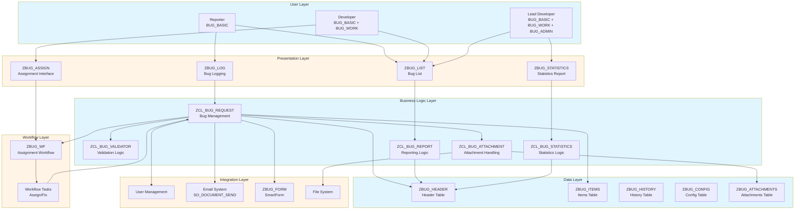
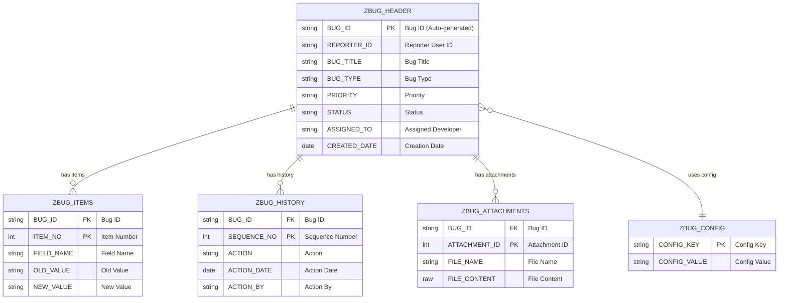
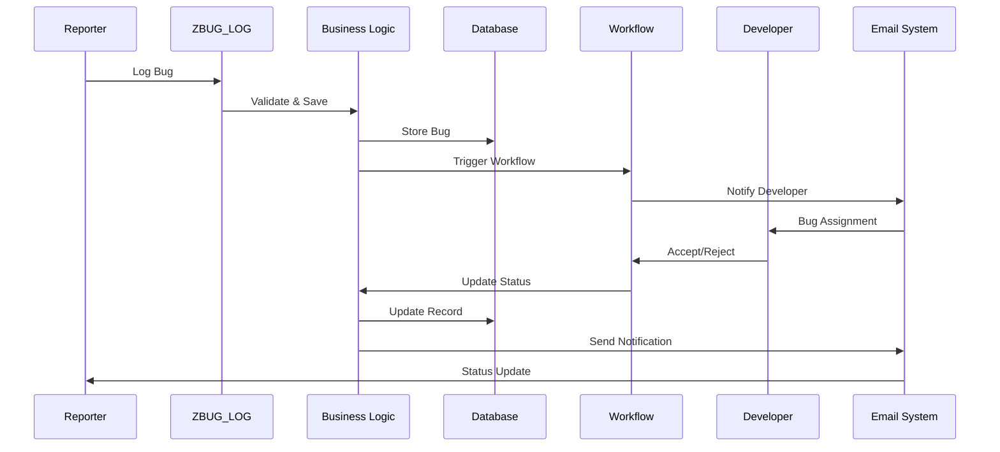
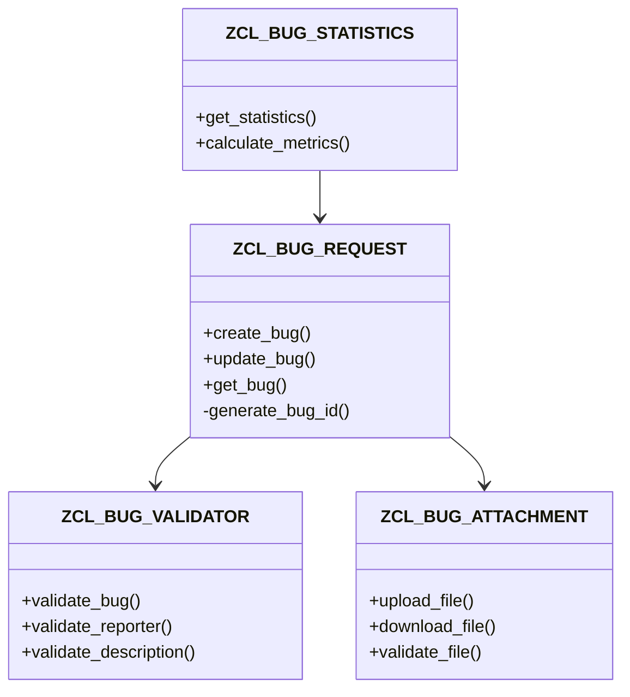

# Kiến trúc Kỹ thuật (Solo Developer)

**← [Quay lại README](README.md)**

---

## Mục lục

1. [Kiến trúc Hệ thống](#kiến-trúc-hệ-thống)
2. [Mô hình Dữ liệu](#mô-hình-dữ-liệu)
3. [Sơ đồ Trình tự](#sơ-đồ-trình-tự)
4. [Sơ đồ Lớp](#sơ-đồ-lớp)
5. [Đặc tả Cơ sở Dữ liệu](#đặc-tả-cơ-sở-dữ-liệu)
6. [Đặc tả API/Giao diện](#đặc-tả-apigiao-diện)
7. [Kiến trúc Workflow](#kiến-trúc-workflow)
8. [Kiến trúc Bảo mật](#kiến-trúc-bảo-mật)
9. [Kiến trúc Tích hợp](#kiến-trúc-tích-hợp)

---

## Kiến trúc Hệ thống

### Kiến trúc Cấp cao

---

## Mô hình Dữ liệu

### Sơ đồ Quan hệ Thực thể

---

## Sơ đồ Trình tự

### Quy trình Ghi nhận và Xử lý Lỗi

---

## Sơ đồ Lớp

---

## Đặc tả Cơ sở Dữ liệu

*(Đặc tả chi tiết cho các bảng ZBUG_HEADER, ZBUG_ITEMS, ZBUG_HISTORY, ZBUG_CONFIG, ZBUG_ATTACHMENTS được giữ nguyên như trong tài liệu gốc. Các thiết kế này là cốt lõi và không thay đổi.)*

---

## Đặc tả API/Giao diện

### Class ZCL_BUG_REQUEST
- **Method: CREATE_BUG**: Nhận dữ liệu lỗi, trả về ID lỗi và thông báo.
- **Method: UPDATE_BUG**: Cập nhật dữ liệu một lỗi đã có.
- **Method: GET_BUG**: Lấy thông tin chi tiết một lỗi.

### Class ZCL_BUG_ATTACHMENT
- **Method: UPLOAD_FILE**: Upload file đính kèm cho một lỗi.
- **Method: DOWNLOAD_FILE**: Tải file đính kèm của một lỗi.

*(Chữ ký chi tiết của các phương thức được giữ nguyên như trong tài liệu gốc.)*

---

## Kiến trúc Workflow

- **Workflow Template**: `ZBUG_WF`
- **Logic**: Khi một lỗi được tạo, workflow được kích hoạt. Dựa trên các quy tắc trong `ZBUG_CONFIG`, một developer sẽ được tự động phân công. Các thông báo email sẽ được gửi ở các bước quan trọng (tạo, phân công, hoàn thành).

---

## Kiến trúc Bảo mật

- **Đối tượng Phân quyền**: `Z_BUG_CREATE`, `Z_BUG_VIEW`, `Z_BUG_UPDATE`, `Z_BUG_ASSIGN`, `Z_BUG_ADMIN`.
- **Role-Based Access Control (RBAC)**:
  - **BUG_BASIC**: Tạo và xem lỗi của chính mình.
  - **BUG_WORK**: Xử lý các lỗi được phân công.
  - **BUG_ADMIN**: Quản trị toàn bộ hệ thống (xem/sửa mọi lỗi, quản lý cấu hình).
- **Audit Trail**: Mọi thay đổi quan trọng đều được ghi lại trong bảng `ZBUG_HISTORY` và không thể xóa.

---

## Kiến trúc Tích hợp

- **User Management**: Tích hợp với bảng `USR02`, `USR21` để xác thực người dùng.
- **Email System**: Sử dụng Function Module `SO_DOCUMENT_SEND_API1` để gửi thông báo.
- **SmartForm**: Sử dụng `ZBUG_FORM` để in báo cáo chi tiết lỗi.

---

## Tham khảo

- **[Tổng quan Dự án](00_Project_Overview.md)**
- **[Giai đoạn 1: Yêu cầu & Thiết kế](Phase1_Requirements_Design.md)**
- **[Hướng dẫn Kỹ thuật từ SAP](../../ABAP-Guides/)**

---

**← [Quay lại README](README.md)**
