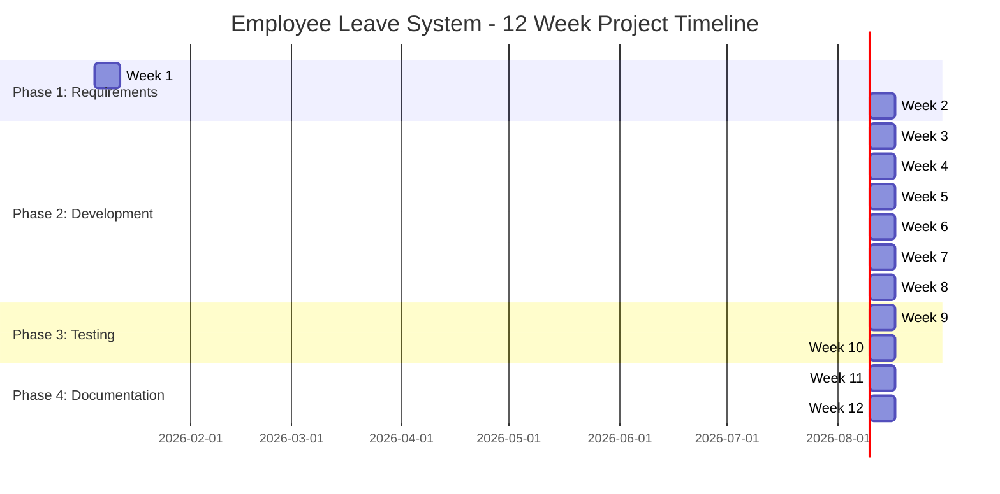
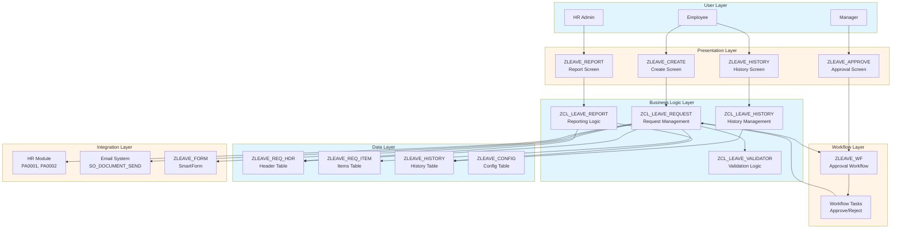
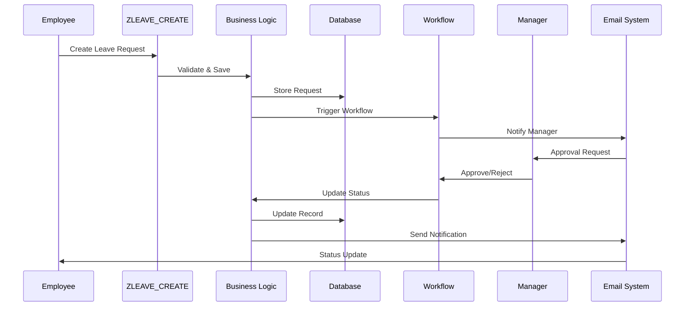

# Tổng quan Dự án - Hệ thống Yêu cầu và Phê duyệt Nghỉ phép Nhân viên

**← [Quay lại README](README.md)**

---

## Mục lục

1. [Thông tin Dự án](#project-information)
2. [Cấu trúc Nhóm & Vai trò](#team-structure--roles)
3. [Tiến độ Dự án](#project-timeline)
4. [Công nghệ Sử dụng](#technology-stack)
5. [Ánh xạ Yêu cầu](#requirements-mapping)
6. [Kiến trúc Cấp cao](#high-level-architecture)
7. [Quản lý Rủi ro](#risk-management)
8. [Tiêu chí Thành công](#success-criteria)

---

## Thông tin Dự án

**Tên Dự án**: Hệ thống Yêu cầu và Phê duyệt Nghỉ phép Nhân viên (ZLEAVE)  
**Mã Dự án**: ABAP4  
**Thời gian**: 12 tuần  
**Quy mô Nhóm**: 5 thành viên  
**Loại Dự án**: Phát triển ABAP Tùy chỉnh SAP  
**Hệ thống Mục tiêu**: SAP ECC / S/4HANA

### Mục tiêu Dự án

1. **Tự động hóa Quản lý Nghỉ phép**: Tối ưu hóa quy trình yêu cầu và phê duyệt nghỉ phép
2. **Phê duyệt Đa cấp**: Triển khai quy trình phê duyệt linh hoạt dựa trên thời gian nghỉ phép
3. **Báo cáo Toàn diện**: Cung cấp khả năng phân tích và báo cáo
4. **Trải nghiệm Người dùng**: Tạo giao diện trực quan cho nhân viên và quản lý
5. **Tích hợp**: Tích hợp liền mạch với module HR của SAP

### Giá trị Kinh doanh

- **Hiệu quả**: Giảm 70% thời gian xử lý thủ công
- **Minh bạch**: Khả năng hiển thị theo thời gian thực về yêu cầu và phê duyệt nghỉ phép
- **Tuân thủ**: Đảm bảo phân quyền phù hợp và dấu vết kiểm tra
- **Sự hài lòng Người dùng**: Cải thiện trải nghiệm nhân viên với khả năng tự phục vụ

---

## Cấu trúc Nhóm & Vai trò

### Thành viên Nhóm 1: Trưởng Nhóm Phát triển / Chuyên gia Mô hình Dữ liệu

**Trọng tâm Chính**: Data Dictionary, Logic ABAP Cốt lõi, Tích hợp

**Trách nhiệm Chính**:
- Thiết kế và tạo tất cả các bảng cơ sở dữ liệu (ZLEAVE_*)
- Phát triển các lớp ABAP cốt lõi cho logic nghiệp vụ
- Tích hợp với module HR (PA0001, PA0002)
- Xem xét mã và lãnh đạo kỹ thuật
- Tối ưu hóa hiệu suất
- Khung xử lý lỗi

**Kỹ năng Kỹ thuật Yêu cầu**:
- Lập trình ABAP nâng cao
- Data Dictionary (SE11)
- ABAP Objects
- Tích hợp module HR
- Tối ưu hóa cơ sở dữ liệu

**Sản phẩm Chính**:
- 4 bảng cơ sở dữ liệu (Header, Items, History, Config)
- 5+ lớp ABAP
- Mã tích hợp với HR
- Tài liệu kỹ thuật

---

### Thành viên Nhóm 2: Chuyên gia Workflow & Phê duyệt

**Trọng tâm Chính**: SAP Workflow, Logic Phê duyệt, Phân quyền

**Trách nhiệm Chính**:
- Thiết kế và triển khai mẫu SAP Workflow
- Phát triển logic phê duyệt đa cấp
- Quy tắc xác định đại lý
- Kiểm tra phân quyền
- Giám sát và xử lý sự cố workflow
- Phát triển UI phê duyệt

**Kỹ năng Kỹ thuật Yêu cầu**:
- SAP Workflow (SWDD, SWDD_HEAD)
- Workflow Builder
- Xác định đại lý
- Khái niệm phân quyền
- Gỡ lỗi workflow

**Sản phẩm Chính**:
- Mẫu workflow (ZLEAVE_WF)
- Nhiệm vụ và phương thức phê duyệt
- Logic xác định đại lý
- Tài liệu workflow

---

### Thành viên Nhóm 3: Chuyên gia UI & Báo cáo

**Trọng tâm Chính**: Màn hình, Báo cáo ALV, Giao diện Người dùng

**Trách nhiệm Chính**:
- Lập trình màn hình (SE51) để tạo yêu cầu nghỉ phép
- Phát triển báo cáo ALV với xuất Excel
- Thiết kế và khả năng sử dụng giao diện người dùng
- Chức năng lọc và tìm kiếm
- Bố cục và định dạng báo cáo
- Tối ưu hóa trải nghiệm người dùng

**Kỹ năng Kỹ thuật Yêu cầu**:
- Screen Painter (SE51)
- Lập trình ALV (CL_SALV_TABLE, CL_SALV_GRID)
- Màn hình lựa chọn
- Chức năng xuất Excel
- Nguyên tắc thiết kế UI/UX

**Sản phẩm Chính**:
- 4 chương trình ABAP (Create, Approve, History, Report)
- Báo cáo ALV với xuất Excel
- Màn hình giao diện người dùng
- Hướng dẫn người dùng

---

### Thành viên Nhóm 4: Chuyên gia Biểu mẫu & Tích hợp

**Trọng tâm Chính**: SmartForms, Tích hợp Email, Thông báo

**Trách nhiệm Chính**:
- Phát triển SmartForm (SMARTFORMS)
- Hệ thống thông báo email
- Chức năng in
- Thiết kế mẫu email
- Kích hoạt và logic thông báo
- Tích hợp hệ thống bên ngoài (nếu cần)

**Kỹ năng Kỹ thuật Yêu cầu**:
- SmartForms
- Tích hợp email (SO_DOCUMENT_SEND_API1)
- Chức năng in
- Thiết kế bố cục biểu mẫu
- Quy trình thông báo

**Sản phẩm Chính**:
- SmartForm (ZLEAVE_FORM)
- 4+ mẫu email
- Chức năng in
- Hướng dẫn cấu hình email

---

### Thành viên Nhóm 5: Chuyên gia Phát triển & Chất lượng

**Trọng tâm Chính**: Hỗ trợ Phát triển, Kiểm thử, Tài liệu, Đảm bảo Chất lượng

**Trách nhiệm Chính**:
- Hỗ trợ phát triển trên tất cả các module
- Phát triển các lớp tiện ích và hàm trợ giúp
- Kiểm thử đơn vị (ABAP Unit) cho các thành phần của mình
- Điều phối kiểm thử tích hợp
- Điều phối kiểm thử chấp nhận người dùng
- Phát triển và thực thi trường hợp kiểm thử
- Theo dõi và quản lý lỗi
- Tài liệu kỹ thuật và người dùng
- Tạo tài liệu đào tạo

**Kỹ năng Kỹ thuật Yêu cầu**:
- Lập trình ABAP
- Kiểm thử ABAP Unit
- Thiết kế trường hợp kiểm thử
- Viết tài liệu
- Quy trình đảm bảo chất lượng
- Đào tạo người dùng
- Xem xét mã

**Sản phẩm Chính**:
- Các lớp tiện ích và hàm trợ giúp
- Kế hoạch kiểm thử và trường hợp kiểm thử
- Tài liệu kết quả kiểm thử
- Hướng dẫn người dùng
- Tài liệu đào tạo
- Tài liệu FAQ

---

### Trách nhiệm Chung: Kiểm thử & Tài liệu

**Tất cả Thành viên Nhóm** tham gia vào:
- **Kiểm thử**: Mỗi thành viên kiểm thử các thành phần của mình và tham gia kiểm thử tích hợp
- **Tài liệu**: Mỗi thành viên tài liệu hóa công việc của mình và đóng góp vào tài liệu tổng thể
- **Xem xét Mã**: Tất cả thành viên tham gia xem xét mã đồng nghiệp
- **Đảm bảo Chất lượng**: Tất cả thành viên đảm bảo chất lượng sản phẩm của mình

---

## Tiến độ Dự án

### Tổng quan Lịch trình 12 Tuần

### Cột mốc

| Tuần | Cột mốc | Sản phẩm |
|------|-----------|--------------|
| **Tuần 2** | Thiết kế Hoàn thành | Thiết kế kỹ thuật, Mô hình dữ liệu, Thiết kế workflow |
| **Tuần 4** | Chức năng Cốt lõi | Tạo yêu cầu nghỉ phép hoạt động |
| **Tuần 5** | Workflow Hoàn thành | Quy trình phê duyệt hoạt động |
| **Tuần 7** | Báo cáo Hoàn thành | Báo cáo và thống kê hoạt động |
| **Tuần 8** | Phát triển Hoàn thành | Tất cả tính năng được triển khai |
| **Tuần 10** | Kiểm thử Hoàn thành | Tất cả kiểm thử đạt, UAT được phê duyệt |
| **Tuần 12** | Dự án Hoàn thành | Tài liệu và trình bày sẵn sàng |

### Phân tích Giai đoạn

1. **Giai đoạn 1: Yêu cầu & Thiết kế** (Tuần 1-2)
   - Thu thập và phân tích yêu cầu
   - Thiết kế và kiến trúc kỹ thuật
   - Thiết kế mô hình dữ liệu
   - Thiết kế workflow

2. **Giai đoạn 2: Phát triển** (Tuần 3-8)
   - Thiết lập nền tảng
   - Phát triển chức năng cốt lõi
   - Triển khai workflow
   - Báo cáo và biểu mẫu

3. **Giai đoạn 3: Kiểm thử & QA** (Tuần 9-10)
   - Kiểm thử đơn vị
   - Kiểm thử tích hợp
   - Kiểm thử chấp nhận người dùng

4. **Giai đoạn 4: Tài liệu & Trình bày** (Tuần 11-12)
   - Tài liệu kỹ thuật
   - Tài liệu người dùng
   - Chuẩn bị trình bày

---

## Công nghệ Sử dụng

### Thành phần SAP

| Thành phần | Công nghệ | Mục đích |
|-----------|-----------|---------|
| **Cơ sở Dữ liệu** | ABAP Data Dictionary (SE11) | Lưu trữ dữ liệu yêu cầu nghỉ phép |
| **Lập trình** | ABAP Objects | Triển khai logic nghiệp vụ |
| **Workflow** | SAP Workflow (SWDD) | Tự động hóa quy trình phê duyệt |
| **UI** | Screen Painter (SE51) | Màn hình giao diện người dùng |
| **Báo cáo** | ALV (CL_SALV_*) | Hiển thị và xuất dữ liệu |
| **Biểu mẫu** | SmartForms | Biểu mẫu nghỉ phép có thể in |
| **Email** | SO_DOCUMENT_SEND_API1 | Thông báo email |
| **Tích hợp** | Module HR (PA0001, PA0002) | Dữ liệu chủ nhân viên |

### Công cụ Phát triển

- **SAP GUI**: Môi trường phát triển chính
- **ABAP Development Tools (ADT)**: IDE dựa trên Eclipse hiện đại (tùy chọn)
- **SE11**: Data Dictionary
- **SE24**: Class Builder
- **SE38**: ABAP Editor
- **SE51**: Screen Painter
- **SWDD**: Workflow Builder
- **SMARTFORMS**: Form Builder

### Tiêu chuẩn & Hướng dẫn

- **Quy ước Đặt tên**: Tiền tố Z cho tất cả đối tượng tùy chỉnh (ZLEAVE_*)
- **Tiêu chuẩn Mã**: Tuân theo hướng dẫn mã hóa SAP
- **Tài liệu**: Nhận xét nội tuyến và tài liệu kỹ thuật
- **Kiểm thử**: ABAP Unit cho kiểm thử đơn vị

---

## Ánh xạ Yêu cầu

### Tính năng 1: Tạo Yêu cầu Nghỉ phép

**Yêu cầu**: Nhập thông tin nghỉ phép với ID yêu cầu tự động tạo

**Triển khai**:
- Chương trình màn hình: `ZLEAVE_CREATE`
- Bảng: `ZLEAVE_REQ_HDR` (header), `ZLEAVE_REQ_ITEM` (items)
- Lớp: `ZCL_LEAVE_REQUEST` (phương thức CREATE_REQUEST)
- Logic tạo ID tự động

**Thành viên Nhóm**: Thành viên Nhóm 1 (Trưởng Nhóm Phát triển) + Thành viên Nhóm 3 (Chuyên gia UI)

---

### Tính năng 2: Quy trình Phê duyệt Đa cấp

**Yêu cầu**: Quy trình phê duyệt quản lý dựa trên thời gian/loại nghỉ phép

**Triển khai**:
- Workflow: `ZLEAVE_WF`
- Cấp phê duyệt:
  - Cấp 1: Quản lý Trực tiếp (< 5 ngày)
  - Cấp 2: Trưởng Phòng (5-10 ngày)
  - Cấp 3: Giám đốc HR (> 10 ngày)
- Chương trình: `ZLEAVE_APPROVE`

**Thành viên Nhóm**: Thành viên Nhóm 2 (Chuyên gia Workflow)

---

### Tính năng 3: Tra cứu Lịch sử Nghỉ phép

**Yêu cầu**: Lọc theo ngày, trạng thái và loại nghỉ phép

**Triển khai**:
- Chương trình: `ZLEAVE_HISTORY`
- Bảng: `ZLEAVE_HISTORY` (nhật ký kiểm tra)
- Hiển thị ALV với lọc
- Lớp: `ZCL_LEAVE_HISTORY`

**Thành viên Nhóm**: Thành viên Nhóm 3 (Chuyên gia UI) + Thành viên Nhóm 1 (Trưởng Nhóm Phát triển)

---

### Tính năng 4: Thống kê & Báo cáo

**Yêu cầu**: Báo cáo ALV với xuất Excel

**Triển khai**:
- Chương trình: `ZLEAVE_REPORT`
- ALV Grid với thống kê
- Chức năng xuất Excel
- Lớp: `ZCL_LEAVE_REPORT`

**Thành viên Nhóm**: Thành viên Nhóm 3 (Chuyên gia UI)

---

### Tính năng 5: Thông báo Email & In Biểu mẫu

**Yêu cầu**: SmartForm cho yêu cầu nghỉ phép với thông báo email

**Triển khai**:
- SmartForm: `ZLEAVE_FORM`
- Mẫu email (4+ mẫu)
- Kích hoạt email khi thay đổi trạng thái
- Chức năng in

**Thành viên Nhóm**: Thành viên Nhóm 4 (Chuyên gia Biểu mẫu)

---

## Kiến trúc Cấp cao

### Sơ đồ Kiến trúc Hệ thống

### Tổng quan Luồng Dữ liệu

---

## Quản lý Rủi ro

### Ma trận Rủi ro

| Rủi ro | Xác suất | Tác động | Chiến lược Giảm thiểu | Chủ sở hữu |
|------|------------|--------|-------------------|-------|
| **Độ phức tạp Workflow** | Trung bình | Cao | Bắt đầu với workflow đơn giản, lặp lại. Tạo mẫu sớm. | Thành viên Nhóm 2 |
| **Vấn đề Tích hợp HR** | Trung bình | Cao | Kiểm thử tích hợp sớm. Sử dụng bảng HR tiêu chuẩn. | Thành viên Nhóm 1 |
| **Vấn đề Hiệu suất** | Thấp | Trung bình | Kiểm thử hiệu suất thường xuyên. Tối ưu hóa cơ sở dữ liệu. | Thành viên Nhóm 1 |
| **Mở rộng Phạm vi** | Trung bình | Trung bình | Kiểm soát thay đổi nghiêm ngặt. Xem xét thường xuyên. | Tất cả |
| **Khả dụng Tài nguyên** | Thấp | Trung bình | Đồng bộ nhóm thường xuyên. Thời gian đệm trong lịch trình. | Tất cả |
| **Thách thức Kỹ thuật** | Trung bình | Trung bình | Thăm dò kỹ thuật sớm. Chia sẻ kiến thức. | Tất cả |
| **Thiếu thời gian Kiểm thử** | Thấp | Cao | Kiểm thử song song trong quá trình phát triển. | Thành viên Nhóm 5 |

### Chiến lược Giảm thiểu

1. **Tạo mẫu Sớm**: Xây dựng bằng chứng khái niệm cho các thành phần phức tạp
2. **Xem xét Thường xuyên**: Cuộc họp nhóm hàng tuần và xem xét mã
3. **Thời gian Đệm**: 10% đệm trong mỗi giai đoạn cho các vấn đề không mong đợi
4. **Chia sẻ Kiến thức**: Tài liệu hóa những gì đã học và chia sẻ với nhóm
5. **Phát triển Tăng dần**: Xây dựng và kiểm thử tăng dần

---

## Tiêu chí Thành công

### Tiêu chí Thành công Chức năng

- [x] Tất cả 5 tính năng được triển khai và hoạt động
- [x] Quy trình phê duyệt đa cấp hoạt động cho tất cả kịch bản
- [x] Tra cứu lịch sử nghỉ phép với tất cả tùy chọn lọc hoạt động
- [x] Báo cáo tạo đúng với xuất Excel
- [x] Thông báo email được gửi cho tất cả thay đổi trạng thái
- [x] SmartForm in đúng

### Tiêu chí Thành công Kỹ thuật

- [x] Tất cả bảng cơ sở dữ liệu được tạo và kích hoạt
- [x] Tất cả lớp ABAP tuân theo tiêu chuẩn mã hóa
- [x] Tất cả chương trình được kiểm thử và hoạt động
- [x] Workflow được kiểm thử cho tất cả đường dẫn phê duyệt
- [x] Hiệu suất đáp ứng yêu cầu (< 2 giây cho báo cáo)
- [x] Không có lỗi nghiêm trọng trong mã sản xuất

### Tiêu chí Thành công Chất lượng

- [x] Tất cả kiểm thử đơn vị đạt (mục tiêu: 80% phủ sóng mã)
- [x] Tất cả kiểm thử tích hợp đạt
- [x] Kiểm thử chấp nhận người dùng được phê duyệt
- [x] Xem xét mã hoàn thành
- [x] Tài liệu hoàn chỉnh

### Tiêu chí Thành công Dự án

- [x] Dự án hoàn thành trong 12 tuần
- [x] Tất cả sản phẩm được nộp
- [x] Trình bày thành công
- [x] Đào tạo người dùng hoàn thành
- [x] Bàn giao dự án hoàn thành

---

## Tham khảo

- **[Yêu cầu Dự án](../Abap-4.md)** - Đặc tả gốc
- **[Hướng dẫn Capstone SAP](../../SAP_CAPSTONE_PROJECT_GUIDE.md)** - Hướng dẫn chung
- **[Kiến trúc Kỹ thuật](Technical_Architecture.md)** - Đặc tả kỹ thuật chi tiết
- **[Giai đoạn 1: Yêu cầu & Thiết kế](Phase1_Requirements_Design.md)** - Nhiệm vụ giai đoạn chi tiết

---

**← [Quay lại README](README.md)** | **Tiếp theo: [Giai đoạn 1: Yêu cầu & Thiết kế](Phase1_Requirements_Design.md)**

