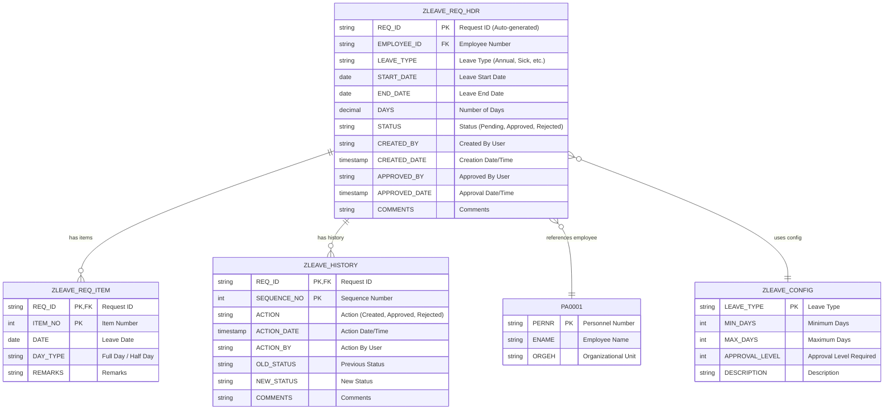
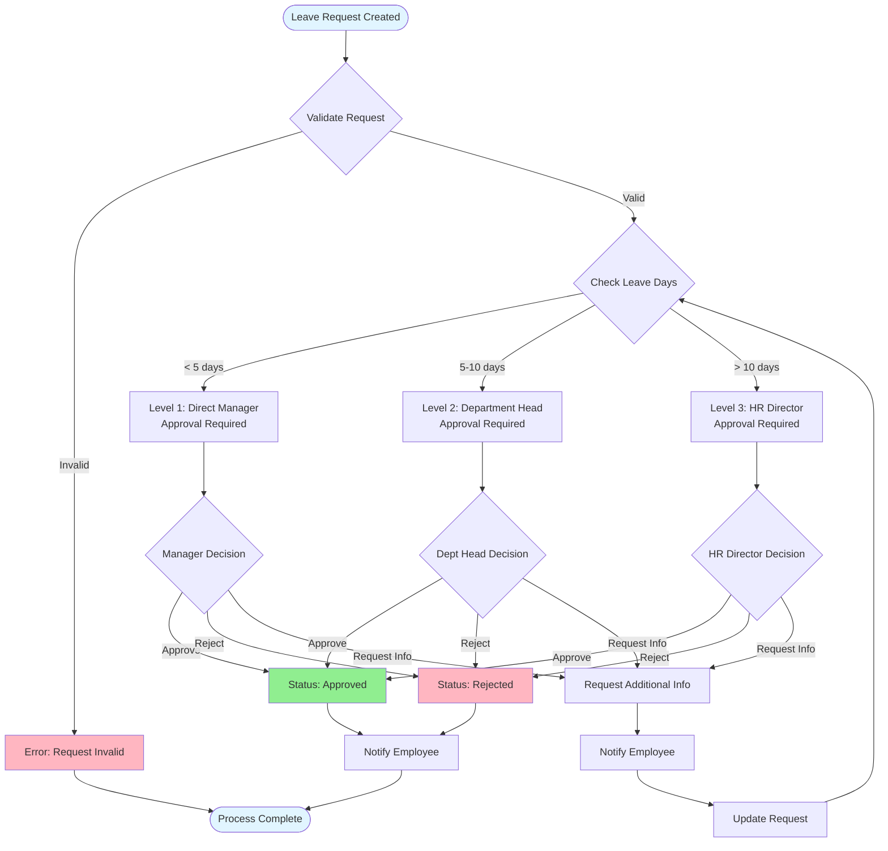
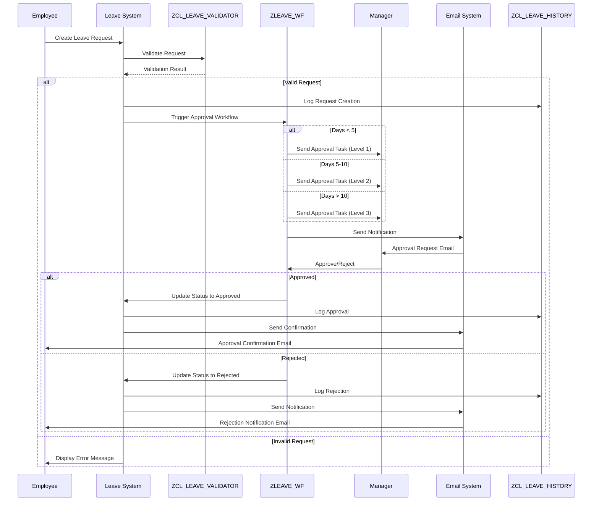
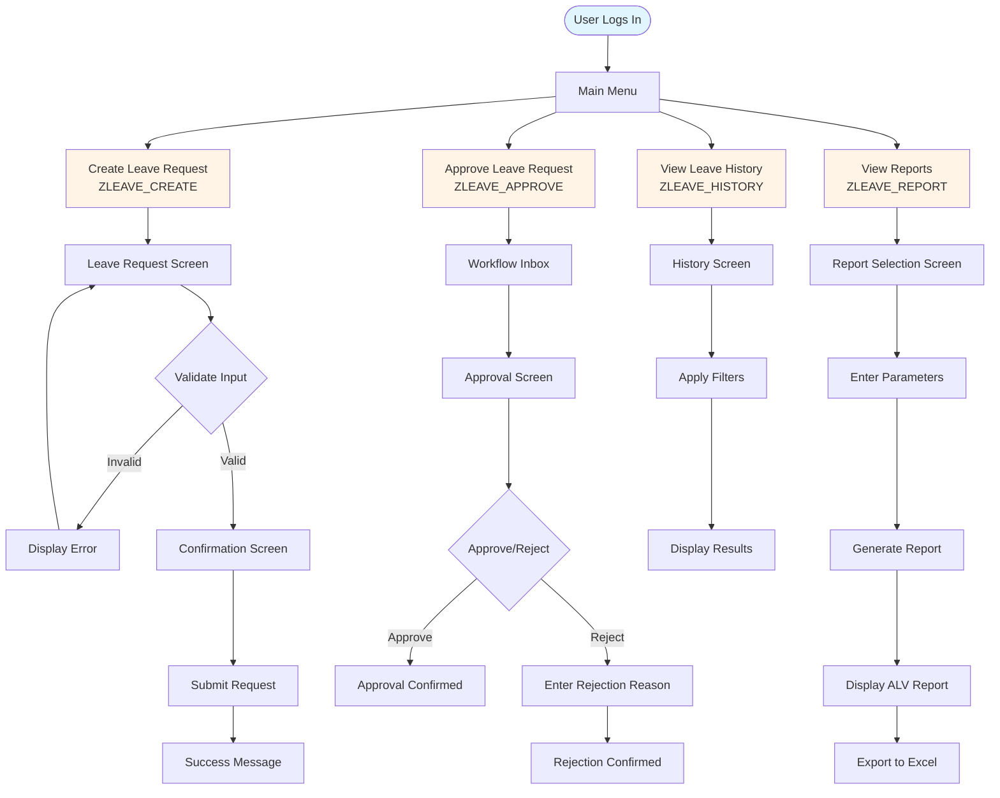

# Giai đoạn 1: Yêu cầu & Thiết kế

**Thời gian**: Tuần 1-2  
**← [Quay lại README](README.md)** | **Tiếp theo: [Giai đoạn 2: Phát triển](Phase2_Development.md)**

---

## Mục lục

1. [Tuần 1: Thu thập & Phân tích Yêu cầu](#week-1-requirements-gathering--analysis)
2. [Tuần 2: Thiết kế & Kiến trúc Chi tiết](#week-2-detailed-design--architecture)
3. [Thiết kế Mô hình Dữ liệu](#data-model-design)
4. [Thiết kế Workflow](#workflow-design)
5. [Thiết kế UI/UX](#uiux-design)
6. [Đặc tả Kỹ thuật](#technical-specifications)
7. [Ví dụ & Mẫu](#examples--templates)
8. [Tham khảo](#references)

---

## Tuần 1: Thu thập & Phân tích Yêu cầu

### Thành viên Nhóm 1: Trưởng Nhóm Phát triển / Chuyên gia Mô hình Dữ liệu

#### Nhiệm vụ

- [ ] **Phân tích Yêu cầu Nghiệp vụ**
  - Xem lại [tài liệu yêu cầu dự án](../Abap-4.md)
  - Xác định tất cả yêu cầu chức năng
  - Tài liệu hóa yêu cầu phi chức năng
  - Tạo ma trận truy vết yêu cầu

- [ ] **Xác định Yêu cầu Mô hình Dữ liệu**
  - Xác định tất cả thực thể dữ liệu cần thiết
  - Ánh xạ yêu cầu nghiệp vụ với cấu trúc dữ liệu
  - Xác định quan hệ giữa các thực thể
  - Tài liệu hóa yêu cầu lưu trữ dữ liệu

- [ ] **Xác định Điểm Tích hợp HR**
  - Xem lại cấu trúc module HR của SAP
  - Xác định bảng tiêu chuẩn sử dụng (PA0001, PA0002)
  - Tài liệu hóa yêu cầu tích hợp
  - Xác định yêu cầu ánh xạ dữ liệu

- [ ] **Tạo Tài liệu Đặc tả Kỹ thuật**
  - Tài liệu hóa kiến trúc hệ thống
  - Xác định ràng buộc kỹ thuật
  - Tài liệu hóa điểm tích hợp
  - Tạo sơ đồ luồng dữ liệu

- [ ] **Thiết kế Cấu trúc Bảng Cơ sở Dữ liệu**
  - Thiết kế cấu trúc bảng ZLEAVE_REQ_HDR
  - Thiết kế cấu trúc bảng ZLEAVE_REQ_ITEM
  - Thiết kế cấu trúc bảng ZLEAVE_HISTORY
  - Thiết kế cấu trúc bảng ZLEAVE_CONFIG

**Sản phẩm**:
- Tài liệu đặc tả yêu cầu
- Tài liệu thiết kế mô hình dữ liệu
- Tài liệu đặc tả kỹ thuật
- Đặc tả tích hợp HR

**Tham khảo**:
- [Hướng dẫn ABAP Data Dictionary](../../ABAP-Guides/02_SAP_ABAP_DATA_DICTIONARY_GUIDE.md) - Thiết kế bảng
- [Hướng dẫn Cơ bản ABAP](../../ABAP-Guides/01_SAP_ABAP_BASICS_GUIDE.md#data-types-and-variables) - Kiểu dữ liệu

---

### Thành viên Nhóm 2: Chuyên gia Workflow & Phê duyệt

#### Nhiệm vụ

- [ ] **Xác định Yêu cầu Workflow Phê duyệt**
  - Tài liệu hóa cấp phê duyệt cần thiết
  - Xác định quy tắc phê duyệt dựa trên thời gian nghỉ phép
  - Tài liệu hóa logic định tuyến phê duyệt
  - Xác định đại lý phê duyệt

- [ ] **Ánh xạ Cấp Phê duyệt**
  - Cấp 1: Quản lý Trực tiếp (< 5 ngày)
  - Cấp 2: Trưởng Phòng (5-10 ngày)
  - Cấp 3: Giám đốc HR (> 10 ngày)
  - Tài liệu hóa quy tắc leo thang

- [ ] **Xác định Yêu cầu Phân quyền**
  - Xác định đối tượng phân quyền cần thiết
  - Tài liệu hóa yêu cầu truy cập dựa trên vai trò
  - Xác định quy tắc quyền phê duyệt
  - Tài liệu hóa yêu cầu bảo mật

- [ ] **Thiết kế Sơ đồ Workflow**
  - Tạo luồng quy trình workflow
  - Tài liệu hóa nhiệm vụ workflow
  - Xác định sự kiện workflow
  - Tài liệu hóa phần tử workflow container

- [ ] **Tài liệu hóa Quy tắc Phê duyệt**
  - Tiêu chí phê duyệt
  - Tiêu chí từ chối
  - Quy tắc leo thang
  - Quy tắc timeout

**Sản phẩm**:
- Tài liệu yêu cầu workflow
- Tài liệu quy tắc phê duyệt
- Sơ đồ thiết kế workflow
- Ma trận phân quyền

**Tham khảo**:
- [Hướng dẫn SAP Workflow](../../SAP_WORKFLOW_GUIDE.md) - Khái niệm workflow
- [Hướng dẫn Capstone](../../SAP_CAPSTONE_PROJECT_GUIDE.md#account-payable-automation) - Ví dụ workflow tương tự

---

### Thành viên Nhóm 3: Chuyên gia UI & Báo cáo

#### Nhiệm vụ

- [ ] **Xác định Yêu cầu Giao diện Người dùng**
  - Tài liệu hóa yêu cầu màn hình
  - Xác định luồng tương tác người dùng
  - Tài liệu hóa yêu cầu khả năng sử dụng
  - Tạo user personas

- [ ] **Thiết kế Bố cục Màn hình**
  - Màn hình tạo yêu cầu nghỉ phép
  - Màn hình phê duyệt
  - Màn hình tra cứu lịch sử
  - Màn hình lựa chọn báo cáo

- [ ] **Xác định Yêu cầu Báo cáo**
  - Tài liệu hóa loại báo cáo cần thiết
  - Xác định tham số báo cáo
  - Tài liệu hóa yêu cầu lọc
  - Xác định yêu cầu xuất

- [ ] **Tạo Mockup/Wireframe UI**
  - Mockup bố cục màn hình
  - Vị trí trường và nhãn
  - Luồng điều hướng
  - Vị trí nút

- [ ] **Tài liệu hóa Yêu cầu Lọc**
  - Lọc theo phạm vi ngày
  - Lọc theo trạng thái
  - Lọc theo loại nghỉ phép
  - Lọc theo nhân viên

**Sản phẩm**:
- Tài liệu yêu cầu UI
- Mockup/wireframe màn hình
- Tài liệu yêu cầu báo cáo
- Tài liệu thiết kế trải nghiệm người dùng

**Tham khảo**:
- [Hướng dẫn Lập trình Màn hình](../../ABAP-Guides/06_SAP_ABAP_SCREEN_PROGRAMMING_GUIDE.md) - Thiết kế màn hình
- [Hướng dẫn Lập trình ALV](../../ABAP-Guides/07_SAP_ABAP_ALV_PROGRAMMING_GUIDE.md) - Thiết kế báo cáo

---

### Thành viên Nhóm 4: Chuyên gia Biểu mẫu & Tích hợp

#### Nhiệm vụ

- [ ] **Xác định Yêu cầu SmartForm**
  - Tài liệu hóa yêu cầu bố cục biểu mẫu
  - Xác định trường biểu mẫu cần thiết
  - Tài liệu hóa yêu cầu thương hiệu
  - Xác định yêu cầu in

- [ ] **Thiết kế Bố cục Biểu mẫu**
  - Thiết kế phần header
  - Thiết kế phần chi tiết nhân viên
  - Thiết kế phần chi tiết nghỉ phép
  - Thiết kế phần phê duyệt
  - Thiết kế phần footer

- [ ] **Xác định Kích hoạt Thông báo Email**
  - Thông báo yêu cầu đã tạo
  - Thông báo yêu cầu phê duyệt
  - Thông báo xác nhận phê duyệt
  - Thông báo từ chối
  - Thông báo thay đổi trạng thái

- [ ] **Xác định Mẫu Thông báo**
  - Dòng chủ đề email
  - Mẫu nội dung email
  - Yêu cầu định dạng email
  - Yêu cầu đính kèm

- [ ] **Tài liệu hóa Yêu cầu In**
  - Yêu cầu định dạng in
  - Kích hoạt in
  - Yêu cầu xem trước in
  - Phân phối in

**Sản phẩm**:
- Tài liệu yêu cầu SmartForm
- Thiết kế bố cục biểu mẫu
- Đặc tả thông báo email
- Tài liệu yêu cầu in

**Tham khảo**:
- [Hướng dẫn Biểu mẫu SAP](../../SAP_FORMS_GUIDE.md) - SmartForms
- [Hướng dẫn Capstone](../../SAP_CAPSTONE_PROJECT_GUIDE.md) - Ví dụ tích hợp

---

### Thành viên Nhóm 5: Chuyên gia Phát triển & Chất lượng

#### Nhiệm vụ

- [ ] **Xác định Yêu cầu Thành phần Tiện ích**
  - Xác định hàm tiện ích chung cần thiết
  - Xác định yêu cầu lớp trợ giúp
  - Tài liệu hóa đặc tả hàm tiện ích
  - Lập kế hoạch kiến trúc thành phần tiện ích

- [ ] **Tạo Kế hoạch Kiểm thử**
  - Xác định chiến lược kiểm thử
  - Tài liệu hóa cấp kiểm thử (Đơn vị, Tích hợp, UAT)
  - Xác định yêu cầu môi trường kiểm thử
  - Tạo lịch trình kiểm thử

- [ ] **Xác định Kịch bản Kiểm thử**
  - Kịch bản tạo yêu cầu nghỉ phép
  - Kịch bản quy trình phê duyệt workflow
  - Kịch bản tra cứu lịch sử
  - Kịch bản báo cáo
  - Kịch bản xử lý lỗi

- [ ] **Tạo Ma trận Truy vết Yêu cầu**
  - Ánh xạ yêu cầu với trường hợp kiểm thử
  - Tài liệu hóa phủ sóng kiểm thử
  - Xác định tiêu chí chấp nhận
  - Tạo mẫu trường hợp kiểm thử

- [ ] **Thiết lập Môi trường Kiểm thử**
  - Tài liệu hóa yêu cầu hệ thống kiểm thử
  - Xác định yêu cầu dữ liệu kiểm thử
  - Tạo tài khoản người dùng kiểm thử
  - Thiết lập công cụ kiểm thử

- [ ] **Tài liệu hóa Cách tiếp cận Kiểm thử**
  - Cách tiếp cận kiểm thử đơn vị
  - Cách tiếp cận kiểm thử tích hợp
  - Cách tiếp cận UAT
  - Cách tiếp cận kiểm thử hiệu suất

**Sản phẩm**:
- Đặc tả thành phần tiện ích
- Tài liệu kế hoạch kiểm thử
- Tài liệu kịch bản kiểm thử
- Ma trận truy vết yêu cầu
- Tài liệu thiết lập môi trường kiểm thử

**Tham khảo**:
- [Hướng dẫn ABAP Objects](../../ABAP-Guides/08_SAP_ABAP_OBJECTS_GUIDE.md) - Thiết kế lớp
- [Hướng dẫn Kiểm thử Đơn vị](../../ABAP-Guides/14_SAP_ABAP_UNIT_TESTING_GUIDE.md) - Cách tiếp cận kiểm thử
- [Hướng dẫn Kiểm thử](../../SAP_TESTING_GUIDE.md) - Lập kế hoạch kiểm thử

---

## Tuần 2: Thiết kế & Kiến trúc Chi tiết

### Thành viên Nhóm 1: Trưởng Nhóm Phát triển / Chuyên gia Mô hình Dữ liệu

#### Nhiệm vụ

- [ ] **Hoàn thiện Thiết kế Data Dictionary**

  **ZLEAVE_REQ_HDR (Bảng Header)**
  - Hoàn thiện định nghĩa trường
  - Xác định kiểu dữ liệu và độ dài
  - Tạo domains và search helps
  - Xác định khóa chính
  - Xác định khóa ngoại

  **ZLEAVE_REQ_ITEM (Bảng Items)**
  - Hoàn thiện định nghĩa trường
  - Xác định quan hệ với header
  - Tạo domains
  - Xác định khóa chính

  **ZLEAVE_HISTORY (Nhật ký Kiểm tra)**
  - Hoàn thiện định nghĩa trường
  - Xác định yêu cầu dấu vết kiểm tra
  - Tạo domains
  - Xác định khóa chính

  **ZLEAVE_CONFIG (Bảng Cấu hình)**
  - Hoàn thiện định nghĩa trường
  - Xác định tham số cấu hình
  - Tạo domains
  - Xác định khóa chính

- [ ] **Thiết kế Cấu trúc Lớp ABAP**

  **ZCL_LEAVE_REQUEST (Lớp Chính)**
  - Xác định cấu trúc lớp
  - Xác định phương thức công khai
  - Xác định phương thức riêng tư
  - Xác định thuộc tính
  - Tài liệu hóa chữ ký phương thức

  **ZCL_LEAVE_VALIDATOR (Lớp Xác thực)**
  - Xác định phương thức xác thực
  - Xác định quy tắc xác thực
  - Tài liệu hóa xử lý lỗi
  - Xác định kiểu trả về

  **ZCL_LEAVE_CALCULATOR (Lớp Tính toán)**
  - Xác định phương thức tính toán
  - Xác định logic tính toán ngày
  - Tài liệu hóa quy tắc nghiệp vụ
  - Xác định kiểu trả về

- [ ] **Thiết kế Tích hợp với Bảng HR**
  - Tài liệu hóa tích hợp PA0001
  - Tài liệu hóa tích hợp PA0002
  - Xác định ánh xạ dữ liệu
  - Tài liệu hóa xử lý lỗi

- [ ] **Tạo Sơ đồ Luồng Dữ liệu**
  - Luồng tạo yêu cầu
  - Luồng phê duyệt
  - Luồng truy xuất lịch sử
  - Luồng báo cáo

- [ ] **Tài liệu hóa Giao diện API**
  - Chữ ký phương thức
  - Định nghĩa tham số
  - Kiểu trả về
  - Xử lý ngoại lệ

**Sản phẩm**:
- Thiết kế data dictionary hoàn chỉnh
- Tài liệu thiết kế lớp
- Tài liệu thiết kế tích hợp
- Sơ đồ luồng dữ liệu

**Tham khảo**:
- [Hướng dẫn Data Dictionary](../../ABAP-Guides/02_SAP_ABAP_DATA_DICTIONARY_GUIDE.md) - Thiết kế bảng
- [Hướng dẫn ABAP Objects](../../ABAP-Guides/08_SAP_ABAP_OBJECTS_GUIDE.md) - Thiết kế lớp

---

### Thành viên Nhóm 2: Chuyên gia Workflow & Phê duyệt

#### Nhiệm vụ

- [ ] **Thiết kế Mẫu Workflow (SWDD)**
  - Xác định cấu trúc workflow
  - Xác định bước workflow
  - Xác định nhiệm vụ workflow
  - Xác định sự kiện workflow

- [ ] **Xác định Nhiệm vụ Workflow**
  - ZLEAVE_APPROVE_TASK
  - ZLEAVE_REJECT_TASK
  - ZLEAVE_ESCALATE_TASK
  - Tài liệu hóa phương thức nhiệm vụ

- [ ] **Thiết kế Xác định Đại lý Phê duyệt**
  - Xác định quản lý trực tiếp
  - Xác định trưởng phòng
  - Xác định giám đốc HR
  - Quy tắc dự phòng

- [ ] **Tạo Phần tử Workflow Container**
  - Xác định cấu trúc container
  - Xác định loại phần tử
  - Tài liệu hóa luồng dữ liệu
  - Xác định quy tắc binding

- [ ] **Thiết kế Kích hoạt Sự kiện Workflow**
  - Sự kiện yêu cầu đã tạo
  - Sự kiện phê duyệt
  - Sự kiện từ chối
  - Sự kiện timeout

- [ ] **Tài liệu hóa Cấu hình Workflow**
  - Cài đặt workflow
  - Quy tắc xác định đại lý
  - Liên kết sự kiện
  - Cấu hình timeout

**Sản phẩm**:
- Thiết kế mẫu workflow
- Đặc tả nhiệm vụ workflow
- Logic xác định đại lý
- Tài liệu cấu hình workflow

**Tham khảo**:
- [Hướng dẫn SAP Workflow](../../SAP_WORKFLOW_GUIDE.md) - Thiết kế workflow
- [Hướng dẫn Capstone](../../SAP_CAPSTONE_PROJECT_GUIDE.md) - Ví dụ workflow

---

### Thành viên Nhóm 3: Chuyên gia UI & Báo cáo

#### Nhiệm vụ

- [ ] **Thiết kế Luồng Màn hình (SE51)**
  - Luồng điều hướng màn hình
  - Chuỗi màn hình
  - Chuyển đổi màn hình
  - Xử lý màn hình lỗi

- [ ] **Thiết kế Cấu trúc Báo cáo ALV**
  - Thiết kế bố cục báo cáo
  - Định nghĩa cột
  - Sắp xếp và lọc
  - Chức năng xuất

- [ ] **Xác định Tham số Màn hình Lựa chọn**
  - Tham số phạm vi ngày
  - Tham số trạng thái
  - Tham số loại nghỉ phép
  - Tham số nhân viên

- [ ] **Thiết kế Tùy chọn Lọc**
  - Thiết kế UI lọc
  - Logic lọc
  - Kết hợp lọc
  - Lưu trữ lọc

- [ ] **Tạo Mockup Bố cục Báo cáo**
  - Cấu trúc báo cáo
  - Bố cục cột
  - Tùy chọn nhóm
  - Phần tóm tắt

- [ ] **Thiết kế Cấu trúc Xuất Excel**
  - Định dạng xuất
  - Ánh xạ cột
  - Quy tắc định dạng
  - Quy ước đặt tên tệp

**Sản phẩm**:
- Thiết kế luồng màn hình
- Thiết kế báo cáo ALV
- Thiết kế màn hình lựa chọn
- Đặc tả xuất Excel

**Tham khảo**:
- [Hướng dẫn Lập trình Màn hình](../../ABAP-Guides/06_SAP_ABAP_SCREEN_PROGRAMMING_GUIDE.md) - Thiết kế màn hình
- [Hướng dẫn Lập trình ALV](../../ABAP-Guides/07_SAP_ABAP_ALV_PROGRAMMING_GUIDE.md) - Thiết kế báo cáo

---

### Thành viên Nhóm 4: Chuyên gia Biểu mẫu & Tích hợp

#### Nhiệm vụ

- [ ] **Thiết kế Bố cục SmartForm (SMARTFORMS)**
  - Thiết kế cấu trúc biểu mẫu
  - Bố cục phần
  - Vị trí trường
  - Quy tắc định dạng

- [ ] **Xác định Trường Biểu mẫu và Nguồn Dữ liệu**
  - Ánh xạ nguồn dữ liệu
  - Định nghĩa trường
  - Logic truy xuất dữ liệu
  - Định dạng trường

- [ ] **Thiết kế Mẫu Email**
  - Cấu trúc mẫu
  - Placeholder biến
  - Quy tắc định dạng
  - Xử lý đính kèm

- [ ] **Xác định Kích hoạt Thông báo**
  - Sự kiện kích hoạt
  - Điều kiện kích hoạt
  - Logic kích hoạt
  - Xử lý lỗi

- [ ] **Tạo Mockup Biểu mẫu**
  - Bố cục trực quan
  - Vị trí trường
  - Phần tử thương hiệu
  - Bố cục in

- [ ] **Tài liệu hóa Cấu hình Email**
  - Cài đặt SMTP
  - Cấu hình máy chủ email
  - Lưu trữ mẫu
  - Danh sách phân phối

**Sản phẩm**:
- Thiết kế SmartForm
- Thiết kế mẫu email
- Đặc tả kích hoạt thông báo
- Hướng dẫn cấu hình email

**Tham khảo**:
- [Hướng dẫn Biểu mẫu SAP](../../SAP_FORMS_GUIDE.md) - SmartForms
- [Hướng dẫn Tích hợp](../../SAP_INTEGRATION_GUIDE.md) - Tích hợp email

---

### Thành viên Nhóm 5: Chuyên gia Phát triển & Chất lượng

#### Nhiệm vụ

- [ ] **Thiết kế Thành phần Tiện ích**
  - Thiết kế cấu trúc lớp tiện ích (ZCL_LEAVE_UTILITIES)
  - Thiết kế module hàm trợ giúp
  - Thiết kế khung xử lý lỗi
  - Tài liệu hóa giao diện thành phần tiện ích

- [ ] **Tạo Trường hợp Kiểm thử Chi tiết**
  - Trường hợp kiểm thử đơn vị
  - Trường hợp kiểm thử tích hợp
  - Trường hợp kiểm thử hệ thống
  - Trường hợp kiểm thử UAT

- [ ] **Thiết kế Dữ liệu Kiểm thử**
  - Dữ liệu nhân viên kiểm thử
  - Dữ liệu yêu cầu nghỉ phép kiểm thử
  - Kịch bản phê duyệt kiểm thử
  - Kịch bản lỗi kiểm thử

- [ ] **Tạo Script Kiểm thử**
  - Script thực thi kiểm thử
  - Script thiết lập dữ liệu kiểm thử
  - Script dọn dẹp kiểm thử
  - Script kiểm thử tự động

- [ ] **Thiết lập Môi trường Kiểm thử**
  - Cấu hình hệ thống kiểm thử
  - Thiết lập người dùng kiểm thử
  - Chuẩn bị dữ liệu kiểm thử
  - Cài đặt công cụ kiểm thử

- [ ] **Tạo Kế hoạch Thực thi Kiểm thử**
  - Lịch trình kiểm thử
  - Phân bổ tài nguyên kiểm thử
  - Truy cập môi trường kiểm thử
  - Quy trình báo cáo kiểm thử

- [ ] **Tài liệu hóa Kịch bản Kiểm thử**
  - Kịch bản kiểm thử tích cực
  - Kịch bản kiểm thử tiêu cực
  - Trường hợp biên
  - Kịch bản hiệu suất

**Sản phẩm**:
- Thiết kế thành phần tiện ích
- Tài liệu trường hợp kiểm thử
- Đặc tả dữ liệu kiểm thử
- Script kiểm thử
- Kế hoạch thực thi kiểm thử

**Tham khảo**:
- [Hướng dẫn ABAP Objects](../../ABAP-Guides/08_SAP_ABAP_OBJECTS_GUIDE.md) - Thiết kế lớp
- [Hướng dẫn Function Modules](../../ABAP-Guides/05_SAP_ABAP_FUNCTION_MODULES_GUIDE.md) - Thiết kế function module
- [Hướng dẫn Kiểm thử Đơn vị](../../ABAP-Guides/14_SAP_ABAP_UNIT_TESTING_GUIDE.md) - Trường hợp kiểm thử
- [Hướng dẫn Kiểm thử](../../SAP_TESTING_GUIDE.md) - Lập kế hoạch kiểm thử

---

## Thiết kế Mô hình Dữ liệu

### Sơ đồ Quan hệ Thực thể



### Ví dụ Cấu trúc Bảng

#### Cấu trúc Bảng ZLEAVE_REQ_HDR

| Tên Trường | Data Element | Kiểu Dữ liệu | Độ dài | Khóa | Mô tả |
|------------|--------------|-----------|--------|-----|-------------|
| REQ_ID | ZLEAVE_REQ_ID | CHAR | 10 | X | Request ID (Tự động tạo) |
| EMPLOYEE_ID | PERNR_D | NUMC | 8 | | Employee Number |
| LEAVE_TYPE | ZLEAVE_TYPE | CHAR | 4 | | Leave Type |
| START_DATE | DATUM | DATS | 8 | | Start Date |
| END_DATE | DATUM | DATS | 8 | | End Date |
| DAYS | ZLEAVE_DAYS | DEC | 5,2 | | Number of Days |
| STATUS | ZLEAVE_STATUS | CHAR | 1 | | Status |
| CREATED_BY | SYUNAME | CHAR | 12 | | Created By |
| CREATED_DATE | TIMESTAMP | TIMESTAMP | 15 | | Creation Date/Time |
| APPROVED_BY | SYUNAME | CHAR | 12 | | Approved By |
| APPROVED_DATE | TIMESTAMP | TIMESTAMP | 15 | | Approval Date/Time |
| COMMENTS | ZLEAVE_COMMENTS | CHAR | 255 | | Comments |

**Khóa Chính**: REQ_ID  
**Khóa Ngoại**: EMPLOYEE_ID → PA0001-PERNR

#### Cấu trúc Bảng ZLEAVE_REQ_ITEM

| Tên Trường | Data Element | Kiểu Dữ liệu | Độ dài | Khóa | Mô tả |
|------------|--------------|-----------|--------|-----|-------------|
| REQ_ID | ZLEAVE_REQ_ID | CHAR | 10 | X | Request ID |
| ITEM_NO | ZLEAVE_ITEM_NO | NUMC | 4 | X | Item Number |
| DATE | DATUM | DATS | 8 | | Leave Date |
| DAY_TYPE | ZLEAVE_DAY_TYPE | CHAR | 1 | | Full/Half Day |
| REMARKS | ZLEAVE_REMARKS | CHAR | 100 | | Remarks |

**Khóa Chính**: REQ_ID, ITEM_NO  
**Khóa Ngoại**: REQ_ID → ZLEAVE_REQ_HDR-REQ_ID

---

## Thiết kế Workflow

### Sơ đồ Workflow Phê duyệt



### Sơ đồ Trình tự Workflow



### Cấu hình Cấp Phê duyệt

| Thời gian Nghỉ phép | Cấp Phê duyệt | Người Phê duyệt | Thời gian Leo thang |
|----------------|----------------|----------|-----------------|
| < 5 ngày | Cấp 1 | Quản lý Trực tiếp | 2 ngày làm việc |
| 5-10 ngày | Cấp 2 | Trưởng Phòng | 3 ngày làm việc |
| > 10 ngày | Cấp 3 | Giám đốc HR | 5 ngày làm việc |

---

## Thiết kế UI/UX

### Sơ đồ Luồng Màn hình



### Ví dụ Bố cục Màn hình: Tạo Yêu cầu Nghỉ phép

```
┌─────────────────────────────────────────────────────────────┐
│  Create Leave Request                          [ZLEAVE_CREATE] │
├─────────────────────────────────────────────────────────────┤
│                                                               │
│  Employee Number: [________]  (Auto-filled from user)        │
│  Employee Name:   [________________________]  (Display only) │
│                                                               │
│  Leave Type:      [Annual ▼]                                │
│  Start Date:      [__/__/____]  📅                          │
│  End Date:        [__/__/____]  📅                          │
│  Number of Days:  [____]  (Auto-calculated)                 │
│                                                               │
│  Comments:                                                   │
│  ┌─────────────────────────────────────────────────────┐   │
│  │                                                     │   │
│  │                                                     │   │
│  └─────────────────────────────────────────────────────┘   │
│                                                               │
│  [Cancel]                              [Save]  [Submit]      │
└─────────────────────────────────────────────────────────────┘
```

---

## Đặc tả Kỹ thuật

### Thiết kế Lớp: ZCL_LEAVE_REQUEST

```abap
CLASS zcl_leave_request DEFINITION
  PUBLIC
  FINAL
  CREATE PRIVATE.

  PUBLIC SECTION.
    " Factory method
    CLASS-METHODS get_instance
      RETURNING VALUE(ro_instance) TYPE REF TO zcl_leave_request.

    " Main methods
    METHODS create_request
      IMPORTING is_request_data TYPE zst_leave_request
      EXPORTING ev_request_id TYPE zleave_req_id
                et_messages TYPE bapiret2_t.

    METHODS update_request
      IMPORTING iv_request_id TYPE zleave_req_id
                is_request_data TYPE zst_leave_request
      EXPORTING et_messages TYPE bapiret2_t.

    METHODS get_request
      IMPORTING iv_request_id TYPE zleave_req_id
      EXPORTING es_request_data TYPE zst_leave_request
                et_messages TYPE bapiret2_t.

  PRIVATE SECTION.
    DATA: mv_request_id TYPE zleave_req_id.

    METHODS generate_request_id
      RETURNING VALUE(rv_request_id) TYPE zleave_req_id.

    METHODS save_to_database
      IMPORTING is_request_data TYPE zst_leave_request
      EXPORTING et_messages TYPE bapiret2_t.

ENDCLASS.
```

### Ví dụ Cấu trúc Dữ liệu

```abap
TYPES: BEGIN OF zst_leave_request,
         request_id TYPE zleave_req_id,
         employee_id TYPE pernr_d,
         leave_type TYPE zleave_type,
         start_date TYPE datum,
         end_date TYPE datum,
         days TYPE zleave_days,
         status TYPE zleave_status,
         comments TYPE zleave_comments,
       END OF zst_leave_request.

TYPES: ztt_leave_request TYPE TABLE OF zst_leave_request.
```

---

## Ví dụ & Mẫu

### Ví dụ Tạo Bảng (SE11)

**Giao dịch**: SE11  
**Tên Bảng**: ZLEAVE_REQ_HDR

**Các bước**:
1. Nhập tên bảng: ZLEAVE_REQ_HDR
2. Nhấp "Create"
3. Nhập mô tả ngắn: "Leave Request Header"
4. Chuyển đến tab "Delivery and Maintenance"
   - Delivery Class: A (Application table)
   - Data Browser/Table View: Display/Maintenance Allowed
5. Chuyển đến tab "Fields" và nhập các trường theo thiết kế
6. Chuyển đến tab "Entry help/check" cho search helps
7. Kích hoạt bảng

**Tham khảo**: [Hướng dẫn Data Dictionary](../../ABAP-Guides/02_SAP_ABAP_DATA_DICTIONARY_GUIDE.md)

### Ví dụ Mẫu Workflow

**Giao dịch**: SWDD  
**Mẫu Workflow**: ZLEAVE_WF

**Cấu trúc**:
- Start Event: Leave Request Created
- Task: ZLEAVE_APPROVE_TASK
- Agent Determination: Dựa trên cấp phê duyệt
- End Event: Request Approved/Rejected

**Tham khảo**: [Hướng dẫn SAP Workflow](../../SAP_WORKFLOW_GUIDE.md)

---

## Tham khảo

### Hướng dẫn SAP

- **[Hướng dẫn Dự án Capstone SAP](../../SAP_CAPSTONE_PROJECT_GUIDE.md)**
  - Phần: [Lập kế hoạch Dự án](#project-planning) - Cách tiếp cận lập kế hoạch dự án
  - Phần: [Thu thập Yêu cầu](#requirements-gathering) - Quy trình yêu cầu
  - Phần: [Tự động hóa Tài khoản Phải trả](#account-payable-automation---detailed-example) - Ví dụ dự án tương tự

- **[Hướng dẫn Cơ bản ABAP](../../ABAP-Guides/01_SAP_ABAP_BASICS_GUIDE.md)**
  - Phần: [Kiểu Dữ liệu và Biến](#data-types-and-variables) - Định nghĩa kiểu dữ liệu
  - Phần: [Quy ước Đặt tên](#naming-conventions) - Tiêu chuẩn đặt tên

- **[Hướng dẫn ABAP Data Dictionary](../../ABAP-Guides/02_SAP_ABAP_DATA_DICTIONARY_GUIDE.md)**
  - Thiết kế và tạo bảng
  - Định nghĩa domain và data element
  - Quan hệ khóa ngoại

- **[Hướng dẫn ABAP Objects](../../ABAP-Guides/08_SAP_ABAP_OBJECTS_GUIDE.md)**
  - Nguyên tắc thiết kế lớp
  - Định nghĩa phương thức
  - Khái niệm hướng đối tượng

- **[Hướng dẫn SAP Workflow](../../SAP_WORKFLOW_GUIDE.md)**
  - Thiết kế workflow
  - Tạo nhiệm vụ
  - Xác định đại lý

- **[Hướng dẫn Lập trình Màn hình](../../ABAP-Guides/06_SAP_ABAP_SCREEN_PROGRAMMING_GUIDE.md)**
  - Thiết kế màn hình
  - Logic luồng màn hình
  - Thiết kế giao diện người dùng

- **[Hướng dẫn Lập trình ALV](../../ABAP-Guides/07_SAP_ABAP_ALV_PROGRAMMING_GUIDE.md)**
  - Thiết kế báo cáo ALV
  - Bố cục báo cáo
  - Chức năng xuất

### Mã Giao dịch SAP

| Giao dịch | Mục đích | Được Sử dụng Bởi |
|------------|---------|---------|
| SE11 | Data Dictionary | Thành viên Nhóm 1 |
| SE24 | Class Builder | Thành viên Nhóm 1 |
| SE38 | ABAP Editor | Tất cả Nhà phát triển |
| SE51 | Screen Painter | Thành viên Nhóm 3 |
| SWDD | Workflow Builder | Thành viên Nhóm 2 |
| SMARTFORMS | Form Builder | Thành viên Nhóm 4 |
| SE37 | Function Builder | Tất cả Nhà phát triển |

---

## Tóm tắt Sản phẩm Giai đoạn 1

### Sản phẩm Tuần 1
- ✅ Tài liệu đặc tả yêu cầu
- ✅ Tài liệu thiết kế kỹ thuật
- ✅ Thiết kế mô hình dữ liệu
- ✅ Sơ đồ thiết kế workflow
- ✅ Mockup UI
- ✅ Kế hoạch kiểm thử

### Sản phẩm Tuần 2
- ✅ Tài liệu thiết kế kỹ thuật hoàn chỉnh
- ✅ Đặc tả bảng cơ sở dữ liệu
- ✅ Thiết kế mẫu workflow
- ✅ Thiết kế màn hình
- ✅ Thiết kế SmartForm
- ✅ Tài liệu kế hoạch kiểm thử
- ✅ Đặc tả thiết kế lớp

---

**← [Quay lại README](README.md)** | **Tiếp theo: [Giai đoạn 2: Phát triển](Phase2_Development.md)**

