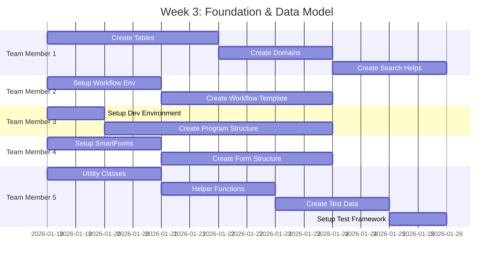
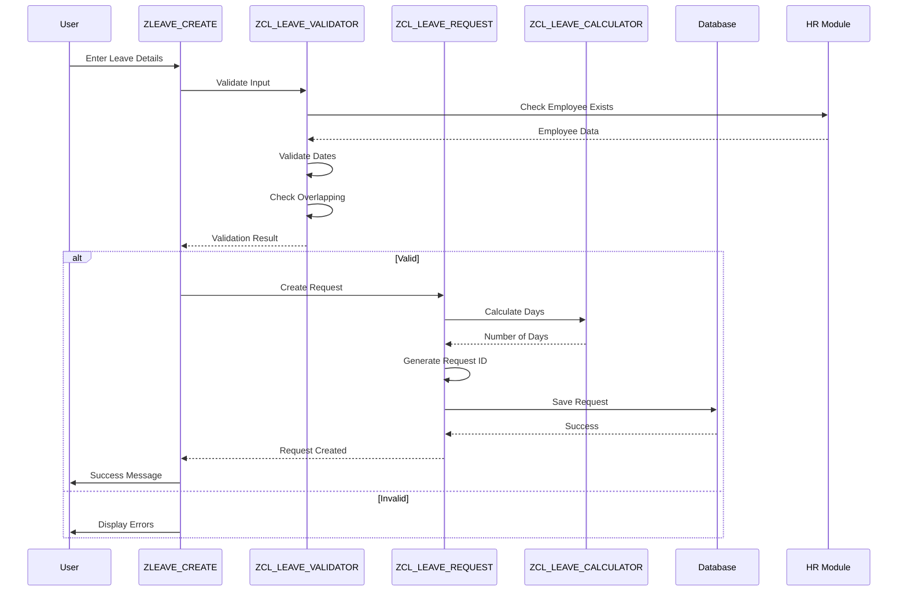
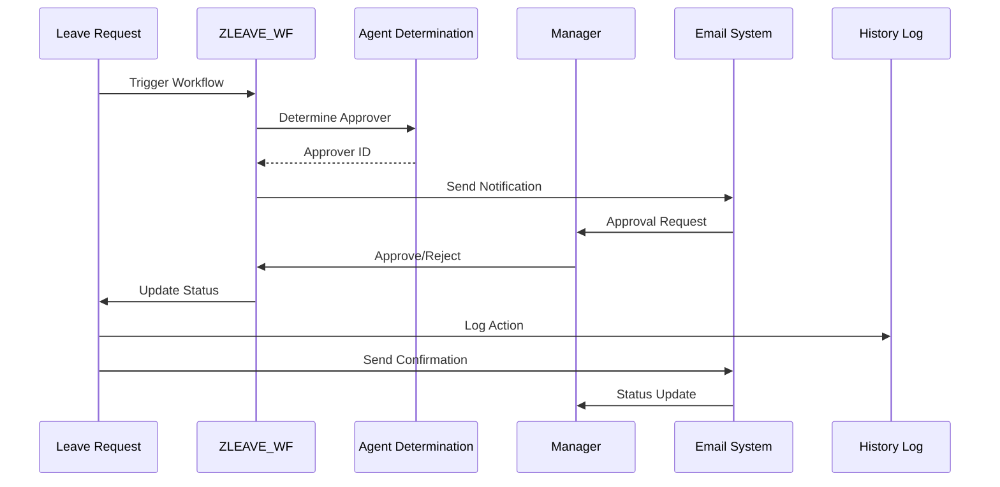
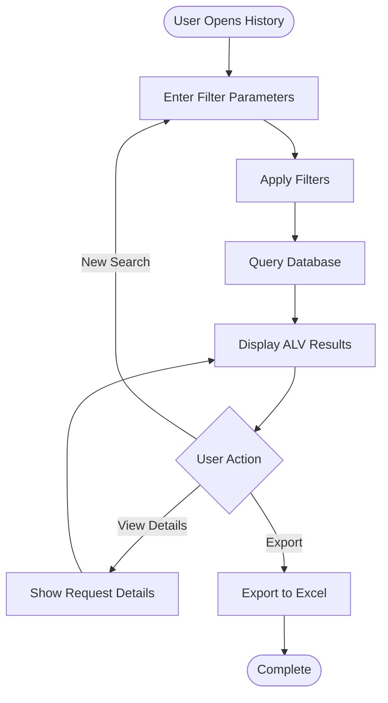
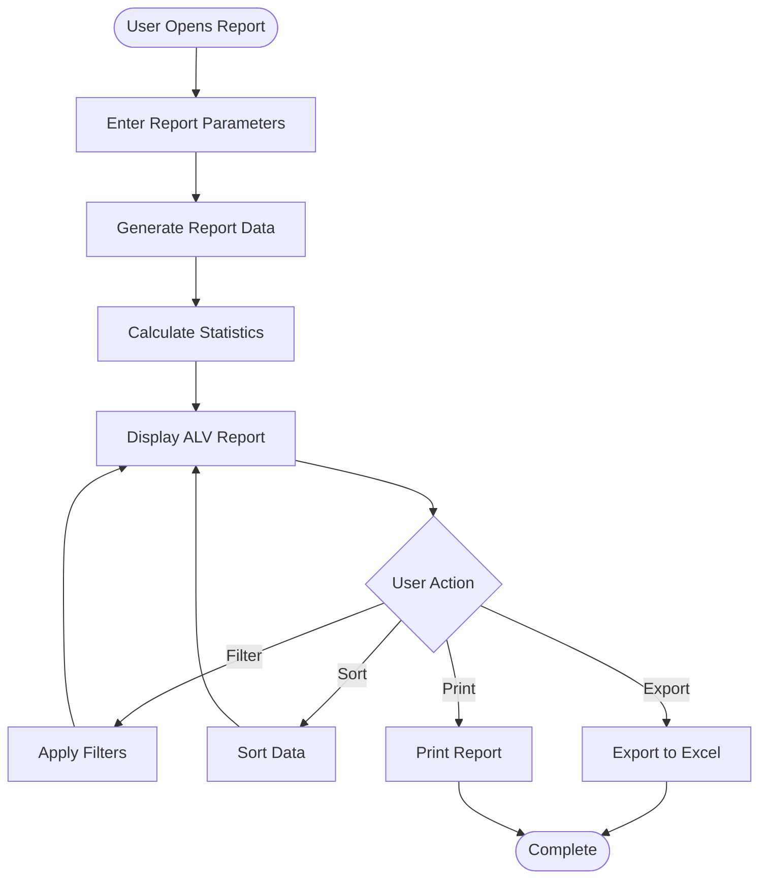
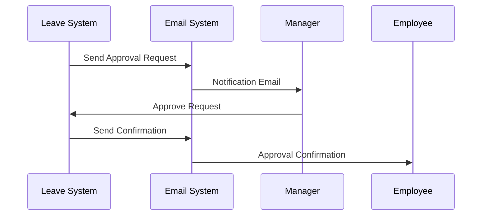

# Giai đoạn 2: Phát triển

**Thời gian**: Tuần 3-8  
**← [Quay lại README](README.md)** | **Trước: [Giai đoạn 1: Yêu cầu & Thiết kế](Phase1_Requirements_Design.md)** | **Tiếp theo: [Giai đoạn 3: Kiểm thử & QA](Phase3_Testing_QA.md)**

---

## Mục lục

1. [Tuần 3: Nền tảng & Mô hình Dữ liệu](#week-3-foundation--data-model)
2. [Tuần 4: Chức năng Yêu cầu Nghỉ phép Cốt lõi](#week-4-core-leave-request-functionality)
3. [Tuần 5: Triển khai Quy trình Phê duyệt Workflow](#week-5-approval-workflow-implementation)
4. [Tuần 6: Tra cứu Lịch sử & Lọc](#week-6-history-lookup--filtering)
5. [Tuần 7: Báo cáo & Thống kê](#week-7-reporting--statistics)
6. [Tuần 8: Biểu mẫu, Email & Tích hợp](#week-8-forms-email--integration)
7. [Ví dụ Mã](#code-examples)
8. [Sơ đồ Tích hợp](#integration-diagrams)
9. [Điểm Kiểm tra](#testing-checkpoints)
10. [Tham khảo](#references)

---

## Tuần 3: Nền tảng & Mô hình Dữ liệu

### Tiến độ Phát triển



### Thành viên Nhóm 1: Trưởng Nhóm Phát triển / Chuyên gia Mô hình Dữ liệu

#### Nhiệm vụ

- [ ] **Tạo Bảng ZLEAVE_REQ_HDR (SE11)**

  **Giao dịch**: SE11  
  **Tên Bảng**: ZLEAVE_REQ_HDR

  **Các bước**:
  1. Mở SE11, nhập tên bảng: ZLEAVE_REQ_HDR
  2. Nhấp "Create"
  3. Nhập mô tả ngắn: "Leave Request Header"
  4. Chuyển đến tab "Delivery and Maintenance":
     - Delivery Class: A (Application table)
     - Data Browser/Table View: Display/Maintenance Allowed
  5. Chuyển đến tab "Fields" và thêm các trường:

  | Tên Trường | Data Element | Kiểu Dữ liệu | Độ dài | Khóa | Mô tả |
  |------------|--------------|-----------|--------|-----|-------------|
  | MANDT | MANDT | CLNT | 3 | X | Client |
  | REQ_ID | ZLEAVE_REQ_ID | CHAR | 10 | X | Request ID |
  | EMPLOYEE_ID | PERNR_D | NUMC | 8 | | Employee Number |
  | LEAVE_TYPE | ZLEAVE_TYPE | CHAR | 4 | | Leave Type |
  | START_DATE | DATUM | DATS | 8 | | Start Date |
  | END_DATE | DATUM | DATS | 8 | | End Date |
  | DAYS | ZLEAVE_DAYS | DEC | 5,2 | | Number of Days |
  | STATUS | ZLEAVE_STATUS | CHAR | 1 | | Status |
  | CREATED_BY | SYUNAME | CHAR | 12 | | Created By |
  | CREATED_DATE | TIMESTAMP | TIMESTAMP | 15 | | Creation Date |
  | APPROVED_BY | SYUNAME | CHAR | 12 | | Approved By |
  | APPROVED_DATE | TIMESTAMP | TIMESTAMP | 15 | | Approval Date |
  | COMMENTS | ZLEAVE_COMMENTS | CHAR | 255 | | Comments |

  6. Chuyển đến tab "Entry help/check":
     - Tạo search help cho LEAVE_TYPE
     - Tạo search help cho EMPLOYEE_ID
  7. Kích hoạt bảng

  **Ví dụ Mã - Định nghĩa Bảng**:
  ```abap
  " Table: ZLEAVE_REQ_HDR
  " Description: Leave Request Header Table
  
  " Key Fields
  MANDT      TYPE MANDT,      " Client
  REQ_ID     TYPE ZLEAVE_REQ_ID,  " Request ID (Primary Key)
  
  " Data Fields
  EMPLOYEE_ID TYPE PERNR_D,   " Employee Number
  LEAVE_TYPE  TYPE ZLEAVE_TYPE,  " Leave Type
  START_DATE  TYPE DATUM,     " Start Date
  END_DATE    TYPE DATUM,     " End Date
  DAYS        TYPE ZLEAVE_DAYS,  " Number of Days
  STATUS      TYPE ZLEAVE_STATUS,  " Status
  CREATED_BY  TYPE SYUNAME,    " Created By
  CREATED_DATE TYPE TIMESTAMP,  " Creation Date
  APPROVED_BY TYPE SYUNAME,    " Approved By
  APPROVED_DATE TYPE TIMESTAMP,  " Approval Date
  COMMENTS    TYPE ZLEAVE_COMMENTS  " Comments
  ```

- [ ] **Tạo Bảng ZLEAVE_REQ_ITEM**

  Quy trình tương tự như trên. Các trường khóa:
  - REQ_ID (Khóa Chính, Khóa Ngoại đến ZLEAVE_REQ_HDR)
  - ITEM_NO (Khóa Chính)
  - DATE, DAY_TYPE, REMARKS

- [ ] **Tạo Bảng ZLEAVE_HISTORY**

  Các trường khóa:
  - REQ_ID (Khóa Chính, Khóa Ngoại)
  - SEQUENCE_NO (Khóa Chính)
  - ACTION, ACTION_DATE, ACTION_BY, OLD_STATUS, NEW_STATUS, COMMENTS

- [ ] **Tạo Bảng ZLEAVE_CONFIG**

  Các trường khóa:
  - LEAVE_TYPE (Khóa Chính)
  - MIN_DAYS, MAX_DAYS, APPROVAL_LEVEL, DESCRIPTION

- [ ] **Tạo Domains và Data Elements**

  **Domain: ZLEAVE_REQ_ID**
  - Kiểu Dữ liệu: CHAR
  - Độ dài: 10
  - Mô tả: "Leave Request ID"

  **Domain: ZLEAVE_STATUS**
  - Kiểu Dữ liệu: CHAR
  - Độ dài: 1
  - Giá trị Cố định:
    - 'P' = Pending
    - 'A' = Approved
    - 'R' = Rejected
    - 'C' = Cancelled

- [ ] **Tạo Search Helps**

  **Search Help: ZLEAVE_EMPLOYEE**
  - Bảng: PA0001
  - Trường: PERNR, ENAME
  - Mô tả: "Employee Search Help"

- [ ] **Kích hoạt Tất cả Bảng**

- [ ] **Tạo Maintenance Views (SM30)**

  Tạo maintenance views cho bảng cấu hình để cho phép bảo trì dễ dàng.

**Sản phẩm**:
- 4 bảng cơ sở dữ liệu được tạo và kích hoạt
- Domains và data elements được tạo
- Search helps được tạo
- Maintenance views được tạo

**Tham khảo**:
- [Hướng dẫn Data Dictionary](../../ABAP-Guides/02_SAP_ABAP_DATA_DICTIONARY_GUIDE.md) - Tạo bảng
- [Hướng dẫn Cơ bản ABAP](../../ABAP-Guides/01_SAP_ABAP_BASICS_GUIDE.md#data-types-and-variables) - Kiểu dữ liệu

---

### Thành viên Nhóm 2: Chuyên gia Workflow & Phê duyệt

#### Nhiệm vụ

- [ ] **Thiết lập Môi trường Phát triển Workflow**

  **Giao dịch**: SWDD (Workflow Builder)

  **Các bước**:
  1. Mở SWDD
  2. Tạo mẫu workflow: ZLEAVE_WF
  3. Đặt thuộc tính workflow
  4. Xác định workflow container

- [ ] **Tạo Mẫu Workflow ZLEAVE_WF**

  **Cấu trúc Workflow**:
  ```
  ZLEAVE_WF
  ├── Start Event: Leave Request Created
  ├── Task: ZLEAVE_APPROVE_TASK
  ├── Agent Determination
  └── End Event: Request Approved/Rejected
  ```

- [ ] **Xác định Workflow Container**

  **Phần tử Container**:
  - REQ_ID (Loại: ZLEAVE_REQ_ID)
  - EMPLOYEE_ID (Loại: PERNR_D)
  - LEAVE_DAYS (Loại: ZLEAVE_DAYS)
  - APPROVAL_LEVEL (Loại: INT1)
  - STATUS (Loại: ZLEAVE_STATUS)

- [ ] **Tạo Nhiệm vụ Workflow Cơ bản**

  **Nhiệm vụ: ZLEAVE_APPROVE_TASK**
  - Loại Nhiệm vụ: Standard Task
  - Phương thức: ZLEAVE_APPROVE_METHOD
  - Đại lý: Sẽ được xác định

- [ ] **Kiểm thử Cấu trúc Workflow Cơ bản**

  Kiểm thử workflow có thể được kích hoạt và luồng cơ bản hoạt động.

**Sản phẩm**:
- Mẫu workflow được tạo
- Workflow container được xác định
- Nhiệm vụ workflow cơ bản được tạo

**Tham khảo**:
- [Hướng dẫn SAP Workflow](../../SAP_WORKFLOW_GUIDE.md) - Tạo workflow

---

### Thành viên Nhóm 3: Chuyên gia UI & Báo cáo

#### Nhiệm vụ

- [ ] **Thiết lập Môi trường Phát triển**

  - Truy cập SAP GUI
  - Truy cập hệ thống phát triển
  - Phân quyền yêu cầu

- [ ] **Xem lại Hướng dẫn Lập trình ALV**

  Nghiên cứu khái niệm ALV và thực hành tốt nhất.

- [ ] **Tạo Cấu trúc Chương trình Cơ bản ZLEAVE_CREATE**

  **Giao dịch**: SE38  
  **Chương trình**: ZLEAVE_CREATE

  **Cấu trúc Mã**:
  ```abap
  REPORT zleave_create.

  "**********************************************************************
  "* Program: Create Leave Request
  "* Purpose: Allow employees to create leave requests
  "* Author: Team Member 3
  "* Date: 2026
  "**********************************************************************

  " Selection screen
  PARAMETERS: p_empno TYPE pernr_d DEFAULT sy-uname.

  " Data declarations
  DATA: go_request TYPE REF TO zcl_leave_request.

  " Initialization
  INITIALIZATION.
    " Set default values

  " Main processing
  START-OF-SELECTION.
    " Create leave request logic
  ```

- [ ] **Thiết kế Bố cục Màn hình Lựa chọn**

  Tạo màn hình lựa chọn với các trường nhập yêu cầu.

**Sản phẩm**:
- Môi trường phát triển được thiết lập
- Cấu trúc chương trình cơ bản được tạo
- Bố cục màn hình lựa chọn được thiết kế

**Tham khảo**:
- [Hướng dẫn Lập trình ALV](../../ABAP-Guides/07_SAP_ABAP_ALV_PROGRAMMING_GUIDE.md) - Khái niệm ALV
- [Hướng dẫn Lập trình Màn hình](../../ABAP-Guides/06_SAP_ABAP_SCREEN_PROGRAMMING_GUIDE.md) - Thiết kế màn hình

---

### Thành viên Nhóm 4: Chuyên gia Biểu mẫu & Tích hợp

#### Nhiệm vụ

- [ ] **Thiết lập Môi trường SmartForms**

  **Giao dịch**: SMARTFORMS

- [ ] **Tạo Cấu trúc SmartForm Cơ bản ZLEAVE_FORM**

  **Các bước**:
  1. Mở SMARTFORMS
  2. Tạo biểu mẫu: ZLEAVE_FORM
  3. Xác định giao diện biểu mẫu
  4. Tạo cấu trúc bố cục cơ bản

- [ ] **Xác định Giao diện Biểu mẫu**

  **Tham số Nhập**:
  - IV_REQ_ID (Loại: ZLEAVE_REQ_ID)
  - IV_EMPLOYEE_ID (Loại: PERNR_D)
  - IV_LEAVE_TYPE (Loại: ZLEAVE_TYPE)
  - IV_START_DATE (Loại: DATUM)
  - IV_END_DATE (Loại: DATUM)
  - IV_DAYS (Loại: ZLEAVE_DAYS)

- [ ] **Tạo Bố cục Cơ bản**

  Tạo phần header, body và footer.

**Sản phẩm**:
- Cấu trúc SmartForm được tạo
- Giao diện biểu mẫu được xác định
- Bố cục cơ bản được tạo

**Tham khảo**:
- [Hướng dẫn Biểu mẫu SAP](../../SAP_FORMS_GUIDE.md) - SmartForms

---

### Thành viên Nhóm 5: Chuyên gia Phát triển & Chất lượng

#### Nhiệm vụ

- [ ] **Phát triển Lớp Tiện ích**

  **Phát triển Lớp ZCL_LEAVE_UTILITIES**:
  - Phương thức: FORMAT_DATE (Định dạng ngày để hiển thị)
  - Phương thức: GET_EMPLOYEE_NAME (Lấy tên nhân viên từ HR)
  - Phương thức: VALIDATE_DATE_RANGE (Xác thực phạm vi ngày)
  - Phương thức: GET_STATUS_TEXT (Lấy mô tả trạng thái)
  - Phương thức: LOG_MESSAGE (Ghi nhật ký tập trung)

  **Định nghĩa Lớp**:
  ```abap
  CLASS zcl_leave_utilities DEFINITION
    PUBLIC
    FINAL
    CREATE PUBLIC.

    PUBLIC SECTION.
      CLASS-METHODS format_date
        IMPORTING iv_date TYPE datum
        RETURNING VALUE(rv_formatted_date) TYPE string.

      CLASS-METHODS get_employee_name
        IMPORTING iv_employee_id TYPE pernr_d
        RETURNING VALUE(rv_name) TYPE string.

      CLASS-METHODS validate_date_range
        IMPORTING iv_start_date TYPE datum
                  iv_end_date TYPE datum
        RETURNING VALUE(rv_valid) TYPE abap_bool.

      CLASS-METHODS get_status_text
        IMPORTING iv_status TYPE zleave_status
        RETURNING VALUE(rv_text) TYPE string.

      CLASS-METHODS log_message
        IMPORTING iv_message TYPE string
                  iv_type TYPE char1.

  ENDCLASS.
  ```

- [ ] **Phát triển Hàm Trợ giúp**

  **Function Module: Z_LEAVE_GET_MANAGER**
  - Mục đích: Lấy quản lý của nhân viên từ HR
  - Đầu vào: Employee ID
  - Đầu ra: Manager ID

  **Function Module: Z_LEAVE_CHECK_HOLIDAY**
  - Mục đích: Kiểm tra xem ngày có phải là ngày lễ không
  - Đầu vào: Date
  - Đầu ra: Cờ Is Holiday

- [ ] **Tạo Dữ liệu Kiểm thử cho Bảng**

  Tạo script dữ liệu kiểm thử cho:
  - Dữ liệu chủ nhân viên
  - Dữ liệu cấu hình nghỉ phép
  - Mẫu yêu cầu nghỉ phép

- [ ] **Viết Thiết lập Khung Kiểm thử Đơn vị**

  Thiết lập khung kiểm thử ABAP Unit cho lớp tiện ích.

- [ ] **Tạo Script Dữ liệu Kiểm thử**

  ```abap
  " Test Data Script Example
  DATA: lt_test_data TYPE TABLE OF zleave_req_hdr.
  
  " Insert test data
  APPEND VALUE #(
    req_id = 'REQ0000001'
    employee_id = '00001234'
    leave_type = 'ANNU'
    start_date = '20260119'
    end_date = '20260123'
    days = 5
    status = 'P'
    created_by = sy-uname
    created_date = sy-datum
  ) TO lt_test_data.
  
  INSERT zleave_req_hdr FROM TABLE lt_test_data.
  ```

- [ ] **Tài liệu hóa Thiết lập Môi trường Kiểm thử**

  Tài liệu hóa cấu hình hệ thống kiểm thử và các bước thiết lập.

**Sản phẩm**:
- Lớp tiện ích được phát triển
- Hàm trợ giúp được tạo
- Dữ liệu kiểm thử được tạo
- Khung kiểm thử đơn vị được thiết lập
- Script dữ liệu kiểm thử được tạo
- Tài liệu môi trường kiểm thử

**Tham khảo**:
- [Hướng dẫn ABAP Objects](../../ABAP-Guides/08_SAP_ABAP_OBJECTS_GUIDE.md) - Phát triển lớp
- [Hướng dẫn Function Modules](../../ABAP-Guides/05_SAP_ABAP_FUNCTION_MODULES_GUIDE.md) - Phát triển function module
- [Hướng dẫn Kiểm thử Đơn vị](../../ABAP-Guides/14_SAP_ABAP_UNIT_TESTING_GUIDE.md) - Thiết lập kiểm thử

---

## Tuần 4: Chức năng Yêu cầu Nghỉ phép Cốt lõi

### Luồng Phát triển



### Thành viên Nhóm 1: Trưởng Nhóm Phát triển / Chuyên gia Mô hình Dữ liệu

#### Nhiệm vụ

- [ ] **Phát triển Lớp ZCL_LEAVE_REQUEST**

  **Giao dịch**: SE24  
  **Lớp**: ZCL_LEAVE_REQUEST

  **Định nghĩa Lớp**:
  ```abap
  CLASS zcl_leave_request DEFINITION
    PUBLIC
    FINAL
    CREATE PRIVATE.

    PUBLIC SECTION.
      " Factory method
      CLASS-METHODS get_instance
        RETURNING VALUE(ro_instance) TYPE REF TO zcl_leave_request.

      " Main methods
      METHODS create_request
        IMPORTING is_request_data TYPE zst_leave_request
        EXPORTING ev_request_id TYPE zleave_req_id
                  et_messages TYPE bapiret2_t.

      METHODS update_request
        IMPORTING iv_request_id TYPE zleave_req_id
                  is_request_data TYPE zst_leave_request
        EXPORTING et_messages TYPE bapiret2_t.

      METHODS get_request
        IMPORTING iv_request_id TYPE zleave_req_id
        EXPORTING es_request_data TYPE zst_leave_request
                  et_messages TYPE bapiret2_t.

    PRIVATE SECTION.
      CLASS-DATA: go_instance TYPE REF TO zcl_leave_request.

      METHODS generate_request_id
        RETURNING VALUE(rv_request_id) TYPE zleave_req_id.

      METHODS save_to_database
        IMPORTING is_request_data TYPE zst_leave_request
        EXPORTING et_messages TYPE bapiret2_t.

  ENDCLASS.
  ```

  **Triển khai Phương thức - CREATE_REQUEST**:
  ```abap
  METHOD create_request.
    DATA: lv_request_id TYPE zleave_req_id.

    " Generate request ID
    lv_request_id = generate_request_id( ).
    is_request_data-request_id = lv_request_id.

    " Save to database
    save_to_database(
      EXPORTING is_request_data = is_request_data
      IMPORTING et_messages = et_messages
    ).

    IF et_messages IS INITIAL.
      ev_request_id = lv_request_id.
      APPEND VALUE #( type = 'S' id = 'ZLEAVE' number = '001' 
                      message_v1 = lv_request_id 
                      message = 'Leave request created successfully' ) 
        TO et_messages.
    ENDIF.

  ENDMETHOD.
  ```

  **Triển khai Phương thức - GENERATE_REQUEST_ID**:
  ```abap
  METHOD generate_request_id.
    DATA: lv_number TYPE n LENGTH 8,
          lv_request_id TYPE zleave_req_id.

    " Get next number from number range
    CALL FUNCTION 'NUMBER_GET_NEXT'
      EXPORTING
        nr_range_nr = '01'
        object = 'ZLEAVE_REQ'
      IMPORTING
        number = lv_number
      EXCEPTIONS
        interval_not_found = 1
        number_range_not_intern = 2
        OTHERS = 3.

    IF sy-subrc = 0.
      CONCATENATE 'REQ' lv_number INTO rv_request_id.
    ELSE.
      " Fallback: Use timestamp
      DATA(lv_timestamp) = |{ sy-datum }{ sy-uzeit }|.
      rv_request_id = lv_timestamp(10).
    ENDIF.

  ENDMETHOD.
  ```

- [ ] **Phát triển Lớp ZCL_LEAVE_VALIDATOR**

  **Định nghĩa Lớp**:
  ```abap
  CLASS zcl_leave_validator DEFINITION
    PUBLIC
    FINAL
    CREATE PUBLIC.

    PUBLIC SECTION.
      METHODS validate_request
        IMPORTING is_request_data TYPE zst_leave_request
        EXPORTING ev_valid TYPE abap_bool
                  et_messages TYPE bapiret2_t.

    PRIVATE SECTION.
      METHODS validate_employee
        IMPORTING iv_employee_id TYPE pernr_d
        EXPORTING ev_valid TYPE abap_bool
                  et_messages TYPE bapiret2_t.

      METHODS validate_dates
        IMPORTING iv_start_date TYPE datum
                  iv_end_date TYPE datum
        EXPORTING ev_valid TYPE abap_bool
                  et_messages TYPE bapiret2_t.

      METHODS validate_leave_balance
        IMPORTING iv_employee_id TYPE pernr_d
                  iv_leave_type TYPE zleave_type
                  iv_days TYPE zleave_days
        EXPORTING ev_valid TYPE abap_bool
                  et_messages TYPE bapiret2_t.

      METHODS check_overlapping
        IMPORTING iv_employee_id TYPE pernr_d
                  iv_start_date TYPE datum
                  iv_end_date TYPE datum
        EXPORTING ev_valid TYPE abap_bool
                  et_messages TYPE bapiret2_t.

  ENDCLASS.
  ```

  **Triển khai Phương thức - VALIDATE_REQUEST**:
  ```abap
  METHOD validate_request.
    DATA: lv_valid TYPE abap_bool VALUE abap_true.

    " Validate employee
    validate_employee(
      EXPORTING iv_employee_id = is_request_data-employee_id
      IMPORTING ev_valid = DATA(lv_emp_valid)
                et_messages = DATA(lt_emp_msg)
    ).

    IF lv_emp_valid = abap_false.
      lv_valid = abap_false.
      APPEND LINES OF lt_emp_msg TO et_messages.
    ENDIF.

    " Validate dates
    validate_dates(
      EXPORTING iv_start_date = is_request_data-start_date
                iv_end_date = is_request_data-end_date
      IMPORTING ev_valid = DATA(lv_date_valid)
                et_messages = DATA(lt_date_msg)
    ).

    IF lv_date_valid = abap_false.
      lv_valid = abap_false.
      APPEND LINES OF lt_date_msg TO et_messages.
    ENDIF.

    " Check overlapping
    check_overlapping(
      EXPORTING iv_employee_id = is_request_data-employee_id
                iv_start_date = is_request_data-start_date
                iv_end_date = is_request_data-end_date
      IMPORTING ev_valid = DATA(lv_overlap_valid)
                et_messages = DATA(lt_overlap_msg)
    ).

    IF lv_overlap_valid = abap_false.
      lv_valid = abap_false.
      APPEND LINES OF lt_overlap_msg TO et_messages.
    ENDIF.

    ev_valid = lv_valid.

  ENDMETHOD.
  ```

- [ ] **Phát triển Lớp ZCL_LEAVE_CALCULATOR**

  **Triển khai Phương thức - CALCULATE_DAYS**:
  ```abap
  METHOD calculate_days.
    DATA: lv_days TYPE zleave_days VALUE 0,
          lv_current_date TYPE datum.

    lv_current_date = iv_start_date.

    WHILE lv_current_date <= iv_end_date.
      " Check if working day (exclude weekends)
      CALL FUNCTION 'DATE_GET_WEEK'
        EXPORTING
          date = lv_current_date
        IMPORTING
          weekday = DATA(lv_weekday).

      IF lv_weekday <> '6' AND lv_weekday <> '7'. " Not Saturday or Sunday
        lv_days = lv_days + 1.
      ENDIF.

      " Add one day
      lv_current_date = lv_current_date + 1.
    ENDWHILE.

    rv_days = lv_days.

  ENDMETHOD.
  ```

- [ ] **Tích hợp với Bảng HR**

  **Mã Tích hợp**:
  ```abap
  " Check employee exists in HR
  SELECT SINGLE pernr ename orgeh
    FROM pa0001
    INTO @DATA(ls_employee)
    WHERE pernr = @iv_employee_id
      AND endda >= @sy-datum
      AND begda <= @sy-datum.

  IF sy-subrc <> 0.
    " Employee not found
    ev_valid = abap_false.
    APPEND VALUE #( type = 'E' id = 'ZLEAVE' number = '002'
                    message = 'Employee not found' ) TO et_messages.
    RETURN.
  ENDIF.
  ```

- [ ] **Triển khai Logic Tạo ID Tự động**

  Xem phương thức GENERATE_REQUEST_ID ở trên.

- [ ] **Kiểm thử Đơn vị Lớp Cốt lõi**

  Tạo kiểm thử đơn vị cho mỗi phương thức.

**Sản phẩm**:
- Lớp ZCL_LEAVE_REQUEST được triển khai
- Lớp ZCL_LEAVE_VALIDATOR được triển khai
- Lớp ZCL_LEAVE_CALCULATOR được triển khai
- Tích hợp HR hoạt động
- Tạo ID tự động hoạt động
- Kiểm thử đơn vị được tạo

**Tham khảo**:
- [Hướng dẫn ABAP Objects](../../ABAP-Guides/08_SAP_ABAP_OBJECTS_GUIDE.md) - Thiết kế lớp
- [Hướng dẫn Kiểm thử Đơn vị](../../ABAP-Guides/14_SAP_ABAP_UNIT_TESTING_GUIDE.md) - Kiểm thử đơn vị

---

### Thành viên Nhóm 3: Chuyên gia UI & Báo cáo

#### Nhiệm vụ

- [ ] **Phát triển Chương trình ZLEAVE_CREATE**

  **Cấu trúc Chương trình Hoàn chỉnh**:
  ```abap
  REPORT zleave_create.

  "**********************************************************************
  "* Program: Create Leave Request
  "* Purpose: Allow employees to create leave requests
  "* Author: Team Member 3
  "* Date: 2026
  "**********************************************************************

  " Selection screen
  PARAMETERS: p_empno TYPE pernr_d DEFAULT sy-uname OBLIGATORY.

  " Data declarations
  DATA: go_request TYPE REF TO zcl_leave_request,
        go_validator TYPE REF TO zcl_leave_validator,
        go_calculator TYPE REF TO zcl_leave_calculator,
        gs_request_data TYPE zst_leave_request,
        gt_messages TYPE bapiret2_t.

  " Initialization
  INITIALIZATION.
    " Set default employee from user
    SELECT SINGLE pernr FROM pa0001
      INTO p_empno
      WHERE pernr = sy-uname
        AND endda >= sy-datum
        AND begda <= sy-datum.

  " Main processing
  START-OF-SELECTION.
    " Get instances
    go_request = zcl_leave_request=>get_instance( ).
    go_validator = zcl_leave_validator=>new( ).
    go_calculator = zcl_leave_calculator=>new( ).

    " Prepare request data
    gs_request_data-employee_id = p_empno.
    " ... other fields from screen

    " Validate
    go_validator->validate_request(
      EXPORTING is_request_data = gs_request_data
      IMPORTING ev_valid = DATA(lv_valid)
                et_messages = gt_messages
    ).

    IF lv_valid = abap_true.
      " Create request
      go_request->create_request(
        EXPORTING is_request_data = gs_request_data
        IMPORTING ev_request_id = DATA(lv_request_id)
                  et_messages = gt_messages
      ).

      IF lv_request_id IS NOT INITIAL.
        MESSAGE |Leave request { lv_request_id } created successfully| TYPE 'S'.
      ENDIF.
    ELSE.
      " Display errors
      LOOP AT gt_messages INTO DATA(ls_message).
        MESSAGE ID ls_message-id TYPE ls_message-type NUMBER ls_message-number
                WITH ls_message-message_v1 ls_message-message_v2
                     ls_message-message_v3 ls_message-message_v4.
      ENDLOOP.
    ENDIF.
  ```

- [ ] **Triển khai Logic Luồng Màn hình**

  Tạo màn hình 0100 (Chính), 0200 (Xác nhận)

- [ ] **Thêm Xác thực Trường**

  Triển khai xác thực cấp trường trong PAI.

- [ ] **Triển khai Logic PBO/PAI**

  Logic chương trình cho luồng màn hình.

- [ ] **Kết nối với Lớp Cốt lõi**

  Tích hợp chương trình màn hình với lớp logic nghiệp vụ.

**Sản phẩm**:
- Chương trình ZLEAVE_CREATE hoạt động
- Luồng màn hình hoạt động
- Xác thực trường được triển khai
- Tích hợp với lớp hoạt động

**Tham khảo**:
- [Hướng dẫn Lập trình Màn hình](../../ABAP-Guides/06_SAP_ABAP_SCREEN_PROGRAMMING_GUIDE.md) - Phát triển màn hình

---

### Thành viên Nhóm 5: Chuyên gia Phát triển & Chất lượng

#### Nhiệm vụ

- [ ] **Cải thiện Lớp Tiện ích**
  - Thêm phương thức cho quản lý trạng thái yêu cầu
  - Thêm phương thức cho định dạng ngày trong màn hình
  - Thêm phương thức trợ giúp xác thực
  - Kiểm thử đơn vị phương thức tiện ích

- [ ] **Phát triển Khung Xử lý Lỗi**
  - Tạo lớp xử lý lỗi tập trung
  - Chuẩn hóa thông báo lỗi
  - Tạo cơ chế ghi nhật ký lỗi

- [ ] **Hỗ trợ Hoạt động Kiểm thử**
  - Tạo dữ liệu kiểm thử cho kịch bản tạo yêu cầu
  - Viết kiểm thử đơn vị cho lớp tiện ích
  - Hỗ trợ kiểm thử tích hợp

**Sản phẩm**:
- Lớp tiện ích được cải thiện
- Khung xử lý lỗi
- Dữ liệu kiểm thử và kiểm thử đơn vị

---

## Tuần 5: Triển khai Quy trình Phê duyệt Workflow

### Luồng Triển khai Workflow



### Thành viên Nhóm 2: Chuyên gia Workflow & Phê duyệt

#### Nhiệm vụ

- [ ] **Hoàn thiện Mẫu Workflow**

  **Cấu trúc Workflow**:
  ```
  ZLEAVE_WF
  ├── Start Event: Leave Request Created
  ├── Decision: Check Approval Level
  │   ├── Level 1: Direct Manager
  │   ├── Level 2: Department Head
  │   └── Level 3: HR Director
  ├── Task: ZLEAVE_APPROVE_TASK
  ├── Decision: Approved/Rejected
  └── End Event: Process Complete
  ```

- [ ] **Triển khai Logic Phê duyệt Đa cấp**

  **Xác định Cấp Phê duyệt**:
  ```abap
  METHOD determine_approval_level.
    DATA: lv_approval_level TYPE int1.

    " Get leave days from request
    SELECT SINGLE days FROM zleave_req_hdr
      INTO @DATA(lv_days)
      WHERE req_id = @iv_request_id.

    " Determine approval level based on days
    IF lv_days < 5.
      lv_approval_level = 1. " Direct Manager
    ELSEIF lv_days >= 5 AND lv_days <= 10.
      lv_approval_level = 2. " Department Head
    ELSE.
      lv_approval_level = 3. " HR Director
    ENDIF.

    rv_approval_level = lv_approval_level.

  ENDMETHOD.
  ```

- [ ] **Triển khai Xác định Đại lý Phê duyệt**

  **Phương thức Xác định Đại lý**:
  ```abap
  METHOD determine_approver.
    DATA: lv_manager_id TYPE pernr_d.

    " Get employee's manager from HR
    SELECT SINGLE vorges FROM pa0001
      INTO lv_manager_id
      WHERE pernr = iv_employee_id
        AND endda >= sy-datum
        AND begda <= sy-datum.

    IF sy-subrc = 0 AND lv_manager_id IS NOT INITIAL.
      rv_approver_id = lv_manager_id.
    ELSE.
      " Fallback to HR admin
      rv_approver_id = '00000001'. " HR Admin
    ENDIF.

  ENDMETHOD.
  ```

- [ ] **Tạo Workflow Binding**

  Liên kết sự kiện workflow với logic nghiệp vụ.

- [ ] **Kiểm thử Workflow Phê duyệt End-to-End**

  Kiểm thử tất cả đường dẫn phê duyệt.

**Sản phẩm**:
- Triển khai workflow hoàn chỉnh
- Phê duyệt đa cấp hoạt động
- Xác định đại lý hoạt động
- Workflow đã được kiểm thử

**Tham khảo**:
- [Hướng dẫn SAP Workflow](../../SAP_WORKFLOW_GUIDE.md) - Triển khai workflow

---

### Thành viên Nhóm 5: Chuyên gia Phát triển & Chất lượng

#### Nhiệm vụ

- [ ] **Phát triển Hàm Trợ giúp Workflow**
  - Hàm: Z_LEAVE_GET_APPROVER (Lấy người phê duyệt dựa trên cấp)
  - Hàm: Z_LEAVE_CHECK_AUTHORITY (Kiểm tra quyền phê duyệt)
  - Hàm: Z_LEAVE_SEND_WORKFLOW_EMAIL (Gửi thông báo workflow)

- [ ] **Hỗ trợ Kiểm thử Workflow**
  - Tạo kịch bản kiểm thử cho tất cả cấp phê duyệt
  - Kiểm thử xử lý lỗi workflow
  - Tài liệu hóa kết quả kiểm thử workflow

**Sản phẩm**:
- Hàm trợ giúp workflow
- Kịch bản kiểm thử workflow
- Tài liệu kiểm thử

---

## Tuần 6: Tra cứu Lịch sử & Lọc

### Luồng Tra cứu Lịch sử



### Thành viên Nhóm 3: Chuyên gia UI & Báo cáo

#### Nhiệm vụ

- [ ] **Phát triển Chương trình ZLEAVE_HISTORY**

  **Màn hình Lựa chọn**:
  ```abap
  SELECTION-SCREEN BEGIN OF BLOCK b1 WITH FRAME TITLE TEXT-001.
  SELECT-OPTIONS: s_date FOR sy-datum,
                   s_empno FOR pa0001-pernr,
                   s_status FOR zleave_req_hdr-status.
  PARAMETERS: p_leavety TYPE zleave_type.
  SELECTION-SCREEN END OF BLOCK b1.
  ```

- [ ] **Triển khai Logic Lọc**

  **Triển khai Lọc**:
  ```abap
  SELECT * FROM zleave_req_hdr
    INTO TABLE @DATA(lt_requests)
    WHERE created_date IN @s_date
      AND employee_id IN @s_empno
      AND status IN @s_status
      AND leave_type = @p_leavety.

  " Apply additional filters if needed
  ```

- [ ] **Thêm Chức năng Sắp xếp**

  Triển khai chức năng sắp xếp ALV.

- [ ] **Triển khai Chức năng Tìm kiếm**

  Thêm khả năng tìm kiếm vào ALV.

**Sản phẩm**:
- Chương trình ZLEAVE_HISTORY hoạt động
- Lọc hoạt động
- Sắp xếp hoạt động
- Tìm kiếm hoạt động

**Tham khảo**:
- [Hướng dẫn Lập trình ALV](../../ABAP-Guides/07_SAP_ABAP_ALV_PROGRAMMING_GUIDE.md) - Lọc ALV

---

### Thành viên Nhóm 5: Chuyên gia Phát triển & Chất lượng

#### Nhiệm vụ

- [ ] **Phát triển Hàm Trợ giúp Lịch sử**
  - Hàm: Z_LEAVE_GET_HISTORY_SUMMARY (Lấy tóm tắt lịch sử)
  - Hàm: Z_LEAVE_FILTER_HISTORY (Lọc dữ liệu lịch sử)
  - Cải thiện lớp tiện ích với phương thức cụ thể cho lịch sử

- [ ] **Hỗ trợ Kiểm thử Lịch sử**
  - Kiểm thử tra cứu lịch sử với các bộ lọc khác nhau
  - Kiểm thử hiệu suất lịch sử với tập dữ liệu lớn
  - Xác thực độ chính xác dữ liệu lịch sử

**Sản phẩm**:
- Hàm trợ giúp lịch sử
- Kịch bản kiểm thử lịch sử
- Kết quả kiểm thử hiệu suất

---

## Tuần 7: Báo cáo & Thống kê

### Luồng Báo cáo



### Thành viên Nhóm 3: Chuyên gia UI & Báo cáo

#### Nhiệm vụ

- [ ] **Phát triển Chương trình ZLEAVE_REPORT**

  **Triển khai Báo cáo ALV**:
  ```abap
  METHOD display_report.
    DATA: lo_alv TYPE REF TO cl_salv_table,
          lo_functions TYPE REF TO cl_salv_functions,
          lo_display TYPE REF TO cl_salv_display_settings.

    " Create ALV object
    cl_salv_table=>factory(
      IMPORTING r_salv_table = lo_alv
      CHANGING t_table = lt_report_data
    ).

    " Enable functions
    lo_functions = lo_alv->get_functions( ).
    lo_functions->set_all( abap_true ).

    " Set display settings
    lo_display = lo_alv->get_display_settings( ).
    lo_display->set_striped_pattern( abap_true ).
    lo_display->set_list_header( 'Leave Request Statistics Report' ).

    " Display
    lo_alv->display( ).

  ENDMETHOD.
  ```

- [ ] **Triển khai Xuất Excel**

  **Triển khai Xuất**:
  ```abap
  METHOD export_to_excel.
    DATA: lo_excel TYPE REF TO cl_salv_excel,
          lv_file TYPE string.

    " Create Excel object
    lo_excel = cl_salv_excel=>factory( ).

    " Add data
    lo_excel->add_sheet( iv_name = 'Leave Report' ).
    lo_excel->add_data( it_data = lt_report_data ).

    " Save to file
    lv_file = |C:\Temp\LeaveReport_{ sy-datum }_{ sy-uzeit }.xlsx|.
    lo_excel->save( lv_file ).

    MESSAGE |Report exported to { lv_file }| TYPE 'S'.

  ENDMETHOD.
  ```

**Sản phẩm**:
- Chương trình ZLEAVE_REPORT hoạt động
- Tính toán thống kê hoạt động
- Xuất Excel hoạt động

**Tham khảo**:
- [Hướng dẫn Lập trình ALV](../../ABAP-Guides/07_SAP_ABAP_ALV_PROGRAMMING_GUIDE.md) - Báo cáo ALV

---

### Thành viên Nhóm 5: Chuyên gia Phát triển & Chất lượng

#### Nhiệm vụ

- [ ] **Phát triển Hàm Trợ giúp Báo cáo**
  - Hàm: Z_LEAVE_AGGREGATE_DATA (Tổng hợp dữ liệu cho báo cáo)
  - Hàm: Z_LEAVE_FORMAT_REPORT_DATA (Định dạng dữ liệu để hiển thị)
  - Cải thiện lớp tiện ích với phương thức cụ thể cho báo cáo

- [ ] **Hỗ trợ Kiểm thử Báo cáo**
  - Kiểm thử tạo báo cáo với các bộ lọc khác nhau
  - Kiểm thử hiệu suất báo cáo
  - Xác thực tính toán báo cáo

**Sản phẩm**:
- Hàm trợ giúp báo cáo
- Kịch bản kiểm thử báo cáo
- Kết quả kiểm thử hiệu suất

---

## Tuần 8: Biểu mẫu, Email & Tích hợp

### Luồng Thông báo Email



### Thành viên Nhóm 4: Chuyên gia Biểu mẫu & Tích hợp

#### Nhiệm vụ

- [ ] **Hoàn thiện SmartForm ZLEAVE_FORM**

  **Cấu trúc Biểu mẫu**:
  - Header: Logo công ty, tiêu đề biểu mẫu
  - Chi tiết Nhân viên: Tên, ID, Phòng ban
  - Chi tiết Nghỉ phép: Loại, ngày, số ngày
  - Phần Phê duyệt: Người phê duyệt, ngày, chữ ký
  - Footer: Ngày in, số trang

- [ ] **Triển khai Thông báo Email**

  **Phương thức Gửi Email**:
  ```abap
  METHOD send_notification.
    DATA: lt_message_body TYPE soli_tab,
          lv_subject TYPE so_obj_des.

    " Prepare email content
    lv_subject = |Leave Request { iv_request_id } - { iv_status }|.

    APPEND |Dear { iv_recipient_name },| TO lt_message_body.
    APPEND |Your leave request { iv_request_id } has been { iv_status }.| TO lt_message_body.
    APPEND |Leave Type: { iv_leave_type }| TO lt_message_body.
    APPEND |Dates: { iv_start_date } to { iv_end_date }| TO lt_message_body.
    APPEND |Days: { iv_days }| TO lt_message_body.

    " Send email
    CALL FUNCTION 'SO_DOCUMENT_SEND_API1'
      EXPORTING
        document_data = ls_doc_data
        document_type = 'RAW'
        put_in_outbox = abap_true
      TABLES
        object_content = lt_message_body
        receivers = lt_receivers
      EXCEPTIONS
        OTHERS = 1.

    IF sy-subrc = 0.
      COMMIT WORK.
    ENDIF.

  ENDMETHOD.
  ```

**Sản phẩm**:
- SmartForm hoàn chỉnh
- Thông báo email hoạt động
- Chức năng in hoạt động

**Tham khảo**:
- [Hướng dẫn Biểu mẫu SAP](../../SAP_FORMS_GUIDE.md) - SmartForms
- [Hướng dẫn Tích hợp](../../SAP_INTEGRATION_GUIDE.md) - Tích hợp email

---

### Thành viên Nhóm 5: Chuyên gia Phát triển & Chất lượng

#### Nhiệm vụ

- [ ] **Phát triển Hàm Trợ giúp Tích hợp**
  - Hàm: Z_LEAVE_SEND_EMAIL (Gửi email tập trung)
  - Hàm: Z_LEAVE_GENERATE_FORM (Trợ giúp tạo biểu mẫu)
  - Cải thiện lớp tiện ích để hỗ trợ tích hợp

- [ ] **Hỗ trợ Kiểm thử Tích hợp**
  - Kiểm thử tích hợp email end-to-end
  - Kiểm thử tạo và in biểu mẫu
  - Kiểm thử tất cả điểm tích hợp

**Sản phẩm**:
- Hàm trợ giúp tích hợp
- Kịch bản kiểm thử tích hợp
- Kết quả kiểm thử tích hợp

---

### Tất cả Thành viên Nhóm: Nhiệm vụ Kiểm thử & Tài liệu Chung

#### Tuần 3-8: Kiểm thử Liên tục

- [ ] **Kiểm thử Đơn vị**
  - Mỗi thành viên viết kiểm thử đơn vị cho các thành phần của mình
  - Thực thi kiểm thử đơn vị thường xuyên
  - Sửa kiểm thử thất bại ngay lập tức
  - Duy trì 80%+ phủ sóng mã

- [ ] **Kiểm thử Thành phần**
  - Kiểm thử kỹ lưỡng các thành phần của mình
  - Kiểm thử xử lý lỗi
  - Kiểm thử trường hợp biên
  - Tài liệu hóa kết quả kiểm thử

- [ ] **Kiểm thử Tích hợp**
  - Kiểm thử tích hợp với các thành phần khác
  - Tham gia phiên kiểm thử tích hợp
  - Sửa vấn đề tích hợp
  - Tài liệu hóa kết quả kiểm thử tích hợp

#### Tuần 3-8: Tài liệu Liên tục

- [ ] **Tài liệu Mã**
  - Thêm nhận xét nội tuyến vào mã
  - Tài liệu hóa logic phức tạp
  - Tài liệu hóa tham số phương thức
  - Tài liệu hóa giá trị trả về

- [ ] **Tài liệu Thành phần**
  - Tài liệu hóa các thành phần của mình
  - Tài liệu hóa giao diện thành phần
  - Tài liệu hóa ví dụ sử dụng
  - Cập nhật tài liệu khi mã thay đổi

---

## Điểm Kiểm tra

### Điểm Kiểm tra Tuần 3
- [ ] Tất cả bảng được tạo và kích hoạt
- [ ] Cấu trúc workflow cơ bản hoạt động
- [ ] Cấu trúc chương trình được tạo
- [ ] Môi trường kiểm thử sẵn sàng

### Điểm Kiểm tra Tuần 4
- [ ] Tạo yêu cầu nghỉ phép hoạt động
- [ ] Logic xác thực hoạt động
- [ ] Tích hợp HR hoạt động
- [ ] Kiểm thử đơn vị đạt

### Điểm Kiểm tra Tuần 5
- [ ] Workflow kích hoạt đúng
- [ ] Quy trình phê duyệt hoạt động
- [ ] Thông báo email được gửi
- [ ] Tất cả cấp phê duyệt được kiểm thử

### Điểm Kiểm tra Tuần 6
- [ ] Tra cứu lịch sử hoạt động
- [ ] Tất cả bộ lọc hoạt động
- [ ] Hiệu suất chấp nhận được

### Điểm Kiểm tra Tuần 7
- [ ] Báo cáo tạo đúng
- [ ] Thống kê chính xác
- [ ] Xuất Excel hoạt động

### Điểm Kiểm tra Tuần 8
- [ ] SmartForm in đúng
- [ ] Tất cả thông báo email hoạt động
- [ ] Kiểm thử tích hợp hoàn thành

---

## Tham khảo

- **[Hướng dẫn ABAP Objects](../../ABAP-Guides/08_SAP_ABAP_OBJECTS_GUIDE.md)** - Phát triển lớp
- **[Hướng dẫn Lập trình Màn hình](../../ABAP-Guides/06_SAP_ABAP_SCREEN_PROGRAMMING_GUIDE.md)** - Phát triển màn hình
- **[Hướng dẫn Lập trình ALV](../../ABAP-Guides/07_SAP_ABAP_ALV_PROGRAMMING_GUIDE.md)** - Phát triển báo cáo
- **[Hướng dẫn SAP Workflow](../../SAP_WORKFLOW_GUIDE.md)** - Triển khai workflow
- **[Hướng dẫn Biểu mẫu SAP](../../SAP_FORMS_GUIDE.md)** - SmartForms
- **[Hướng dẫn Kiểm thử Đơn vị](../../ABAP-Guides/14_SAP_ABAP_UNIT_TESTING_GUIDE.md)** - Cách tiếp cận kiểm thử
- **[Hướng dẫn Capstone](../../SAP_CAPSTONE_PROJECT_GUIDE.md#account-payable-automation)** - Ví dụ dự án tương tự

---

**← [Quay lại README](README.md)** | **Trước: [Giai đoạn 1: Yêu cầu & Thiết kế](Phase1_Requirements_Design.md)** | **Tiếp theo: [Giai đoạn 3: Kiểm thử & QA](Phase3_Testing_QA.md)**

