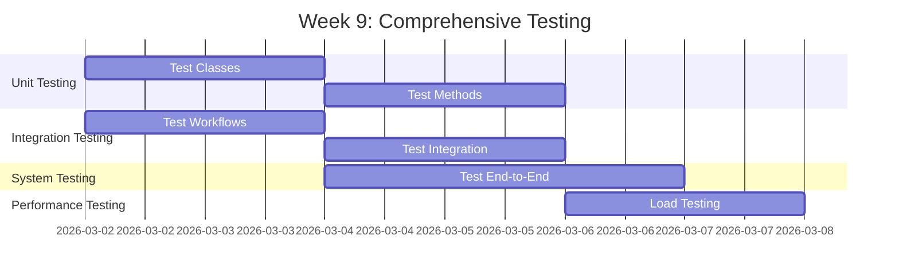
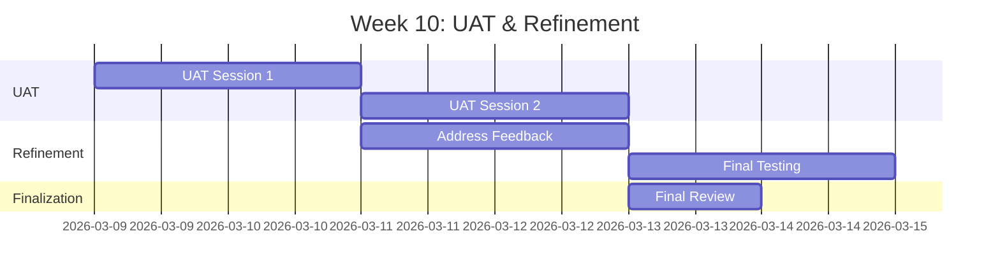
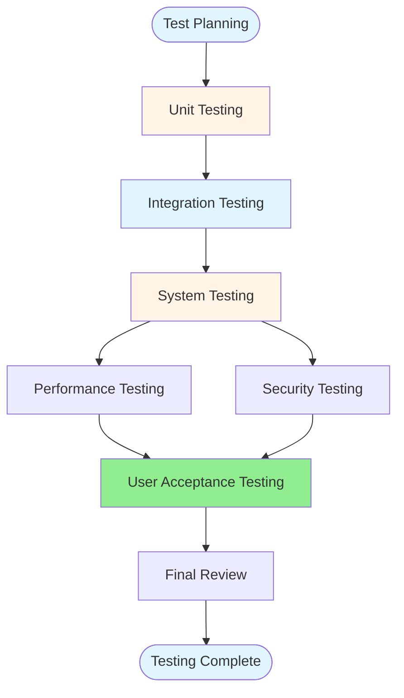
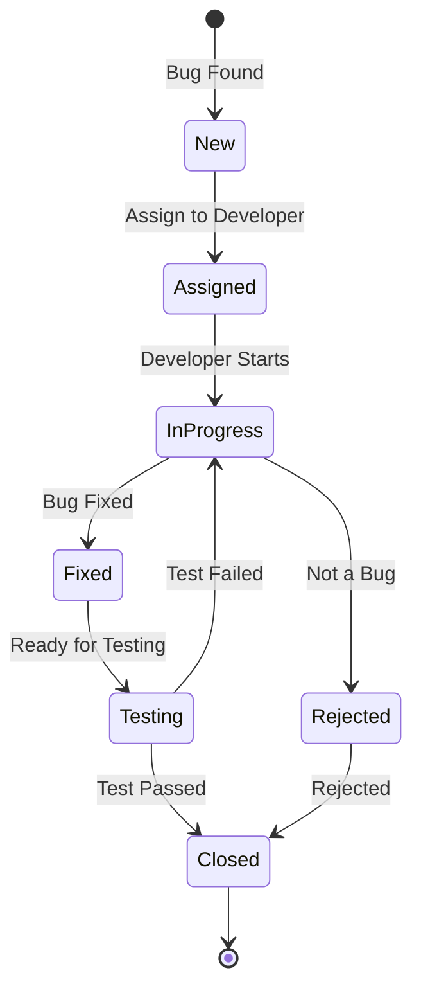

# Giai đoạn 3: Kiểm thử & Đảm bảo Chất lượng

**Thời gian**: Tuần 9-10  
**← [Quay lại README](README.md)** | **Trước: [Giai đoạn 2: Phát triển](Phase2_Development.md)** | **Tiếp theo: [Giai đoạn 4: Tài liệu & Trình bày](Phase4_Documentation_Presentation.md)**

---

## Mục lục

1. [Tuần 9: Kiểm thử Toàn diện](#week-9-comprehensive-testing)
2. [Tuần 10: Kiểm thử Chấp nhận Người dùng & Tinh chỉnh](#week-10-user-acceptance-testing--refinement)
3. [Cấu trúc Kế hoạch Kiểm thử](#test-plan-structure)
4. [Mẫu Trường hợp Kiểm thử](#test-case-templates)
5. [Kịch bản Kiểm thử](#testing-scenarios)
6. [Quy trình Theo dõi Lỗi](#bug-tracking-process)
7. [Kiểm thử Hiệu suất](#performance-testing)
8. [Kiểm thử Bảo mật](#security-testing)
9. [Kịch bản và Script UAT](#uat-scenarios-and-scripts)
10. [Tham khảo](#references)

---

## Tuần 9: Kiểm thử Toàn diện

### Tiến độ Kiểm thử

### Tất cả Thành viên Nhóm: Trách nhiệm Kiểm thử Chung

#### Nhiệm vụ Kiểm thử Chung

- [ ] **Hoàn thành Kiểm thử Đơn vị**
  - Mỗi thành viên xem lại và hoàn thành kiểm thử đơn vị cho các thành phần của mình
  - Đảm bảo 80%+ phủ sóng mã cho các thành phần của mình
  - Sửa kiểm thử thất bại trong các thành phần của mình
  - Tài liệu hóa kết quả kiểm thử cho các thành phần của mình

- [ ] **Kiểm thử Thành phần**
  - Kiểm thử kỹ lưỡng các thành phần của mình
  - Kiểm thử xử lý lỗi trong các thành phần của mình
  - Kiểm thử trường hợp biên cho các thành phần của mình
  - Tài liệu hóa kết quả kiểm thử thành phần

- [ ] **Kiểm thử Tích hợp**
  - Tham gia phiên kiểm thử tích hợp
  - Kiểm thử tích hợp các thành phần của mình với các thành phần khác
  - Kiểm thử tích hợp workflow
  - Kiểm thử tích hợp email
  - Kiểm thử tích hợp HR
  - Tài liệu hóa kết quả kiểm thử tích hợp

- [ ] **Kiểm thử Hệ thống**
  - Tham gia kịch bản kiểm thử end-to-end
  - Kiểm thử quy trình người dùng liên quan đến các thành phần của mình
  - Kiểm thử xử lý lỗi trên các thành phần
  - Tài liệu hóa kết quả kiểm thử hệ thống

- [ ] **Kiểm thử Hiệu suất**
  - Kiểm thử hiệu suất các thành phần của mình
  - Tham gia kiểm thử tải
  - Tối ưu hóa truy vấn thành phần của mình
  - Tài liệu hóa kết quả kiểm thử hiệu suất

- [ ] **Kiểm thử Bảo mật**
  - Kiểm thử phân quyền cho các thành phần của mình
  - Kiểm thử kiểm soát truy cập dữ liệu
  - Kiểm thử xác thực đầu vào
  - Tài liệu hóa kết quả kiểm thử bảo mật

- [ ] **Xem lại Mã**
  - Tham gia xem lại mã đồng nghiệp
  - Xem lại mã từ các thành viên nhóm khác
  - Cung cấp phản hồi mang tính xây dựng
  - Tài liệu hóa phát hiện xem lại mã

- [ ] **Chuẩn bị Kiểm thử Chấp nhận Người dùng**
  - Chuẩn bị kịch bản UAT cho các thành phần của mình
  - Tạo script kiểm thử cho các tính năng của mình
  - Chuẩn bị dữ liệu kiểm thử cho các thành phần của mình
  - Hỗ trợ điều phối UAT (Thành viên Nhóm 5 dẫn dắt)

---

### Thành viên Nhóm 1: Trưởng Nhóm Phát triển / Chuyên gia Mô hình Dữ liệu

#### Nhiệm vụ

- [ ] **Xem lại Mã Tất cả Mô-đun**
  - Xem lại tất cả lớp ABAP
  - Xem lại thiết kế cơ sở dữ liệu
  - Kiểm tra tuân thủ tiêu chuẩn mã
  - Xem lại xử lý lỗi

- [ ] **Tối ưu hóa Hiệu suất**
  - Tối ưu hóa truy vấn cơ sở dữ liệu
  - Thêm chỉ mục khi cần
  - Tối ưu hóa vòng lặp và lặp lại
  - Xem lại sử dụng bộ nhớ

- [ ] **Sửa Lỗi Nghiêm trọng**
  - Ưu tiên lỗi nghiêm trọng
  - Sửa vấn đề tính toàn vẹn dữ liệu
  - Sửa vấn đề hiệu suất
  - Sửa lỗ hổng bảo mật

- [ ] **Tái cấu trúc Mã nếu Cần**
  - Cải thiện khả năng đọc mã
  - Loại bỏ mã trùng lặp
  - Tối ưu hóa cấu trúc lớp
  - Cải thiện thông báo lỗi

**Sản phẩm**:
- Báo cáo xem lại mã
- Báo cáo tối ưu hóa hiệu suất
- Lỗi nghiêm trọng đã được sửa
- Mã đã được tái cấu trúc

**Tham khảo**:
- [Hướng dẫn Thực hành Tốt nhất ABAP](../../ABAP-Guides/12_SAP_ABAP_BEST_PRACTICES_GUIDE.md) - Chất lượng mã
- [Hướng dẫn Hiệu suất](../../ABAP-Guides/10_SAP_ABAP_PERFORMANCE_GUIDE.md) - Tối ưu hóa hiệu suất

---

### Thành viên Nhóm 2: Chuyên gia Workflow & Phê duyệt

#### Nhiệm vụ

- [ ] **Kiểm thử Tất cả Kịch bản Workflow**
  - Kiểm thử phê duyệt Cấp 1 (< 5 ngày)
  - Kiểm thử phê duyệt Cấp 2 (5-10 ngày)
  - Kiểm thử phê duyệt Cấp 3 (> 10 ngày)
  - Kiểm thử kịch bản từ chối
  - Kiểm thử kịch bản leo thang

- [ ] **Kiểm thử Trường hợp Biên**
  - Nhiều phê duyệt song song
  - Người phê duyệt không có sẵn
  - Hết thời gian workflow
  - Lỗi xác định đại lý

- [ ] **Xác thực Phân quyền**
  - Kiểm thử kiểm tra phân quyền
  - Kiểm thử truy cập dựa trên vai trò
  - Kiểm thử quyền phê duyệt
  - Kiểm thử kiểm soát truy cập dữ liệu

- [ ] **Sửa Vấn đề Workflow**
  - Sửa lỗi workflow
  - Sửa vấn đề xác định đại lý
  - Sửa vấn đề thông báo
  - Cải thiện hiệu suất workflow

**Sản phẩm**:
- Kết quả kiểm thử workflow
- Kết quả kiểm thử trường hợp biên
- Kết quả kiểm thử phân quyền
- Vấn đề workflow đã được sửa

**Tham khảo**:
- [Hướng dẫn SAP Workflow](../../SAP_WORKFLOW_GUIDE.md) - Kiểm thử workflow
- [Hướng dẫn Bảo mật](../../SAP_SECURITY_AUTHORIZATION_GUIDE.md) - Kiểm thử phân quyền

---

### Thành viên Nhóm 3: Chuyên gia UI & Báo cáo

#### Nhiệm vụ

- [ ] **Kiểm thử Tất cả Màn hình**
  - Kiểm thử màn hình tạo yêu cầu nghỉ phép
  - Kiểm thử màn hình phê duyệt
  - Kiểm thử màn hình tra cứu lịch sử
  - Kiểm thử màn hình báo cáo
  - Kiểm thử điều hướng màn hình
  - Kiểm thử xác thực trường

- [ ] **Kiểm thử Tất cả Báo cáo**
  - Kiểm thử tạo báo cáo
  - Kiểm thử lọc báo cáo
  - Kiểm thử sắp xếp báo cáo
  - Kiểm thử xuất báo cáo
  - Kiểm thử hiệu suất báo cáo

- [ ] **Kiểm thử Xuất Excel**
  - Kiểm thử chức năng xuất
  - Kiểm thử định dạng xuất
  - Kiểm thử xuất dữ liệu lớn
  - Kiểm thử hiệu suất xuất

- [ ] **Cải thiện UI/UX**
  - Cải thiện trải nghiệm người dùng
  - Sửa lỗi UI
  - Cải thiện thông báo lỗi
  - Cải thiện bố cục màn hình

- [ ] **Sửa Lỗi UI**
  - Sửa vấn đề hiển thị
  - Sửa vấn đề điều hướng
  - Sửa vấn đề xác thực
  - Sửa vấn đề hiệu suất

**Sản phẩm**:
- Kết quả kiểm thử màn hình
- Kết quả kiểm thử báo cáo
- Kết quả kiểm thử xuất Excel
- Cải thiện UI đã được triển khai

**Tham khảo**:
- [Hướng dẫn Lập trình Màn hình](../../ABAP-Guides/06_SAP_ABAP_SCREEN_PROGRAMMING_GUIDE.md) - Kiểm thử màn hình
- [Hướng dẫn Lập trình ALV](../../ABAP-Guides/07_SAP_ABAP_ALV_PROGRAMMING_GUIDE.md) - Kiểm thử báo cáo

---

### Thành viên Nhóm 4: Chuyên gia Biểu mẫu & Tích hợp

#### Nhiệm vụ

- [ ] **Kiểm thử SmartForm trong Tất cả Kịch bản**
  - Kiểm thử tạo biểu mẫu
  - Kiểm thử bố cục biểu mẫu
  - Kiểm thử in biểu mẫu
  - Kiểm thử biểu mẫu với dữ liệu khác nhau
  - Kiểm thử hiệu suất biểu mẫu

- [ ] **Kiểm thử Thông báo Email**
  - Kiểm thử email yêu cầu phê duyệt
  - Kiểm thử email xác nhận phê duyệt
  - Kiểm thử email từ chối
  - Kiểm thử thông báo thay đổi trạng thái
  - Kiểm thử định dạng email
  - Kiểm thử giao hàng email

- [ ] **Xác thực Đầu ra In**
  - Xác thực nội dung biểu mẫu
  - Xác thực bố cục biểu mẫu
  - Xác thực chất lượng in
  - Xác thực hiệu suất in

- [ ] **Sửa Vấn đề Biểu mẫu**
  - Sửa vấn đề bố cục biểu mẫu
  - Sửa vấn đề dữ liệu biểu mẫu
  - Sửa vấn đề in
  - Sửa vấn đề email

**Sản phẩm**:
- Kết quả kiểm thử SmartForm
- Kết quả kiểm thử thông báo email
- Xác thực đầu ra in
- Vấn đề biểu mẫu đã được sửa

**Tham khảo**:
- [Hướng dẫn Biểu mẫu SAP](../../SAP_FORMS_GUIDE.md) - Kiểm thử biểu mẫu
- [Hướng dẫn Tích hợp](../../SAP_INTEGRATION_GUIDE.md) - Kiểm thử email

---

### Thành viên Nhóm 5: Chuyên gia Phát triển & Chất lượng

#### Nhiệm vụ

- [ ] **Tiếp tục Hỗ trợ Phát triển**
  - Hỗ trợ các thành viên nhóm khác với hàm tiện ích
  - Sửa lỗi trong lớp tiện ích
  - Cải thiện hàm trợ giúp khi cần
  - Hỗ trợ xem lại mã

- [ ] **Điều phối Hoạt động Kiểm thử**
  - Điều phối thực thi kiểm thử trên tất cả thành viên
  - Tổng hợp kết quả kiểm thử từ tất cả thành viên
  - Theo dõi tiến độ kiểm thử tổng thể
  - Báo cáo trạng thái kiểm thử

- [ ] **Thực thi Trường hợp Kiểm thử cho Thành phần Của mình**
  - Thực thi trường hợp kiểm thử đơn vị cho lớp tiện ích
  - Thực thi trường hợp kiểm thử tích hợp
  - Thực thi trường hợp kiểm thử hệ thống
  - Thực thi trường hợp kiểm thử hiệu suất
  - Thực thi trường hợp kiểm thử bảo mật

- [ ] **Tài liệu hóa Kết quả Kiểm thử**
  - Tổng hợp kết quả kiểm thử từ tất cả thành viên
  - Tài liệu hóa thực thi kiểm thử tổng thể
  - Tạo báo cáo tóm tắt kiểm thử
  - Theo dõi số liệu kiểm thử

- [ ] **Quản lý Theo dõi Lỗi**
  - Thiết lập hệ thống theo dõi lỗi
  - Tài liệu hóa tất cả lỗi được tìm thấy (từ tất cả thành viên)
  - Ưu tiên lỗi
  - Gán lỗi cho thành viên nhóm
  - Theo dõi giải quyết lỗi

- [ ] **Chuẩn bị Điều phối UAT**
  - Tạo kịch bản kiểm thử UAT tổng thể
  - Tạo script kiểm thử UAT
  - Chuẩn bị dữ liệu kiểm thử UAT
  - Lên lịch phiên UAT
  - Điều phối hoạt động UAT

**Sản phẩm**:
- Hỗ trợ phát triển đã hoàn thành
- Báo cáo điều phối kiểm thử
- Tài liệu kết quả kiểm thử tổng hợp
- Hệ thống theo dõi lỗi
- Báo cáo lỗi
- Tài liệu điều phối UAT

**Tham khảo**:
- [Hướng dẫn Kiểm thử Đơn vị](../../ABAP-Guides/14_SAP_ABAP_UNIT_TESTING_GUIDE.md) - Thực thi kiểm thử
- [Hướng dẫn Kiểm thử](../../SAP_TESTING_GUIDE.md) - Lập kế hoạch kiểm thử

---

## Tuần 10: Kiểm thử Chấp nhận Người dùng & Tinh chỉnh

### Tiến độ UAT

### Thành viên Nhóm 5: Chuyên gia Phát triển & Chất lượng

#### Nhiệm vụ

- [ ] **Tiếp tục Hỗ trợ Phát triển**
  - Hỗ trợ sửa lỗi với hàm tiện ích
  - Cải thiện hàm trợ giúp khi cần
  - Hỗ trợ xem lại mã

- [ ] **Điều phối Phiên UAT**
  - Lên lịch phiên UAT với người dùng
  - Tạo điều kiện cho phiên UAT
  - Điều phối sự tham gia của thành viên nhóm
  - Hướng dẫn người dùng qua kịch bản kiểm thử
  - Trả lời câu hỏi người dùng
  - Tài liệu hóa quan sát UAT

- [ ] **Điều phối Thu thập Phản hồi Người dùng**
  - Điều phối thu thập phản hồi từ tất cả thành viên
  - Tổng hợp biểu mẫu phản hồi
  - Tiến hành phỏng vấn phản hồi
  - Tài liệu hóa đề xuất người dùng
  - Ưu tiên mục phản hồi

- [ ] **Tổng hợp Kết quả UAT**
  - Tổng hợp kết quả thực thi kiểm thử từ tất cả thành viên
  - Tài liệu hóa phản hồi người dùng tổng thể
  - Tài liệu hóa vấn đề được tìm thấy trên tất cả thành phần
  - Tài liệu hóa trạng thái chấp nhận

- [ ] **Quản lý Yêu cầu Thay đổi**
  - Tạo hệ thống theo dõi yêu cầu thay đổi
  - Tạo yêu cầu thay đổi cho mỗi mục phản hồi
  - Ưu tiên yêu cầu thay đổi
  - Gán yêu cầu thay đổi cho thành viên nhóm
  - Theo dõi trạng thái yêu cầu thay đổi

**Sản phẩm**:
- Hỗ trợ phát triển đã hoàn thành
- Báo cáo điều phối UAT
- Báo cáo phản hồi người dùng tổng hợp
- Tài liệu kết quả UAT
- Theo dõi yêu cầu thay đổi

**Tham khảo**:
- [Hướng dẫn Kiểm thử](../../SAP_TESTING_GUIDE.md) - Cách tiếp cận UAT
- [Hướng dẫn Capstone](../../SAP_CAPSTONE_PROJECT_GUIDE.md#testing-approach) - Hướng dẫn UAT

---

### Tất cả Thành viên Nhóm: Trách nhiệm Chung

#### Nhiệm vụ

- [ ] **Xử lý Phản hồi UAT**
  - Xem lại phản hồi người dùng liên quan đến các thành phần của mình
  - Triển khai thay đổi được yêu cầu cho các thành phần của mình
  - Kiểm thử thay đổi đã triển khai
  - Tài liệu hóa thay đổi đã thực hiện

- [ ] **Triển khai Thay đổi Được yêu cầu**
  - Ưu tiên thay đổi cho các thành phần của mình
  - Triển khai thay đổi ưu tiên cao
  - Kiểm thử thay đổi đã triển khai
  - Nhận sự chấp thuận người dùng cho thay đổi

- [ ] **Sửa Lỗi Cuối cùng**
  - Sửa lỗi còn lại trong các thành phần của mình
  - Sửa lỗi được tìm thấy trong UAT
  - Kiểm thử sửa lỗi
  - Xác minh giải quyết lỗi

- [ ] **Kiểm thử Cuối cùng**
  - Thực thi bộ kiểm thử cuối cùng cho các thành phần của mình
  - Xác minh tất cả chức năng của các thành phần của mình
  - Kiểm thử tất cả điểm tích hợp
  - Xác thực hiệu suất

- [ ] **Tài liệu hóa Thành phần**
  - Hoàn thiện tài liệu cho các thành phần của mình
  - Cập nhật phần hướng dẫn người dùng cho các tính năng của mình
  - Cập nhật tài liệu kỹ thuật
  - Đảm bảo tính đầy đủ của tài liệu

- [ ] **Chuẩn bị Triển khai**
  - Chuẩn bị gói triển khai cho các thành phần của mình
  - Chuẩn bị tài liệu triển khai
  - Hỗ trợ chuẩn bị triển khai (Thành viên Nhóm 5 điều phối)

**Sản phẩm**:
- Phản hồi UAT đã được xử lý
- Thay đổi đã được triển khai
- Lỗi cuối cùng đã được sửa
- Kiểm thử cuối cùng đã hoàn thành
- Sẵn sàng triển khai

---

## Cấu trúc Kế hoạch Kiểm thử

### Tổng quan Kế hoạch Kiểm thử

### Cấp Kiểm thử

1. **Kiểm thử Đơn vị**
   - Kiểm thử lớp riêng lẻ
   - Kiểm thử phương thức riêng lẻ
   - Kiểm thử xác thực dữ liệu
   - Phủ sóng mã: 80%+

2. **Kiểm thử Tích hợp**
   - Kiểm thử tích hợp lớp
   - Kiểm thử tích hợp workflow
   - Kiểm thử tích hợp email
   - Kiểm thử tích hợp HR

3. **Kiểm thử Hệ thống**
   - Kiểm thử kịch bản end-to-end
   - Kiểm thử quy trình người dùng
   - Kiểm thử xử lý lỗi
   - Kiểm thử trường hợp biên

4. **Kiểm thử Hiệu suất**
   - Kiểm thử thời gian phản hồi
   - Kiểm thử tải
   - Hiệu suất cơ sở dữ liệu
   - Hiệu suất báo cáo

5. **Kiểm thử Bảo mật**
   - Kiểm thử phân quyền
   - Kiểm thử truy cập dữ liệu
   - Kiểm thử xác thực đầu vào
   - Kiểm thử SQL injection

6. **Kiểm thử Chấp nhận Người dùng**
   - Kiểm thử kịch bản nghiệp vụ
   - Kiểm thử quy trình người dùng
   - Kiểm thử khả năng sử dụng
   - Xác thực chấp nhận

---

## Mẫu Trường hợp Kiểm thử

### Mẫu Trường hợp Kiểm thử Đơn vị

| Test Case ID | TC-UNIT-001 |
|--------------|-------------|
| **Tên Trường hợp Kiểm thử** | Kiểm thử Phương thức CREATE_REQUEST |
| **Thành phần** | ZCL_LEAVE_REQUEST |
| **Phương thức** | CREATE_REQUEST |
| **Điều kiện Tiên quyết** | Dữ liệu kiểm thử có sẵn |
| **Bước Kiểm thử** | 1. Tạo dữ liệu yêu cầu 2. Gọi CREATE_REQUEST 3. Xác minh ID yêu cầu được tạo 4. Xác minh dữ liệu được lưu |
| **Kết quả Mong đợi** | Yêu cầu được tạo với ID hợp lệ |
| **Kết quả Thực tế** | [Cần điền] |
| **Trạng thái** | [Pass/Fail] |
| **Nhận xét** | [Bất kỳ nhận xét nào] |

### Mẫu Trường hợp Kiểm thử Tích hợp

| Test Case ID | TC-INT-001 |
|--------------|------------|
| **Tên Trường hợp Kiểm thử** | Kiểm thử Luồng Tạo Yêu cầu Nghỉ phép |
| **Thành phần** | ZLEAVE_CREATE, ZCL_LEAVE_REQUEST, ZCL_LEAVE_VALIDATOR |
| **Điều kiện Tiên quyết** | Tất cả thành phần có sẵn |
| **Bước Kiểm thử** | 1. Người dùng nhập chi tiết nghỉ phép 2. Hệ thống xác thực đầu vào 3. Hệ thống tạo yêu cầu 4. Hệ thống kích hoạt workflow |
| **Kết quả Mong đợi** | Yêu cầu được tạo và workflow được kích hoạt |
| **Kết quả Thực tế** | [Cần điền] |
| **Trạng thái** | [Pass/Fail] |
| **Nhận xét** | [Bất kỳ nhận xét nào] |

### Mẫu Trường hợp Kiểm thử Hệ thống

| Test Case ID | TC-SYS-001 |
|--------------|------------|
| **Tên Trường hợp Kiểm thử** | Kiểm thử Quy trình Yêu cầu Nghỉ phép Hoàn chỉnh |
| **Kịch bản** | Nhân viên tạo yêu cầu nghỉ phép, quản lý phê duyệt |
| **Điều kiện Tiên quyết** | Hệ thống được cấu hình, người dùng có sẵn |
| **Bước Kiểm thử** | 1. Nhân viên đăng nhập 2. Nhân viên tạo yêu cầu nghỉ phép 3. Quản lý nhận thông báo 4. Quản lý phê duyệt yêu cầu 5. Nhân viên nhận xác nhận |
| **Kết quả Mong đợi** | Quy trình hoàn chỉnh hoạt động end-to-end |
| **Kết quả Thực tế** | [Cần điền] |
| **Trạng thái** | [Pass/Fail] |
| **Nhận xét** | [Bất kỳ nhận xét nào] |

---

## Kịch bản Kiểm thử

### Kịch bản 1: Tạo Yêu cầu Nghỉ phép

**Mô tả**: Nhân viên tạo yêu cầu nghỉ phép thành công

**Các bước**:
1. Nhân viên đăng nhập hệ thống
2. Nhân viên điều hướng đến "Tạo Yêu cầu Nghỉ phép"
3. Nhân viên nhập chi tiết nghỉ phép:
   - Loại Nghỉ phép: Năm
   - Ngày Bắt đầu: 2026-03-23
   - Ngày Kết thúc: 2026-03-27
   - Nhận xét: "Kỳ nghỉ gia đình"
4. Nhân viên nhấp "Gửi"
5. Hệ thống xác thực đầu vào
6. Hệ thống tạo yêu cầu
7. Hệ thống tạo ID yêu cầu
8. Hệ thống hiển thị thông báo thành công

**Kết quả Mong đợi**: Yêu cầu được tạo với ID REQ0000001

**Dữ liệu Kiểm thử**:
- Employee ID: 00001234
- Leave Type: ANNU
- Dates: Phạm vi ngày hợp lệ

---

### Kịch bản 2: Quy trình Phê duyệt Workflow - Cấp 1

**Mô tả**: Yêu cầu nghỉ phép < 5 ngày yêu cầu phê duyệt Cấp 1

**Các bước**:
1. Nhân viên tạo yêu cầu cho 3 ngày
2. Hệ thống xác định cấp phê duyệt: Cấp 1
3. Hệ thống kích hoạt workflow
4. Hệ thống gửi thông báo cho quản lý trực tiếp
5. Quản lý nhận thông báo
6. Quản lý mở nhiệm vụ phê duyệt
7. Quản lý phê duyệt yêu cầu
8. Hệ thống cập nhật trạng thái yêu cầu
9. Hệ thống gửi xác nhận cho nhân viên

**Kết quả Mong đợi**: Yêu cầu được phê duyệt bởi quản lý Cấp 1

**Dữ liệu Kiểm thử**:
- Leave Days: 3
- Approval Level: 1
- Manager: Quản lý trực tiếp của nhân viên

---

### Kịch bản 3: Quy trình Phê duyệt Workflow - Cấp 2

**Mô tả**: Yêu cầu nghỉ phép 5-10 ngày yêu cầu phê duyệt Cấp 2

**Các bước**:
1. Nhân viên tạo yêu cầu cho 7 ngày
2. Hệ thống xác định cấp phê duyệt: Cấp 2
3. Hệ thống kích hoạt workflow
4. Hệ thống gửi thông báo cho trưởng phòng ban
5. Trưởng phòng ban nhận thông báo
6. Trưởng phòng ban mở nhiệm vụ phê duyệt
7. Trưởng phòng ban phê duyệt yêu cầu
8. Hệ thống cập nhật trạng thái yêu cầu
9. Hệ thống gửi xác nhận cho nhân viên

**Kết quả Mong đợi**: Yêu cầu được phê duyệt bởi trưởng phòng ban Cấp 2

**Dữ liệu Kiểm thử**:
- Leave Days: 7
- Approval Level: 2
- Approver: Trưởng phòng ban

---

### Kịch bản 4: Kịch bản Từ chối

**Mô tả**: Quản lý từ chối yêu cầu nghỉ phép

**Các bước**:
1. Nhân viên tạo yêu cầu
2. Quản lý nhận nhiệm vụ phê duyệt
3. Quản lý mở nhiệm vụ phê duyệt
4. Quản lý nhập lý do từ chối
5. Quản lý nhấp "Từ chối"
6. Hệ thống cập nhật trạng thái yêu cầu thành "Rejected"
7. Hệ thống ghi nhật ký từ chối trong lịch sử
8. Hệ thống gửi thông báo từ chối cho nhân viên
9. Nhân viên nhận email từ chối

**Kết quả Mong đợi**: Yêu cầu bị từ chối với lý do được ghi nhật ký

**Dữ liệu Kiểm thử**:
- Rejection Reason: "Không đủ số dư nghỉ phép"

---

### Kịch bản 5: Tra cứu Lịch sử với Bộ lọc

**Mô tả**: Người dùng tra cứu lịch sử nghỉ phép với bộ lọc

**Các bước**:
1. Người dùng điều hướng đến "Lịch sử Nghỉ phép"
2. Người dùng nhập bộ lọc:
   - Phạm vi Ngày: 2026-01-05 đến 2026-03-13
   - Trạng thái: Approved
   - Loại Nghỉ phép: Annual
3. Người dùng nhấp "Tìm kiếm"
4. Hệ thống truy vấn cơ sở dữ liệu
5. Hệ thống hiển thị kết quả đã lọc
6. Người dùng xem chi tiết yêu cầu
7. Người dùng xuất kết quả ra Excel

**Kết quả Mong đợi**: Kết quả đã lọc được hiển thị đúng

**Dữ liệu Kiểm thử**:
- Date Range: Phạm vi hợp lệ
- Status: Nhiều trạng thái
- Leave Type: Nhiều loại

---

### Kịch bản 6: Tạo Báo cáo

**Mô tả**: Người dùng tạo báo cáo thống kê nghỉ phép

**Các bước**:
1. Người dùng điều hướng đến "Báo cáo"
2. Người dùng nhập tham số báo cáo:
   - Phạm vi Ngày: 2026-01-05 đến 2026-12-31
   - Phòng ban: Tất cả
3. Người dùng nhấp "Tạo Báo cáo"
4. Hệ thống tính toán thống kê:
   - Tổng yêu cầu
   - Approved/Rejected/Pending
   - Nghỉ phép theo loại
   - Nghỉ phép theo phòng ban
5. Hệ thống hiển thị báo cáo ALV
6. Người dùng xuất ra Excel

**Kết quả Mong đợi**: Báo cáo được tạo với thống kê chính xác

**Dữ liệu Kiểm thử**:
- Date Range: Cả năm
- Nhiều phòng ban
- Nhiều loại nghỉ phép

---

## Quy trình Theo dõi Lỗi

### Vòng đời Lỗi

### Mức Độ Nghiêm trọng Lỗi

| Mức Độ Nghiêm trọng | Mô tả | Thời gian Phản hồi |
|----------|-------------|---------------|
| **Critical** | Sự cố hệ thống, mất dữ liệu | 4 giờ |
| **High** | Chức năng chính bị hỏng | 1 ngày |
| **Medium** | Vấn đề chức năng nhỏ | 3 ngày |
| **Low** | Vấn đề giao diện, cải tiến | 1 tuần |

### Mẫu Báo cáo Lỗi

| Trường | Mô tả |
|-------|-------------|
| **Bug ID** | Định danh duy nhất |
| **Tiêu đề** | Mô tả ngắn gọn |
| **Mức Độ Nghiêm trọng** | Critical/High/Medium/Low |
| **Thành phần** | Thành phần bị ảnh hưởng |
| **Các bước Tái tạo** | Các bước chi tiết |
| **Kết quả Mong đợi** | Điều gì nên xảy ra |
| **Kết quả Thực tế** | Điều gì thực sự xảy ra |
| **Ảnh chụp màn hình** | Nếu áp dụng |
| **Môi trường** | Test/Production |
| **Gán cho** | Tên nhà phát triển |
| **Trạng thái** | New/Assigned/In Progress/Fixed/Closed |
| **Giải pháp** | Cách nó được sửa |

---

## Kiểm thử Hiệu suất

### Yêu cầu Hiệu suất

| Chức năng | Thời gian Phản hồi | Thông lượng |
|----------|---------------|------------|
| Tạo Yêu cầu | < 2 giây | 100 yêu cầu/giờ |
| Quy trình Phê duyệt | < 3 giây | 50 phê duyệt/giờ |
| Tra cứu Lịch sử | < 3 giây | 200 truy vấn/giờ |
| Tạo Báo cáo | < 5 giây | 20 báo cáo/giờ |
| Xuất Excel | < 10 giây | 10 xuất/giờ |

### Kịch bản Kiểm thử Hiệu suất

**Kịch bản 1: Kiểm thử Tải**
- Mô phỏng 50 người dùng đồng thời
- Tạo 1000 yêu cầu nghỉ phép
- Đo thời gian phản hồi
- Giám sát tài nguyên hệ thống

**Kịch bản 2: Kiểm thử Căng thẳng**
- Mô phỏng 100 người dùng đồng thời
- Tạo 5000 yêu cầu nghỉ phép
- Xác định điểm phá vỡ
- Giám sát tính ổn định hệ thống

**Kịch bản 3: Hiệu suất Cơ sở Dữ liệu**
- Kiểm thử với 10.000 bản ghi
- Kiểm thử hiệu suất truy vấn
- Kiểm thử hiệu quả chỉ mục
- Tối ưu hóa truy vấn chậm

---

## Kiểm thử Bảo mật

### Danh sách Kiểm tra Bảo mật

- [ ] **Kiểm tra Phân quyền**
  - [ ] Người dùng chỉ có thể xem yêu cầu của mình
  - [ ] Quản lý chỉ có thể phê duyệt cấp dưới của họ
  - [ ] HR có thể xem tất cả yêu cầu
  - [ ] Truy cập trái phép bị chặn

- [ ] **Kiểm soát Truy cập Dữ liệu**
  - [ ] Truy cập dữ liệu bị hạn chế bởi phân quyền
  - [ ] Dữ liệu nhạy cảm được bảo vệ
  - [ ] Dấu vết kiểm toán được duy trì

- [ ] **Xác thực Đầu vào**
  - [ ] SQL injection được ngăn chặn
  - [ ] Tấn công XSS được ngăn chặn
  - [ ] Làm sạch đầu vào hoạt động
  - [ ] Xác thực trường hoạt động

- [ ] **Quản lý Phiên**
  - [ ] Hết thời gian phiên hoạt động
  - [ ] Chiếm quyền phiên được ngăn chặn
  - [ ] Xử lý phiên an toàn

---

## Kịch bản và Script UAT

### Mẫu Script UAT

**Phiên UAT**: Phiên 1 - Tạo Yêu cầu Nghỉ phép  
**Ngày**: [Ngày]  
**Người tham gia**: [Tên người dùng]  
**Người điều phối**: Thành viên Nhóm 5

**Script**:

1. **Giới thiệu** (5 phút)
   - Chào mừng người tham gia
   - Giải thích mục đích UAT
   - Giải thích quy trình kiểm thử

2. **Kịch bản 1: Tạo Yêu cầu Nghỉ phép** (15 phút)
   - Người dùng tạo yêu cầu nghỉ phép năm
   - Người dùng xác minh yêu cầu được tạo
   - Người dùng kiểm tra ID yêu cầu được tạo

3. **Kịch bản 2: Phê duyệt Yêu cầu Nghỉ phép** (15 phút)
   - Quản lý nhận thông báo
   - Quản lý phê duyệt yêu cầu
   - Nhân viên nhận xác nhận

4. **Thu thập Phản hồi** (10 phút)
   - Thu thập phản hồi người dùng
   - Tài liệu hóa vấn đề
   - Tài liệu hóa đề xuất

5. **Tổng kết** (5 phút)
   - Cảm ơn người tham gia
   - Giải thích các bước tiếp theo

**Thời gian Mong đợi**: 50 phút

---

## Tham khảo

- **[Hướng dẫn Kiểm thử Đơn vị](../../ABAP-Guides/14_SAP_ABAP_UNIT_TESTING_GUIDE.md)** - Cách tiếp cận kiểm thử đơn vị
- **[Hướng dẫn Kiểm thử](../../SAP_TESTING_GUIDE.md)** - Lập kế hoạch và thực thi kiểm thử
- **[Hướng dẫn Hiệu suất](../../ABAP-Guides/10_SAP_ABAP_PERFORMANCE_GUIDE.md)** - Kiểm thử hiệu suất
- **[Hướng dẫn Bảo mật](../../SAP_SECURITY_AUTHORIZATION_GUIDE.md)** - Kiểm thử bảo mật
- **[Hướng dẫn Capstone](../../SAP_CAPSTONE_PROJECT_GUIDE.md#testing-approach)** - Phương pháp kiểm thử

---

**← [Quay lại README](README.md)** | **Trước: [Giai đoạn 2: Phát triển](Phase2_Development.md)** | **Tiếp theo: [Giai đoạn 4: Tài liệu & Trình bày](Phase4_Documentation_Presentation.md)**

