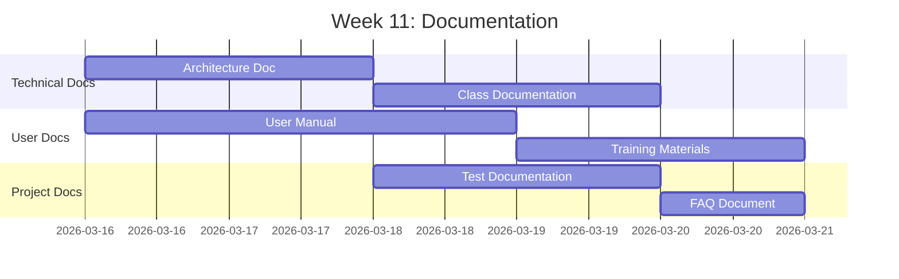
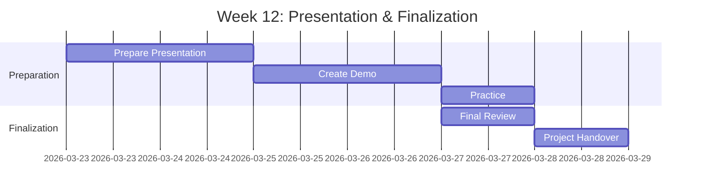

# Giai đoạn 4: Tài liệu & Trình bày

**Thời gian**: Tuần 11-12  
**← [Quay lại README](README.md)** | **Trước: [Giai đoạn 3: Kiểm thử & QA](Phase3_Testing_QA.md)**

---

## Mục lục

1. [Tuần 11: Tài liệu](#week-11-documentation)
2. [Tuần 12: Trình bày & Hoàn thiện](#week-12-presentation--finalization)
3. [Mẫu Tài liệu](#documentation-templates)
4. [Cấu trúc Tài liệu](#documentation-structure)
5. [Cấu trúc Trình bày](#presentation-structure)
6. [Kịch bản Demo](#demo-scenarios)
7. [Chuẩn bị Q&A](#qa-preparation)
8. [Tham khảo](#references)

---

## Tuần 11: Tài liệu

### Tiến độ Tài liệu



### Tất cả Thành viên Nhóm: Trách nhiệm Tài liệu Chung

#### Tài liệu hóa Thành phần (Mỗi Thành viên Tài liệu hóa Thành phần Của mình)

**Thành viên Nhóm 1: Trưởng Nhóm Phát triển / Chuyên gia Mô hình Dữ liệu**

- [ ] **Tài liệu Kỹ thuật**

  **Kiến trúc Hệ thống**
  - Tài liệu hóa kiến trúc hệ thống
  - Tài liệu hóa mối quan hệ thành phần
  - Tài liệu hóa luồng dữ liệu
  - Tài liệu hóa điểm tích hợp

  **Tài liệu Mô hình Dữ liệu**
  - Tài liệu hóa tất cả bảng cơ sở dữ liệu
  - Tài liệu hóa mối quan hệ bảng
  - Tài liệu hóa data elements
  - Tài liệu hóa search helps

  **Tài liệu Lớp**
  - Tài liệu hóa lớp ABAP của mình (ZCL_LEAVE_REQUEST, ZCL_LEAVE_VALIDATOR, ZCL_LEAVE_CALCULATOR)
  - Tài liệu hóa phương thức lớp
  - Tài liệu hóa tham số phương thức
  - Tài liệu hóa kiểu trả về
  - Tài liệu hóa ngoại lệ

  **Tài liệu API**
  - Tài liệu hóa phương thức công khai của lớp của mình
  - Tài liệu hóa chữ ký phương thức
  - Tài liệu hóa ví dụ sử dụng
  - Tài liệu hóa xử lý lỗi

- [ ] **Tài liệu hóa Mã**
  - Thêm nhận xét nội tuyến vào mã của mình
  - Tài liệu hóa logic phức tạp trong lớp của mình
  - Tài liệu hóa quy tắc nghiệp vụ
  - Tài liệu hóa thuật toán

- [ ] **Tài liệu hóa Tích hợp**
  - Tài liệu hóa tích hợp HR
  - Tài liệu hóa tích hợp với các thành phần khác

**Sản phẩm**:
- Tài liệu thiết kế kỹ thuật
- Tài liệu mô hình dữ liệu
- Tài liệu lớp
- Tài liệu API
- Tài liệu tích hợp

**Tham khảo**:
- [Hướng dẫn Capstone](../../SAP_CAPSTONE_PROJECT_GUIDE.md#documentation-standards) - Tiêu chuẩn tài liệu

---

**Thành viên Nhóm 2: Chuyên gia Workflow & Phê duyệt**

- [ ] **Tài liệu Workflow**
  - Tài liệu hóa mẫu workflow
  - Tài liệu hóa nhiệm vụ workflow
  - Tài liệu hóa sự kiện workflow
  - Tài liệu hóa workflow container
  - Tài liệu hóa xác định đại lý

- [ ] **Tài liệu Quy trình Phê duyệt**
  - Tài liệu hóa cấp phê duyệt
  - Tài liệu hóa quy tắc phê duyệt
  - Tài liệu hóa định tuyến phê duyệt
  - Tài liệu hóa quy tắc leo thang

- [ ] **Hướng dẫn Cấu hình**
  - Tài liệu hóa cấu hình workflow
  - Tài liệu hóa cấu hình cấp phê duyệt
  - Tài liệu hóa cấu hình xác định đại lý
  - Tài liệu hóa giám sát workflow

- [ ] **Tài liệu hóa Mã**
  - Tài liệu hóa phương thức workflow
  - Tài liệu hóa logic phê duyệt
  - Thêm nhận xét nội tuyến

**Sản phẩm**:
- Tài liệu workflow
- Tài liệu quy trình phê duyệt
- Hướng dẫn cấu hình

**Tham khảo**:
- [Hướng dẫn SAP Workflow](../../SAP_WORKFLOW_GUIDE.md) - Tài liệu workflow

---

**Thành viên Nhóm 3: Chuyên gia UI & Báo cáo**

- [ ] **Phần Hướng dẫn Người dùng**
  - Tài liệu hóa giao diện người dùng cho màn hình của mình
  - Tài liệu hóa điều hướng màn hình cho chương trình của mình
  - Tài liệu hóa mô tả trường
  - Tài liệu hóa quy trình người dùng cho tính năng của mình
  - Tài liệu hóa thông báo lỗi

- [ ] **Hướng dẫn Điều hướng Màn hình**
  - Tài liệu hóa luồng màn hình cho chương trình của mình
  - Tài liệu hóa bố cục màn hình
  - Tài liệu hóa xác thực trường
  - Tài liệu hóa chức năng nút

- [ ] **Hướng dẫn Sử dụng Báo cáo**
  - Tài liệu hóa tham số báo cáo
  - Tài liệu hóa bộ lọc báo cáo
  - Tài liệu hóa sắp xếp báo cáo
  - Tài liệu hóa xuất Excel
  - Tài liệu hóa giải thích báo cáo

- [ ] **Tài liệu hóa Mã**
  - Tài liệu hóa chương trình màn hình
  - Tài liệu hóa mã báo cáo ALV
  - Thêm nhận xét nội tuyến

**Sản phẩm**:
- Hướng dẫn người dùng
- Hướng dẫn điều hướng màn hình
- Hướng dẫn sử dụng báo cáo

**Tham khảo**:
- [Hướng dẫn Capstone](../../SAP_CAPSTONE_PROJECT_GUIDE.md#documentation-standards) - Tài liệu người dùng

---

**Thành viên Nhóm 4: Chuyên gia Biểu mẫu & Tích hợp**

- [ ] **Tài liệu SmartForm**
  - Tài liệu hóa cấu trúc biểu mẫu
  - Tài liệu hóa trường biểu mẫu
  - Tài liệu hóa nguồn dữ liệu biểu mẫu
  - Tài liệu hóa quy trình in

- [ ] **Hướng dẫn Cấu hình Email**
  - Tài liệu hóa thiết lập email
  - Tài liệu hóa mẫu email
  - Tài liệu hóa kích hoạt thông báo
  - Tài liệu hóa khắc phục sự cố email

- [ ] **Hướng dẫn Quy trình In**
  - Tài liệu hóa thiết lập in
  - Tài liệu hóa quy trình in
  - Tài liệu hóa khắc phục sự cố in
  - Tài liệu hóa tùy chỉnh in

- [ ] **Tài liệu hóa Mã**
  - Tài liệu hóa mã tích hợp email
  - Tài liệu hóa mã tạo biểu mẫu
  - Thêm nhận xét nội tuyến

**Sản phẩm**:
- Tài liệu SmartForm
- Hướng dẫn cấu hình email
- Hướng dẫn quy trình in

**Tham khảo**:
- [Hướng dẫn Biểu mẫu SAP](../../SAP_FORMS_GUIDE.md) - Tài liệu biểu mẫu

---

**Thành viên Nhóm 5: Chuyên gia Phát triển & Chất lượng**

- [ ] **Điều phối Tài liệu**
  - Tổng hợp tài liệu từ tất cả thành viên
  - Tạo mục lục tài liệu
  - Đảm bảo tính đầy đủ của tài liệu
  - Xem lại chất lượng tài liệu
  - Định dạng và chuẩn hóa tài liệu

- [ ] **Tài liệu Kiểm thử**
  - Tổng hợp tài liệu kiểm thử từ tất cả thành viên
  - Tài liệu hóa kế hoạch kiểm thử tổng thể
  - Tóm tắt kết quả kiểm thử từ tất cả thành phần
  - Tài liệu hóa phủ sóng kiểm thử trên tất cả thành phần
  - Tài liệu hóa môi trường kiểm thử

- [ ] **Tóm tắt Kết quả Kiểm thử**
  - Tóm tắt kết quả kiểm thử đơn vị từ tất cả thành viên
  - Tóm tắt kết quả kiểm thử tích hợp
  - Tóm tắt kết quả kiểm thử hệ thống
  - Tóm tắt kết quả UAT
  - Tài liệu hóa số liệu kiểm thử tổng thể

- [ ] **Tài liệu Đào tạo Người dùng**
  - Tạo slide đào tạo (tổng hợp từ tất cả thành viên)
  - Tạo video đào tạo (nếu áp dụng)
  - Tạo hướng dẫn tham khảo nhanh
  - Tạo tài liệu FAQ

- [ ] **Tài liệu FAQ**
  - Câu hỏi thường gặp (thu thập từ tất cả thành viên)
  - Vấn đề thường gặp (từ tất cả thành phần)
  - Mẹo khắc phục sự cố
  - Thực hành tốt nhất

- [ ] **Tài liệu hóa Mã**
  - Tài liệu hóa lớp tiện ích của mình
  - Tài liệu hóa hàm trợ giúp
  - Thêm nhận xét nội tuyến

**Sản phẩm**:
- Tài liệu kiểm thử
- Tóm tắt kết quả kiểm thử
- Tài liệu đào tạo người dùng
- Tài liệu FAQ

**Tham khảo**:
- [Hướng dẫn Kiểm thử](../../SAP_TESTING_GUIDE.md) - Tài liệu kiểm thử
- [Hướng dẫn Capstone](../../SAP_CAPSTONE_PROJECT_GUIDE.md#documentation-standards) - Mẫu tài liệu

---

## Tuần 12: Trình bày & Hoàn thiện

### Tiến độ Trình bày



### Tất cả Thành viên Nhóm

#### Nhiệm vụ

- [ ] **Chuẩn bị Trình bày**
  - Tạo slide trình bày
  - Chuẩn bị nội dung trình bày
  - Chuẩn bị công cụ trực quan
  - Chuẩn bị tài liệu phát tay

- [ ] **Tạo Kịch bản Demo**
  - Chuẩn bị dữ liệu demo
  - Chuẩn bị script demo
  - Kiểm thử kịch bản demo
  - Chuẩn bị kế hoạch dự phòng

- [ ] **Luyện tập Trình bày**
  - Luyện tập cá nhân
  - Luyện tập theo nhóm
  - Đo thời gian trình bày
  - Tinh chỉnh trình bày

- [ ] **Chuẩn bị Q&A**
  - Dự đoán câu hỏi
  - Chuẩn bị câu trả lời
  - Chuẩn bị tài liệu hỗ trợ
  - Luyện tập phản hồi Q&A

- [ ] **Xem lại Mã Cuối cùng**
  - Xem lại tất cả mã
  - Kiểm tra tiêu chuẩn mã
  - Xác minh tài liệu
  - Dọn dẹp cuối cùng

- [ ] **Xem lại Tài liệu Cuối cùng**
  - Xem lại tất cả tài liệu
  - Kiểm tra tính đầy đủ
  - Xác minh độ chính xác
  - Hoàn thiện tài liệu

- [ ] **Bàn giao Dự án**
  - Chuẩn bị gói bàn giao
  - Tài liệu hóa quy trình bàn giao
  - Lên lịch cuộc họp bàn giao
  - Hoàn thành bàn giao

**Sản phẩm**:
- Trình bày cuối cùng
- Demo sẵn sàng
- Tất cả tài liệu hoàn chỉnh
- Bàn giao dự án hoàn thành

---

## Mẫu Tài liệu

### Mẫu Tài liệu Kỹ thuật

```markdown
# [Tên Thành phần] - Tài liệu Kỹ thuật

## Tổng quan
[Mô tả thành phần]

## Kiến trúc
[Chi tiết kiến trúc]

## Thành phần
[Danh sách thành phần]

## Mô hình Dữ liệu
[Chi tiết mô hình dữ liệu]

## Phương thức
[Tài liệu phương thức]

## Tích hợp
[Chi tiết tích hợp]

## Xử lý Lỗi
[Cách tiếp cận xử lý lỗi]

## Hiệu suất
[Cân nhắc hiệu suất]

## Tham khảo
[Tài liệu liên quan]
```

### Mẫu Hướng dẫn Người dùng

```markdown
# [Tên Tính năng] - Hướng dẫn Người dùng

## Tổng quan
[Mô tả tính năng]

## Điều kiện Tiên quyết
[Điều kiện tiên quyết]

## Hướng dẫn Từng bước
[Các bước chi tiết]

## Ảnh chụp màn hình
[Ảnh chụp màn hình với chú thích]

## Vấn đề Thường gặp
[Vấn đề và giải pháp thường gặp]

## FAQs
[Câu hỏi thường gặp]
```

---

## Cấu trúc Tài liệu

### Gói Tài liệu Hoàn chỉnh

```
Documentation/
├── Technical/
│   ├── System_Architecture.md
│   ├── Data_Model.md
│   ├── Class_Documentation.md
│   ├── API_Documentation.md
│   └── Integration_Documentation.md
├── User/
│   ├── User_Manual.md
│   ├── Quick_Reference_Guide.md
│   ├── Training_Materials/
│   └── FAQ.md
├── Administration/
│   ├── Configuration_Guide.md
│   ├── Workflow_Configuration.md
│   └── Maintenance_Guide.md
└── Testing/
    ├── Test_Plan.md
    ├── Test_Cases.md
    └── Test_Results.md
```

---

## Cấu trúc Trình bày

### Dàn ý Trình bày

**Thời lượng**: 45-60 phút

1. **Giới thiệu** (5 phút)
   - Tổng quan dự án
   - Giới thiệu nhóm
   - Chương trình trình bày

2. **Yêu cầu & Thiết kế** (10 phút)
   - Yêu cầu nghiệp vụ
   - Thiết kế hệ thống
   - Tổng quan kiến trúc
   - Quyết định chính

3. **Triển khai** (15 phút)
   - Cách tiếp cận phát triển
   - Thành phần chính
   - Điểm nổi bật kỹ thuật
   - Thách thức và giải pháp

4. **Kiểm thử & Chất lượng** (5 phút)
   - Cách tiếp cận kiểm thử
   - Kết quả kiểm thử
   - Số liệu chất lượng

5. **Trình diễn** (15 phút)
   - Demo trực tiếp
   - Tính năng chính
   - Quy trình người dùng

6. **Kết luận** (5 phút)
   - Tóm tắt
   - Bài học kinh nghiệm
   - Cải tiến tương lai
   - Q&A

---

## Kịch bản Demo

### Script Demo 1: Tạo Yêu cầu Nghỉ phép

**Thời lượng**: 5 phút

**Các bước**:
1. Đăng nhập với tư cách nhân viên
2. Điều hướng đến "Tạo Yêu cầu Nghỉ phép"
3. Nhập chi tiết nghỉ phép:
   - Loại Nghỉ phép: Annual
   - Ngày Bắt đầu: 2026-03-23
   - Ngày Kết thúc: 2026-03-27
   - Nhận xét: "Kỳ nghỉ gia đình"
4. Gửi yêu cầu
5. Hiển thị ID yêu cầu được tạo
6. Hiển thị thông báo thành công

**Điểm Chính**:
- Tạo ID tự động
- Xác thực trường
- Giao diện thân thiện với người dùng

---

### Script Demo 2: Quy trình Phê duyệt Workflow

**Thời lượng**: 5 phút

**Các bước**:
1. Hiển thị hộp thư quản lý
2. Mở nhiệm vụ phê duyệt
3. Xem lại chi tiết yêu cầu
4. Phê duyệt yêu cầu
5. Hiển thị cập nhật trạng thái
6. Hiển thị thông báo nhân viên

**Điểm Chính**:
- Tự động hóa workflow
- Phê duyệt đa cấp
- Thông báo email

---

### Script Demo 3: Lịch sử & Báo cáo

**Thời lượng**: 5 phút

**Các bước**:
1. Điều hướng đến "Lịch sử Nghỉ phép"
2. Áp dụng bộ lọc
3. Xem kết quả đã lọc
4. Điều hướng đến "Báo cáo"
5. Tạo báo cáo thống kê
6. Xuất ra Excel

**Điểm Chính**:
- Lọc nâng cao
- Báo cáo toàn diện
- Xuất Excel

---

## Chuẩn bị Q&A

### Câu hỏi Dự kiến

**Câu hỏi Kỹ thuật**:
1. **Q**: Workflow phê duyệt xác định người phê duyệt như thế nào?
   **A**: Hệ thống kiểm tra thời lượng nghỉ phép và xác định cấp phê duyệt. Cấp 1 (< 5 ngày) đến quản lý trực tiếp, Cấp 2 (5-10 ngày) đến trưởng phòng ban, Cấp 3 (> 10 ngày) đến giám đốc HR.

2. **Q**: ID yêu cầu được tạo như thế nào?
   **A**: Chúng tôi sử dụng đối tượng phạm vi số SAP ZLEAVE_REQ để tạo ID tuần tự theo định dạng REQ0000001.

3. **Q**: Hệ thống xử lý yêu cầu nghỉ phép trùng lặp như thế nào?
   **A**: Lớp validator kiểm tra ngày trùng lặp trước khi cho phép tạo yêu cầu và ngăn chặn xung đột.

**Câu hỏi Nghiệp vụ**:
1. **Q**: Cấp phê duyệt có thể được tùy chỉnh không?
   **A**: Có, cấp phê duyệt có thể cấu hình trong bảng ZLEAVE_CONFIG.

2. **Q**: Thông báo email được gửi như thế nào?
   **A**: Chúng tôi sử dụng hàm chuẩn SAP SO_DOCUMENT_SEND_API1 để gửi email qua sự kiện workflow.

**Câu hỏi Cải tiến Tương lai**:
1. **Q**: Có thể mở rộng sang di động không?
   **A**: Có, chúng tôi có thể tạo ứng dụng Fiori hoặc giao diện di động sử dụng các lớp backend tương tự.

2. **Q**: Có thể tích hợp với hệ thống lịch bên ngoài không?
   **A**: Có, chúng tôi có thể thêm điểm tích hợp sử dụng RFC hoặc dịch vụ web.

---

## Mẹo Trình bày

### Thực hành Tốt nhất

1. **Luyện tập**: Luyện tập trình bày nhiều lần
2. **Thời gian**: Tuân thủ thời gian được phân bổ
3. **Trực quan**: Sử dụng sơ đồ và ảnh chụp màn hình rõ ràng
4. **Demo**: Có kế hoạch dự phòng cho demo
5. **Tương tác**: Tương tác với khán giả bằng câu hỏi
6. **Tự tin**: Nói rõ ràng và tự tin

### Cạm bẫy Thường gặp Cần Tránh

1. **Quá Kỹ thuật**: Tránh thuật ngữ kỹ thuật quá mức
2. **Quá Nhanh**: Đừng vội vàng qua các slide
3. **Không Demo**: Luôn bao gồm demo trực tiếp
4. **Không Chuẩn bị**: Sẵn sàng cho câu hỏi
5. **Đọc Slide**: Đừng đọc slide theo từng chữ

---

## Danh sách Kiểm tra Bàn giao Dự án

- [ ] Tất cả mã được giao
- [ ] Tất cả tài liệu được giao
- [ ] Tất cả trường hợp kiểm thử được giao
- [ ] Hệ thống được triển khai
- [ ] Đào tạo người dùng hoàn thành
- [ ] Kế hoạch hỗ trợ được tài liệu hóa
- [ ] Chuyển giao kiến thức hoàn thành
- [ ] Cuộc họp bàn giao được tiến hành
- [ ] Ký duyệt được lấy

---

## Tham khảo

- **[Hướng dẫn Capstone](../../SAP_CAPSTONE_PROJECT_GUIDE.md#documentation-standards)** - Tiêu chuẩn tài liệu
- **[Hướng dẫn Capstone](../../SAP_CAPSTONE_PROJECT_GUIDE.md#presentation-guidelines)** - Hướng dẫn trình bày
- **[Hướng dẫn Thực hành Tốt nhất](../../ABAP-Guides/12_SAP_ABAP_BEST_PRACTICES_GUIDE.md)** - Tài liệu mã

---

**← [Quay lại README](README.md)** | **Trước: [Giai đoạn 3: Kiểm thử & QA](Phase3_Testing_QA.md)**

