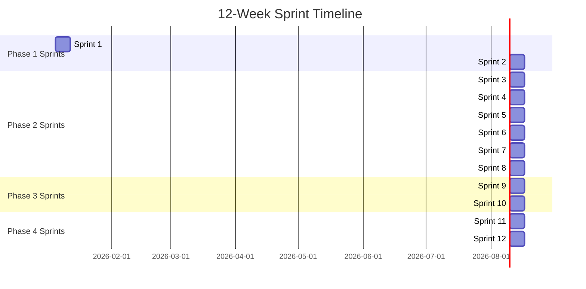
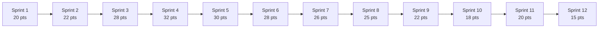
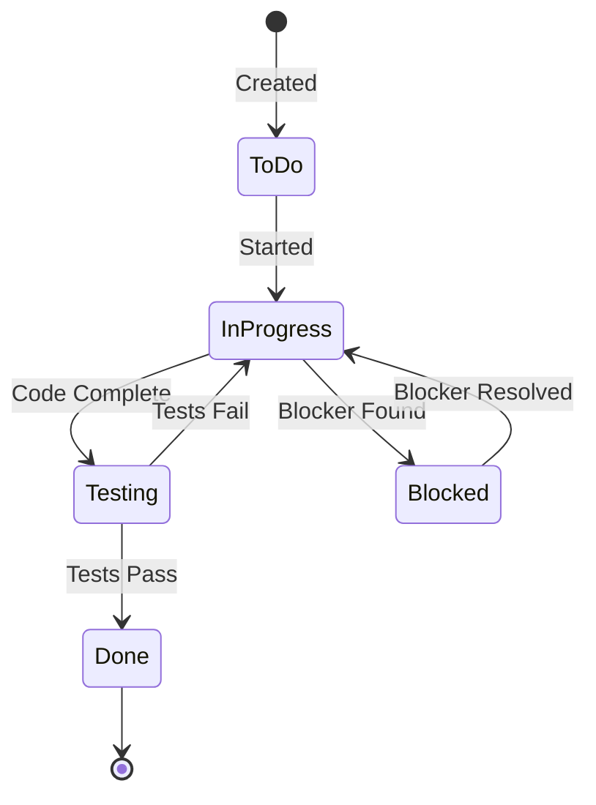

# Kế hoạch Quản lý Dự án Capstone

## Tổng quan Quản lý Dự án

**Dự án**: Hệ thống Yêu cầu và Phê duyệt Nghỉ phép Nhân viên  
**Thời gian**: 12 tuần (12 sprints)  
**Thời lượng Sprint**: 1 tuần  
**Quy mô Nhóm**: 5 thành viên  
**Phương pháp**: Agile/Scrum (điều chỉnh cho capstone)

---

## Cấu trúc Sprint

### Phân tích Sprint 12 Tuần



### Lịch trình Sprint

| Sprint | Tuần | Ngày | Giai đoạn | Trọng tâm | Mục tiêu Story Points |
|--------|------|-------|-------|-------|-------------------|
| **Sprint 1** | Tuần 1 | 5-9 tháng 1, 2026 | Giai đoạn 1 | Thu thập Yêu cầu | 20-25 |
| **Sprint 2** | Tuần 2 | 12-16 tháng 1, 2026 | Giai đoạn 1 | Thiết kế Chi tiết | 20-25 |
| **Sprint 3** | Tuần 3 | 19-23 tháng 1, 2026 | Giai đoạn 2 | Nền tảng & Mô hình Dữ liệu | 25-30 |
| **Sprint 4** | Tuần 4 | 26-30 tháng 1, 2026 | Giai đoạn 2 | Chức năng Cốt lõi | 30-35 |
| **Sprint 5** | Tuần 5 | 2-6 tháng 2, 2026 | Giai đoạn 2 | Triển khai Workflow | 30-35 |
| **Sprint 6** | Tuần 6 | 9-13 tháng 2, 2026 | Giai đoạn 2 | Lịch sử & Lọc | 25-30 |
| **Sprint 7** | Tuần 7 | 16-20 tháng 2, 2026 | Giai đoạn 2 | Báo cáo & Thống kê | 25-30 |
| **Sprint 8** | Tuần 8 | 23-27 tháng 2, 2026 | Giai đoạn 2 | Biểu mẫu & Tích hợp | 25-30 |
| **Sprint 9** | Tuần 9 | 2-6 tháng 3, 2026 | Giai đoạn 3 | Kiểm thử Toàn diện | 20-25 |
| **Sprint 10** | Tuần 10 | 9-13 tháng 3, 2026 | Giai đoạn 3 | UAT & Tinh chỉnh | 15-20 |
| **Sprint 11** | Tuần 11 | 16-20 tháng 3, 2026 | Giai đoạn 4 | Tài liệu | 20-25 |
| **Sprint 12** | Tuần 12 | 23-27 tháng 3, 2026 | Giai đoạn 4 | Trình bày | 15-20 |

**Tổng Story Points**: ~280-320 điểm

---

## Đánh giá Story Point

### Thang Fibonacci

| Điểm | Mô tả | Công sức | Ví dụ |
|--------|-------------|--------|----------|
| **1** | Tầm thường | < 2 giờ | Sửa lỗi đơn giản, tài liệu nhỏ |
| **2** | Rất Dễ | 2-4 giờ | Hàm tiện ích nhỏ, trường màn hình đơn giản |
| **3** | Dễ | 4-8 giờ | Triển khai phương thức đơn, xác thực cơ bản |
| **5** | Trung bình | 1-2 ngày | Phương thức lớp hoàn chỉnh, màn hình với xác thực |
| **8** | Lớn | 2-3 ngày | Chương trình hoàn chỉnh, nhiệm vụ workflow, lớp phức tạp |
| **13** | Rất Lớn | 3-5 ngày | Tính năng đa thành phần, tích hợp phức tạp |
| **21** | Epic | 1+ tuần | Mô-đun hoàn chỉnh, tính năng chính |

### Quy trình Ước tính Story Point

1. **Phiên Planning Poker** (Lập kế hoạch Sprint)
   - Mỗi thành viên nhóm ước tính độc lập
   - Thảo luận khác biệt
   - Ước tính lại cho đến khi đồng thuận
   - Sử dụng thang Fibonacci

2. **Yếu tố Ước tính**
   - **Độ phức tạp**: Nhiệm vụ phức tạp đến mức nào?
   - **Công sức**: Cần bao nhiêu công việc?
   - **Sự không chắc chắn**: Chúng ta hiểu yêu cầu đến mức nào?
   - **Phụ thuộc**: Có phụ thuộc chặn không?

3. **Stories Tham khảo** (Cơ sở)
   - **1 Điểm**: Tạo domain đơn giản trong SE11
   - **3 Điểm**: Triển khai phương thức xác thực đơn
   - **5 Điểm**: Tạo màn hình hoàn chỉnh với PBO/PAI
   - **8 Điểm**: Phát triển chương trình ABAP hoàn chỉnh
   - **13 Điểm**: Triển khai mẫu workflow hoàn chỉnh

---

## Quy trình Lập kế hoạch Sprint

### Lập kế hoạch Trước Sprint (Ngày 0 - Thứ Sáu trước Sprint)

**Hoạt động**:
- Xem lại kết quả sprint trước
- Cập nhật product backlog
- Ưu tiên mục backlog
- Chuẩn bị sprint backlog

**Người tham gia**: Tất cả thành viên nhóm  
**Thời lượng**: 1-2 giờ

### Cuộc họp Lập kế hoạch Sprint (Ngày 1 - Thứ Hai)

**Chương trình**:
1. **Định nghĩa Mục tiêu Sprint** (15 phút)
   - Xác định sprint sẽ đạt được gì
   - Đồng bộ với mục tiêu giai đoạn

2. **Xem lại Backlog** (30 phút)
   - Xem lại mục backlog đã ưu tiên
   - Thảo luận yêu cầu
   - Làm rõ câu hỏi

3. **Ước tính Story Point** (45 phút)
   - Ước tính mỗi user story
   - Sử dụng planning poker
   - Tài liệu hóa ước tính

4. **Tạo Sprint Backlog** (30 phút)
   - Chọn stories cho sprint
   - Gán stories cho thành viên nhóm
   - Chia nhỏ stories thành nhiệm vụ

5. **Lập kế hoạch Năng lực** (15 phút)
   - Tính toán năng lực nhóm
   - Xác minh cam kết sprint
   - Xác định rủi ro

**Tổng Thời lượng**: ~2 giờ  
**Đầu ra**: Sprint backlog với stories đã ước tính

### Mẫu Sprint Backlog

| Story ID | User Story | Story Points | Gán cho | Trạng thái | Nhiệm vụ |
|----------|------------|--------------|-------------|--------|-------|
| US-001 | Là một nhân viên, tôi muốn tạo yêu cầu nghỉ phép | 8 | Thành viên 1, 3 | To Do | T-001, T-002, T-003 |
| US-002 | Là một quản lý, tôi muốn phê duyệt yêu cầu nghỉ phép | 13 | Thành viên 2 | In Progress | T-004, T-005 |

---

## Cuộc họp Daily Standup

### Định dạng

**Thời gian**: 15 phút  
**Tần suất**: Hàng ngày (Thứ Hai-Thứ Sáu)  
**Thời gian**: 9:00 AM (hoặc thời gian đã thỏa thuận)

### Ba Câu hỏi

1. **Tôi đã hoàn thành gì hôm qua?**
2. **Tôi sẽ làm gì hôm nay?**
3. **Có chướng ngại vật nào không?**

### Mẫu Standup

| Thành viên | Hôm qua | Hôm nay | Chướng ngại vật |
|--------|-----------|-------|----------|
| Thành viên 1 | Đã hoàn thành tạo bảng | Đang làm lớp xác thực | Không |
| Thành viên 2 | Đã thiết kế workflow | Đang tạo mẫu workflow | Cần truy cập bảng HR |
| Thành viên 3 | Đã tạo cấu trúc chương trình | Đang phát triển màn hình | Đang chờ lớp của Thành viên 1 |
| Thành viên 4 | Đã thiết lập SmartForms | Đang tạo bố cục biểu mẫu | Không |
| Thành viên 5 | Đã tạo lớp tiện ích | Đang viết hàm trợ giúp | Không |

### Quy tắc Standup

- Giữ ngắn gọn (2-3 phút mỗi người)
- Tập trung vào tiến độ và chướng ngại vật
- Không thảo luận kỹ thuật chi tiết (lên lịch cuộc họp riêng)
- Cập nhật bảng sprint sau standup

---

## Xem lại Sprint (Cuối Sprint)

### Cuộc họp Xem lại Sprint

**Thời gian**: 1 giờ  
**Tần suất**: Cuối mỗi sprint (Thứ Sáu)  
**Người tham gia**: Tất cả thành viên nhóm

### Chương trình

1. **Tóm tắt Sprint** (10 phút)
   - Đạt được mục tiêu sprint
   - Stories hoàn thành
   - Story points hoàn thành

2. **Demo** (30 phút)
   - Demo tính năng đã hoàn thành
   - Hiển thị chức năng hoạt động
   - Thu thập phản hồi

3. **Xem lại Số liệu** (10 phút)
   - Velocity (story points hoàn thành)
   - Biểu đồ burndown
   - Số liệu chất lượng

4. **Xem trước Sprint Tiếp theo** (10 phút)
   - Xem trước mục tiêu sprint tiếp theo
   - Thảo luận ưu tiên

### Mẫu Xem lại Sprint

```
Sprint X Review - [Ngày]

Mục tiêu Sprint: [Mục tiêu]
Stories Hoàn thành: [Số lượng]
Story Points Hoàn thành: [Điểm]
Velocity: [Điểm]

Mục Demo:
- [Tính năng 1]
- [Tính năng 2]

Số liệu:
- Đã Lên kế hoạch: [Điểm]
- Hoàn thành: [Điểm]
- Velocity: [Điểm]

Xem trước Sprint Tiếp theo:
- [Mục tiêu]
- [Stories Chính]
```

---

## Sprint Retrospective

### Cuộc họp Retrospective

**Thời gian**: 45 phút  
**Tần suất**: Cuối mỗi sprint (Thứ Sáu, sau xem lại)  
**Người tham gia**: Tất cả thành viên nhóm

### Định dạng: Bắt đầu-Dừng-Tiếp tục

1. **Chúng ta Nên Bắt đầu Làm gì?** (15 phút)
   - Thực hành mới để áp dụng
   - Cải tiến để thử

2. **Chúng ta Nên Dừng Làm gì?** (15 phút)
   - Thực hành không hoạt động
   - Hoạt động lãng phí

3. **Chúng ta Nên Tiếp tục Làm gì?** (15 phút)
   - Thực hành hoạt động tốt
   - Cách tiếp cận thành công

### Mẫu Retrospective

```
Sprint X Retrospective - [Ngày]

Bắt đầu:
- [Mục hành động 1]
- [Mục hành động 2]

Dừng:
- [Mục hành động 1]
- [Mục hành động 2]

Tiếp tục:
- [Mục hành động 1]
- [Mục hành động 2]

Mục Hành động:
- [ ] [Hành động] - Chủ sở hữu: [Tên] - Hạn: [Ngày]
```

---

## Quản lý Product Backlog

### Cấu trúc Backlog

**Cấp Epic**:
- Epic 1: Quản lý Yêu cầu Nghỉ phép
- Epic 2: Workflow Phê duyệt
- Epic 3: Lịch sử & Báo cáo
- Epic 4: Biểu mẫu & Thông báo

**Cấp User Story**:
- User stories dưới mỗi epic
- Ưu tiên theo giá trị nghiệp vụ
- Ước tính với story points

**Cấp Nhiệm vụ**:
- Nhiệm vụ kỹ thuật dưới mỗi story
- Gán cho thành viên nhóm
- Theo dõi hàng ngày

### Ưu tiên Backlog

**Mức Ưu tiên**:
1. **P0 - Nghiêm trọng**: Phải có cho MVP
2. **P1 - Cao**: Quan trọng cho MVP
3. **P2 - Trung bình**: Tốt để có
4. **P3 - Thấp**: Cải tiến tương lai

**Yếu tố Ưu tiên**:
- Giá trị nghiệp vụ
- Phụ thuộc
- Rủi ro
- Độ phức tạp kỹ thuật

### Mẫu User Story

```
Story ID: US-XXX
Tiêu đề: [Là một <người dùng>, tôi muốn <hành động>, để <lợi ích>]

Mô tả:
[Mô tả chi tiết]

Tiêu chí Chấp nhận:
- [ ] Tiêu chí 1
- [ ] Tiêu chí 2
- [ ] Tiêu chí 3

Story Points: [X]
Ưu tiên: [P0/P1/P2/P3]
Epic: [Tên Epic]
Gán cho: [Thành viên Nhóm]
Trạng thái: [To Do / In Progress / Testing / Done]

Nhiệm vụ:
- [ ] Nhiệm vụ 1
- [ ] Nhiệm vụ 2
```

---

## Phân tích Story Point theo Epic

### Epic 1: Quản lý Yêu cầu Nghỉ phép (80-90 điểm)

| User Story | Điểm | Sprint |
|------------|--------|--------|
| Tạo yêu cầu nghỉ phép với ID tự động | 8 | Sprint 4 |
| Xác thực dữ liệu yêu cầu nghỉ phép | 5 | Sprint 4 |
| Tính toán ngày nghỉ phép | 5 | Sprint 4 |
| Kiểm tra yêu cầu trùng lặp | 5 | Sprint 4 |
| Tích hợp với mô-đun HR | 8 | Sprint 4 |
| Tạo màn hình yêu cầu | 8 | Sprint 4 |
| Lưu yêu cầu vào cơ sở dữ liệu | 5 | Sprint 4 |
| Xử lý lỗi | 5 | Sprint 4 |
| Kiểm thử đơn vị | 8 | Sprint 4 |
| Kiểm thử tích hợp | 5 | Sprint 9 |

### Epic 2: Workflow Phê duyệt (70-80 điểm)

| User Story | Điểm | Sprint |
|------------|--------|--------|
| Thiết kế mẫu workflow | 8 | Sprint 2 |
| Tạo nhiệm vụ workflow | 8 | Sprint 5 |
| Triển khai xác định đại lý | 13 | Sprint 5 |
| Logic phê duyệt đa cấp | 13 | Sprint 5 |
| UI Phê duyệt | 8 | Sprint 5 |
| Tích hợp workflow | 8 | Sprint 5 |
| Thông báo email | 8 | Sprint 5 |
| Kiểm thử workflow | 8 | Sprint 9 |

### Epic 3: Lịch sử & Báo cáo (60-70 điểm)

| User Story | Điểm | Sprint |
|------------|--------|--------|
| Màn hình tra cứu lịch sử | 8 | Sprint 6 |
| Chức năng lọc | 8 | Sprint 6 |
| Phát triển lớp lịch sử | 8 | Sprint 6 |
| Tạo báo cáo | 13 | Sprint 7 |
| Tính toán thống kê | 8 | Sprint 7 |
| Xuất Excel | 8 | Sprint 7 |
| Kiểm thử báo cáo | 5 | Sprint 9 |

### Epic 4: Biểu mẫu & Thông báo (50-60 điểm)

| User Story | Điểm | Sprint |
|------------|--------|--------|
| Phát triển SmartForm | 13 | Sprint 8 |
| Mẫu email | 8 | Sprint 8 |
| Chức năng in | 5 | Sprint 8 |
| Tích hợp email | 8 | Sprint 8 |
| Kích hoạt thông báo | 5 | Sprint 8 |
| Kiểm thử biểu mẫu | 5 | Sprint 9 |

### Epic 5: Nền tảng & Hạ tầng (40-50 điểm)

| User Story | Điểm | Sprint |
|------------|--------|--------|
| Bảng cơ sở dữ liệu | 13 | Sprint 3 |
| Lớp tiện ích | 13 | Sprint 3 |
| Hàm trợ giúp | 8 | Sprint 3-8 |
| Khung kiểm thử | 5 | Sprint 3 |
| Khung xử lý lỗi | 8 | Sprint 4 |

---

## Theo dõi Velocity

### Tính toán Velocity

**Velocity** = Story Points Hoàn thành mỗi Sprint

### Biểu đồ Velocity



### Mẫu Theo dõi Velocity

| Sprint | Điểm Đã Lên kế hoạch | Điểm Hoàn thành | Velocity | Xu hướng |
|--------|---------------|------------------|----------|-------|
| Sprint 1 | 20 | 20 | 20 | - |
| Sprint 2 | 22 | 22 | 22 | ↑ |
| Sprint 3 | 28 | 28 | 28 | ↑ |
| Sprint 4 | 32 | 32 | 32 | ↑ |
| ... | ... | ... | ... | ... |

**Velocity Trung bình**: Tính sau Sprint 3

---

## Biểu đồ Burndown

### Sprint Burndown

**Mục đích**: Theo dõi tiến độ trong sprint

**Trục X**: Ngày của sprint (1-5)  
**Trục Y**: Story points còn lại

**Burndown Lý tưởng**: Đường thẳng từ tổng điểm đến 0

### Release Burndown

**Mục đích**: Theo dõi tiến độ trên tất cả sprints

**Trục X**: Sprints (1-12)  
**Trục Y**: Story points còn lại

**Mục tiêu**: Hoàn thành tất cả 280-320 điểm vào Sprint 12

---

## Quản lý Nhiệm vụ

### Phân tích Nhiệm vụ

**User Story → Nhiệm vụ**:
- Chia nhỏ mỗi story thành nhiệm vụ có thể thực hiện
- Mỗi nhiệm vụ nên là 1-2 ngày công việc
- Nhiệm vụ nên cụ thể và có thể kiểm thử

### Mẫu Nhiệm vụ

```
Task ID: T-XXX
Tiêu đề: [Tiêu đề Nhiệm vụ]

Mô tả:
[Mô tả chi tiết]

Story: US-XXX
Gán cho: [Thành viên Nhóm]
Giờ Ước tính: [X]
Trạng thái: [To Do / In Progress / Testing / Done]

Tiêu chí Chấp nhận:
- [ ] Tiêu chí 1
- [ ] Tiêu chí 2

Phụ thuộc:
- [Task ID] phải được hoàn thành trước

Ghi chú:
[Bất kỳ ghi chú bổ sung nào]
```

### Quy trình Trạng thái Nhiệm vụ



---

## Quản lý Rủi ro trong Sprints

### Xác định Rủi ro

**Rủi ro Lập kế hoạch Sprint**:
- Cam kết quá mức
- Yêu cầu không rõ ràng
- Phụ thuộc
- Thách thức kỹ thuật

### Giảm thiểu Rủi ro

1. **Thời gian Đệm**: Thêm 20% đệm vào năng lực sprint
2. **Xác định Rủi ro Sớm**: Xác định rủi ro trong lập kế hoạch sprint
3. **Xem lại Rủi ro Hàng ngày**: Thảo luận rủi ro trong daily standup
4. **Kế hoạch Dự phòng**: Có kế hoạch dự phòng sẵn sàng

### Mẫu Đăng ký Rủi ro

| Risk ID | Mô tả | Xác suất | Tác động | Giảm thiểu | Chủ sở hữu |
|---------|-------------|-------------|--------|------------|-------|
| R-001 | Độ phức tạp workflow | Trung bình | Cao | Nguyên mẫu sớm | Thành viên 2 |
| R-002 | Vấn đề tích hợp HR | Trung bình | Cao | Kiểm thử tích hợp sớm | Thành viên 1 |

---

## Công cụ và Mẫu

### Công cụ Đề xuất

1. **Quản lý Dự án**:
   - Jira / Azure DevOps / Trello
   - GitHub Projects
   - Excel/Google Sheets

2. **Tài liệu**:
   - Tệp Markdown (cấu trúc hiện tại)
   - Confluence / Notion
   - Google Docs

3. **Giao tiếp**:
   - Slack / Teams
   - Email
   - Cuộc họp daily standup

### Mẫu Cần thiết

1. **Mẫu Lập kế hoạch Sprint**
2. **Mẫu Daily Standup**
3. **Mẫu Xem lại Sprint**
4. **Mẫu Retrospective**
5. **Mẫu User Story**
6. **Mẫu Nhiệm vụ**
7. **Mẫu Biểu đồ Burndown**
8. **Mẫu Theo dõi Velocity**

---

## Lịch trình Nghi thức Sprint

### Lịch trình Hàng tuần

| Ngày | Thời gian | Nghi thức | Thời lượng | Người tham gia |
|-----|------|----------|----------|--------------|
| **Thứ Hai** | 9:00 AM | Daily Standup | 15 phút | Tất cả |
| **Thứ Hai** | 10:00 AM | Lập kế hoạch Sprint | 2 giờ | Tất cả |
| **Thứ Ba-Thứ Sáu** | 9:00 AM | Daily Standup | 15 phút | Tất cả |
| **Thứ Sáu** | 2:00 PM | Xem lại Sprint | 1 giờ | Tất cả |
| **Thứ Sáu** | 3:00 PM | Retrospective | 45 phút | Tất cả |

---

## Định nghĩa Hoàn thành

### Định nghĩa Hoàn thành Story

Một user story được coi là "Hoàn thành" khi:

- [ ] Mã được viết và xem lại
- [ ] Kiểm thử đơn vị được viết và đạt
- [ ] Mã tuân thủ tiêu chuẩn mã
- [ ] Tài liệu được cập nhật
- [ ] Kiểm thử tích hợp đạt
- [ ] Không có lỗi nghiêm trọng
- [ ] Được chấp nhận bởi chủ sở hữu sản phẩm/bên liên quan

### Định nghĩa Hoàn thành Sprint

Một sprint được coi là "Hoàn thành" khi:

- [ ] Tất cả stories cam kết đã hoàn thành
- [ ] Xem lại sprint được tiến hành
- [ ] Retrospective đã hoàn thành
- [ ] Sprint tiếp theo đã được lên kế hoạch
- [ ] Tài liệu được cập nhật
- [ ] Demo được chuẩn bị

---

## Lập kế hoạch Năng lực

### Tính toán Năng lực Nhóm

**Năng lực Cá nhân**:
- Giờ mỗi ngày: 6-8 giờ (tính các cuộc họp, nghỉ giải lao)
- Ngày mỗi sprint: 5 ngày
- Năng lực cá nhân: 30-40 giờ mỗi sprint

**Năng lực Nhóm**:
- 5 thành viên × 35 giờ = 175 giờ mỗi sprint
- Tính các cuộc họp: -10 giờ
- Tính đệm: -20% = 132 giờ khả dụng

**Chuyển đổi Story Point sang Giờ**:
- 1 Story Point ≈ 4-6 giờ
- Năng lực nhóm: ~25-30 story points mỗi sprint

---

## Số liệu và KPI

### Số liệu Chính

1. **Velocity**: Story points hoàn thành mỗi sprint
2. **Tỷ lệ Burndown**: Điểm đốt mỗi ngày
3. **Đạt được Mục tiêu Sprint**: % mục tiêu sprint đạt được
4. **Chất lượng Mã**: Phủ sóng kiểm thử, phát hiện xem lại mã
5. **Tỷ lệ Lỗi**: Lỗi được tìm thấy mỗi sprint
6. **Sự hài lòng Nhóm**: Phản hồi retrospective

### Mẫu Bảng điều khiển Số liệu

| Số liệu | Sprint 1 | Sprint 2 | Sprint 3 | Mục tiêu |
|--------|----------|----------|----------|--------|
| Velocity | 20 | 22 | 28 | 25-30 |
| % Mục tiêu Sprint | 100% | 95% | 100% | ≥90% |
| Phủ sóng Kiểm thử | 0% | 20% | 45% | ≥80% |
| Số lượng Lỗi | 0 | 3 | 5 | <10/sprint |

---

## Kế hoạch Giao tiếp

### Kênh Giao tiếp

1. **Daily Standup**: Đồng bộ, 15 phút
2. **Lập kế hoạch Sprint**: Đồng bộ, 2 giờ
3. **Xem lại Sprint**: Đồng bộ, 1 giờ
4. **Retrospective**: Đồng bộ, 45 phút
5. **Slack/Teams**: Không đồng bộ, liên tục
6. **Email**: Giao tiếp chính thức
7. **Tài liệu**: Tài liệu dự án (Markdown)

### Đường dẫn Leo thang

1. **Cấp Nhóm**: Thảo luận trong daily standup
2. **Cấp Sprint**: Thảo luận trong lập kế hoạch/xem lại sprint
3. **Cấp Dự án**: Leo thang đến cố vấn/giảng viên dự án

---

## Danh sách Kiểm tra Triển khai

### Nhiệm vụ Thiết lập

- [ ] Thiết lập công cụ quản lý dự án (Jira/Trello/Sheets)
- [ ] Tạo product backlog
- [ ] Tạo mẫu sprint backlog
- [ ] Thiết lập kênh giao tiếp
- [ ] Lên lịch nghi thức sprint
- [ ] Tạo stories cơ sở ước tính
- [ ] Thiết lập theo dõi velocity
- [ ] Tạo mẫu biểu đồ burndown

### Nhiệm vụ Đang diễn ra

- [ ] Cuộc họp daily standup
- [ ] Lập kế hoạch sprint hàng tuần
- [ ] Xem lại sprint hàng tuần
- [ ] Retrospective hàng tuần
- [ ] Cập nhật backlog thường xuyên
- [ ] Theo dõi velocity
- [ ] Cập nhật biểu đồ burndown
- [ ] Quản lý rủi ro

---

## Tham khảo

- **[Tổng quan Dự án](../00_Project_Overview.md)** - Bối cảnh dự án
- **[Nhiệm vụ Thành viên Nhóm](../Team_Members_Tasks.md)** - Phân tích nhiệm vụ cá nhân
- **[Tài liệu Giai đoạn](../Phase1_Requirements_Design.md)** - Nhiệm vụ giai đoạn chi tiết
- **[Tài liệu Sprint](../Sprints/README.md)** - Tài liệu sprint theo từng sprint chi tiết
- **[Hướng dẫn Capstone SAP](../../../SAP_CAPSTONE_PROJECT_GUIDE.md#development-methodology)** - Phương pháp phát triển

