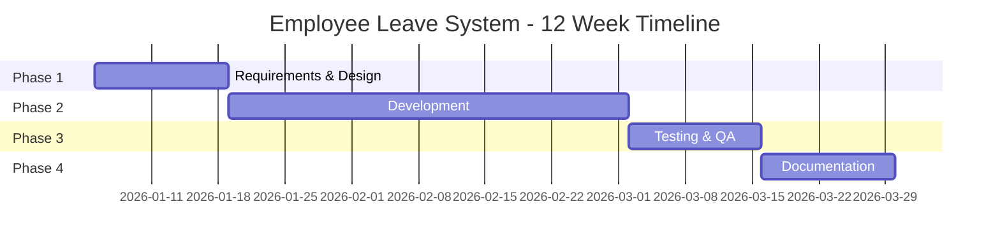

# Employee Leave Request and Approval System

**Hệ thống yêu cầu và phê duyệt nghỉ phép nhân viên**

---

## Tổng quan Dự án

Đây là dự án capstone SAP ABAP toàn diện kéo dài 12 tuần để phát triển Hệ thống Yêu cầu và Phê duyệt Nghỉ phép Nhân viên. Hệ thống tự động hóa toàn bộ quy trình quản lý nghỉ phép từ việc tạo yêu cầu, qua quy trình phê duyệt đa cấp, đến báo cáo và thông báo.

### Tính năng Chính

1. ✅ **Tạo Yêu cầu Nghỉ phép** - Nhập thông tin nghỉ phép với ID yêu cầu tự động tạo
2. ✅ **Quy trình Phê duyệt Đa cấp** - Phê duyệt của quản lý dựa trên thời gian/loại nghỉ phép
3. ✅ **Tra cứu Lịch sử Nghỉ phép** - Lọc theo ngày, trạng thái và loại nghỉ phép
4. ✅ **Thống kê & Báo cáo** - Báo cáo ALV với xuất Excel
5. ✅ **Thông báo Email & In Biểu mẫu** - Biểu mẫu có thể in dựa trên SmartForm

### Công nghệ Sử dụng

- **Phát triển ABAP**: Logic lập trình cốt lõi
- **SAP Workflow**: Quy trình phê duyệt đa cấp
- **Báo cáo ALV**: Hiển thị dữ liệu và xuất Excel
- **SmartForms**: Tạo biểu mẫu in
- **Tích hợp Email**: Thông báo tự động
- **Tích hợp HR**: Dữ liệu chủ nhân viên

---

## Tiến độ Dự án

**Thời gian**: 12 tuần  
**Quy mô Nhóm**: 5 thành viên  
**Loại Dự án**: Phát triển ABAP Tùy chỉnh

---

## Điều hướng

### 📋 Tài liệu Dự án

- **[00_Project_Overview.md](00_Project_Overview.md)** - Cấu trúc nhóm, tiến độ, tổng quan kiến trúc
- **[Team_Members_Tasks.md](Team_Members_Tasks.md)** - Tóm tắt ngắn gọn công việc và nhiệm vụ cho từng thành viên nhóm
- **[Technical_Architecture.md](Technical_Architecture.md)** - Đặc tả kỹ thuật chi tiết
- **[Kế hoạch Quản lý Dự án](Project_Management/Project_Management_Plan.md)** - Cấu trúc sprint, story points, quy trình agile

### 📝 Tài liệu Giai đoạn

- **[Giai đoạn 1: Yêu cầu & Thiết kế](Phase1_Requirements_Design.md)** (Tuần 1-2)
  - Thu thập yêu cầu
  - Thiết kế mô hình dữ liệu
  - Thiết kế quy trình
  - Thiết kế UI/UX

- **[Giai đoạn 2: Phát triển](Phase2_Development.md)** (Tuần 3-8)
  - Nền tảng & Mô hình Dữ liệu
  - Chức năng cốt lõi
  - Triển khai quy trình
  - Báo cáo & Biểu mẫu

- **[Giai đoạn 3: Kiểm thử & QA](Phase3_Testing_QA.md)** (Tuần 9-10)
  - Kiểm thử đơn vị
  - Kiểm thử tích hợp
  - Kiểm thử chấp nhận người dùng

- **[Giai đoạn 4: Tài liệu & Trình bày](Phase4_Documentation_Presentation.md)** (Tuần 11-12)
  - Tài liệu kỹ thuật
  - Hướng dẫn người dùng
  - Chuẩn bị trình bày

### 📚 Tài nguyên

- **[Tham khảo & Tài nguyên](References_Resources.md)** - Hướng dẫn SAP, mã giao dịch, thực hành tốt nhất
- **[Tài liệu Sprint](Sprints/README.md)** - Tài liệu chi tiết theo từng sprint

---

## Cấu trúc Nhóm

| Vai trò | Trọng tâm Chính | Trách nhiệm Chính |
|------|--------------|---------------------|
| **Thành viên Nhóm 1** | Trưởng Nhóm Phát triển / Chuyên gia Mô hình Dữ liệu | Data Dictionary, Logic ABAP Cốt lõi, Tích hợp HR |
| **Thành viên Nhóm 2** | Chuyên gia Workflow | SAP Workflow, Logic Phê duyệt, Phân quyền |
| **Thành viên Nhóm 3** | Chuyên gia UI & Báo cáo | Màn hình, Báo cáo ALV, Giao diện Người dùng |
| **Thành viên Nhóm 4** | Chuyên gia Biểu mẫu & Tích hợp | SmartForms, Tích hợp Email, Thông báo |
| **Thành viên Nhóm 5** | Phát triển & Chất lượng | Hỗ trợ Phát triển, Kiểm thử, Tài liệu, Đảm bảo Chất lượng |

**Tham khảo Nhanh**: Xem [Team_Members_Tasks.md](Team_Members_Tasks.md) để xem tóm tắt nhiệm vụ cho từng thành viên.

Để xem mô tả vai trò chi tiết, xem [00_Project_Overview.md](00_Project_Overview.md#team-structure--roles).

---

## Bắt đầu Nhanh

### Cho Thành viên Nhóm

1. **Đọc README này** để hiểu cấu trúc dự án
2. **Xem lại [00_Project_Overview.md](00_Project_Overview.md)** để biết vai trò nhóm và tiến độ
3. **Kiểm tra tài liệu giai đoạn được giao** để biết nhiệm vụ chi tiết
4. **Tham khảo [Technical_Architecture.md](Technical_Architecture.md)** để biết chi tiết kỹ thuật
5. **Sử dụng [References_Resources.md](References_Resources.md)** để xem hướng dẫn và ví dụ SAP

### Cho Người Xem xét Dự án

1. Bắt đầu với README này để xem tổng quan dự án
2. Xem lại [00_Project_Overview.md](00_Project_Overview.md) để biết phạm vi dự án
3. Kiểm tra [Technical_Architecture.md](Technical_Architecture.md) để biết thiết kế hệ thống
4. Xem lại tài liệu giai đoạn để biết chi tiết triển khai
5. Kiểm tra các sản phẩm trong mỗi tài liệu giai đoạn

---

## Danh sách Kiểm tra Sản phẩm Chính

### Sản phẩm Kỹ thuật
- [ ] Bảng Cơ sở Dữ liệu (4 bảng: Header, Items, History, Config)
- [ ] Lớp ABAP (5+ lớp cho chức năng cốt lõi)
- [ ] Chương trình ABAP (4 chương trình: Create, Approve, History, Report)
- [ ] Mẫu Workflow (ZLEAVE_WF)
- [ ] SmartForm (ZLEAVE_FORM)
- [ ] Mẫu Email (4+ mẫu thông báo)

### Sản phẩm Tài liệu
- [ ] Tài liệu Thiết kế Kỹ thuật
- [ ] Hướng dẫn Người dùng
- [ ] Hướng dẫn Quản trị viên
- [ ] Tài liệu Kiểm thử
- [ ] Tài liệu API

### Sản phẩm Dự án
- [ ] Hệ thống Hoạt động
- [ ] Mã Nguồn
- [ ] Trường hợp Kiểm thử & Kết quả
- [ ] Trình bày
- [ ] Demo

---

## Trạng thái Dự án

| Giai đoạn | Trạng thái | Tiến độ |
|-------|--------|----------|
| Giai đoạn 1: Yêu cầu & Thiết kế | 🟡 Đang tiến hành | 0% |
| Giai đoạn 2: Phát triển | ⚪ Chưa bắt đầu | 0% |
| Giai đoạn 3: Kiểm thử & QA | ⚪ Chưa bắt đầu | 0% |
| Giai đoạn 4: Tài liệu & Trình bày | ⚪ Chưa bắt đầu | 0% |

**Chú giải**: 🟢 Hoàn thành | 🟡 Đang tiến hành | ⚪ Chưa bắt đầu

---

## Tiêu chí Thành công

1. ✅ Tất cả 5 tính năng được triển khai và hoạt động
2. ✅ Quy trình phê duyệt đa cấp hoạt động
3. ✅ Tất cả kiểm thử đạt (Đơn vị, Tích hợp, UAT)
4. ✅ Tài liệu hoàn chỉnh
5. ✅ Đạt được sự chấp nhận người dùng
6. ✅ Trình bày thành công

---

## Tài liệu Liên quan

- **[Yêu cầu Dự án](../Abap-4.md)** - Đặc tả dự án gốc
- **[Hướng dẫn Dự án Capstone SAP](../../SAP_CAPSTONE_PROJECT_GUIDE.md)** - Hướng dẫn capstone chung
- **[Hướng dẫn Cơ bản ABAP](../../ABAP-Guides/01_SAP_ABAP_BASICS_GUIDE.md)** - Kiến thức cơ bản ABAP

---

## Liên hệ & Hỗ trợ

Đối với câu hỏi hoặc vấn đề:
- Xem lại tài liệu giai đoạn liên quan
- Kiểm tra [References_Resources.md](References_Resources.md) để xem hướng dẫn
- Tham khảo [Technical_Architecture.md](Technical_Architecture.md) để biết chi tiết kỹ thuật

---

**Cập nhật lần cuối**: 2026  
**Phiên bản Dự án**: 1.0  
**Trạng thái**: Giai đoạn Lập kế hoạch

