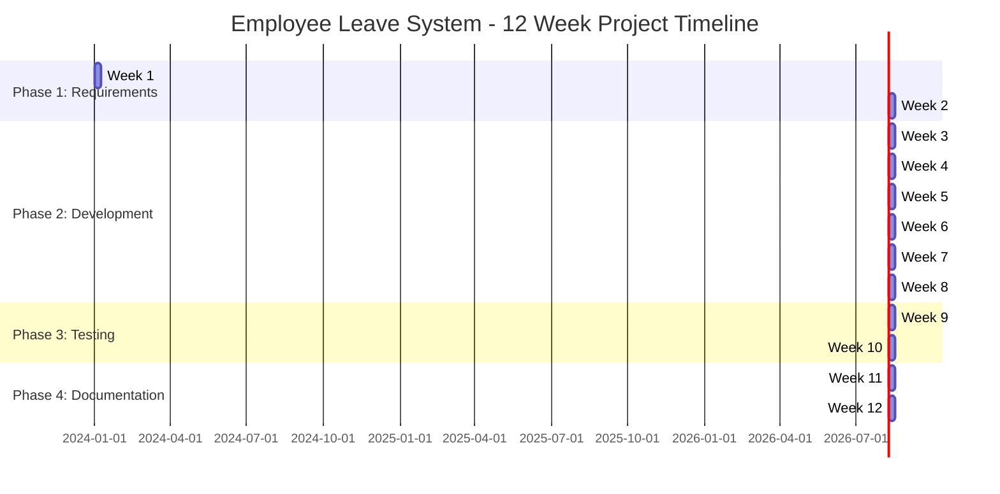
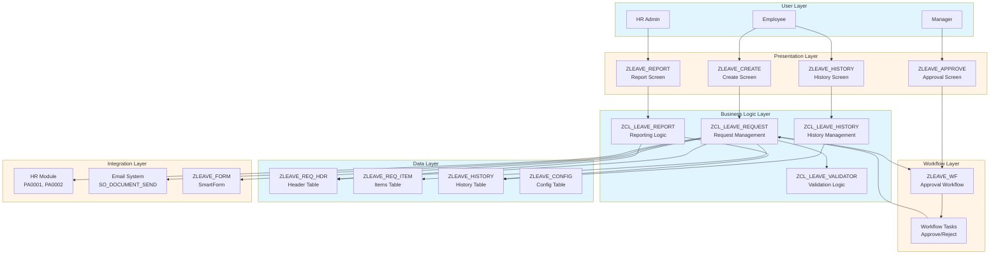
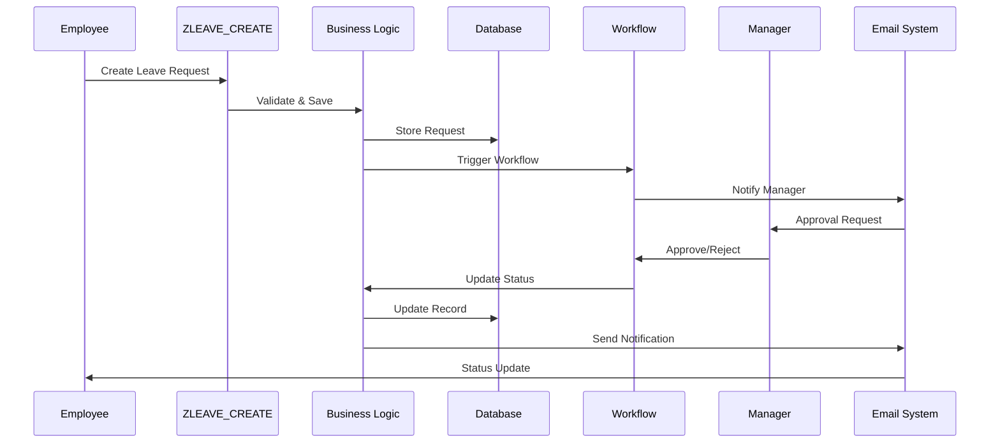

# Project Overview - Employee Leave Request and Approval System

**← [Back to README](README.md)**

---

## Table of Contents

1. [Project Information](#project-information)
2. [Team Structure & Roles](#team-structure--roles)
3. [Project Timeline](#project-timeline)
4. [Technology Stack](#technology-stack)
5. [Requirements Mapping](#requirements-mapping)
6. [High-Level Architecture](#high-level-architecture)
7. [Risk Management](#risk-management)
8. [Success Criteria](#success-criteria)

---

## Project Information

**Project Name**: Employee Leave Request and Approval System (ZLEAVE)  
**Project Code**: ABAP4  
**Duration**: 12 weeks  
**Team Size**: 5 members  
**Project Type**: SAP ABAP Custom Development  
**Target System**: SAP ECC / S/4HANA

### Project Objectives

1. **Automate Leave Management**: Streamline the leave request and approval process
2. **Multi-level Approval**: Implement flexible approval workflow based on leave duration
3. **Comprehensive Reporting**: Provide analytics and reporting capabilities
4. **User Experience**: Create intuitive interfaces for employees and managers
5. **Integration**: Seamlessly integrate with SAP HR module

### Business Value

- **Efficiency**: Reduce manual processing time by 70%
- **Transparency**: Real-time visibility into leave requests and approvals
- **Compliance**: Ensure proper authorization and audit trail
- **User Satisfaction**: Improve employee experience with self-service capabilities

---

## Team Structure & Roles

### Team Member 1: Lead Developer / Data Model Specialist

**Primary Focus**: Data Dictionary, Core ABAP Logic, Integration

**Key Responsibilities**:
- Design and create all database tables (ZLEAVE_*)
- Develop core ABAP classes for business logic
- Integration with HR module (PA0001, PA0002)
- Code reviews and technical leadership
- Performance optimization
- Error handling framework

**Technical Skills Required**:
- Advanced ABAP programming
- Data Dictionary (SE11)
- ABAP Objects
- HR module integration
- Database optimization

**Key Deliverables**:
- 4 database tables (Header, Items, History, Config)
- 5+ ABAP classes
- Integration code with HR
- Technical documentation

---

### Team Member 2: Workflow & Approval Specialist

**Primary Focus**: SAP Workflow, Approval Logic, Authorization

**Key Responsibilities**:
- Design and implement SAP Workflow template
- Multi-level approval logic development
- Agent determination rules
- Authorization checks
- Workflow monitoring and troubleshooting
- Approval UI development

**Technical Skills Required**:
- SAP Workflow (SWDD, SWDD_HEAD)
- Workflow Builder
- Agent determination
- Authorization concepts
- Workflow debugging

**Key Deliverables**:
- Workflow template (ZLEAVE_WF)
- Approval tasks and methods
- Agent determination logic
- Workflow documentation

---

### Team Member 3: UI & Reporting Specialist

**Primary Focus**: Screens, ALV Reports, User Interface

**Key Responsibilities**:
- Screen programming (SE51) for leave request creation
- ALV report development with Excel export
- User interface design and usability
- Filtering and search functionality
- Report layout and formatting
- User experience optimization

**Technical Skills Required**:
- Screen Painter (SE51)
- ALV programming (CL_SALV_TABLE, CL_SALV_GRID)
- Selection screens
- Excel export functionality
- UI/UX design principles

**Key Deliverables**:
- 4 ABAP programs (Create, Approve, History, Report)
- ALV reports with Excel export
- User interface screens
- User manual

---

### Team Member 4: Forms & Integration Specialist

**Primary Focus**: SmartForms, Email Integration, Notifications

**Key Responsibilities**:
- SmartForm development (SMARTFORMS)
- Email notification system
- Print functionality
- Email template design
- Notification triggers and logic
- External system integration (if needed)

**Technical Skills Required**:
- SmartForms
- Email integration (SO_DOCUMENT_SEND_API1)
- Print functionality
- Form layout design
- Notification workflows

**Key Deliverables**:
- SmartForm (ZLEAVE_FORM)
- 4+ email templates
- Print functionality
- Email configuration guide

---

### Team Member 5: Development & Quality Specialist

**Primary Focus**: Development Support, Testing, Documentation, Quality Assurance

**Key Responsibilities**:
- Support development across all modules
- Develop utility classes and helper functions
- Unit testing (ABAP Unit) for own components
- Integration testing coordination
- User acceptance testing coordination
- Test case development and execution
- Bug tracking and management
- Technical and user documentation
- Training materials creation

**Technical Skills Required**:
- ABAP programming
- ABAP Unit testing
- Test case design
- Documentation writing
- Quality assurance processes
- User training
- Code review

**Key Deliverables**:
- Utility classes and helper functions
- Test plan and test cases
- Test results documentation
- User manual
- Training materials
- FAQ document

---

### Shared Responsibilities: Testing & Documentation

**All Team Members** participate in:
- **Testing**: Each member tests their own components and participates in integration testing
- **Documentation**: Each member documents their own work and contributes to overall documentation
- **Code Reviews**: All members participate in peer code reviews
- **Quality Assurance**: All members ensure quality of their deliverables

---

## Project Timeline

### 12-Week Schedule Overview

### Milestones

| Week | Milestone | Deliverables |
|------|-----------|--------------|
| **Week 2** | Design Complete | Technical design, Data model, Workflow design |
| **Week 4** | Core Functionality | Leave request creation working |
| **Week 5** | Workflow Complete | Approval workflow functional |
| **Week 7** | Reporting Complete | Reports and statistics working |
| **Week 8** | Development Complete | All features implemented |
| **Week 10** | Testing Complete | All tests passed, UAT approved |
| **Week 12** | Project Complete | Documentation and presentation ready |

### Phase Breakdown

1. **Phase 1: Requirements & Design** (Weeks 1-2)
   - Requirements gathering and analysis
   - Technical design and architecture
   - Data model design
   - Workflow design

2. **Phase 2: Development** (Weeks 3-8)
   - Foundation setup
   - Core functionality development
   - Workflow implementation
   - Reporting and forms

3. **Phase 3: Testing & QA** (Weeks 9-10)
   - Unit testing
   - Integration testing
   - User acceptance testing

4. **Phase 4: Documentation & Presentation** (Weeks 11-12)
   - Technical documentation
   - User documentation
   - Presentation preparation

---

## Technology Stack

### SAP Components

| Component | Technology | Purpose |
|-----------|-----------|---------|
| **Database** | ABAP Data Dictionary (SE11) | Store leave request data |
| **Programming** | ABAP Objects | Business logic implementation |
| **Workflow** | SAP Workflow (SWDD) | Approval process automation |
| **UI** | Screen Painter (SE51) | User interface screens |
| **Reports** | ALV (CL_SALV_*) | Data display and export |
| **Forms** | SmartForms | Printable leave forms |
| **Email** | SO_DOCUMENT_SEND_API1 | Email notifications |
| **Integration** | HR Module (PA0001, PA0002) | Employee master data |

### Development Tools

- **SAP GUI**: Primary development environment
- **ABAP Development Tools (ADT)**: Modern Eclipse-based IDE (optional)
- **SE11**: Data Dictionary
- **SE24**: Class Builder
- **SE38**: ABAP Editor
- **SE51**: Screen Painter
- **SWDD**: Workflow Builder
- **SMARTFORMS**: Form Builder

### Standards & Guidelines

- **Naming Convention**: Z-prefix for all custom objects (ZLEAVE_*)
- **Code Standards**: Follow SAP coding guidelines
- **Documentation**: Inline comments and technical documentation
- **Testing**: ABAP Unit for unit testing

---

## Requirements Mapping

### Feature 1: Create Leave Request

**Requirement**: Input leave details with auto-generated request ID

**Implementation**:
- Screen program: `ZLEAVE_CREATE`
- Table: `ZLEAVE_REQ_HDR` (header), `ZLEAVE_REQ_ITEM` (items)
- Class: `ZCL_LEAVE_REQUEST` (CREATE_REQUEST method)
- Auto-ID generation logic

**Team Member**: Team Member 1 (Lead Developer) + Team Member 3 (UI Specialist)

---

### Feature 2: Multi-level Approval Workflow

**Requirement**: Manager approval workflow based on leave duration/type

**Implementation**:
- Workflow: `ZLEAVE_WF`
- Approval levels:
  - Level 1: Direct Manager (< 5 days)
  - Level 2: Department Head (5-10 days)
  - Level 3: HR Director (> 10 days)
- Program: `ZLEAVE_APPROVE`

**Team Member**: Team Member 2 (Workflow Specialist)

---

### Feature 3: Leave History Lookup

**Requirement**: Filter by date, status, and leave type

**Implementation**:
- Program: `ZLEAVE_HISTORY`
- Table: `ZLEAVE_HISTORY` (audit log)
- ALV display with filtering
- Class: `ZCL_LEAVE_HISTORY`

**Team Member**: Team Member 3 (UI Specialist) + Team Member 1 (Lead Developer)

---

### Feature 4: Statistics & Reporting

**Requirement**: ALV report with Excel export

**Implementation**:
- Program: `ZLEAVE_REPORT`
- ALV Grid with statistics
- Excel export functionality
- Class: `ZCL_LEAVE_REPORT`

**Team Member**: Team Member 3 (UI Specialist)

---

### Feature 5: Email Notifications & Print Forms

**Requirement**: SmartForm for leave request with email notifications

**Implementation**:
- SmartForm: `ZLEAVE_FORM`
- Email templates (4+ templates)
- Email triggers on status changes
- Print functionality

**Team Member**: Team Member 4 (Forms Specialist)

---

## High-Level Architecture

### System Architecture Diagram

### Data Flow Overview

---

## Risk Management

### Risk Matrix

| Risk | Probability | Impact | Mitigation Strategy | Owner |
|------|------------|--------|-------------------|-------|
| **Workflow Complexity** | Medium | High | Start with simple workflow, iterate. Early prototyping. | Team Member 2 |
| **HR Integration Issues** | Medium | High | Early integration testing. Use standard HR tables. | Team Member 1 |
| **Performance Issues** | Low | Medium | Regular performance testing. Database optimization. | Team Member 1 |
| **Scope Creep** | Medium | Medium | Strict change control. Regular reviews. | All |
| **Resource Availability** | Low | Medium | Regular team sync. Buffer time in schedule. | All |
| **Technical Challenges** | Medium | Medium | Early technical spikes. Knowledge sharing. | All |
| **Testing Time Shortage** | Low | High | Parallel testing during development. | Team Member 5 |

### Mitigation Strategies

1. **Early Prototyping**: Build proof-of-concept for complex components
2. **Regular Reviews**: Weekly team meetings and code reviews
3. **Buffer Time**: 10% buffer in each phase for unexpected issues
4. **Knowledge Sharing**: Document learnings and share with team
5. **Incremental Development**: Build and test incrementally

---

## Success Criteria

### Functional Success Criteria

- [x] All 5 features implemented and working
- [x] Multi-level approval workflow functional for all scenarios
- [x] Leave history lookup with all filter options working
- [x] Reports generate correctly with Excel export
- [x] Email notifications sent for all status changes
- [x] SmartForm prints correctly

### Technical Success Criteria

- [x] All database tables created and activated
- [x] All ABAP classes follow coding standards
- [x] All programs tested and working
- [x] Workflow tested for all approval paths
- [x] Performance meets requirements (< 2 seconds for reports)
- [x] No critical bugs in production code

### Quality Success Criteria

- [x] All unit tests passing (target: 80% code coverage)
- [x] All integration tests passing
- [x] User acceptance testing approved
- [x] Code review completed
- [x] Documentation complete

### Project Success Criteria

- [x] Project completed within 12 weeks
- [x] All deliverables submitted
- [x] Presentation successful
- [x] User training completed
- [x] Project handover completed

---

## References

- **[Project Requirements](../Abap-4.md)** - Original specification
- **[SAP Capstone Guide](../../SAP_CAPSTONE_PROJECT_GUIDE.md)** - General guidance
- **[Technical Architecture](Technical_Architecture.md)** - Detailed technical specs
- **[Phase 1: Requirements & Design](Phase1_Requirements_Design.md)** - Detailed phase tasks

---

**← [Back to README](README.md)** | **Next: [Phase 1: Requirements & Design](Phase1_Requirements_Design.md)**

